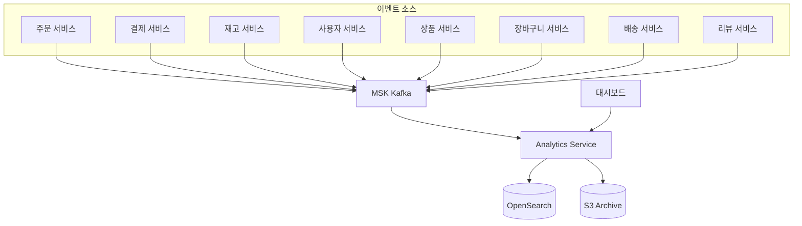
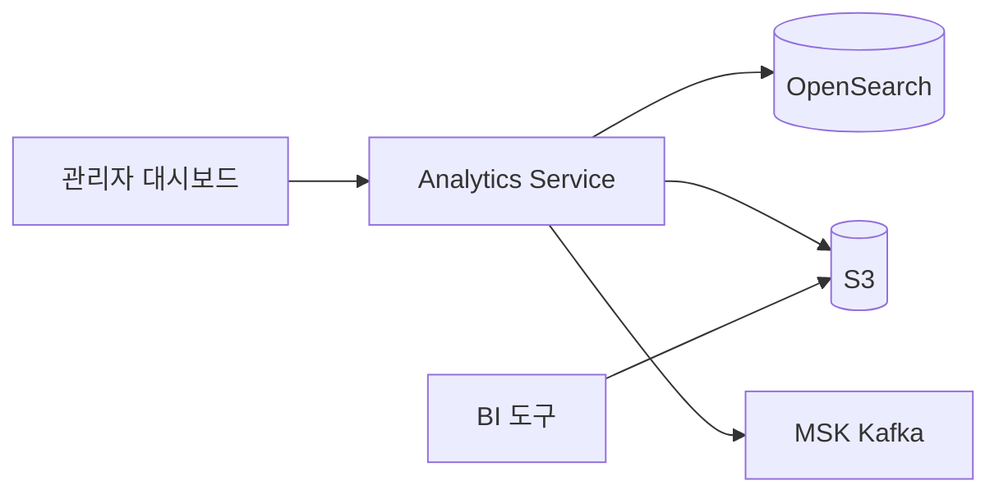

# 분석 서비스 (Analytics)

## 개요

분석 서비스는 쇼핑몰의 모든 도메인 이벤트를 수집하고 분석합니다. OpenSearch에 이벤트를 저장하여 실시간 대시보드와 커스텀 쿼리를 제공하며, S3에 이벤트를 아카이빙합니다.

| 항목 | 값 |
|------|-----|
| 언어 | Python 3.11 |
| 프레임워크 | FastAPI |
| 검색/분석 | OpenSearch |
| 아카이브 | S3 |
| 네임스페이스 | `mall-services` |
| 포트 | 8000 |
| 헬스체크 | `GET /health` |

## 아키텍처



## API 엔드포인트

### 분석 API

| 메서드 | 경로 | 설명 |
|--------|------|------|
| `GET` | `/api/v1/analytics/dashboard` | 대시보드 메트릭 |
| `GET` | `/api/v1/analytics/events` | 이벤트 목록 조회 |
| `POST` | `/api/v1/analytics/query` | 커스텀 쿼리 실행 |

### 요청/응답 예시

#### 대시보드 메트릭

**요청:**
```http
GET /api/v1/analytics/dashboard
```

**응답:**
```json
{
  "order_count": 15420,
  "revenue": 2456780000,
  "active_users": 8934,
  "events_processed": 1523456,
  "events_by_topic": {
    "orders": 45230,
    "payments": 43120,
    "inventory": 89450,
    "users": 12340,
    "products": 8920,
    "cart": 234560,
    "shipping": 41230,
    "reviews": 15670,
    "notifications": 52340,
    "pricing": 3450,
    "recommendations": 98760
  },
  "last_updated": "2024-01-15T10:00:00Z"
}
```

#### 이벤트 목록 조회

**요청:**
```http
GET /api/v1/analytics/events?topic=orders&start_time=2024-01-15T00:00:00Z&end_time=2024-01-15T23:59:59Z&limit=100
```

**응답:**
```json
[
  {
    "id": "evt_001",
    "topic": "orders",
    "key": "order_001",
    "payload": {
      "event_type": "order.created",
      "order_id": "order_001",
      "user_id": "user_001",
      "total_amount": 159000,
      "items": [
        {"product_id": "prod_001", "quantity": 2, "price": 79500}
      ]
    },
    "timestamp": "2024-01-15T10:30:00Z",
    "region": "us-east-1"
  },
  {
    "id": "evt_002",
    "topic": "orders",
    "key": "order_001",
    "payload": {
      "event_type": "order.confirmed",
      "order_id": "order_001",
      "user_id": "user_001"
    },
    "timestamp": "2024-01-15T10:35:00Z",
    "region": "us-east-1"
  }
]
```

#### 커스텀 쿼리 실행

**요청:**
```http
POST /api/v1/analytics/query
Content-Type: application/json

{
  "query_type": "sum",
  "topic": "orders",
  "field": "payload.total_amount",
  "start_time": "2024-01-01T00:00:00Z",
  "end_time": "2024-01-31T23:59:59Z",
  "group_by": "payload.user_id",
  "limit": 10
}
```

**응답:**
```json
{
  "query_type": "sum",
  "result": [
    {"user_id": "user_001", "total_amount": 2345000},
    {"user_id": "user_042", "total_amount": 1890000},
    {"user_id": "user_015", "total_amount": 1567000}
  ],
  "count": 10,
  "execution_time_ms": 45.2
}
```

## 데이터 모델

### DashboardMetrics

```python
class DashboardMetrics(BaseModel):
    order_count: int = Field(description="Total number of orders")
    revenue: float = Field(description="Total revenue")
    active_users: int = Field(description="Number of active users")
    events_processed: int = Field(description="Total events processed")
    events_by_topic: dict[str, int] = Field(description="Event counts by topic")
    last_updated: datetime
```

### EventRecord

```python
class EventRecord(BaseModel):
    id: str
    topic: str
    key: Optional[str] = None
    payload: dict[str, Any]
    timestamp: datetime
    region: Optional[str] = None
```

### AnalyticsQuery

```python
class AnalyticsQuery(BaseModel):
    query_type: str = Field(description="Type of query: count, sum, avg, list")
    topic: Optional[str] = Field(None, description="Filter by topic")
    field: Optional[str] = Field(None, description="Field to aggregate on")
    start_time: Optional[datetime] = Field(None, description="Start of time range")
    end_time: Optional[datetime] = Field(None, description="End of time range")
    group_by: Optional[str] = Field(None, description="Field to group results by")
    limit: int = Field(100, ge=1, le=10000, description="Maximum results")
```

### QueryResult

```python
class QueryResult(BaseModel):
    query_type: str
    result: Any
    count: int
    execution_time_ms: float
```

## 이벤트 (Kafka)

### 구독 토픽

분석 서비스는 다음 12개 토픽의 모든 이벤트를 구독합니다:

| 토픽 | 설명 | 주요 이벤트 |
|------|------|-------------|
| `orders` | 주문 이벤트 | created, confirmed, cancelled |
| `payments` | 결제 이벤트 | completed, failed, refunded |
| `inventory` | 재고 이벤트 | reserved, released, updated |
| `users` | 사용자 이벤트 | registered, updated, deleted |
| `products` | 상품 이벤트 | created, updated, deleted |
| `cart` | 장바구니 이벤트 | item-added, item-removed, cleared |
| `shipping` | 배송 이벤트 | created, status-updated, delivered |
| `notifications` | 알림 이벤트 | sent, failed |
| `reviews` | 리뷰 이벤트 | created, updated, deleted |
| `pricing` | 가격 이벤트 | updated, promotion-applied |
| `analytics` | 분석 이벤트 | page-view, click, search |
| `recommendations` | 추천 이벤트 | generated, clicked |

### 컨슈머 설정

```python
TOPICS = [
    "orders", "payments", "inventory", "users", "products",
    "cart", "shipping", "notifications", "reviews",
    "pricing", "analytics", "recommendations"
]

consumer = AIOKafkaConsumer(
    *TOPICS,
    bootstrap_servers=config.kafka_brokers,
    group_id=f"analytics-{config.aws_region}",
    auto_offset_reset="earliest",
    enable_auto_commit=True
)
```

## OpenSearch 인덱스

### 인덱스 매핑

```json
{
  "mappings": {
    "properties": {
      "id": { "type": "keyword" },
      "topic": { "type": "keyword" },
      "key": { "type": "keyword" },
      "payload": { "type": "object", "enabled": true },
      "timestamp": { "type": "date" },
      "region": { "type": "keyword" }
    }
  },
  "settings": {
    "number_of_shards": 5,
    "number_of_replicas": 1
  }
}
```

### 인덱스 패턴

- 일별 인덱스: `events-YYYY-MM-DD`
- 인덱스 별칭: `events` (최근 30일 롤링)

## S3 아카이빙

### 아카이브 구조

```
s3://{bucket}/events/
  ├── year=2024/
  │   ├── month=01/
  │   │   ├── day=15/
  │   │   │   ├── hour=00/
  │   │   │   │   ├── events_00000.parquet
  │   │   │   │   └── events_00001.parquet
  │   │   │   └── hour=01/
  │   │   │       └── ...
```

### 플러시 설정

```python
class AnalyticsConfig(ServiceConfig):
    s3_bucket: str = ""
    s3_prefix: str = "events/"
    flush_interval_seconds: int = 60    # 1분마다 플러시
    flush_batch_size: int = 1000        # 1000개 이벤트마다 플러시
```

## 환경 변수

| 변수명 | 설명 | 기본값 |
|--------|------|--------|
| `SERVICE_NAME` | 서비스 이름 | `analytics` |
| `PORT` | 서비스 포트 | `8080` |
| `AWS_REGION` | AWS 리전 | `us-east-1` |
| `REGION_ROLE` | 리전 역할 (PRIMARY/SECONDARY) | `PRIMARY` |
| `KAFKA_BROKERS` | Kafka 브로커 주소 | `localhost:9092` |
| `OPENSEARCH_ENDPOINT` | OpenSearch 엔드포인트 | `http://localhost:9200` |
| `S3_BUCKET` | S3 아카이브 버킷 | - |
| `S3_PREFIX` | S3 아카이브 경로 프리픽스 | `events/` |
| `FLUSH_INTERVAL_SECONDS` | S3 플러시 주기 (초) | `60` |
| `FLUSH_BATCH_SIZE` | S3 플러시 배치 크기 | `1000` |
| `LOG_LEVEL` | 로그 레벨 | `info` |

## 서비스 의존성



### 의존하는 서비스
- **MSK Kafka**: 모든 도메인 이벤트 구독
- **OpenSearch**: 실시간 이벤트 검색 및 집계
- **S3**: 이벤트 장기 아카이빙

### 의존받는 서비스
- **관리자 대시보드**: 실시간 메트릭 조회
- **BI 도구**: S3 아카이브 데이터 분석

## 기능 상세

### 실시간 대시보드

| 메트릭 | 설명 | 업데이트 주기 |
|--------|------|---------------|
| 주문 수 | 총 주문 건수 | 실시간 |
| 매출액 | 총 결제 금액 | 실시간 |
| 활성 사용자 | 최근 30분 활동 사용자 | 1분 |
| 이벤트 처리량 | 초당 이벤트 처리 수 | 실시간 |

### 쿼리 타입

| 타입 | 설명 | 사용 예 |
|------|------|---------|
| `count` | 이벤트 수 집계 | 일별 주문 수 |
| `sum` | 필드 합계 | 총 매출액 |
| `avg` | 필드 평균 | 평균 주문 금액 |
| `list` | 이벤트 목록 | 최근 주문 내역 |

### 데이터 보관 정책

| 저장소 | 보관 기간 | 용도 |
|--------|-----------|------|
| OpenSearch | 30일 | 실시간 분석 |
| S3 (Standard) | 90일 | 최근 분석 |
| S3 (Glacier) | 7년 | 장기 보관 |
