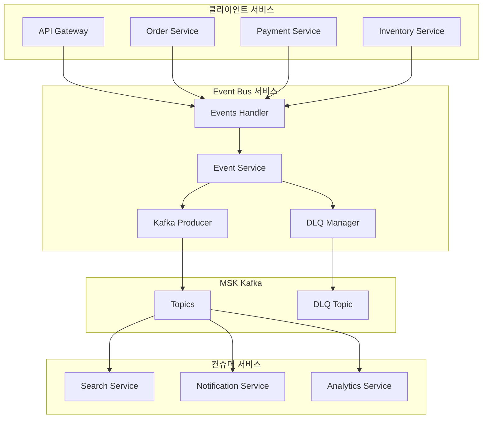
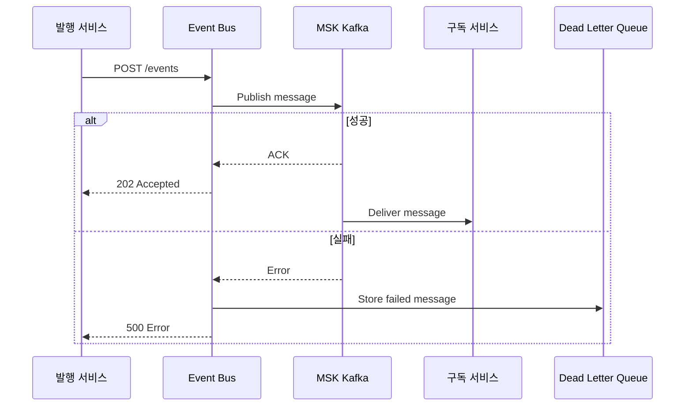
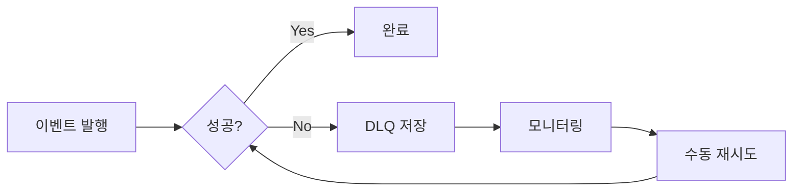
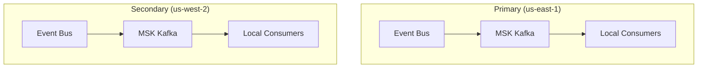

# Event Bus 서비스

## 개요

Event Bus 서비스는 MSK(Kafka)를 통한 이벤트 발행 및 관리 기능을 제공합니다. 서비스 간 비동기 통신을 위한 중앙 이벤트 허브 역할을 수행하며, DLQ(Dead Letter Queue) 관리 기능을 포함합니다.

| 항목 | 내용 |
|------|------|
| 언어 | Go 1.21+ |
| 프레임워크 | Gin |
| 메시지 브로커 | MSK (Kafka) |
| 네임스페이스 | platform |
| 포트 | 8080 |
| 헬스체크 | `/healthz`, `/readyz` |

## 아키텍처



## 주요 기능

### 1. 이벤트 발행
- 동적 토픽 생성 및 메시지 발행
- 키 기반 파티셔닝
- 최소 1회 전달 보장

### 2. 토픽 관리
- 사용 가능한 토픽 목록 조회
- 사전 정의된 토픽 세트 제공

### 3. DLQ 관리
- 실패한 메시지 보관
- 수동 재시도 지원
- 실패 원인 추적

## API 엔드포인트

| 메서드 | 경로 | 설명 |
|--------|------|------|
| POST | `/api/v1/events` | 이벤트 발행 |
| GET | `/api/v1/events/topics` | 토픽 목록 조회 |
| GET | `/api/v1/events/dlq` | DLQ 메시지 조회 |
| POST | `/api/v1/events/dlq/:id/retry` | DLQ 메시지 재시도 |

### 이벤트 발행

#### 요청

```bash
POST /api/v1/events
Content-Type: application/json

{
  "topic": "orders",
  "key": "order-12345",
  "payload": {
    "event_type": "order.created",
    "order_id": "order-12345",
    "user_id": "user-001",
    "items": [
      {
        "product_id": "prod-001",
        "quantity": 2,
        "price": 1590000
      }
    ],
    "total": 3180000,
    "created_at": "2024-01-15T10:30:00Z"
  }
}
```

#### 응답 (성공)

```json
{
  "id": "550e8400-e29b-41d4-a716-446655440000",
  "topic": "orders",
  "timestamp": "2024-01-15T10:30:00Z"
}
```
HTTP Status: 202 Accepted

#### 응답 (실패)

```json
{
  "error": "failed to publish event"
}
```
HTTP Status: 500 Internal Server Error

### 토픽 목록 조회

#### 요청

```bash
GET /api/v1/events/topics
```

#### 응답

```json
{
  "topics": [
    "orders",
    "payments",
    "inventory",
    "users",
    "products",
    "cart",
    "shipping",
    "notifications",
    "reviews",
    "pricing",
    "analytics",
    "recommendations"
  ]
}
```

### DLQ 메시지 조회

#### 요청

```bash
GET /api/v1/events/dlq
```

#### 응답

```json
{
  "messages": [
    {
      "id": "550e8400-e29b-41d4-a716-446655440001",
      "topic": "orders",
      "key": "order-12346",
      "payload": {
        "event_type": "order.created",
        "order_id": "order-12346"
      },
      "error": "kafka: broker not available",
      "timestamp": "2024-01-15T10:35:00Z",
      "retry_count": 2
    }
  ],
  "count": 1
}
```

### DLQ 메시지 재시도

#### 요청

```bash
POST /api/v1/events/dlq/550e8400-e29b-41d4-a716-446655440001/retry
```

#### 응답 (성공)

```json
{
  "id": "550e8400-e29b-41d4-a716-446655440001",
  "topic": "orders",
  "retried": true,
  "timestamp": "2024-01-15T10:40:00Z"
}
```

#### 응답 (메시지 없음)

```json
{
  "error": "message not found"
}
```
HTTP Status: 404 Not Found

## 데이터 모델

### Event

```go
type Event struct {
    ID         string      `json:"id"`
    Topic      string      `json:"topic"`
    Key        string      `json:"key"`
    Payload    interface{} `json:"payload"`
    Timestamp  time.Time   `json:"timestamp"`
    RetryCount int         `json:"retry_count"`
}
```

### DLQMessage

```go
type DLQMessage struct {
    ID         string      `json:"id"`
    Topic      string      `json:"topic"`
    Key        string      `json:"key"`
    Payload    interface{} `json:"payload"`
    Error      string      `json:"error"`
    Timestamp  time.Time   `json:"timestamp"`
    RetryCount int         `json:"retry_count"`
}
```

### PublishRequest

```go
type PublishRequest struct {
    Topic   string      `json:"topic" binding:"required"`
    Key     string      `json:"key"`
    Payload interface{} `json:"payload" binding:"required"`
}
```

## 사용 가능한 토픽

| 토픽 | 설명 | 주요 발행자 |
|------|------|------------|
| `orders` | 주문 이벤트 | Order Service |
| `payments` | 결제 이벤트 | Payment Service |
| `inventory` | 재고 이벤트 | Inventory Service |
| `users` | 사용자 이벤트 | User Account Service |
| `products` | 상품 이벤트 | Product Catalog Service |
| `cart` | 장바구니 이벤트 | Cart Service |
| `shipping` | 배송 이벤트 | Shipping Service |
| `notifications` | 알림 이벤트 | 다양한 서비스 |
| `reviews` | 리뷰 이벤트 | Review Service |
| `pricing` | 가격 이벤트 | Pricing Service |
| `analytics` | 분석 이벤트 | 다양한 서비스 |
| `recommendations` | 추천 이벤트 | Recommendation Service |

## Kafka 설정

### Producer 설정

```go
type EventProducer struct {
    brokers string
    writers map[string]*kafka.Writer
    logger  *zap.Logger
}

// Writer 설정
w := &kafka.Writer{
    Addr:         kafka.TCP(brokers...),
    Topic:        topic,
    Balancer:     &kafka.LeastBytes{},
    BatchTimeout: 10 * time.Millisecond,
    RequiredAcks: kafka.RequireAll,  // 모든 replica 확인
}
```

### 메시지 형식

```go
msg := kafka.Message{
    Key:   []byte(key),
    Value: data,  // JSON encoded
    Time:  time.Now(),
}
```

## 환경 변수

| 변수명 | 설명 | 기본값 |
|--------|------|--------|
| `PORT` | 서버 포트 | `8080` |
| `AWS_REGION` | AWS 리전 | `us-east-1` |
| `REGION_ROLE` | 리전 역할 (PRIMARY/SECONDARY) | `PRIMARY` |
| `PRIMARY_HOST` | Primary 리전 호스트 | - |
| `KAFKA_BROKERS` | Kafka 브로커 주소 | `localhost:9092` |
| `LOG_LEVEL` | 로그 레벨 | `info` |

## 서비스 의존성

### 의존하는 서비스

| 서비스 | 용도 |
|--------|------|
| MSK (Kafka) | 메시지 브로커 |

### 이 서비스에 의존하는 컴포넌트

| 컴포넌트 | 용도 |
|----------|------|
| API Gateway | Events API 라우팅 |
| Order Service | 주문 이벤트 발행 |
| Payment Service | 결제 이벤트 발행 |
| Inventory Service | 재고 이벤트 발행 |
| Product Catalog | 상품 이벤트 발행 |

## 이벤트 흐름



## DLQ 관리

### DLQ 동작 방식

1. 이벤트 발행 실패 시 메모리 기반 DLQ에 저장
2. 실패 원인과 재시도 횟수 기록
3. 관리자가 수동으로 재시도 가능
4. 재시도 성공 시 DLQ에서 제거
5. 재시도 실패 시 retry_count 증가 후 다시 DLQ에 저장

### DLQ 모니터링



:::warning DLQ 제한사항
현재 DLQ는 메모리 기반으로 구현되어 있습니다. 서비스 재시작 시 DLQ 메시지가 유실됩니다. 프로덕션 환경에서는 영구 저장소(Redis, Database)로 마이그레이션을 권장합니다.
:::

## 멀티 리전 동작

Event Bus는 리전별로 독립적인 MSK 클러스터를 사용합니다. 각 리전에서 발생한 이벤트는 로컬 Kafka 클러스터에만 발행됩니다.



### 쓰기 요청 포워딩

Secondary 리전에서의 쓰기 요청은 Primary로 포워딩되지 않습니다. 이벤트는 해당 리전의 로컬 Kafka 클러스터에 발행됩니다.

:::note 크로스 리전 이벤트
글로벌 데이터 동기화가 필요한 경우, 데이터베이스 레벨의 복제(Aurora Global Database, DocumentDB Global Cluster)를 활용합니다.
:::

## 에러 응답

### 400 Bad Request

```json
{
  "error": "topic is required"
}
```

### 404 Not Found

```json
{
  "error": "message not found"
}
```

### 500 Internal Server Error

```json
{
  "error": "failed to publish event"
}
```
