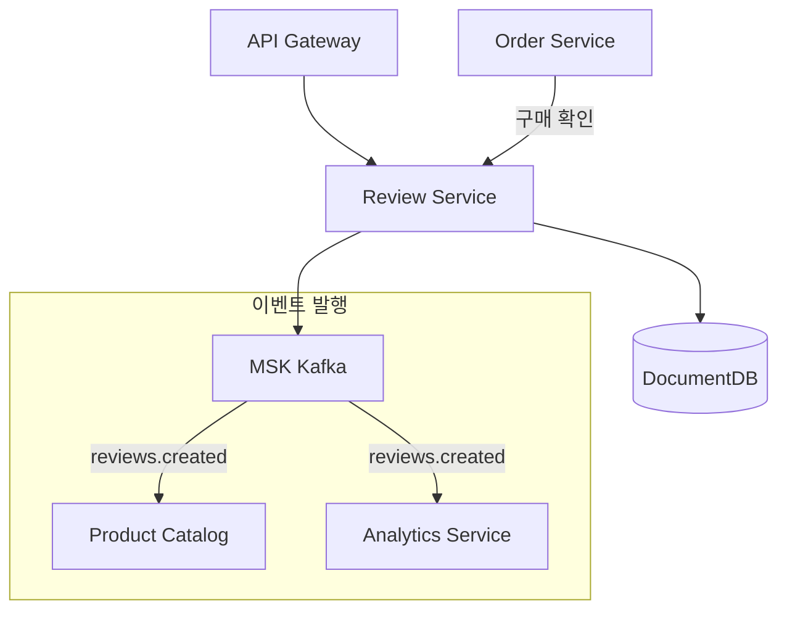
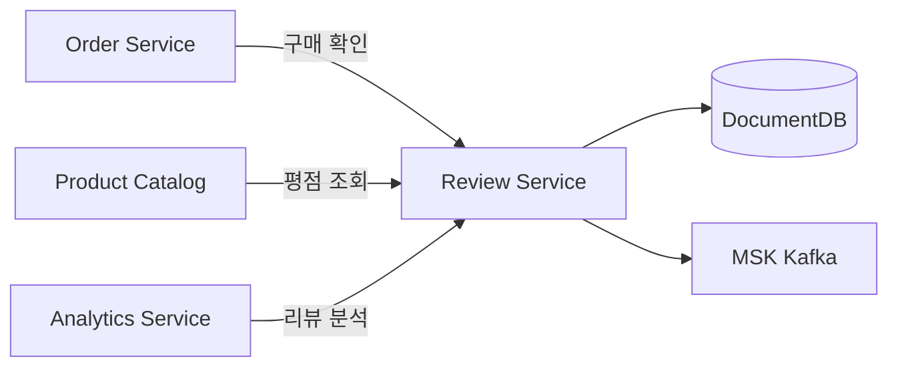

# 리뷰 서비스 (Review)

## 개요

리뷰 서비스는 상품에 대한 사용자 리뷰와 평점을 관리합니다. 구매 확인된 리뷰를 표시하고, 상품별 평점 집계를 제공합니다.

| 항목 | 값 |
|------|-----|
| 언어 | Python 3.11 |
| 프레임워크 | FastAPI |
| 데이터베이스 | DocumentDB (MongoDB 호환) |
| 네임스페이스 | `mall-services` |
| 포트 | 8000 |
| 헬스체크 | `GET /health` |

## 아키텍처



## API 엔드포인트

### 리뷰 API

| 메서드 | 경로 | 설명 |
|--------|------|------|
| `GET` | `/api/v1/reviews/product/{product_id}` | 상품별 리뷰 목록 |
| `GET` | `/api/v1/reviews/{review_id}` | 리뷰 상세 조회 |
| `POST` | `/api/v1/reviews` | 리뷰 등록 |
| `PUT` | `/api/v1/reviews/{review_id}` | 리뷰 수정 |
| `DELETE` | `/api/v1/reviews/{review_id}` | 리뷰 삭제 |

### 요청/응답 예시

#### 상품별 리뷰 목록

**요청:**
```http
GET /api/v1/reviews/product/prod_001?page=1&page_size=10
```

**응답:**
```json
{
  "reviews": [
    {
      "id": "rev_001",
      "user_id": "user_001",
      "product_id": "prod_001",
      "rating": 5,
      "title": "정말 만족스러운 제품입니다",
      "body": "배송도 빠르고 품질도 좋아요. 색상도 사진과 동일합니다. 강력 추천합니다!",
      "helpful_count": 42,
      "verified_purchase": true,
      "created_at": "2024-01-15T10:00:00Z",
      "updated_at": "2024-01-15T10:00:00Z"
    },
    {
      "id": "rev_002",
      "user_id": "user_002",
      "product_id": "prod_001",
      "rating": 4,
      "title": "좋은 제품이지만 배송이 좀 늦었어요",
      "body": "제품 자체는 만족하지만 배송이 예상보다 이틀 늦게 왔습니다.",
      "helpful_count": 15,
      "verified_purchase": true,
      "created_at": "2024-01-14T15:30:00Z",
      "updated_at": "2024-01-14T15:30:00Z"
    }
  ],
  "total": 128,
  "page": 1,
  "page_size": 10,
  "has_more": true
}
```

#### 리뷰 등록

**요청:**
```http
POST /api/v1/reviews
Content-Type: application/json

{
  "user_id": "user_003",
  "product_id": "prod_001",
  "rating": 5,
  "title": "최고의 선택이었습니다",
  "body": "가격 대비 품질이 정말 좋습니다. 디자인도 세련되고 실용적입니다. 다음에도 이 브랜드 제품을 구매할 예정입니다.",
  "verified_purchase": true
}
```

**응답 (201 Created):**
```json
{
  "id": "rev_003",
  "user_id": "user_003",
  "product_id": "prod_001",
  "rating": 5,
  "title": "최고의 선택이었습니다",
  "body": "가격 대비 품질이 정말 좋습니다. 디자인도 세련되고 실용적입니다. 다음에도 이 브랜드 제품을 구매할 예정입니다.",
  "helpful_count": 0,
  "verified_purchase": true,
  "created_at": "2024-01-15T11:00:00Z",
  "updated_at": "2024-01-15T11:00:00Z"
}
```

#### 리뷰 수정

**요청:**
```http
PUT /api/v1/reviews/rev_003
Content-Type: application/json

{
  "rating": 4,
  "title": "좋은 제품이지만 한 가지 아쉬운 점",
  "body": "전반적으로 만족하지만, 한 달 사용 후 약간의 변색이 있었습니다. 그래도 가격 대비 괜찮습니다."
}
```

**응답:**
```json
{
  "id": "rev_003",
  "user_id": "user_003",
  "product_id": "prod_001",
  "rating": 4,
  "title": "좋은 제품이지만 한 가지 아쉬운 점",
  "body": "전반적으로 만족하지만, 한 달 사용 후 약간의 변색이 있었습니다. 그래도 가격 대비 괜찮습니다.",
  "helpful_count": 0,
  "verified_purchase": true,
  "created_at": "2024-01-15T11:00:00Z",
  "updated_at": "2024-02-15T09:00:00Z"
}
```

## 데이터 모델

### Review

```python
class Review(BaseModel):
    id: str = ""
    user_id: str
    product_id: str
    rating: int = Field(..., ge=1, le=5)  # 1-5점
    title: str
    body: str
    helpful_count: int = 0  # "도움이 됐어요" 수
    verified_purchase: bool = False  # 구매 확인 여부
    created_at: datetime
    updated_at: datetime
```

### ReviewCreate

```python
class ReviewCreate(BaseModel):
    user_id: str
    product_id: str
    rating: int = Field(..., ge=1, le=5)
    title: str = Field(..., min_length=1, max_length=200)
    body: str = Field(..., min_length=1, max_length=5000)
    verified_purchase: bool = False
```

### ReviewUpdate

```python
class ReviewUpdate(BaseModel):
    rating: Optional[int] = Field(None, ge=1, le=5)
    title: Optional[str] = Field(None, min_length=1, max_length=200)
    body: Optional[str] = Field(None, min_length=1, max_length=5000)
```

### ReviewListResponse

```python
class ReviewListResponse(BaseModel):
    reviews: list[Review]
    total: int
    page: int
    page_size: int
    has_more: bool
```

### MongoDB 컬렉션 스키마

```javascript
// reviews 컬렉션
{
  "_id": ObjectId("..."),
  "user_id": "user_001",
  "product_id": "prod_001",
  "rating": 5,
  "title": "정말 만족스러운 제품입니다",
  "body": "배송도 빠르고 품질도 좋아요...",
  "helpful_count": 42,
  "verified_purchase": true,
  "created_at": ISODate("2024-01-15T10:00:00Z"),
  "updated_at": ISODate("2024-01-15T10:00:00Z")
}

// 인덱스
db.reviews.createIndex({ "product_id": 1, "created_at": -1 })
db.reviews.createIndex({ "user_id": 1 })
db.reviews.createIndex({ "rating": 1 })
```

## 이벤트 (Kafka)

### 발행 토픽

| 토픽 | 이벤트 | 설명 |
|------|--------|------|
| `reviews.created` | 리뷰 등록 | 새 리뷰 작성 시 발행 |
| `reviews.updated` | 리뷰 수정 | 리뷰 내용 변경 시 발행 |
| `reviews.deleted` | 리뷰 삭제 | 리뷰 삭제 시 발행 |

### 이벤트 페이로드 예시

**reviews.created:**
```json
{
  "event_type": "review.created",
  "review_id": "rev_003",
  "product_id": "prod_001",
  "user_id": "user_003",
  "rating": 5,
  "timestamp": "2024-01-15T11:00:00Z"
}
```

### 이벤트 활용

- **Product Catalog**: 상품 평균 평점 업데이트
- **Analytics Service**: 리뷰 트렌드 분석
- **Notification Service**: 판매자에게 새 리뷰 알림

## 환경 변수

| 변수명 | 설명 | 기본값 |
|--------|------|--------|
| `SERVICE_NAME` | 서비스 이름 | `review` |
| `PORT` | 서비스 포트 | `8080` |
| `AWS_REGION` | AWS 리전 | `us-east-1` |
| `REGION_ROLE` | 리전 역할 (PRIMARY/SECONDARY) | `PRIMARY` |
| `DB_HOST` | 데이터베이스 호스트 | `localhost` |
| `DB_PORT` | 데이터베이스 포트 | `27017` |
| `DB_NAME` | 데이터베이스 이름 | `reviews` |
| `DB_USER` | 데이터베이스 사용자 | `mall` |
| `DB_PASSWORD` | 데이터베이스 비밀번호 | - |
| `DOCUMENTDB_HOST` | DocumentDB 호스트 | `localhost` |
| `DOCUMENTDB_PORT` | DocumentDB 포트 | `27017` |
| `KAFKA_BROKERS` | Kafka 브로커 주소 | `localhost:9092` |
| `LOG_LEVEL` | 로그 레벨 | `info` |

## 서비스 의존성



### 의존하는 서비스
- **DocumentDB**: 리뷰 데이터 저장
- **MSK Kafka**: 이벤트 발행
- **Order Service**: 구매 확인 검증 (verified_purchase)

### 의존받는 서비스
- **Product Catalog**: 상품 상세 페이지에 리뷰 표시
- **Analytics Service**: 리뷰 감성 분석, 트렌드 파악
- **Recommendation Service**: 리뷰 기반 추천 개선

## 기능 상세

### 평점 시스템
- 1-5점 척도 (별점)
- 상품별 평균 평점 자동 계산
- 평점 분포 히스토그램 제공

### 구매 확인 리뷰
- 실제 구매 이력이 있는 사용자만 "구매 확인" 배지 표시
- Order Service와 연동하여 자동 검증

### 리뷰 정렬 옵션
- 최신순 (기본)
- 평점 높은순 / 낮은순
- 도움이 된 순
