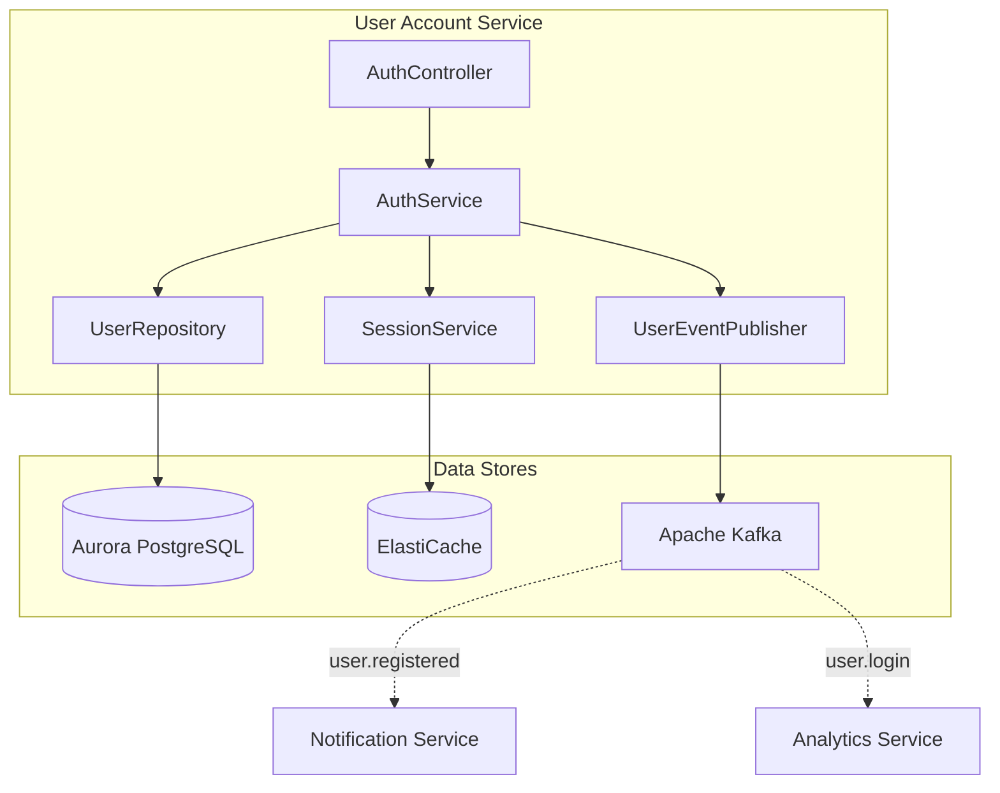
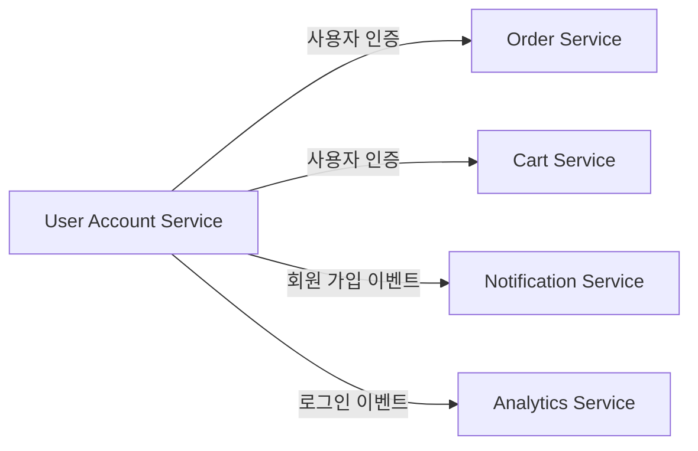
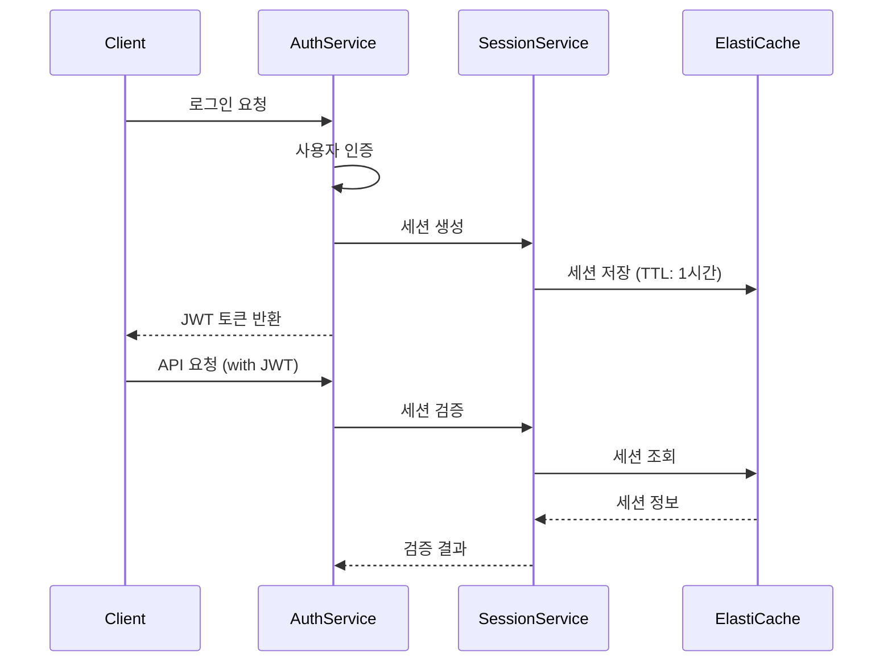

# 사용자 계정 서비스 (User Account Service)

## 개요

사용자 계정 서비스는 회원 가입, 로그인, 로그아웃 등 인증/인가를 담당하며, JWT 토큰 기반 인증과 ElastiCache를 활용한 세션 관리를 제공합니다.

| 항목 | 내용 |
|------|------|
| 언어 | Java 17 |
| 프레임워크 | Spring Boot 3.2 |
| 데이터베이스 | Aurora PostgreSQL (Global Database) |
| 캐시 | ElastiCache (Valkey/Redis) |
| 네임스페이스 | `mall-user-account` |
| 포트 | 8080 |
| 헬스체크 | `/actuator/health` |

## 아키텍처



## API 엔드포인트

| 메서드 | 경로 | 설명 | 인증 필요 |
|--------|------|------|----------|
| `POST` | `/api/v1/auth/register` | 회원 가입 | X |
| `POST` | `/api/v1/auth/login` | 로그인 | X |
| `POST` | `/api/v1/auth/logout` | 로그아웃 | O |
| `GET` | `/api/v1/auth/me` | 현재 사용자 정보 조회 | O |

### 회원 가입

**POST** `/api/v1/auth/register`

요청:
```json
{
  "email": "user@example.com",
  "password": "securePassword123",
  "name": "홍길동"
}
```

유효성 검사:
- `email`: 필수, 이메일 형식
- `password`: 필수, 최소 8자
- `name`: 필수

응답 (201 Created):
```json
{
  "id": "550e8400-e29b-41d4-a716-446655440000",
  "email": "user@example.com",
  "name": "홍길동",
  "role": "USER",
  "active": true,
  "createdAt": "2024-01-15T10:30:00Z"
}
```

### 로그인

**POST** `/api/v1/auth/login`

요청:
```json
{
  "email": "user@example.com",
  "password": "securePassword123"
}
```

응답 (200 OK):
```json
{
  "token": "eyJhbGciOiJIUzI1NiIsInR5cCI6IkpXVCJ9...",
  "tokenType": "Bearer",
  "expiresIn": 3600,
  "user": {
    "id": "550e8400-e29b-41d4-a716-446655440000",
    "email": "user@example.com",
    "name": "홍길동",
    "role": "USER",
    "active": true,
    "createdAt": "2024-01-15T10:30:00Z"
  }
}
```

### 로그아웃

**POST** `/api/v1/auth/logout`

헤더:
```
Authorization: Bearer <token>
```

응답 (204 No Content)

### 현재 사용자 정보 조회

**GET** `/api/v1/auth/me`

헤더:
```
Authorization: Bearer <token>
```

응답 (200 OK):
```json
{
  "id": "550e8400-e29b-41d4-a716-446655440000",
  "email": "user@example.com",
  "name": "홍길동",
  "role": "USER",
  "active": true,
  "createdAt": "2024-01-15T10:30:00Z"
}
```

## 데이터 모델

### User 엔티티

```java
@Entity
@Table(name = "users")
public class User {
    public enum Role {
        USER, SELLER, ADMIN
    }

    @Id
    @GeneratedValue(strategy = GenerationType.UUID)
    private UUID id;

    @Column(unique = true, nullable = false)
    private String email;

    @Column(name = "password_hash", nullable = false)
    private String passwordHash;

    @Column(nullable = false)
    private String name;

    @Enumerated(EnumType.STRING)
    @Column(nullable = false)
    private Role role = Role.USER;

    @Column(nullable = false)
    private boolean active = true;

    @Column(name = "created_at", nullable = false, updatable = false)
    private Instant createdAt;

    @Column(name = "updated_at", nullable = false)
    private Instant updatedAt;
}
```

### 사용자 역할

| 역할 | 설명 |
|------|------|
| `USER` | 일반 사용자 |
| `SELLER` | 판매자 |
| `ADMIN` | 관리자 |

### 데이터베이스 스키마

```sql
CREATE TABLE users (
    id UUID PRIMARY KEY DEFAULT gen_random_uuid(),
    email VARCHAR(255) UNIQUE NOT NULL,
    password_hash VARCHAR(255) NOT NULL,
    name VARCHAR(255) NOT NULL,
    role VARCHAR(50) NOT NULL DEFAULT 'USER',
    active BOOLEAN NOT NULL DEFAULT true,
    created_at TIMESTAMP NOT NULL DEFAULT CURRENT_TIMESTAMP,
    updated_at TIMESTAMP NOT NULL DEFAULT CURRENT_TIMESTAMP
);

CREATE UNIQUE INDEX idx_users_email ON users(email);
CREATE INDEX idx_users_role ON users(role);
CREATE INDEX idx_users_active ON users(active);
```

## 이벤트 (Kafka)

### 발행 토픽

| 토픽명 | 이벤트 | 설명 |
|--------|--------|------|
| `user.registered` | user.registered | 회원 가입 시 발행 |
| `user.login` | user.login | 로그인 시 발행 |

#### user.registered 페이로드

```json
{
  "eventType": "user.registered",
  "userId": "550e8400-e29b-41d4-a716-446655440000",
  "email": "user@example.com",
  "name": "홍길동",
  "role": "USER",
  "timestamp": "2024-01-15T10:30:00Z"
}
```

#### user.login 페이로드

```json
{
  "eventType": "user.login",
  "userId": "550e8400-e29b-41d4-a716-446655440000",
  "email": "user@example.com",
  "timestamp": "2024-01-15T11:00:00Z"
}
```

## 환경 변수

| 변수명 | 설명 | 기본값 |
|--------|------|--------|
| `SPRING_DATASOURCE_URL` | Aurora PostgreSQL 연결 URL | - |
| `SPRING_DATASOURCE_USERNAME` | DB 사용자명 | - |
| `SPRING_DATASOURCE_PASSWORD` | DB 비밀번호 | - |
| `SPRING_REDIS_HOST` | ElastiCache 호스트 | - |
| `SPRING_REDIS_PORT` | ElastiCache 포트 | 6379 |
| `SPRING_KAFKA_BOOTSTRAP_SERVERS` | Kafka 브로커 주소 | - |
| `JWT_SECRET` | JWT 서명 시크릿 | - |
| `JWT_EXPIRATION` | JWT 만료 시간 (초) | 3600 |
| `SERVER_PORT` | 서비스 포트 | 8080 |

## 서비스 의존성



### 세션 관리

ElastiCache를 활용한 세션 관리:



### 인증 흐름

1. **회원 가입**: 비밀번호 해시화 후 저장, 환영 이메일 이벤트 발행
2. **로그인**: 비밀번호 검증, JWT 토큰 발급, 세션 저장
3. **인증된 요청**: JWT 검증, 세션 확인
4. **로그아웃**: 세션 삭제, 토큰 무효화

### 보안 설정

- 비밀번호: BCrypt 해싱 (강도 12)
- JWT: HMAC-SHA256 서명
- 세션: ElastiCache TTL 기반 자동 만료
- HTTPS: TLS 1.3 필수

### 에러 처리

| HTTP 상태 코드 | 에러 | 설명 |
|----------------|------|------|
| 400 | ValidationException | 입력값 유효성 검사 실패 |
| 401 | UnauthorizedException | 인증 실패 (잘못된 자격 증명) |
| 403 | ForbiddenException | 권한 없음 |
| 409 | DuplicateEmailException | 이미 등록된 이메일 |
