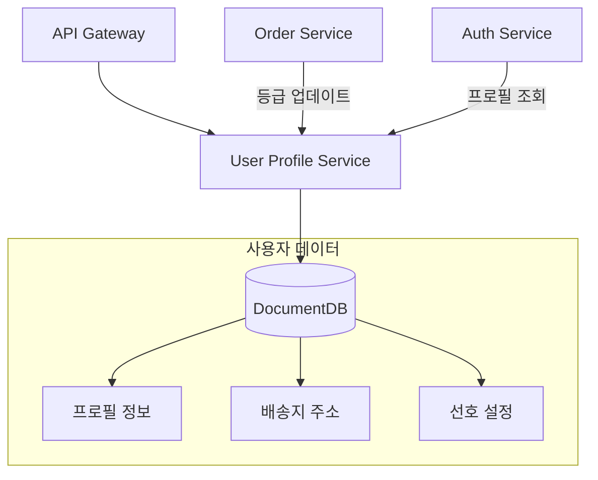
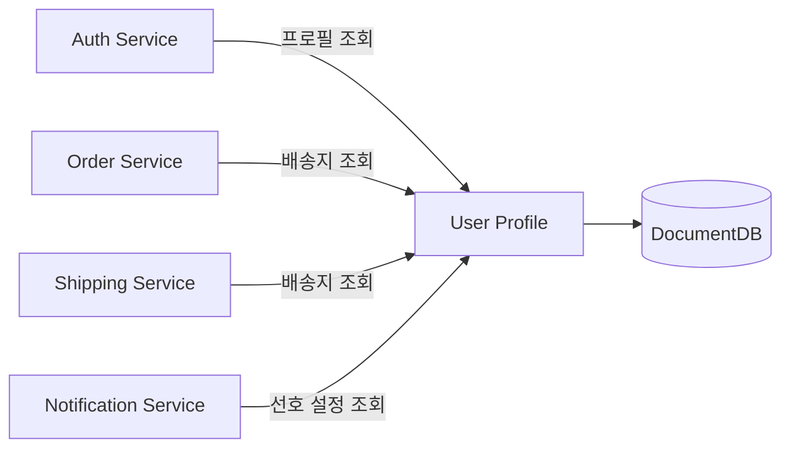

# 사용자 프로필 서비스 (User Profile)

## 개요

사용자 프로필 서비스는 회원의 개인정보, 배송지 주소, 선호 설정을 관리합니다. 회원 등급 시스템(브론즈/실버/골드/플래티넘)을 통해 차별화된 혜택을 제공합니다.

| 항목 | 값 |
|------|-----|
| 언어 | Python 3.11 |
| 프레임워크 | FastAPI |
| 데이터베이스 | DocumentDB (MongoDB 호환) |
| 네임스페이스 | `mall-services` |
| 포트 | 8000 |
| 헬스체크 | `GET /health` |

## 아키텍처



## API 엔드포인트

### 프로필 API

| 메서드 | 경로 | 설명 |
|--------|------|------|
| `GET` | `/api/v1/profiles/{user_id}` | 프로필 조회 |
| `PUT` | `/api/v1/profiles/{user_id}` | 프로필 수정 |
| `GET` | `/api/v1/profiles/{user_id}/addresses` | 배송지 목록 조회 |
| `POST` | `/api/v1/profiles/{user_id}/addresses` | 배송지 추가 |
| `PUT` | `/api/v1/profiles/{user_id}/addresses/{address_id}` | 배송지 수정 |
| `DELETE` | `/api/v1/profiles/{user_id}/addresses/{address_id}` | 배송지 삭제 |

### 요청/응답 예시

#### 프로필 조회

**요청:**
```http
GET /api/v1/profiles/user_001
```

**응답:**
```json
{
  "user_id": "user_001",
  "phone": "010-1234-5678",
  "date_of_birth": "1990-05-15",
  "avatar_url": "https://cdn.example.com/avatars/user_001.jpg",
  "preferences": {
    "language": "ko",
    "currency": "KRW",
    "categories": ["electronics", "fashion"],
    "tier": "gold",
    "notification_email": true,
    "notification_push": true
  },
  "addresses": [
    {
      "id": "addr_001",
      "label": "집",
      "street": "강남대로 123",
      "city": "서울",
      "state": "서울특별시",
      "postal_code": "06000",
      "country": "KR",
      "is_default": true
    }
  ],
  "created_at": "2024-01-01T00:00:00Z",
  "updated_at": "2024-01-15T10:00:00Z"
}
```

#### 프로필 수정

**요청:**
```http
PUT /api/v1/profiles/user_001
Content-Type: application/json

{
  "phone": "010-9876-5432",
  "preferences": {
    "language": "ko",
    "currency": "KRW",
    "categories": ["electronics", "sports"],
    "notification_push": false
  }
}
```

**응답:**
```json
{
  "user_id": "user_001",
  "phone": "010-9876-5432",
  "date_of_birth": "1990-05-15",
  "avatar_url": "https://cdn.example.com/avatars/user_001.jpg",
  "preferences": {
    "language": "ko",
    "currency": "KRW",
    "categories": ["electronics", "sports"],
    "tier": "gold",
    "notification_email": true,
    "notification_push": false
  },
  "addresses": [],
  "created_at": "2024-01-01T00:00:00Z",
  "updated_at": "2024-01-15T11:00:00Z"
}
```

#### 배송지 추가

**요청:**
```http
POST /api/v1/profiles/user_001/addresses
Content-Type: application/json

{
  "label": "회사",
  "street": "테헤란로 456",
  "city": "서울",
  "state": "서울특별시",
  "postal_code": "06100",
  "country": "KR",
  "is_default": false
}
```

**응답 (201 Created):**
```json
{
  "id": "addr_002",
  "label": "회사",
  "street": "테헤란로 456",
  "city": "서울",
  "state": "서울특별시",
  "postal_code": "06100",
  "country": "KR",
  "is_default": false
}
```

## 데이터 모델

### UserProfile

```python
class UserProfile(BaseModel):
    user_id: str
    phone: Optional[str] = None
    date_of_birth: Optional[str] = None
    avatar_url: Optional[str] = None
    preferences: dict = {}
    addresses: list[Address] = []
    created_at: datetime
    updated_at: datetime
```

### Address

```python
class Address(BaseModel):
    id: str
    label: str  # 예: "집", "회사", "부모님 댁"
    street: str
    city: str
    state: str
    postal_code: str
    country: str = "KR"
    is_default: bool = False
```

### 회원 등급 시스템

| 등급 | 조건 | 혜택 |
|------|------|------|
| **브론즈 (Bronze)** | 기본 | 기본 적립률 1% |
| **실버 (Silver)** | 누적 구매 50만원 | 적립률 2%, 무료배송 쿠폰 |
| **골드 (Gold)** | 누적 구매 200만원 | 적립률 3%, 우선 배송 |
| **플래티넘 (Platinum)** | 누적 구매 500만원 | 적립률 5%, VIP 전용 상품 |

### 선호 설정 (Preferences)

```json
{
  "language": "ko",           // 언어: ko, en, ja, zh
  "currency": "KRW",          // 통화: KRW, USD, JPY
  "categories": ["electronics", "fashion"],  // 관심 카테고리
  "tier": "gold",             // 회원 등급
  "notification_email": true, // 이메일 알림
  "notification_push": true,  // 푸시 알림
  "notification_sms": false   // SMS 알림
}
```

## 이벤트 (Kafka)

### 발행 토픽

| 토픽 | 이벤트 | 설명 |
|------|--------|------|
| `users.profile-updated` | 프로필 수정 | 프로필 정보 변경 시 발행 |
| `users.address-added` | 배송지 추가 | 새 배송지 등록 시 발행 |
| `users.tier-changed` | 등급 변경 | 회원 등급 변경 시 발행 |

### 구독 토픽

| 토픽 | 이벤트 | 설명 |
|------|--------|------|
| `orders.completed` | 주문 완료 | 등급 산정을 위한 구매 금액 집계 |

## 환경 변수

| 변수명 | 설명 | 기본값 |
|--------|------|--------|
| `SERVICE_NAME` | 서비스 이름 | `user-profile` |
| `PORT` | 서비스 포트 | `8080` |
| `AWS_REGION` | AWS 리전 | `us-east-1` |
| `REGION_ROLE` | 리전 역할 (PRIMARY/SECONDARY) | `PRIMARY` |
| `DB_HOST` | 데이터베이스 호스트 | `localhost` |
| `DB_PORT` | 데이터베이스 포트 | `27017` |
| `DB_NAME` | 데이터베이스 이름 | `user_profiles` |
| `DB_USER` | 데이터베이스 사용자 | `mall` |
| `DB_PASSWORD` | 데이터베이스 비밀번호 | - |
| `DOCUMENTDB_HOST` | DocumentDB 호스트 | `localhost` |
| `DOCUMENTDB_PORT` | DocumentDB 포트 | `27017` |
| `KAFKA_BROKERS` | Kafka 브로커 주소 | `localhost:9092` |
| `LOG_LEVEL` | 로그 레벨 | `info` |

## 서비스 의존성



### 의존하는 서비스
- **DocumentDB**: 프로필/주소 데이터 저장

### 의존받는 서비스
- **Auth Service**: 로그인 시 프로필 정보 조회
- **Order Service**: 주문 시 배송지 선택
- **Shipping Service**: 배송 주소 확인
- **Notification Service**: 알림 채널 선호도 확인
