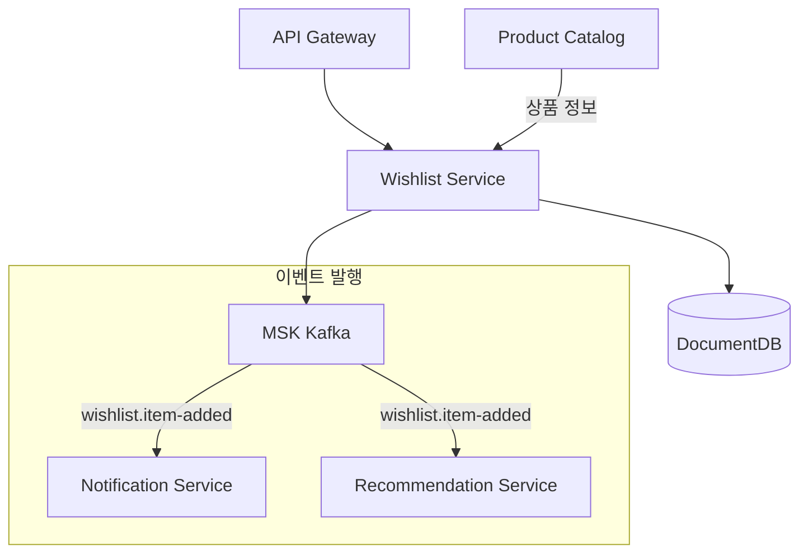
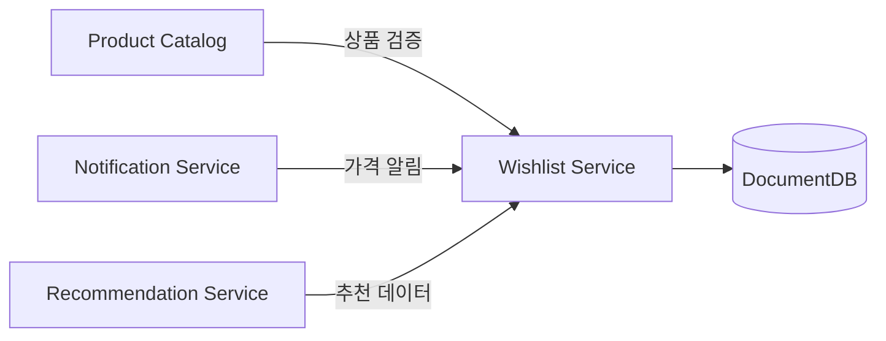

# 위시리스트 서비스 (Wishlist)

## 개요

위시리스트 서비스는 사용자가 관심 있는 상품을 저장하고 관리할 수 있는 기능을 제공합니다. 나중에 구매하려는 상품을 모아두고, 가격 변동이나 재입고 알림을 받을 수 있습니다.

| 항목 | 값 |
|------|-----|
| 언어 | Python 3.11 |
| 프레임워크 | FastAPI |
| 데이터베이스 | DocumentDB (MongoDB 호환) |
| 네임스페이스 | `mall-services` |
| 포트 | 8000 |
| 헬스체크 | `GET /health` |

## 아키텍처



## API 엔드포인트

### 위시리스트 API

| 메서드 | 경로 | 설명 |
|--------|------|------|
| `GET` | `/api/v1/wishlists/{user_id}` | 위시리스트 조회 |
| `POST` | `/api/v1/wishlists/{user_id}/items` | 상품 추가 |
| `DELETE` | `/api/v1/wishlists/{user_id}/items/{product_id}` | 상품 제거 |

### 요청/응답 예시

#### 위시리스트 조회

**요청:**
```http
GET /api/v1/wishlists/user_001
```

**응답:**
```json
{
  "user_id": "user_001",
  "items": [
    {
      "product_id": "prod_001",
      "added_at": "2024-01-15T10:00:00Z",
      "note": "생일 선물로 사고 싶음"
    },
    {
      "product_id": "prod_002",
      "added_at": "2024-01-14T15:30:00Z",
      "note": null
    }
  ],
  "created_at": "2024-01-01T00:00:00Z",
  "updated_at": "2024-01-15T10:00:00Z"
}
```

#### 상품 추가

**요청:**
```http
POST /api/v1/wishlists/user_001/items
Content-Type: application/json

{
  "product_id": "prod_003",
  "note": "할인할 때 구매 예정"
}
```

**응답 (201 Created):**
```json
{
  "product_id": "prod_003",
  "added_at": "2024-01-15T11:00:00Z",
  "note": "할인할 때 구매 예정"
}
```

#### 상품 제거

**요청:**
```http
DELETE /api/v1/wishlists/user_001/items/prod_001
```

**응답 (204 No Content)**

## 데이터 모델

### Wishlist

```python
class Wishlist(BaseModel):
    user_id: str
    items: list[WishlistItem] = []
    created_at: datetime
    updated_at: datetime
```

### WishlistItem

```python
class WishlistItem(BaseModel):
    product_id: str
    added_at: datetime
    note: Optional[str] = None  # 사용자 메모
```

### WishlistItemCreate

```python
class WishlistItemCreate(BaseModel):
    product_id: str
    note: Optional[str] = None
```

### MongoDB 컬렉션 스키마

```javascript
// wishlists 컬렉션
{
  "_id": ObjectId("..."),
  "user_id": "user_001",
  "items": [
    {
      "product_id": "prod_001",
      "added_at": ISODate("2024-01-15T10:00:00Z"),
      "note": "생일 선물"
    }
  ],
  "created_at": ISODate("2024-01-01T00:00:00Z"),
  "updated_at": ISODate("2024-01-15T10:00:00Z")
}

// 인덱스
db.wishlists.createIndex({ "user_id": 1 }, { unique: true })
db.wishlists.createIndex({ "items.product_id": 1 })
```

## 이벤트 (Kafka)

### 발행 토픽

| 토픽 | 이벤트 | 설명 |
|------|--------|------|
| `wishlists.item-added` | 상품 추가 | 위시리스트에 상품 추가 시 발행 |
| `wishlists.item-removed` | 상품 제거 | 위시리스트에서 상품 제거 시 발행 |

### 이벤트 페이로드 예시

**wishlists.item-added:**
```json
{
  "event_type": "wishlist.item-added",
  "user_id": "user_001",
  "product_id": "prod_003",
  "timestamp": "2024-01-15T11:00:00Z"
}
```

### 이벤트 활용

- **Notification Service**: 위시리스트 상품 가격 인하/재입고 시 알림 발송
- **Recommendation Service**: 위시리스트 기반 개인화 추천 개선
- **Analytics Service**: 인기 위시리스트 상품 분석

## 환경 변수

| 변수명 | 설명 | 기본값 |
|--------|------|--------|
| `SERVICE_NAME` | 서비스 이름 | `wishlist` |
| `PORT` | 서비스 포트 | `8080` |
| `AWS_REGION` | AWS 리전 | `us-east-1` |
| `REGION_ROLE` | 리전 역할 (PRIMARY/SECONDARY) | `PRIMARY` |
| `DB_HOST` | 데이터베이스 호스트 | `localhost` |
| `DB_PORT` | 데이터베이스 포트 | `27017` |
| `DB_NAME` | 데이터베이스 이름 | `wishlists` |
| `DB_USER` | 데이터베이스 사용자 | `mall` |
| `DB_PASSWORD` | 데이터베이스 비밀번호 | - |
| `DOCUMENTDB_HOST` | DocumentDB 호스트 | `localhost` |
| `DOCUMENTDB_PORT` | DocumentDB 포트 | `27017` |
| `KAFKA_BROKERS` | Kafka 브로커 주소 | `localhost:9092` |
| `LOG_LEVEL` | 로그 레벨 | `info` |

## 서비스 의존성



### 의존하는 서비스
- **DocumentDB**: 위시리스트 데이터 저장
- **Product Catalog**: 상품 존재 여부 검증 (선택적)

### 의존받는 서비스
- **Notification Service**: 위시리스트 상품 관련 알림
- **Recommendation Service**: 사용자 관심사 파악
- **Analytics Service**: 위시리스트 트렌드 분석

## 기능 상세

### 위시리스트 제한
- 사용자당 최대 100개 상품
- 동일 상품 중복 추가 불가
- 품절/삭제된 상품도 보관 (알림 목적)

### 알림 연동
위시리스트에 추가된 상품의 다음 이벤트 발생 시 알림:
- 가격 인하 (10% 이상)
- 재입고
- 품절 임박 (재고 5개 이하)
