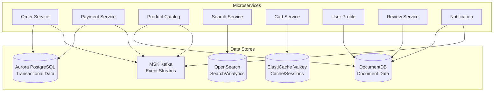
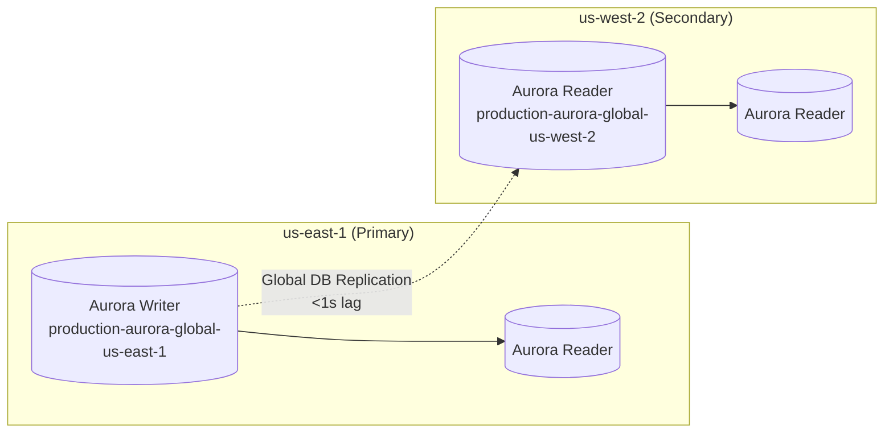
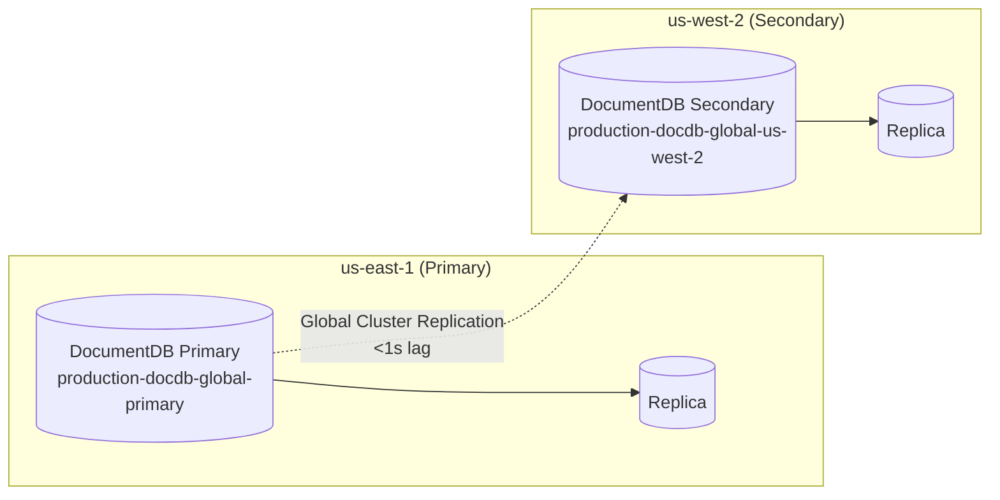
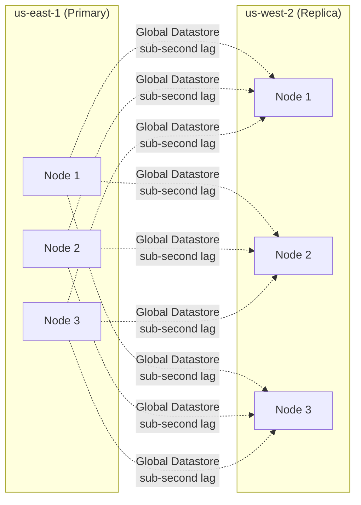
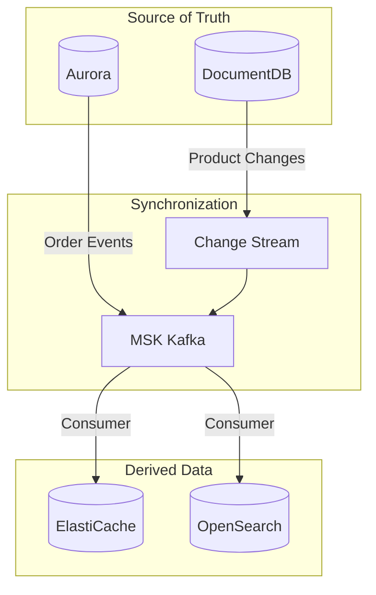

# Data Architecture

Multi-Region Shopping Mall adopts a **Polyglot Persistence** strategy, using the optimal data store for each service's characteristics. This document details the schema, usage patterns, and service-to-data mappings for each data store.

## Polyglot Persistence Strategy



### Data Store Mapping by Service

| Service | Primary Store | Secondary Store | Cache | Events |
|---------|--------------|-----------------|-------|--------|
| **Order** | Aurora | - | ElastiCache | MSK |
| **Payment** | Aurora | - | - | MSK |
| **Inventory** | Aurora | - | ElastiCache | MSK |
| **User Account** | Aurora | - | ElastiCache | MSK |
| **Shipping** | Aurora | - | - | MSK |
| **Warehouse** | Aurora | - | - | MSK |
| **Returns** | Aurora | - | - | MSK |
| **Pricing** | Aurora | - | ElastiCache | MSK |
| **Seller** | Aurora | DocumentDB | - | MSK |
| **Product Catalog** | DocumentDB | OpenSearch | ElastiCache | MSK |
| **User Profile** | DocumentDB | - | ElastiCache | MSK |
| **Wishlist** | DocumentDB | - | - | MSK |
| **Review** | DocumentDB | OpenSearch | - | MSK |
| **Notification** | DocumentDB | - | - | MSK |
| **Search** | OpenSearch | - | ElastiCache | - |
| **Cart** | ElastiCache | - | - | MSK |
| **Recommendation** | DocumentDB | - | ElastiCache | - |
| **Analytics** | OpenSearch | Aurora | - | MSK |
| **Event Bus** | MSK | - | - | - |
| **API Gateway** | - | - | ElastiCache | - |

## Aurora PostgreSQL

### Global Configuration



| Cluster | Region | Endpoint | Role |
|---------|--------|----------|------|
| Primary | us-east-1 | `production-aurora-global-us-east-1.cluster-xxxxxxxxxxxx.us-east-1.rds.amazonaws.com` | Writer |
| Secondary | us-west-2 | `production-aurora-global-us-west-2.cluster-yyyyyyyyyyyy.us-west-2.rds.amazonaws.com` | Reader |

### Schema Design

#### users Schema

```sql
-- User account table
CREATE TABLE users (
    id UUID PRIMARY KEY DEFAULT gen_random_uuid(),
    email VARCHAR(255) UNIQUE NOT NULL,
    password_hash VARCHAR(255) NOT NULL,
    phone VARCHAR(20),
    status VARCHAR(20) DEFAULT 'ACTIVE',  -- ACTIVE, SUSPENDED, DELETED
    email_verified BOOLEAN DEFAULT FALSE,
    created_at TIMESTAMP WITH TIME ZONE DEFAULT NOW(),
    updated_at TIMESTAMP WITH TIME ZONE DEFAULT NOW(),
    last_login_at TIMESTAMP WITH TIME ZONE
);

-- User addresses table
CREATE TABLE user_addresses (
    id UUID PRIMARY KEY DEFAULT gen_random_uuid(),
    user_id UUID NOT NULL REFERENCES users(id),
    address_type VARCHAR(20) NOT NULL,  -- SHIPPING, BILLING
    recipient_name VARCHAR(100) NOT NULL,
    phone VARCHAR(20) NOT NULL,
    postal_code VARCHAR(10) NOT NULL,
    address_line1 VARCHAR(255) NOT NULL,
    address_line2 VARCHAR(255),
    city VARCHAR(100) NOT NULL,
    province VARCHAR(100) NOT NULL,
    country VARCHAR(50) DEFAULT 'KR',
    is_default BOOLEAN DEFAULT FALSE,
    created_at TIMESTAMP WITH TIME ZONE DEFAULT NOW()
);

CREATE INDEX idx_user_addresses_user_id ON user_addresses(user_id);
```

#### orders Schema

```sql
-- Orders table
CREATE TABLE orders (
    id UUID PRIMARY KEY DEFAULT gen_random_uuid(),
    user_id UUID NOT NULL,
    order_number VARCHAR(50) UNIQUE NOT NULL,
    status VARCHAR(30) NOT NULL DEFAULT 'PENDING',
    -- PENDING, CONFIRMED, PAID, PROCESSING, SHIPPED, DELIVERED, CANCELLED, REFUNDED

    -- Amount information
    subtotal_amount DECIMAL(15,2) NOT NULL,
    shipping_amount DECIMAL(15,2) DEFAULT 0,
    tax_amount DECIMAL(15,2) DEFAULT 0,
    discount_amount DECIMAL(15,2) DEFAULT 0,
    total_amount DECIMAL(15,2) NOT NULL,
    currency VARCHAR(3) DEFAULT 'KRW',

    -- Shipping information
    shipping_address_id UUID,
    shipping_method VARCHAR(50),
    tracking_number VARCHAR(100),

    -- Timestamps
    ordered_at TIMESTAMP WITH TIME ZONE DEFAULT NOW(),
    paid_at TIMESTAMP WITH TIME ZONE,
    shipped_at TIMESTAMP WITH TIME ZONE,
    delivered_at TIMESTAMP WITH TIME ZONE,
    cancelled_at TIMESTAMP WITH TIME ZONE,

    created_at TIMESTAMP WITH TIME ZONE DEFAULT NOW(),
    updated_at TIMESTAMP WITH TIME ZONE DEFAULT NOW()
);

-- Order items table
CREATE TABLE order_items (
    id UUID PRIMARY KEY DEFAULT gen_random_uuid(),
    order_id UUID NOT NULL REFERENCES orders(id),
    product_id VARCHAR(50) NOT NULL,
    product_name VARCHAR(255) NOT NULL,
    product_image_url VARCHAR(500),
    sku VARCHAR(50),
    quantity INTEGER NOT NULL CHECK (quantity > 0),
    unit_price DECIMAL(15,2) NOT NULL,
    discount_price DECIMAL(15,2) DEFAULT 0,
    total_price DECIMAL(15,2) NOT NULL,
    created_at TIMESTAMP WITH TIME ZONE DEFAULT NOW()
);

CREATE INDEX idx_orders_user_id ON orders(user_id);
CREATE INDEX idx_orders_status ON orders(status);
CREATE INDEX idx_orders_ordered_at ON orders(ordered_at DESC);
CREATE INDEX idx_order_items_order_id ON order_items(order_id);
CREATE INDEX idx_order_items_product_id ON order_items(product_id);
```

#### payments Schema

```sql
-- Payments table
CREATE TABLE payments (
    id UUID PRIMARY KEY DEFAULT gen_random_uuid(),
    order_id UUID NOT NULL,
    payment_number VARCHAR(50) UNIQUE NOT NULL,
    status VARCHAR(30) NOT NULL DEFAULT 'PENDING',
    -- PENDING, PROCESSING, COMPLETED, FAILED, CANCELLED, REFUNDED

    -- Payment information
    payment_method VARCHAR(30) NOT NULL,  -- CREDIT_CARD, BANK_TRANSFER, KAKAO_PAY, NAVER_PAY
    payment_gateway VARCHAR(30),  -- TOSS, INICIS, KAKAO, NAVER

    -- Amount
    amount DECIMAL(15,2) NOT NULL,
    currency VARCHAR(3) DEFAULT 'KRW',

    -- External payment information
    external_transaction_id VARCHAR(100),
    pg_response_code VARCHAR(20),
    pg_response_message VARCHAR(255),

    -- Timestamps
    requested_at TIMESTAMP WITH TIME ZONE DEFAULT NOW(),
    completed_at TIMESTAMP WITH TIME ZONE,
    failed_at TIMESTAMP WITH TIME ZONE,
    refunded_at TIMESTAMP WITH TIME ZONE,

    created_at TIMESTAMP WITH TIME ZONE DEFAULT NOW(),
    updated_at TIMESTAMP WITH TIME ZONE DEFAULT NOW()
);

-- Refunds table
CREATE TABLE refunds (
    id UUID PRIMARY KEY DEFAULT gen_random_uuid(),
    payment_id UUID NOT NULL REFERENCES payments(id),
    refund_number VARCHAR(50) UNIQUE NOT NULL,
    status VARCHAR(30) NOT NULL DEFAULT 'PENDING',
    amount DECIMAL(15,2) NOT NULL,
    reason VARCHAR(500),
    external_refund_id VARCHAR(100),
    requested_at TIMESTAMP WITH TIME ZONE DEFAULT NOW(),
    completed_at TIMESTAMP WITH TIME ZONE,
    created_at TIMESTAMP WITH TIME ZONE DEFAULT NOW()
);

CREATE INDEX idx_payments_order_id ON payments(order_id);
CREATE INDEX idx_payments_status ON payments(status);
CREATE INDEX idx_refunds_payment_id ON refunds(payment_id);
```

#### inventory Schema

```sql
-- Inventory table
CREATE TABLE inventory (
    id UUID PRIMARY KEY DEFAULT gen_random_uuid(),
    product_id VARCHAR(50) NOT NULL,
    sku VARCHAR(50) NOT NULL,
    warehouse_id UUID NOT NULL,

    -- Quantities
    total_quantity INTEGER NOT NULL DEFAULT 0,
    available_quantity INTEGER NOT NULL DEFAULT 0,
    reserved_quantity INTEGER NOT NULL DEFAULT 0,

    -- Thresholds
    reorder_point INTEGER DEFAULT 10,
    reorder_quantity INTEGER DEFAULT 100,

    -- Metadata
    last_restocked_at TIMESTAMP WITH TIME ZONE,
    created_at TIMESTAMP WITH TIME ZONE DEFAULT NOW(),
    updated_at TIMESTAMP WITH TIME ZONE DEFAULT NOW(),

    UNIQUE(product_id, sku, warehouse_id)
);

-- Inventory movements log
CREATE TABLE inventory_movements (
    id UUID PRIMARY KEY DEFAULT gen_random_uuid(),
    inventory_id UUID NOT NULL REFERENCES inventory(id),
    movement_type VARCHAR(30) NOT NULL,
    -- INBOUND, OUTBOUND, RESERVED, RELEASED, ADJUSTMENT
    quantity INTEGER NOT NULL,
    reference_type VARCHAR(30),  -- ORDER, RETURN, ADJUSTMENT, TRANSFER
    reference_id VARCHAR(50),
    notes VARCHAR(500),
    created_at TIMESTAMP WITH TIME ZONE DEFAULT NOW()
);

CREATE INDEX idx_inventory_product ON inventory(product_id, sku);
CREATE INDEX idx_inventory_warehouse ON inventory(warehouse_id);
CREATE INDEX idx_inventory_movements_inventory_id ON inventory_movements(inventory_id);
```

#### shipments Schema

```sql
-- Shipments table
CREATE TABLE shipments (
    id UUID PRIMARY KEY DEFAULT gen_random_uuid(),
    order_id UUID NOT NULL,
    shipment_number VARCHAR(50) UNIQUE NOT NULL,
    status VARCHAR(30) NOT NULL DEFAULT 'PENDING',
    -- PENDING, PICKED, PACKED, SHIPPED, IN_TRANSIT, OUT_FOR_DELIVERY, DELIVERED, FAILED

    -- Carrier information
    carrier VARCHAR(50) NOT NULL,  -- CJ Logistics, Lotte Global, Hanjin, Korea Post
    tracking_number VARCHAR(100),

    -- Address information
    recipient_name VARCHAR(100) NOT NULL,
    recipient_phone VARCHAR(20) NOT NULL,
    postal_code VARCHAR(10) NOT NULL,
    address VARCHAR(500) NOT NULL,

    -- Shipping options
    shipping_method VARCHAR(30),  -- STANDARD, EXPRESS, SAME_DAY
    estimated_delivery_date DATE,
    actual_delivery_date DATE,

    -- Timestamps
    picked_at TIMESTAMP WITH TIME ZONE,
    shipped_at TIMESTAMP WITH TIME ZONE,
    delivered_at TIMESTAMP WITH TIME ZONE,
    created_at TIMESTAMP WITH TIME ZONE DEFAULT NOW(),
    updated_at TIMESTAMP WITH TIME ZONE DEFAULT NOW()
);

-- Shipment tracking events
CREATE TABLE shipment_events (
    id UUID PRIMARY KEY DEFAULT gen_random_uuid(),
    shipment_id UUID NOT NULL REFERENCES shipments(id),
    event_type VARCHAR(50) NOT NULL,
    location VARCHAR(255),
    description VARCHAR(500),
    occurred_at TIMESTAMP WITH TIME ZONE NOT NULL,
    created_at TIMESTAMP WITH TIME ZONE DEFAULT NOW()
);

CREATE INDEX idx_shipments_order_id ON shipments(order_id);
CREATE INDEX idx_shipments_tracking ON shipments(carrier, tracking_number);
CREATE INDEX idx_shipment_events_shipment_id ON shipment_events(shipment_id);
```

## DocumentDB

### Global Configuration



| Cluster | Region | Endpoint | Role |
|---------|--------|----------|------|
| Primary | us-east-1 | `production-docdb-global-primary.cluster-xxxxxxxxxxxx.us-east-1.docdb.amazonaws.com` | Writer |
| Secondary | us-west-2 | `production-docdb-global-us-west-2.cluster-yyyyyyyyyyyy.us-west-2.docdb.amazonaws.com` | Reader |

### Collection Schemas

#### products Collection

```javascript
// products collection schema
{
  "_id": ObjectId("..."),
  "productId": "PROD-001",
  "name": "Samsung Galaxy S24 Ultra",
  "slug": "samsung-galaxy-s24-ultra",
  "brand": "Samsung",
  "category": {
    "main": "Electronics",
    "sub": "Smartphones",
    "path": ["Electronics", "Smartphones", "Android"]
  },
  "description": {
    "short": "Flagship smartphone with AI features",
    "long": "Detailed product description...",
    "highlights": ["200MP Camera", "Galaxy AI", "Built-in S Pen"]
  },
  "pricing": {
    "listPrice": 1650000,
    "salePrice": 1550000,
    "currency": "KRW",
    "discount": {
      "percentage": 6,
      "validUntil": ISODate("2024-12-31T23:59:59Z")
    }
  },
  "variants": [
    {
      "sku": "S24U-256-BLK",
      "attributes": {
        "storage": "256GB",
        "color": "Titanium Black"
      },
      "price": 1550000,
      "stock": 150
    },
    {
      "sku": "S24U-512-VLT",
      "attributes": {
        "storage": "512GB",
        "color": "Titanium Violet"
      },
      "price": 1750000,
      "stock": 80
    }
  ],
  "images": [
    {
      "url": "https://cdn.atomai.click/products/s24u-main.jpg",
      "alt": "Galaxy S24 Ultra front view",
      "type": "main"
    }
  ],
  "specifications": {
    "display": "6.8-inch QHD+ Dynamic AMOLED 2X",
    "processor": "Snapdragon 8 Gen 3",
    "ram": "12GB",
    "battery": "5000mAh",
    "os": "Android 14"
  },
  "seller": {
    "sellerId": "SELLER-001",
    "name": "Samsung Official Store",
    "rating": 4.9
  },
  "ratings": {
    "average": 4.7,
    "count": 2584,
    "distribution": {
      "5": 1842,
      "4": 512,
      "3": 156,
      "2": 48,
      "1": 26
    }
  },
  "tags": ["5G", "AI", "flagship", "S Pen", "high-performance"],
  "status": "ACTIVE",  // ACTIVE, DRAFT, DISCONTINUED
  "createdAt": ISODate("2024-01-15T09:00:00Z"),
  "updatedAt": ISODate("2024-03-10T14:30:00Z")
}

// Indexes
db.products.createIndex({ "productId": 1 }, { unique: true })
db.products.createIndex({ "slug": 1 }, { unique: true })
db.products.createIndex({ "category.main": 1, "category.sub": 1 })
db.products.createIndex({ "seller.sellerId": 1 })
db.products.createIndex({ "status": 1 })
db.products.createIndex({ "pricing.salePrice": 1 })
db.products.createIndex({ "ratings.average": -1 })
db.products.createIndex({ "tags": 1 })
```

#### user_profiles Collection

```javascript
// user_profiles collection schema
{
  "_id": ObjectId("..."),
  "userId": "USER-001",  // References Aurora users.id
  "displayName": "John Doe",
  "avatar": "https://cdn.atomai.click/avatars/user001.jpg",
  "preferences": {
    "language": "en",
    "currency": "KRW",
    "timezone": "Asia/Seoul",
    "notifications": {
      "email": true,
      "push": true,
      "sms": false,
      "marketing": true
    },
    "categories": ["Electronics", "Fashion", "Books"]
  },
  "recentlyViewed": [
    {
      "productId": "PROD-001",
      "viewedAt": ISODate("2024-03-10T10:30:00Z")
    }
  ],
  "searchHistory": [
    {
      "query": "Galaxy S24",
      "searchedAt": ISODate("2024-03-10T10:25:00Z")
    }
  ],
  "savedPaymentMethods": [
    {
      "id": "PM-001",
      "type": "CREDIT_CARD",
      "last4": "1234",
      "brand": "VISA",
      "isDefault": true
    }
  ],
  "createdAt": ISODate("2024-01-01T00:00:00Z"),
  "updatedAt": ISODate("2024-03-10T10:30:00Z")
}

// Indexes
db.user_profiles.createIndex({ "userId": 1 }, { unique: true })
db.user_profiles.createIndex({ "preferences.categories": 1 })
```

#### wishlists Collection

```javascript
// wishlists collection schema
{
  "_id": ObjectId("..."),
  "wishlistId": "WL-001",
  "userId": "USER-001",
  "name": "My Wishlist",
  "isPublic": false,
  "items": [
    {
      "productId": "PROD-001",
      "addedAt": ISODate("2024-03-05T14:00:00Z"),
      "priceAtAdd": 1550000,
      "note": "Want this for my birthday"
    },
    {
      "productId": "PROD-042",
      "addedAt": ISODate("2024-03-08T09:30:00Z"),
      "priceAtAdd": 89000,
      "note": null
    }
  ],
  "createdAt": ISODate("2024-02-01T00:00:00Z"),
  "updatedAt": ISODate("2024-03-08T09:30:00Z")
}

// Indexes
db.wishlists.createIndex({ "userId": 1 })
db.wishlists.createIndex({ "items.productId": 1 })
```

#### reviews Collection

```javascript
// reviews collection schema
{
  "_id": ObjectId("..."),
  "reviewId": "REV-001",
  "productId": "PROD-001",
  "orderId": "ORD-12345",  // For purchase verification
  "userId": "USER-001",
  "userDisplayName": "J***n",
  "rating": 5,
  "title": "Best smartphone ever!",
  "content": "The Galaxy AI features are really useful. Especially the call translation feature...",
  "images": [
    {
      "url": "https://cdn.atomai.click/reviews/rev001-1.jpg",
      "caption": "Unboxing"
    }
  ],
  "pros": ["Excellent camera", "S Pen convenience", "AI features"],
  "cons": ["Expensive price"],
  "isVerifiedPurchase": true,
  "helpfulCount": 42,
  "status": "APPROVED",  // PENDING, APPROVED, REJECTED
  "createdAt": ISODate("2024-02-15T16:30:00Z"),
  "updatedAt": ISODate("2024-02-15T16:30:00Z")
}

// Indexes
db.reviews.createIndex({ "productId": 1, "createdAt": -1 })
db.reviews.createIndex({ "userId": 1 })
db.reviews.createIndex({ "rating": 1 })
db.reviews.createIndex({ "status": 1 })
```

#### notifications Collection

```javascript
// notifications collection schema
{
  "_id": ObjectId("..."),
  "notificationId": "NOTIF-001",
  "userId": "USER-001",
  "type": "ORDER_STATUS",  // ORDER_STATUS, PROMOTION, PRICE_DROP, REVIEW_REQUEST, SYSTEM
  "channel": "PUSH",  // PUSH, EMAIL, SMS, IN_APP
  "title": "Your order has been shipped",
  "body": "Order ORD-12345 has started shipping.",
  "data": {
    "orderId": "ORD-12345",
    "trackingNumber": "1234567890",
    "deepLink": "/orders/ORD-12345"
  },
  "status": "SENT",  // PENDING, SENT, DELIVERED, FAILED, READ
  "scheduledAt": null,
  "sentAt": ISODate("2024-03-10T14:00:00Z"),
  "readAt": null,
  "createdAt": ISODate("2024-03-10T14:00:00Z")
}

// Indexes
db.notifications.createIndex({ "userId": 1, "createdAt": -1 })
db.notifications.createIndex({ "status": 1 })
db.notifications.createIndex({ "type": 1 })
db.notifications.createIndex({ "scheduledAt": 1 }, { sparse: true })
```

## ElastiCache Valkey

### Global Configuration



| Cluster | Region | Endpoint | Role |
|---------|--------|----------|------|
| Primary | us-east-1 | `clustercfg.production-elasticache-us-east-1.xxxxxx.use1.cache.amazonaws.com:6379` | Primary |
| Secondary | us-west-2 | `clustercfg.production-elasticache-us-west-2.yyyyyy.usw2.cache.amazonaws.com:6379` | Replica |

### Key Patterns and TTL

| Key Pattern | Data | TTL | Purpose |
|-------------|------|-----|---------|
| `cart:{userId}` | Cart JSON | 7 days | Shopping cart data |
| `session:{sessionId}` | Session JSON | 24 hours | User sessions |
| `product:{productId}` | Product JSON | 1 hour | Product cache |
| `product:list:{category}:{page}` | Product list | 10 minutes | Category listings |
| `user:{userId}:profile` | Profile JSON | 30 minutes | User profile cache |
| `inventory:{productId}:{sku}` | Stock quantity | 5 minutes | Inventory cache |
| `price:{productId}` | Price info | 15 minutes | Price cache |
| `rate_limit:{userId}:{endpoint}` | Counter | 1 minute | Rate limiting |
| `search:suggest:{prefix}` | Autocomplete list | 1 hour | Search autocomplete |

### Data Structure Examples

#### Cart (cart:{userId})

```json
{
  "userId": "USER-001",
  "items": [
    {
      "productId": "PROD-001",
      "sku": "S24U-256-BLK",
      "name": "Samsung Galaxy S24 Ultra 256GB",
      "quantity": 1,
      "unitPrice": 1550000,
      "totalPrice": 1550000,
      "imageUrl": "https://cdn.atomai.click/products/s24u-thumb.jpg"
    }
  ],
  "subtotal": 1550000,
  "itemCount": 1,
  "updatedAt": "2024-03-10T14:30:00Z"
}
```

#### Session (session:{sessionId})

```json
{
  "sessionId": "sess_abc123xyz",
  "userId": "USER-001",
  "email": "user@example.com",
  "roles": ["USER"],
  "deviceInfo": {
    "type": "mobile",
    "os": "iOS",
    "browser": "Safari"
  },
  "region": "us-west-2",
  "createdAt": "2024-03-10T10:00:00Z",
  "lastAccessAt": "2024-03-10T14:30:00Z"
}
```

### Valkey Command Examples

```bash
# Get cart
GET cart:USER-001

# Update cart (7-day TTL)
SET cart:USER-001 '{"items":[...]}' EX 604800

# Decrease inventory (atomic operation)
DECRBY inventory:PROD-001:S24U-256-BLK 1

# Rate limiting (100 requests per minute limit)
MULTI
INCR rate_limit:USER-001:POST:/orders
EXPIRE rate_limit:USER-001:POST:/orders 60
EXEC

# Search autocomplete
ZADD search:suggest:gal 1 "Galaxy S24" 2 "Galaxy Buds" 3 "Galaxy Tab"
ZRANGE search:suggest:gal 0 9
```

## OpenSearch

### Per-Region Configuration

OpenSearch operates independent clusters per region (no global replication).

| Region | Domain | Endpoint |
|--------|--------|----------|
| us-east-1 | production-os-use1 | `vpc-production-os-use1-xxxxxxxxxxxxxxxxxxxxxxxxxxxx.us-east-1.es.amazonaws.com` |
| us-west-2 | production-os-usw2 | `vpc-production-os-usw2-yyyyyyyyyyyyyyyyyyyyyyyyyyyy.us-west-2.es.amazonaws.com` |

### Index Mappings

#### products Index

```json
{
  "settings": {
    "number_of_shards": 3,
    "number_of_replicas": 1,
    "analysis": {
      "analyzer": {
        "korean_analyzer": {
          "type": "custom",
          "tokenizer": "nori_tokenizer",
          "filter": [
            "nori_readingform",
            "lowercase",
            "nori_part_of_speech"
          ]
        },
        "korean_search": {
          "type": "custom",
          "tokenizer": "nori_tokenizer",
          "filter": [
            "nori_readingform",
            "lowercase",
            "synonym_filter"
          ]
        }
      },
      "filter": {
        "synonym_filter": {
          "type": "synonym",
          "synonyms": [
            "phone,cellphone,smartphone,mobile",
            "notebook,laptop",
            "earphone,earbuds"
          ]
        }
      }
    }
  },
  "mappings": {
    "properties": {
      "productId": { "type": "keyword" },
      "name": {
        "type": "text",
        "analyzer": "korean_analyzer",
        "search_analyzer": "korean_search",
        "fields": {
          "keyword": { "type": "keyword" },
          "suggest": {
            "type": "completion",
            "analyzer": "korean_analyzer"
          }
        }
      },
      "brand": {
        "type": "text",
        "fields": {
          "keyword": { "type": "keyword" }
        }
      },
      "category": {
        "properties": {
          "main": { "type": "keyword" },
          "sub": { "type": "keyword" },
          "path": { "type": "keyword" }
        }
      },
      "description": {
        "type": "text",
        "analyzer": "korean_analyzer"
      },
      "tags": { "type": "keyword" },
      "price": { "type": "float" },
      "salePrice": { "type": "float" },
      "rating": { "type": "float" },
      "reviewCount": { "type": "integer" },
      "sellerId": { "type": "keyword" },
      "status": { "type": "keyword" },
      "createdAt": { "type": "date" },
      "updatedAt": { "type": "date" }
    }
  }
}
```

#### notification-logs Index

```json
{
  "settings": {
    "number_of_shards": 2,
    "number_of_replicas": 1,
    "index.lifecycle.name": "notification-logs-policy",
    "index.lifecycle.rollover_alias": "notification-logs"
  },
  "mappings": {
    "properties": {
      "notificationId": { "type": "keyword" },
      "userId": { "type": "keyword" },
      "type": { "type": "keyword" },
      "channel": { "type": "keyword" },
      "status": { "type": "keyword" },
      "title": { "type": "text" },
      "sentAt": { "type": "date" },
      "deliveredAt": { "type": "date" },
      "errorMessage": { "type": "text" },
      "@timestamp": { "type": "date" }
    }
  }
}
```

### Search Query Example

```json
// Korean product search
POST /products/_search
{
  "query": {
    "bool": {
      "must": [
        {
          "multi_match": {
            "query": "Galaxy smartphone",
            "fields": ["name^3", "brand^2", "description", "tags"],
            "type": "best_fields",
            "fuzziness": "AUTO"
          }
        }
      ],
      "filter": [
        { "term": { "status": "ACTIVE" } },
        { "range": { "price": { "gte": 100000, "lte": 2000000 } } }
      ]
    }
  },
  "sort": [
    { "_score": "desc" },
    { "rating": "desc" }
  ],
  "aggs": {
    "categories": {
      "terms": { "field": "category.main" }
    },
    "price_ranges": {
      "range": {
        "field": "price",
        "ranges": [
          { "to": 100000 },
          { "from": 100000, "to": 500000 },
          { "from": 500000, "to": 1000000 },
          { "from": 1000000 }
        ]
      }
    },
    "avg_rating": {
      "avg": { "field": "rating" }
    }
  },
  "highlight": {
    "fields": {
      "name": {},
      "description": { "fragment_size": 150 }
    }
  }
}
```

## Data Synchronization Patterns



### DocumentDB Change Stream → OpenSearch

```python
# Change Stream Consumer
async def sync_products_to_opensearch():
    client = motor.motor_asyncio.AsyncIOMotorClient(DOCDB_URI)
    collection = client.mall.products

    pipeline = [
        {'$match': {'operationType': {'$in': ['insert', 'update', 'replace']}}}
    ]

    async with collection.watch(pipeline) as stream:
        async for change in stream:
            doc = change['fullDocument']
            await opensearch.index(
                index='products',
                id=doc['productId'],
                body={
                    'productId': doc['productId'],
                    'name': doc['name'],
                    'brand': doc['brand'],
                    'category': doc['category'],
                    'description': doc['description']['short'],
                    'tags': doc['tags'],
                    'price': doc['pricing']['listPrice'],
                    'salePrice': doc['pricing']['salePrice'],
                    'rating': doc['ratings']['average'],
                    'reviewCount': doc['ratings']['count'],
                    'sellerId': doc['seller']['sellerId'],
                    'status': doc['status'],
                    'updatedAt': doc['updatedAt']
                }
            )
```

## Next Steps

- [Event-Driven Architecture](./event-driven) - MSK Kafka topics and event patterns
- [Disaster Recovery](./disaster-recovery) - Data replication and failover
