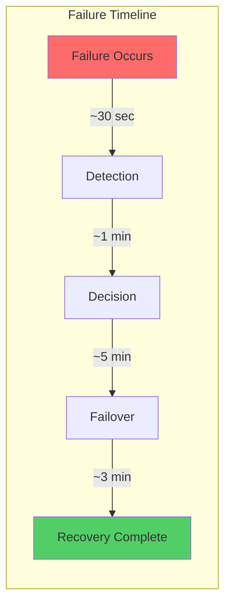
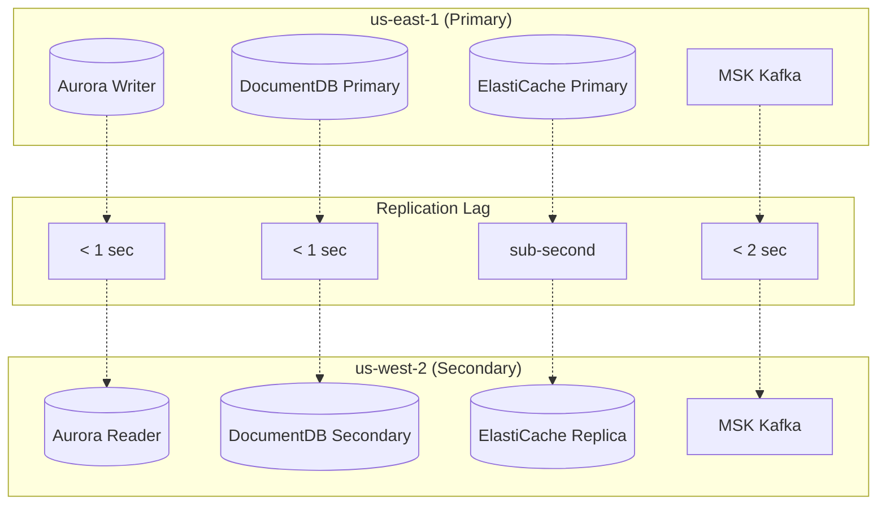
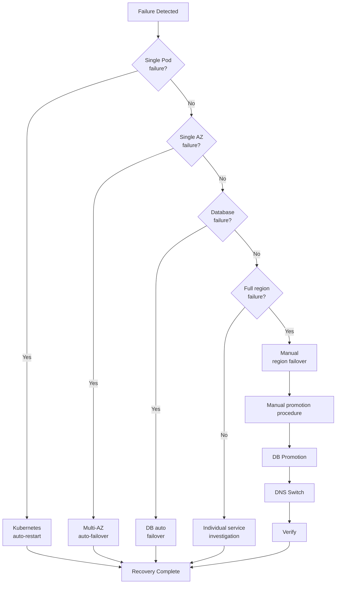
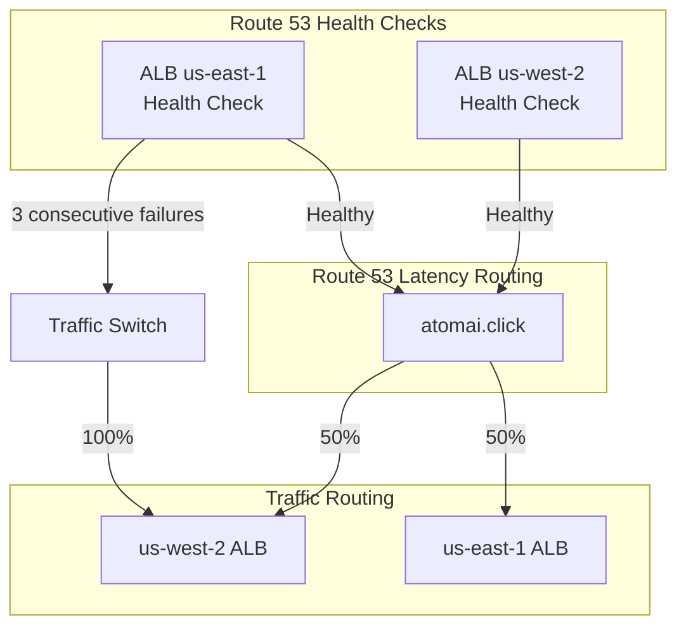
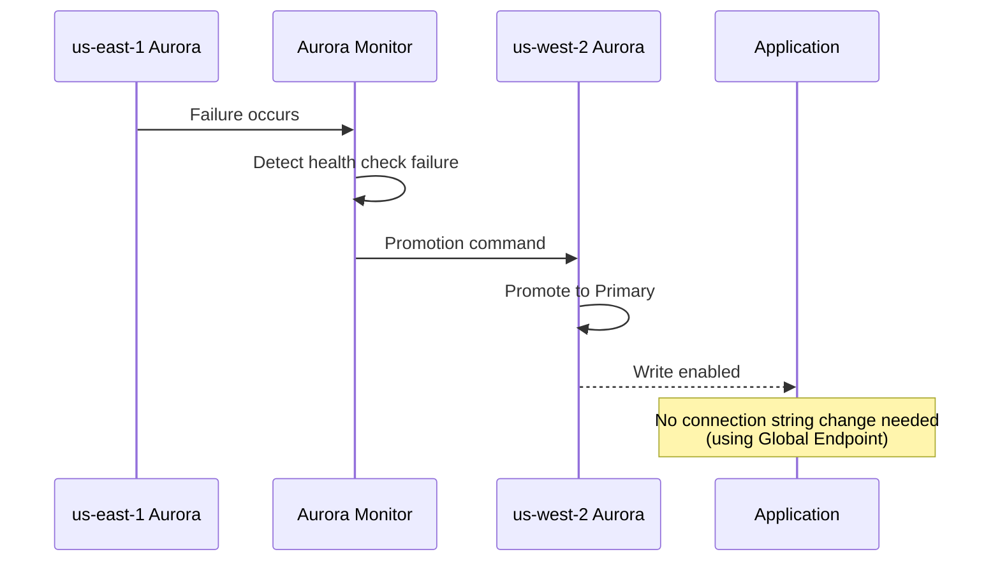
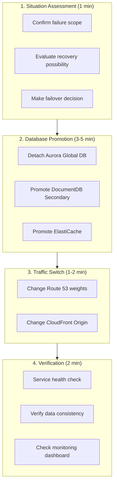
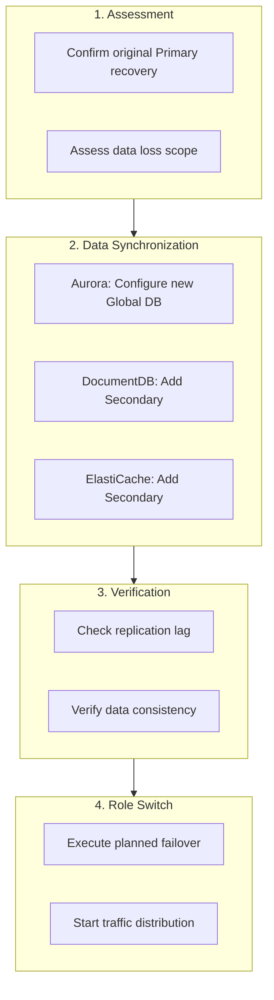

# Disaster Recovery

Multi-Region Shopping Mall implements disaster recovery (DR) strategies targeting **RPO < 1 second, RTO < 10 minutes**. This document details data replication lag, failover procedures, and recovery processes.

## DR Goals

| Metric | Target | Description |
|--------|--------|-------------|
| **RPO** (Recovery Point Objective) | < 1 second | Acceptable data loss range |
| **RTO** (Recovery Time Objective) | < 10 minutes | Service recovery time |
| **Availability** | 99.99% | Annual downtime under 52 minutes |



## Data Replication Lag

### Replication Lag by Data Store

| Data Store | Replication Method | Average Lag | Maximum Lag | RPO Compliance |
|------------|-------------------|-------------|-------------|----------------|
| **Aurora PostgreSQL** | Global Database | < 100ms | < 1 second | O |
| **DocumentDB** | Global Cluster | < 100ms | < 1 second | O |
| **ElastiCache Valkey** | Global Datastore | < 50ms | < 500ms | O |
| **MSK Kafka** | MSK Replicator | < 500ms | < 2 seconds | O |
| **OpenSearch** | None (per-region) | N/A | N/A | N/A |



### Monitoring Replication Lag

```sql
-- Check Aurora Global Database replication lag
SELECT
    server_id,
    session_id,
    replica_lag_in_msec,
    last_update_timestamp
FROM aurora_global_db_instance_status()
WHERE session_id = 'GLOBAL';
```

```bash
# Check ElastiCache Global Datastore lag
aws elasticache describe-global-replication-groups \
    --global-replication-group-id production-global-datastore \
    --query 'GlobalReplicationGroups[0].Members[*].{Region:ReplicationGroupRegion,Lag:GlobalReplicationGroupMemberRole}'

# CloudWatch metrics
aws cloudwatch get-metric-statistics \
    --namespace AWS/RDS \
    --metric-name AuroraGlobalDBReplicationLag \
    --dimensions Name=DBClusterIdentifier,Value=production-aurora-global-us-west-2 \
    --start-time $(date -d '1 hour ago' -u +%Y-%m-%dT%H:%M:%SZ) \
    --end-time $(date -u +%Y-%m-%dT%H:%M:%SZ) \
    --period 60 \
    --statistics Average
```

## Failover Decision Matrix

### Response by Failure Type

| Failure Type | Impact Scope | Detection Method | Failover Type | Expected RTO |
|--------------|--------------|------------------|---------------|--------------|
| **Single EC2/Pod failure** | Partial service | EKS Health Check | Automatic (Kubernetes) | < 30 seconds |
| **Single AZ failure** | Resources in AZ | Route 53 Health Check | Automatic (Multi-AZ) | < 1 minute |
| **Aurora Primary failure** | Write operations | Aurora Auto-failover | Automatic (Aurora) | 1-2 minutes |
| **EKS cluster failure** | Regional services | ALB Health Check | Automatic (Route 53) | < 2 minutes |
| **Full region failure** | All services | Manual verification | **Manual** | 5-10 minutes |

### Failover Decision Flow



## Automatic Failover

### Route 53 Health Check Based



### Terraform Configuration

```hcl
# Route 53 Health Check
resource "aws_route53_health_check" "alb_use1" {
  fqdn              = aws_lb.use1.dns_name
  port              = 443
  type              = "HTTPS"
  resource_path     = "/health"
  failure_threshold = 3
  request_interval  = 10

  tags = {
    Name = "alb-us-east-1-health-check"
  }
}

resource "aws_route53_health_check" "alb_usw2" {
  fqdn              = aws_lb.usw2.dns_name
  port              = 443
  type              = "HTTPS"
  resource_path     = "/health"
  failure_threshold = 3
  request_interval  = 10

  tags = {
    Name = "alb-us-west-2-health-check"
  }
}

# Latency-based routing with health check
resource "aws_route53_record" "api_use1" {
  zone_id = aws_route53_zone.main.zone_id
  name    = "api.atomai.click"
  type    = "A"

  alias {
    name                   = aws_lb.use1.dns_name
    zone_id                = aws_lb.use1.zone_id
    evaluate_target_health = true
  }

  latency_routing_policy {
    region = "us-east-1"
  }

  set_identifier  = "us-east-1"
  health_check_id = aws_route53_health_check.alb_use1.id
}

resource "aws_route53_record" "api_usw2" {
  zone_id = aws_route53_zone.main.zone_id
  name    = "api.atomai.click"
  type    = "A"

  alias {
    name                   = aws_lb.usw2.dns_name
    zone_id                = aws_lb.usw2.zone_id
    evaluate_target_health = true
  }

  latency_routing_policy {
    region = "us-west-2"
  }

  set_identifier  = "us-west-2"
  health_check_id = aws_route53_health_check.alb_usw2.id
}
```

### Aurora Automatic Failover

Aurora Global Database automatically promotes Secondary on Primary cluster failure.



## Manual Failover Procedure

### Full Region Failover

When full region failure occurs, Secondary must be manually promoted to Primary.



### Detailed Procedures

#### Step 1: Aurora Global Database Detach and Promotion

```bash
#!/bin/bash
# aurora-failover.sh

# 1. Detach Secondary cluster from Global Database
aws rds remove-from-global-cluster \
    --global-cluster-identifier production-aurora-global \
    --db-cluster-identifier production-aurora-global-us-west-2 \
    --region us-west-2

# 2. Wait for detached cluster to become standalone
aws rds wait db-cluster-available \
    --db-cluster-identifier production-aurora-global-us-west-2 \
    --region us-west-2

# 3. Verify new Primary cluster
aws rds describe-db-clusters \
    --db-cluster-identifier production-aurora-global-us-west-2 \
    --region us-west-2 \
    --query 'DBClusters[0].{Status:Status,Endpoint:Endpoint}'

echo "Aurora failover completed. New primary: us-west-2"
```

#### Step 2: DocumentDB Global Cluster Promotion

```bash
#!/bin/bash
# documentdb-failover.sh

# 1. Promote Secondary cluster to Primary
aws docdb failover-global-cluster \
    --global-cluster-identifier production-docdb-global \
    --target-db-cluster-identifier production-docdb-global-us-west-2 \
    --region us-west-2

# 2. Wait for promotion to complete
aws docdb wait db-cluster-available \
    --db-cluster-identifier production-docdb-global-us-west-2 \
    --region us-west-2

echo "DocumentDB failover completed. New primary: us-west-2"
```

#### Step 3: ElastiCache Global Datastore Promotion

```bash
#!/bin/bash
# elasticache-failover.sh

# 1. Promote us-west-2 to Primary in Global Datastore
aws elasticache failover-global-replication-group \
    --global-replication-group-id production-global-datastore \
    --primary-region us-west-2 \
    --primary-replication-group-id production-elasticache-us-west-2

# 2. Check status
aws elasticache describe-global-replication-groups \
    --global-replication-group-id production-global-datastore \
    --query 'GlobalReplicationGroups[0].Members'

echo "ElastiCache failover completed. New primary: us-west-2"
```

#### Step 4: DNS and Traffic Switch

```bash
#!/bin/bash
# dns-failover.sh

# 1. Change Route 53 record weights (us-east-1: 0, us-west-2: 100)
aws route53 change-resource-record-sets \
    --hosted-zone-id Z1234567890 \
    --change-batch '{
        "Changes": [
            {
                "Action": "UPSERT",
                "ResourceRecordSet": {
                    "Name": "api.atomai.click",
                    "Type": "A",
                    "SetIdentifier": "us-east-1",
                    "Weight": 0,
                    "AliasTarget": {
                        "HostedZoneId": "Z35SXDOTRQ7X7K",
                        "DNSName": "alb-use1.us-east-1.elb.amazonaws.com",
                        "EvaluateTargetHealth": false
                    }
                }
            },
            {
                "Action": "UPSERT",
                "ResourceRecordSet": {
                    "Name": "api.atomai.click",
                    "Type": "A",
                    "SetIdentifier": "us-west-2",
                    "Weight": 100,
                    "AliasTarget": {
                        "HostedZoneId": "Z1H1FL5HABSF5",
                        "DNSName": "alb-usw2.us-west-2.elb.amazonaws.com",
                        "EvaluateTargetHealth": false
                    }
                }
            }
        ]
    }'

echo "DNS failover completed. All traffic routed to us-west-2"
```

## Recovery Procedure (Failback)

### Failback After Original Primary Recovery



### Failback Script

```bash
#!/bin/bash
# failback-to-use1.sh

echo "=== Step 1: Verify us-east-1 is healthy ==="
# Check infrastructure status
aws ec2 describe-availability-zones --region us-east-1

echo "=== Step 2: Re-establish Aurora Global DB ==="
# Create new Global DB (us-west-2 is current Primary)
aws rds create-global-cluster \
    --global-cluster-identifier production-aurora-global-v2 \
    --source-db-cluster-identifier production-aurora-us-west-2 \
    --region us-west-2

# Add Secondary cluster to us-east-1
aws rds create-db-cluster \
    --db-cluster-identifier production-aurora-us-east-1-v2 \
    --global-cluster-identifier production-aurora-global-v2 \
    --engine aurora-postgresql \
    --engine-version 15.4 \
    --region us-east-1

echo "=== Step 3: Wait for sync ==="
# Wait until replication lag approaches 0
while true; do
    lag=$(aws rds describe-db-clusters \
        --db-cluster-identifier production-aurora-us-east-1-v2 \
        --region us-east-1 \
        --query 'DBClusters[0].GlobalWriteForwardingStatus' \
        --output text)
    if [ "$lag" == "enabled" ]; then
        break
    fi
    sleep 10
done

echo "=== Step 4: Planned failover to us-east-1 ==="
aws rds failover-global-cluster \
    --global-cluster-identifier production-aurora-global-v2 \
    --target-db-cluster-identifier production-aurora-us-east-1-v2

echo "=== Step 5: Gradually shift traffic ==="
# Gradual traffic shift: 10% -> 50% -> 100%
for weight in 10 50 100; do
    echo "Setting us-east-1 weight to $weight%"
    # Update Route 53 weights
    sleep 300  # 5 minute monitoring
done

echo "Failback completed!"
```

## Monitoring and Alerts

### CloudWatch Alarms

```hcl
# Aurora replication lag alarm
resource "aws_cloudwatch_metric_alarm" "aurora_replication_lag" {
  alarm_name          = "aurora-global-replication-lag-high"
  comparison_operator = "GreaterThanThreshold"
  evaluation_periods  = 3
  metric_name         = "AuroraGlobalDBReplicationLag"
  namespace           = "AWS/RDS"
  period              = 60
  statistic           = "Average"
  threshold           = 1000  # 1 second

  dimensions = {
    DBClusterIdentifier = "production-aurora-global-us-west-2"
  }

  alarm_actions = [aws_sns_topic.alerts.arn]
  ok_actions    = [aws_sns_topic.alerts.arn]

  alarm_description = "Aurora Global DB replication lag exceeds 1 second"
}

# Route 53 Health Check alarm
resource "aws_cloudwatch_metric_alarm" "route53_health_use1" {
  alarm_name          = "route53-health-us-east-1-unhealthy"
  comparison_operator = "LessThanThreshold"
  evaluation_periods  = 1
  metric_name         = "HealthCheckStatus"
  namespace           = "AWS/Route53"
  period              = 60
  statistic           = "Minimum"
  threshold           = 1

  dimensions = {
    HealthCheckId = aws_route53_health_check.alb_use1.id
  }

  alarm_actions = [aws_sns_topic.alerts.arn]

  alarm_description = "us-east-1 ALB health check failing"
}
```

### DR Dashboard

```json
{
  "widgets": [
    {
      "title": "Aurora Global DB Replication Lag",
      "type": "metric",
      "properties": {
        "metrics": [
          ["AWS/RDS", "AuroraGlobalDBReplicationLag", "DBClusterIdentifier", "production-aurora-global-us-west-2"]
        ],
        "period": 60,
        "stat": "Average",
        "region": "us-west-2"
      }
    },
    {
      "title": "Route 53 Health Check Status",
      "type": "metric",
      "properties": {
        "metrics": [
          ["AWS/Route53", "HealthCheckStatus", "HealthCheckId", "health-check-use1"],
          ["AWS/Route53", "HealthCheckStatus", "HealthCheckId", "health-check-usw2"]
        ],
        "period": 60,
        "stat": "Minimum"
      }
    },
    {
      "title": "Cross-Region Latency",
      "type": "metric",
      "properties": {
        "metrics": [
          ["Custom/MultiRegion", "CrossRegionLatency", "SourceRegion", "us-east-1", "TargetRegion", "us-west-2"]
        ],
        "period": 60
      }
    }
  ]
}
```

## DR Testing

### Regular DR Drills

| Drill Type | Frequency | Scope | Impact |
|------------|-----------|-------|--------|
| **Tabletop exercise** | Monthly | Procedure review | None |
| **Component failover** | Quarterly | Individual DB | Minimal |
| **Full region failover** | Annually | Full stack | Planned downtime |

### Test Checklist

- [ ] Verify Route 53 Health Check behavior
- [ ] Test Aurora auto-failover
- [ ] Test DocumentDB Secondary promotion
- [ ] Test ElastiCache Global Datastore failover
- [ ] Verify MSK Replicator replication lag
- [ ] Verify application connection string auto-switch
- [ ] Verify monitoring alert delivery
- [ ] Update runbook

## Next Steps

- [Security](./security) - Security architecture and compliance
- [Multi-Region Design](./multi-region-design) - Region roles and traffic routing
