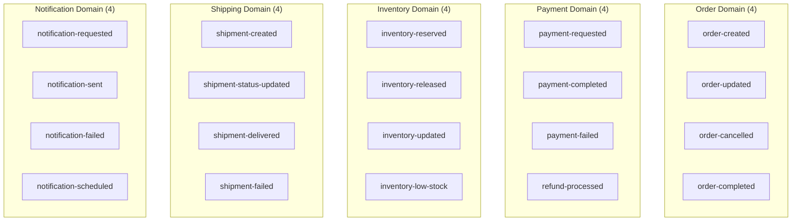
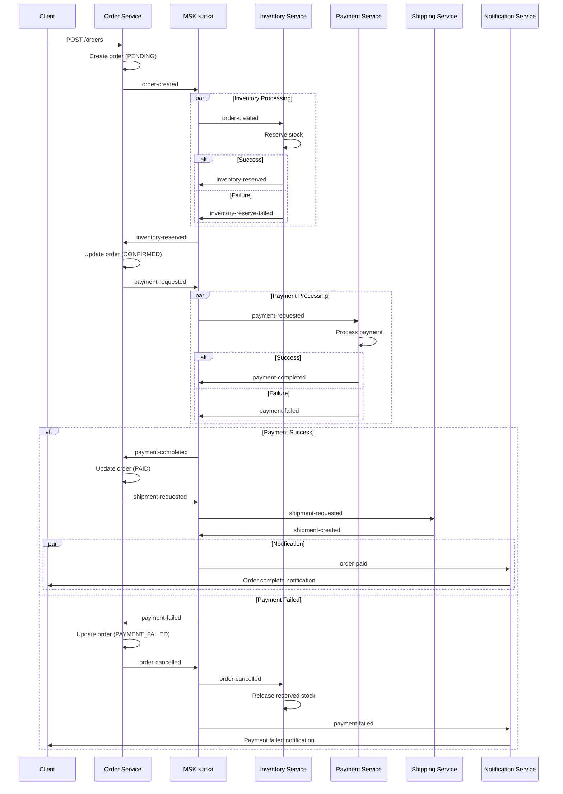
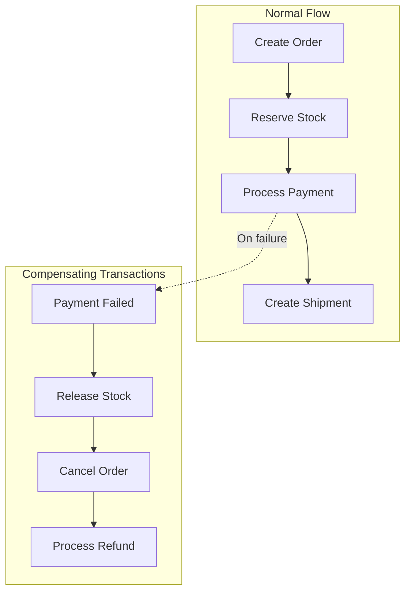
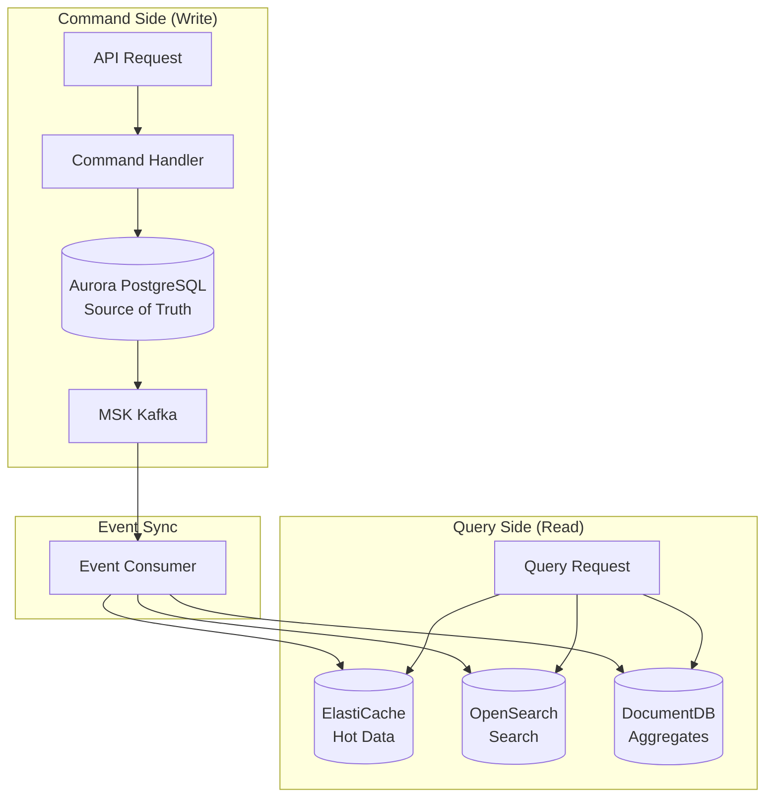
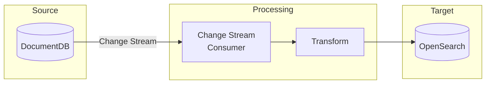
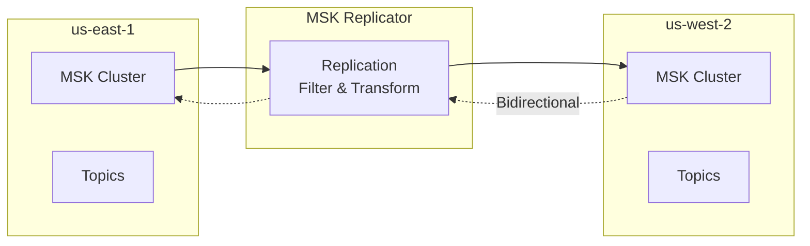
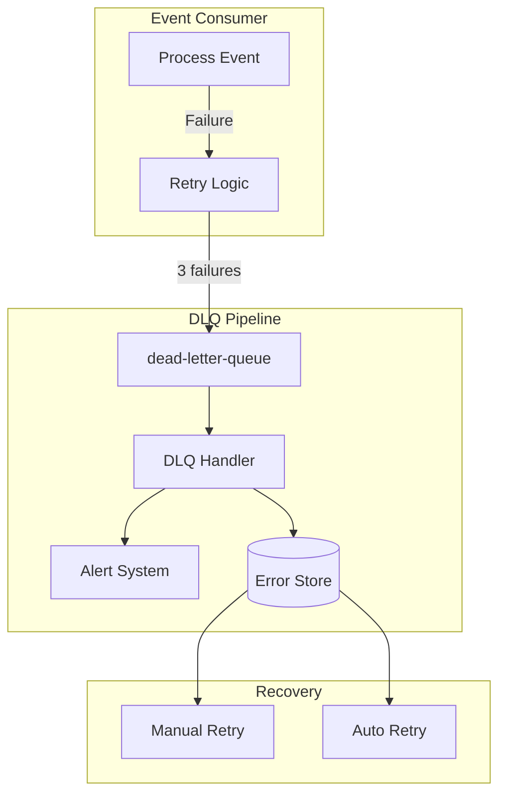

# Event-Driven Architecture

Multi-Region Shopping Mall implements an event-driven architecture (EDA) centered on **MSK Kafka**. This enables loose coupling between services, asynchronous processing, and distributed transactions based on the SAGA pattern.

## MSK Kafka Topic Structure

### Topic Overview

A total of **35 Kafka topics** are organized by domain.



### Topic Details by Domain

#### Order Domain (4 Topics)

| Topic | Partitions | Producer | Consumer | Description |
|-------|------------|----------|----------|-------------|
| `order-created` | 6 | Order Service | Payment, Inventory, Notification | Order creation event |
| `order-updated` | 6 | Order Service | Analytics, Notification | Order status change |
| `order-cancelled` | 3 | Order Service | Payment, Inventory, Notification | Order cancellation |
| `order-completed` | 3 | Order Service | Analytics, Recommendation | Order completion |

```json
// order-created event schema
{
  "eventId": "evt-uuid-123",
  "eventType": "ORDER_CREATED",
  "timestamp": "2024-03-10T14:30:00Z",
  "version": "1.0",
  "source": "order-service",
  "correlationId": "corr-uuid-456",
  "payload": {
    "orderId": "ORD-12345",
    "userId": "USER-001",
    "items": [
      {
        "productId": "PROD-001",
        "sku": "S24U-256-BLK",
        "quantity": 1,
        "unitPrice": 1550000
      }
    ],
    "totalAmount": 1550000,
    "currency": "KRW",
    "shippingAddressId": "ADDR-001",
    "paymentMethod": "CREDIT_CARD"
  }
}
```

#### Payment Domain (4 Topics)

| Topic | Partitions | Producer | Consumer | Description |
|-------|------------|----------|----------|-------------|
| `payment-requested` | 6 | Payment Service | Payment Processor | Payment request |
| `payment-completed` | 6 | Payment Service | Order, Inventory, Notification | Payment complete |
| `payment-failed` | 3 | Payment Service | Order, Notification | Payment failed |
| `refund-processed` | 3 | Payment Service | Order, Notification, Analytics | Refund processed |

#### Inventory Domain (4 Topics)

| Topic | Partitions | Producer | Consumer | Description |
|-------|------------|----------|----------|-------------|
| `inventory-reserved` | 6 | Inventory Service | Order | Stock reserved |
| `inventory-released` | 3 | Inventory Service | Analytics | Stock reservation released |
| `inventory-updated` | 6 | Inventory Service | Product Catalog, Search | Stock quantity changed |
| `inventory-low-stock` | 3 | Inventory Service | Notification, Seller | Low stock alert |

#### Shipping Domain (4 Topics)

| Topic | Partitions | Producer | Consumer | Description |
|-------|------------|----------|----------|-------------|
| `shipment-created` | 6 | Shipping Service | Order, Notification | Shipment created |
| `shipment-status-updated` | 6 | Shipping Service | Order, Notification | Shipment status change |
| `shipment-delivered` | 3 | Shipping Service | Order, Notification, Analytics | Delivery complete |
| `shipment-failed` | 3 | Shipping Service | Order, Notification, Returns | Delivery failed |

#### Notification Domain (4 Topics)

| Topic | Partitions | Producer | Consumer | Description |
|-------|------------|----------|----------|-------------|
| `notification-requested` | 6 | Various Services | Notification Service | Notification request |
| `notification-sent` | 3 | Notification Service | Analytics | Notification sent |
| `notification-failed` | 3 | Notification Service | Analytics, Retry Handler | Notification failed |
| `notification-scheduled` | 3 | Notification Service | Scheduler | Scheduled notification |

#### User Domain (3 Topics)

| Topic | Partitions | Producer | Consumer | Description |
|-------|------------|----------|----------|-------------|
| `user-registered` | 3 | User Account | Notification, Analytics | User registration |
| `user-profile-updated` | 3 | User Profile | Recommendation | Profile change |
| `user-preferences-changed` | 3 | User Profile | Notification, Recommendation | Preferences change |

#### Product Domain (4 Topics)

| Topic | Partitions | Producer | Consumer | Description |
|-------|------------|----------|----------|-------------|
| `product-created` | 6 | Product Catalog | Search, Notification | Product created |
| `product-updated` | 6 | Product Catalog | Search, Cache Invalidator | Product updated |
| `product-price-changed` | 6 | Pricing Service | Search, Notification, Wishlist | Price change |
| `product-discontinued` | 3 | Product Catalog | Search, Wishlist, Cart | Product discontinued |

#### Review Domain (2 Topics)

| Topic | Partitions | Producer | Consumer | Description |
|-------|------------|----------|----------|-------------|
| `review-created` | 6 | Review Service | Product Catalog, Search, Notification | Review created |
| `review-moderated` | 3 | Review Service | Notification | Review moderated |

#### Analytics Domain (3 Topics)

| Topic | Partitions | Producer | Consumer | Description |
|-------|------------|----------|----------|-------------|
| `analytics-page-view` | 12 | API Gateway | Analytics | Page view |
| `analytics-user-action` | 12 | Various Services | Analytics | User action |
| `analytics-conversion` | 6 | Order Service | Analytics | Conversion event |

#### Infrastructure Domain (2 Topics)

| Topic | Partitions | Producer | Consumer | Description |
|-------|------------|----------|----------|-------------|
| `system-health` | 3 | All Services | Monitoring | Health check |
| `dead-letter-queue` | 6 | All Consumers | DLQ Handler | Failed events |

## SAGA Pattern - Order Flow

### SAGA Orchestration

Order creation is a distributed transaction requiring collaboration of multiple services. The SAGA pattern manages this.



### Compensating Transactions



| Step | Normal Action | Compensating Action | Trigger Event |
|------|---------------|---------------------|---------------|
| 1 | Create Order | Cancel Order | `order-cancelled` |
| 2 | Reserve Stock | Release Stock | `inventory-released` |
| 3 | Process Payment | Process Refund | `refund-processed` |
| 4 | Create Shipment | Cancel Shipment | `shipment-cancelled` |

## CQRS Pattern

### Command and Query Separation



### Write Model vs Read Model

| Aspect | Write Model | Read Model |
|--------|-------------|------------|
| **Purpose** | Apply business rules | Fast queries |
| **Data** | Normalized | Denormalized |
| **Storage** | Aurora PostgreSQL | ElastiCache, OpenSearch |
| **Consistency** | Strong | Eventual |
| **Schema** | Transaction-centric | Query pattern optimized |

### Example: Product Detail Query

```python
# Command Side - Product update
@app.post("/products/{product_id}")
async def update_product(product_id: str, request: ProductUpdateRequest):
    # 1. Save to DocumentDB (Source of Truth)
    await docdb.products.update_one(
        {"productId": product_id},
        {"$set": request.dict()}
    )

    # 2. Publish event
    await kafka.send("product-updated", {
        "eventType": "PRODUCT_UPDATED",
        "productId": product_id,
        "changes": request.dict(),
        "timestamp": datetime.utcnow().isoformat()
    })

    return {"status": "updated"}

# Event Consumer - Read Model sync
async def handle_product_updated(event):
    product = await docdb.products.find_one({"productId": event["productId"]})

    # 1. Update OpenSearch (for search)
    await opensearch.index(
        index="products",
        id=event["productId"],
        body=transform_for_search(product)
    )

    # 2. Invalidate ElastiCache (cache)
    await cache.delete(f"product:{event['productId']}")

    # 3. Notify wishlist users on price change
    if "pricing" in event["changes"]:
        await notify_wishlist_users(event["productId"], product["pricing"])

# Query Side - Product query
@app.get("/products/{product_id}")
async def get_product(product_id: str):
    # 1. Check cache
    cached = await cache.get(f"product:{product_id}")
    if cached:
        return json.loads(cached)

    # 2. Query DocumentDB
    product = await docdb.products.find_one({"productId": product_id})

    # 3. Save to cache
    await cache.set(
        f"product:{product_id}",
        json.dumps(product),
        ex=3600  # 1 hour
    )

    return product
```

## DocumentDB Change Stream → OpenSearch Sync

### Architecture



### Implementation

```go
// Go - Change Stream Consumer
package main

import (
    "context"
    "encoding/json"
    "log"

    "go.mongodb.org/mongo-driver/bson"
    "go.mongodb.org/mongo-driver/mongo"
    "go.mongodb.org/mongo-driver/mongo/options"
    "github.com/opensearch-project/opensearch-go"
)

type ChangeStreamConsumer struct {
    docdbClient *mongo.Client
    osClient    *opensearch.Client
}

func (c *ChangeStreamConsumer) WatchProducts(ctx context.Context) error {
    collection := c.docdbClient.Database("mall").Collection("products")

    pipeline := mongo.Pipeline{
        {{"$match", bson.D{
            {"operationType", bson.D{{"$in", bson.A{"insert", "update", "replace", "delete"}}}},
        }}},
    }

    opts := options.ChangeStream().SetFullDocument(options.UpdateLookup)
    stream, err := collection.Watch(ctx, pipeline, opts)
    if err != nil {
        return err
    }
    defer stream.Close(ctx)

    for stream.Next(ctx) {
        var change bson.M
        if err := stream.Decode(&change); err != nil {
            log.Printf("Error decoding change: %v", err)
            continue
        }

        if err := c.processChange(ctx, change); err != nil {
            log.Printf("Error processing change: %v", err)
            // Send to DLQ
            c.sendToDLQ(change)
        }
    }

    return stream.Err()
}

func (c *ChangeStreamConsumer) processChange(ctx context.Context, change bson.M) error {
    operationType := change["operationType"].(string)

    switch operationType {
    case "insert", "update", "replace":
        fullDoc := change["fullDocument"].(bson.M)
        return c.indexProduct(ctx, fullDoc)
    case "delete":
        docKey := change["documentKey"].(bson.M)
        productId := docKey["productId"].(string)
        return c.deleteProduct(ctx, productId)
    }

    return nil
}

func (c *ChangeStreamConsumer) indexProduct(ctx context.Context, doc bson.M) error {
    // Transform to OpenSearch document
    searchDoc := map[string]interface{}{
        "productId":   doc["productId"],
        "name":        doc["name"],
        "brand":       doc["brand"],
        "category":    doc["category"],
        "description": doc["description"].(bson.M)["short"],
        "tags":        doc["tags"],
        "price":       doc["pricing"].(bson.M)["listPrice"],
        "salePrice":   doc["pricing"].(bson.M)["salePrice"],
        "rating":      doc["ratings"].(bson.M)["average"],
        "reviewCount": doc["ratings"].(bson.M)["count"],
        "sellerId":    doc["seller"].(bson.M)["sellerId"],
        "status":      doc["status"],
        "updatedAt":   doc["updatedAt"],
    }

    body, _ := json.Marshal(searchDoc)

    _, err := c.osClient.Index(
        "products",
        bytes.NewReader(body),
        c.osClient.Index.WithDocumentID(doc["productId"].(string)),
        c.osClient.Index.WithRefresh("true"),
    )

    return err
}
```

## Cross-Region MSK Replicator

### Configuration



### Topic Replication Settings

| Topic | Replication Direction | Reason |
|-------|----------------------|--------|
| `order-*` | Primary → Secondary | Order events created at Primary |
| `payment-*` | Primary → Secondary | Payments processed only at Primary |
| `inventory-*` | Bidirectional | Inventory info needed in both regions |
| `product-*` | Bidirectional | Product info sync |
| `notification-*` | Primary → Secondary | Notifications coordinated at Primary |
| `analytics-*` | Both → Primary | Analytics data aggregated at Primary |

### Terraform Configuration

```hcl
resource "aws_msk_replicator" "cross_region" {
  replicator_name = "cross-region-replicator"
  description     = "Replicate events between us-east-1 and us-west-2"

  service_execution_role_arn = aws_iam_role.msk_replicator.arn

  kafka_cluster {
    amazon_msk_cluster {
      msk_cluster_arn = aws_msk_cluster.use1.arn
    }
    vpc_config {
      security_groups_to_add = [aws_security_group.msk_use1.id]
      subnet_ids             = aws_subnet.use1_private[*].id
    }
  }

  kafka_cluster {
    amazon_msk_cluster {
      msk_cluster_arn = aws_msk_cluster.usw2.arn
    }
    vpc_config {
      security_groups_to_add = [aws_security_group.msk_usw2.id]
      subnet_ids             = aws_subnet.usw2_private[*].id
    }
  }

  replication_info_list {
    source_kafka_cluster_arn = aws_msk_cluster.use1.arn
    target_kafka_cluster_arn = aws_msk_cluster.usw2.arn

    topic_replication {
      topics_to_replicate = ["order-*", "payment-*", "product-*", "inventory-*"]
      copy_topic_configurations = true
      copy_access_control_lists_for_topics = true
      detect_and_copy_new_topics = true
    }

    consumer_group_replication {
      consumer_groups_to_replicate = [".*"]
      synchronise_consumer_group_offsets = true
    }

    target_compression_type = "GZIP"
  }
}
```

## Dead Letter Queue (DLQ) Strategy

### DLQ Architecture



### DLQ Message Schema

```json
{
  "dlqId": "dlq-uuid-123",
  "originalTopic": "order-created",
  "originalKey": "ORD-12345",
  "originalEvent": {
    "eventId": "evt-uuid-123",
    "eventType": "ORDER_CREATED",
    "payload": { }
  },
  "error": {
    "type": "ProcessingException",
    "message": "Inventory service unavailable",
    "stackTrace": "...",
    "consumerGroup": "inventory-consumer"
  },
  "retryCount": 3,
  "firstFailedAt": "2024-03-10T14:30:00Z",
  "lastFailedAt": "2024-03-10T14:35:00Z",
  "status": "PENDING"  // PENDING, RETRYING, RESOLVED, DISCARDED
}
```

### Consumer Group Design

| Consumer Group | Service | Subscribed Topics | Instances |
|----------------|---------|-------------------|-----------|
| `order-payment-consumer` | Payment | `order-created` | 3 |
| `order-inventory-consumer` | Inventory | `order-created`, `order-cancelled` | 3 |
| `order-notification-consumer` | Notification | `order-*` | 2 |
| `payment-order-consumer` | Order | `payment-*` | 3 |
| `shipment-order-consumer` | Order | `shipment-*` | 2 |
| `product-search-consumer` | Search | `product-*` | 3 |
| `analytics-consumer` | Analytics | `analytics-*` | 6 |

## Event Processing Guarantees

### At-Least-Once Processing

```java
// Java Spring Kafka Consumer
@KafkaListener(
    topics = "order-created",
    groupId = "payment-order-consumer",
    containerFactory = "kafkaListenerContainerFactory"
)
public void handleOrderCreated(
    @Payload OrderCreatedEvent event,
    @Header(KafkaHeaders.RECEIVED_KEY) String key,
    Acknowledgment ack
) {
    try {
        // Idempotency check (verify if already processed)
        if (processedEventRepository.exists(event.getEventId())) {
            log.info("Event already processed: {}", event.getEventId());
            ack.acknowledge();
            return;
        }

        // Process business logic
        paymentService.initiatePayment(event);

        // Record processing complete
        processedEventRepository.save(new ProcessedEvent(
            event.getEventId(),
            Instant.now()
        ));

        // Manual commit
        ack.acknowledge();

    } catch (RetryableException e) {
        // Retryable error - don't commit
        throw e;
    } catch (Exception e) {
        // Non-retryable error - send to DLQ
        dlqProducer.send(event, e);
        ack.acknowledge();
    }
}
```

### Idempotency Guarantee

```python
# Python - Idempotent processing
class IdempotentEventHandler:
    def __init__(self, redis_client, handler_func):
        self.redis = redis_client
        self.handler = handler_func

    async def handle(self, event: dict):
        event_id = event["eventId"]
        lock_key = f"event_lock:{event_id}"
        processed_key = f"event_processed:{event_id}"

        # 1. Check if already processed
        if await self.redis.exists(processed_key):
            logger.info(f"Event {event_id} already processed, skipping")
            return

        # 2. Acquire distributed lock
        lock_acquired = await self.redis.set(
            lock_key, "1",
            ex=30,  # 30 second timeout
            nx=True  # Fail if already exists
        )

        if not lock_acquired:
            logger.info(f"Event {event_id} is being processed by another instance")
            return

        try:
            # 3. Process event
            await self.handler(event)

            # 4. Record processing complete (retain for 7 days)
            await self.redis.set(processed_key, "1", ex=604800)

        finally:
            # 5. Release lock
            await self.redis.delete(lock_key)
```

## Next Steps

- [Disaster Recovery](./disaster-recovery) - Event-based recovery procedures
- [Data Architecture](./data) - Data store synchronization
