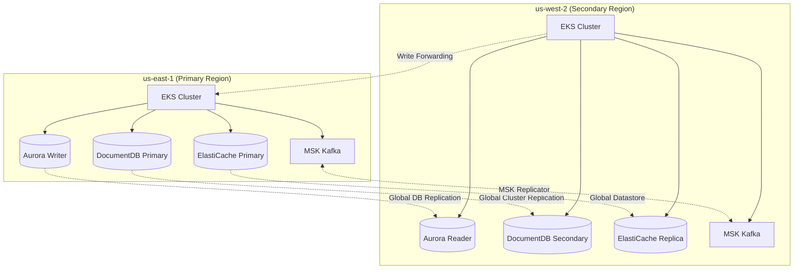
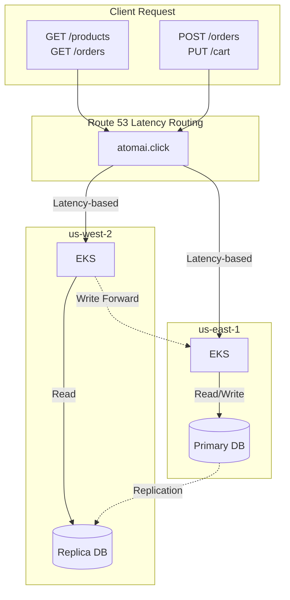
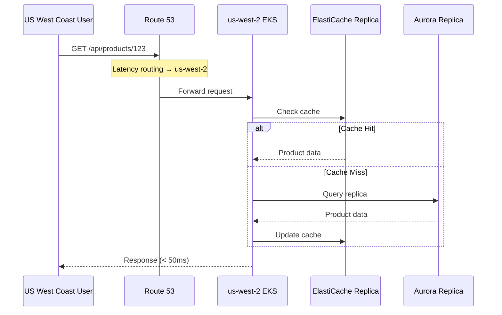
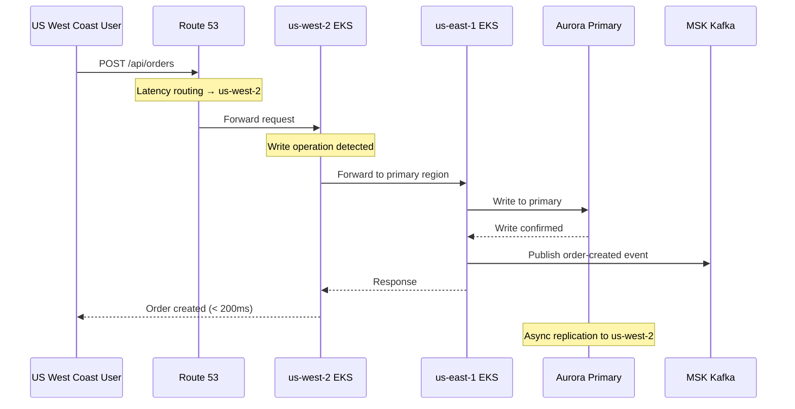
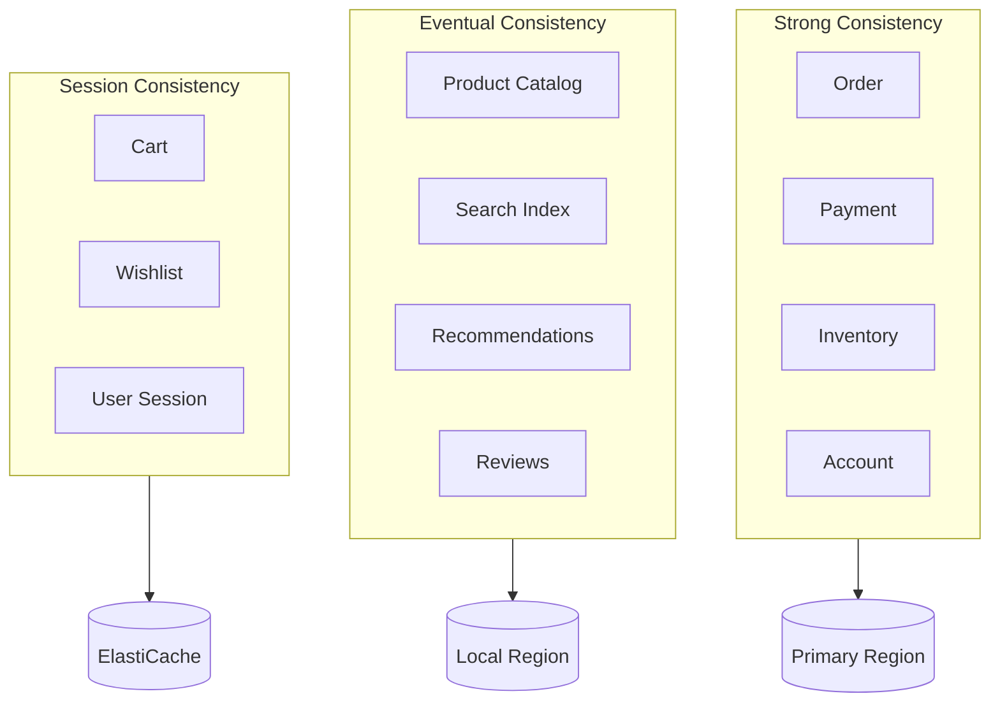
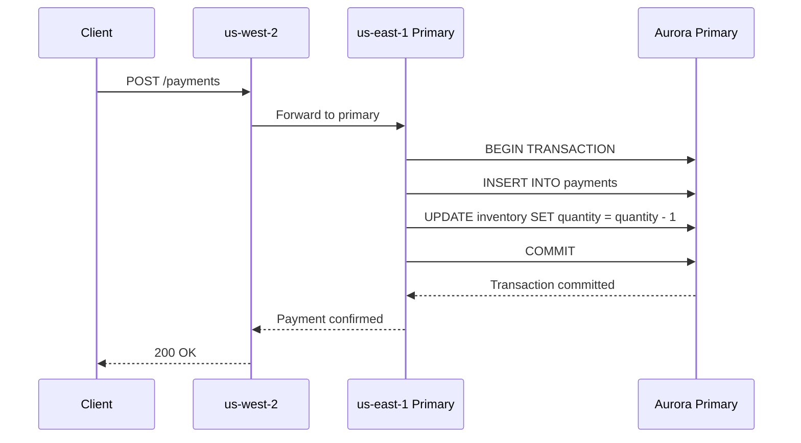
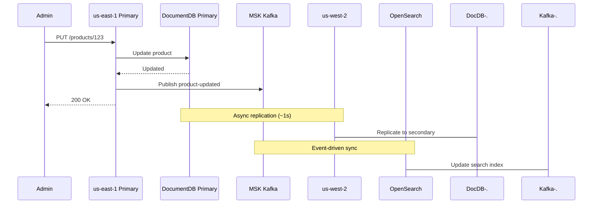
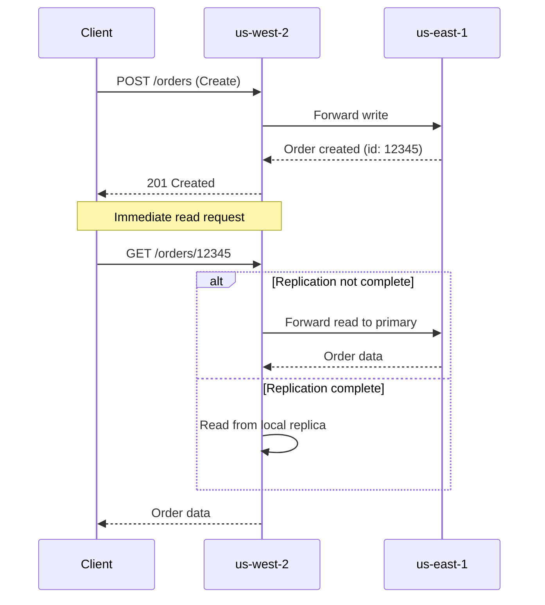
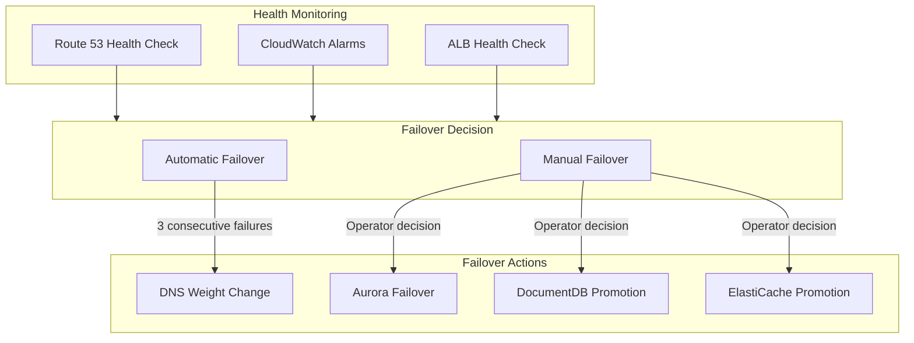

# Multi-Region Design

Multi-Region Shopping Mall implements an Active-Active multi-region architecture based on the **Write-Primary/Read-Local** pattern. This document explains why this pattern was chosen, how it works, and the consistency model in detail.

## Region Role Assignment

| Region | Role | Responsibility |
|--------|------|----------------|
| **us-east-1** | Primary | All write operations, global data master |
| **us-west-2** | Secondary | Read operations, write forwarding, promotable on failure |



## Why Active-Active?

### Comparison: Active-Passive vs Active-Active

| Aspect | Active-Passive | Active-Active |
|--------|----------------|---------------|
| **Resource Utilization** | Secondary idle | Both regions utilized |
| **Read Latency** | Single region dependent | Processed in nearest region |
| **Failover Time** | Wait for DNS propagation (minutes) | Immediate (already serving traffic) |
| **Cost Efficiency** | Low (standby resources) | High (load balanced during normal operation) |
| **Implementation Complexity** | Low | High (data consistency management) |

### Reasons for Choosing Active-Active

1. **99.99% Availability Goal**: Service continuity even with single region failure
2. **Global User Experience**: Responses from the region closest to users
3. **Cost Optimization**: Utilizing resources in both regions during normal operation
4. **Gradual Failover**: Smooth transition since traffic is already distributed

## Write-Primary / Read-Local Pattern

### Pattern Overview



### Read Path (Local Read)



**Read Path Characteristics:**
- Processed in the region closest to the user
- ElastiCache checked first to minimize latency
- Reads from Aurora/DocumentDB local replica
- Average response time: 30-50ms

### Write Path (Forward to Primary)



**Write Path Characteristics:**
- Write requests received at Secondary region are forwarded to Primary
- Transaction processed at Primary, then response returned
- Events published to MSK Kafka
- Data asynchronously replicated to Secondary
- Average response time: 150-200ms

## Write Forwarding Mechanism

### Service-Level Implementation

```go
// Go service example (Order Service)
func (h *OrderHandler) CreateOrder(c *gin.Context) {
    region := os.Getenv("AWS_REGION")
    primaryRegion := os.Getenv("PRIMARY_REGION") // "us-east-1"

    if region != primaryRegion {
        // Forward to Primary if in Secondary region
        resp, err := h.forwardToPrimary(c.Request)
        if err != nil {
            c.JSON(500, gin.H{"error": "Primary region unavailable"})
            return
        }
        c.Data(resp.StatusCode, "application/json", resp.Body)
        return
    }

    // Process directly in Primary region
    order, err := h.orderService.Create(c.Request.Context(), orderRequest)
    // ...
}
```

```java
// Java service example (Payment Service)
@Service
public class PaymentService {

    @Value("${aws.region}")
    private String currentRegion;

    @Value("${primary.region}")
    private String primaryRegion;

    public PaymentResponse processPayment(PaymentRequest request) {
        if (!currentRegion.equals(primaryRegion)) {
            return forwardToPrimary(request);
        }

        // Process directly in Primary region
        return executePayment(request);
    }
}
```

### Aurora Global Database Write Forwarding

Aurora Global Database natively supports Write Forwarding.

```sql
-- Executed in Secondary region
-- Aurora automatically forwards to Primary
INSERT INTO orders (user_id, total_amount, status)
VALUES ('user-123', 150000, 'PENDING');

-- Verify Write Forwarding is enabled
SELECT * FROM aurora_global_db_status();
```

```hcl
# Terraform configuration
resource "aws_rds_cluster" "secondary" {
  # ...
  enable_global_write_forwarding = true
}
```

## Consistency Model

### Consistency Strategy by Data Type



| Consistency Level | Applied To | Reason | Allowed Replication Lag |
|-------------------|------------|--------|------------------------|
| **Strong** | Orders, Payments, Inventory, Accounts | Financial transactions, duplicate prevention required | 0 (synchronous) |
| **Eventual** | Product Catalog, Search, Recommendations, Reviews | Slight delay acceptable, read performance priority | 1-2 seconds |
| **Session** | Cart, Wishlist, Sessions | Per-user isolation, immediate reflection needed | N/A (cache) |

### Strong Consistency Implementation

Financial transactions must be processed in the Primary region.



### Eventual Consistency Implementation

Catalog and search data are processed with eventual consistency.



## Read-After-Write Consistency

Ensuring consistency when a user reads their own data immediately after writing.



### Implementation Strategy

```python
# Python service example
class OrderService:
    def get_order(self, order_id: str, user_id: str) -> Order:
        # 1. Check local cache
        cached = self.cache.get(f"order:{order_id}")
        if cached:
            return cached

        # 2. Check for recent write (Session sticky)
        recent_write = self.cache.get(f"recent_write:{user_id}:{order_id}")

        if recent_write:
            # Read from Primary (strong consistency)
            return self.read_from_primary(order_id)
        else:
            # Read from local replica (performance priority)
            return self.read_from_local(order_id)
```

## Region Failover

### Automatic Failover Conditions



### Failover Scenarios

| Failure Type | Impact Scope | Auto/Manual | Expected Recovery Time |
|--------------|--------------|-------------|----------------------|
| Single AZ failure | Services in that AZ | Automatic (EKS) | 30 seconds |
| EKS cluster failure | Regional services | Automatic (Route 53) | 1 minute |
| Aurora Primary failure | Write operations | Automatic (Aurora) | 1-2 minutes |
| Full region failure | All services | **Manual** (promotion required) | 5-10 minutes |

## Next Steps

- [Network Architecture](./network) - VPC design and cross-region connectivity
- [Data Architecture](./data) - Replication strategies by data store
- [Disaster Recovery](./disaster-recovery) - Detailed failover procedures
