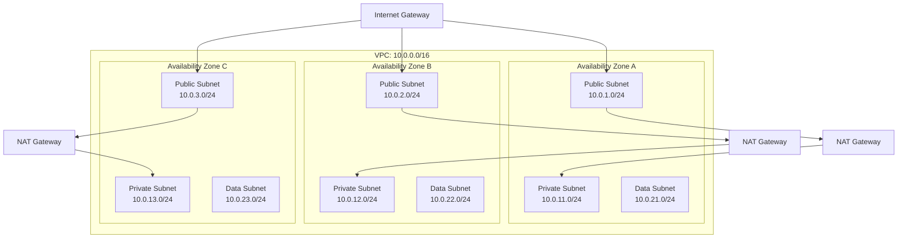
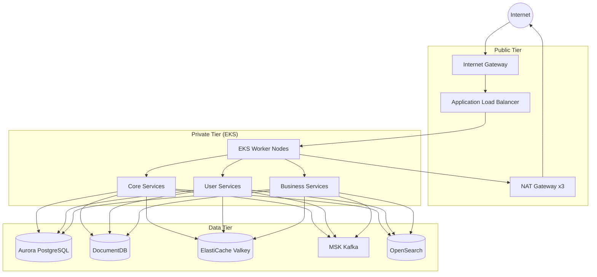
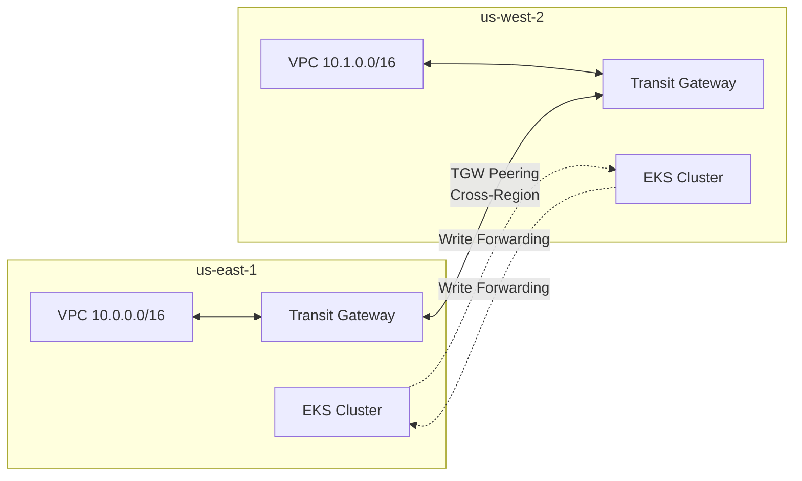
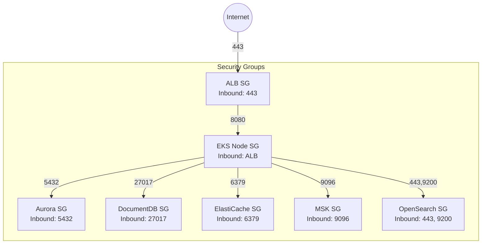
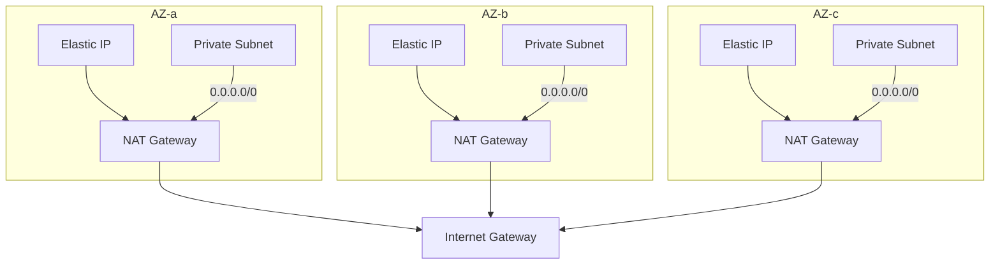
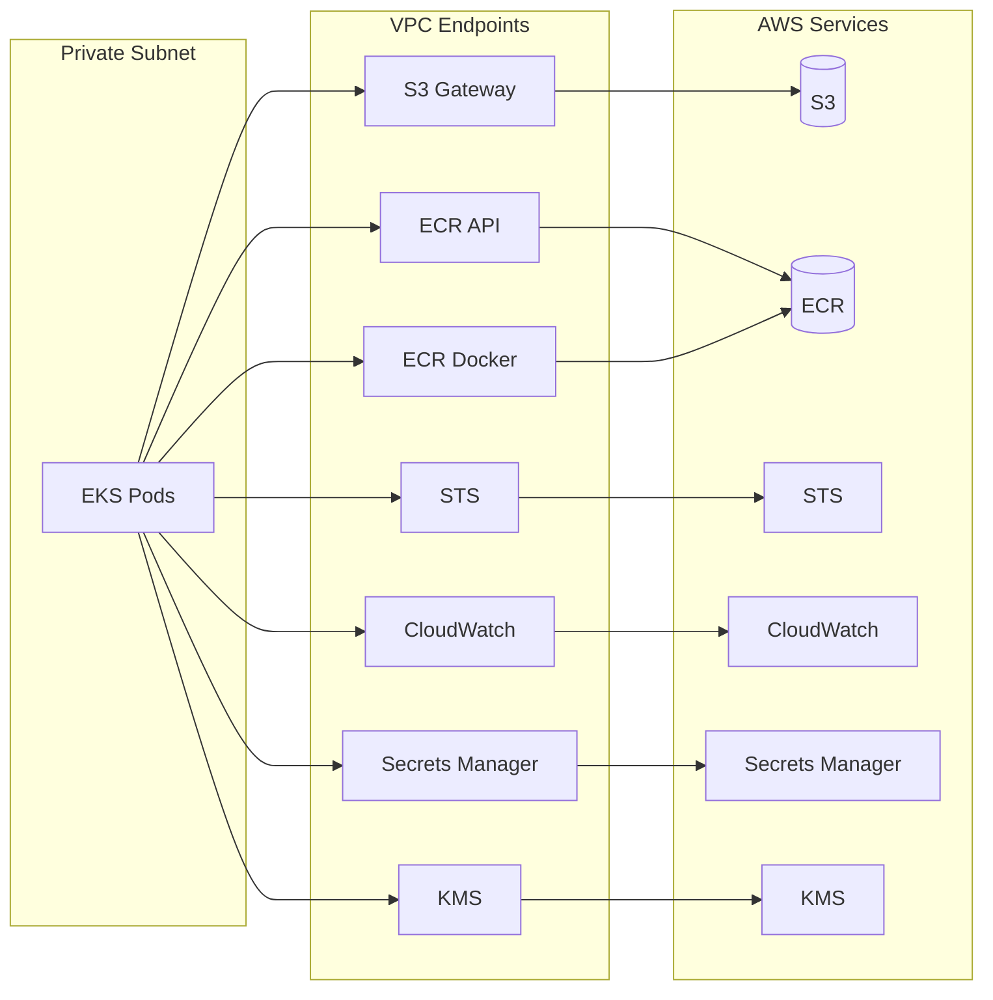
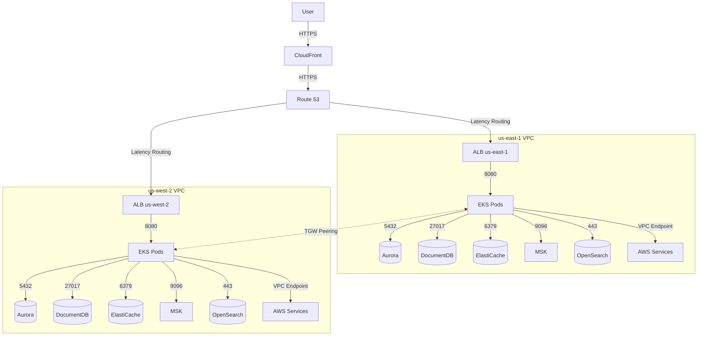

# Network Architecture

The Multi-Region Shopping Mall network is designed based on a 3-tier VPC architecture. Each region has an independent VPC, and cross-region communication is handled through Transit Gateway Peering.

## VPC Design

### CIDR Block Allocation

| Region | VPC CIDR | Purpose |
|--------|----------|---------|
| us-east-1 | 10.0.0.0/16 | Primary Region |
| us-west-2 | 10.1.0.0/16 | Secondary Region |

### us-east-1 Subnet Configuration



| Tier | AZ-a | AZ-b | AZ-c | Purpose |
|------|------|------|------|---------|
| **Public** | 10.0.1.0/24 | 10.0.2.0/24 | 10.0.3.0/24 | ALB, NAT Gateway |
| **Private** | 10.0.11.0/24 | 10.0.12.0/24 | 10.0.13.0/24 | EKS Worker Nodes |
| **Data** | 10.0.21.0/24 | 10.0.22.0/24 | 10.0.23.0/24 | Aurora, DocumentDB, ElastiCache, MSK, OpenSearch |

### us-west-2 Subnet Configuration

| Tier | AZ-a | AZ-b | AZ-c | Purpose |
|------|------|------|------|---------|
| **Public** | 10.1.1.0/24 | 10.1.2.0/24 | 10.1.3.0/24 | ALB, NAT Gateway |
| **Private** | 10.1.11.0/24 | 10.1.12.0/24 | 10.1.13.0/24 | EKS Worker Nodes |
| **Data** | 10.1.21.0/24 | 10.1.22.0/24 | 10.1.23.0/24 | Aurora, DocumentDB, ElastiCache, MSK, OpenSearch |

## 3-Tier Architecture



### Role by Tier

| Tier | Components | Internet Access | Inbound Traffic |
|------|------------|-----------------|-----------------|
| **Public** | ALB, NAT Gateway | Direct | Internet → ALB |
| **Private** | EKS Nodes, Pods | Via NAT Gateway | ALB → EKS |
| **Data** | All data stores | None | EKS → Data stores |

## Transit Gateway Peering

Transit Gateway Peering is used for cross-region communication.



### Transit Gateway Route Tables

**us-east-1 TGW Route Table:**

| Destination | Target | Purpose |
|-------------|--------|---------|
| 10.0.0.0/16 | VPC Attachment | Local VPC |
| 10.1.0.0/16 | Peering Attachment | us-west-2 VPC |

**us-west-2 TGW Route Table:**

| Destination | Target | Purpose |
|-------------|--------|---------|
| 10.1.0.0/16 | VPC Attachment | Local VPC |
| 10.0.0.0/16 | Peering Attachment | us-east-1 VPC |

### Terraform Configuration

```hcl
# us-east-1 Transit Gateway
resource "aws_ec2_transit_gateway" "use1" {
  provider = aws.us-east-1

  description                     = "Multi-region TGW us-east-1"
  default_route_table_association = "enable"
  default_route_table_propagation = "enable"

  tags = {
    Name = "multi-region-tgw-use1"
  }
}

# us-west-2 Transit Gateway
resource "aws_ec2_transit_gateway" "usw2" {
  provider = aws.us-west-2

  description                     = "Multi-region TGW us-west-2"
  default_route_table_association = "enable"
  default_route_table_propagation = "enable"

  tags = {
    Name = "multi-region-tgw-usw2"
  }
}

# Transit Gateway Peering
resource "aws_ec2_transit_gateway_peering_attachment" "use1_usw2" {
  provider = aws.us-east-1

  peer_region             = "us-west-2"
  peer_transit_gateway_id = aws_ec2_transit_gateway.usw2.id
  transit_gateway_id      = aws_ec2_transit_gateway.use1.id

  tags = {
    Name = "tgw-peering-use1-usw2"
  }
}
```

## Security Groups

### Security Group Configuration by Service



### Security Group Details

#### ALB Security Group

| Direction | Protocol | Port | Source/Destination | Purpose |
|-----------|----------|------|-------------------|---------|
| Inbound | TCP | 443 | 0.0.0.0/0 | HTTPS traffic |
| Inbound | TCP | 80 | 0.0.0.0/0 | HTTP (redirect) |
| Outbound | TCP | 8080 | EKS SG | Service forwarding |

#### EKS Node Security Group

| Direction | Protocol | Port | Source/Destination | Purpose |
|-----------|----------|------|-------------------|---------|
| Inbound | TCP | 8080 | ALB SG | Service traffic |
| Inbound | TCP | 443 | EKS Control Plane | API Server |
| Inbound | TCP | 10250 | EKS Control Plane | Kubelet |
| Inbound | All | All | Self | Pod-to-pod communication |
| Outbound | TCP | 5432 | Aurora SG | PostgreSQL |
| Outbound | TCP | 27017 | DocumentDB SG | MongoDB |
| Outbound | TCP | 6379 | ElastiCache SG | Redis/Valkey |
| Outbound | TCP | 9096 | MSK SG | Kafka SASL |
| Outbound | TCP | 443 | OpenSearch SG | OpenSearch HTTPS |
| Outbound | TCP | 443 | 0.0.0.0/0 | AWS APIs, ECR |

#### Aurora PostgreSQL Security Group

| Direction | Protocol | Port | Source/Destination | Purpose |
|-----------|----------|------|-------------------|---------|
| Inbound | TCP | 5432 | EKS SG | Application access |
| Inbound | TCP | 5432 | 10.0.0.0/16 | Intra-region access |
| Inbound | TCP | 5432 | 10.1.0.0/16 | Cross-region replication |

#### DocumentDB Security Group

| Direction | Protocol | Port | Source/Destination | Purpose |
|-----------|----------|------|-------------------|---------|
| Inbound | TCP | 27017 | EKS SG | Application access |
| Inbound | TCP | 27017 | 10.0.0.0/16 | Intra-region access |
| Inbound | TCP | 27017 | 10.1.0.0/16 | Cross-region replication |

#### ElastiCache Valkey Security Group

| Direction | Protocol | Port | Source/Destination | Purpose |
|-----------|----------|------|-------------------|---------|
| Inbound | TCP | 6379 | EKS SG | Application access |
| Inbound | TCP | 6379 | Self | Intra-cluster communication |

#### MSK Kafka Security Group

| Direction | Protocol | Port | Source/Destination | Purpose |
|-----------|----------|------|-------------------|---------|
| Inbound | TCP | 9096 | EKS SG | SASL/SCRAM authentication |
| Inbound | TCP | 9092 | EKS SG | Plaintext (internal) |
| Inbound | TCP | 2181 | EKS SG | Zookeeper |
| Inbound | TCP | 9096 | 10.0.0.0/16 | Intra-region access |
| Inbound | TCP | 9096 | 10.1.0.0/16 | MSK Replicator |

#### OpenSearch Security Group

| Direction | Protocol | Port | Source/Destination | Purpose |
|-----------|----------|------|-------------------|---------|
| Inbound | TCP | 443 | EKS SG | HTTPS API |
| Inbound | TCP | 9200 | EKS SG | REST API |
| Inbound | TCP | 9300 | Self | Inter-node communication |

## NAT Gateway

Independent NAT Gateways are placed in each AZ for high availability.



### NAT Gateway Pros and Cons

| Configuration | Advantages | Disadvantages |
|---------------|------------|---------------|
| 1 NAT per AZ | AZ failure isolation, no cross-AZ traffic | Increased cost (3x) |
| Single NAT | Cost savings | Single Point of Failure |

Current configuration: **1 NAT Gateway per AZ** (high availability priority)

## VPC Endpoints

VPC Endpoints are configured to allow Private subnets to access AWS services.



### Endpoint Types

| Endpoint | Type | Service | Purpose |
|----------|------|---------|---------|
| S3 | **Gateway** | com.amazonaws.region.s3 | Object storage |
| ECR API | Interface | com.amazonaws.region.ecr.api | Image metadata |
| ECR DKR | Interface | com.amazonaws.region.ecr.dkr | Image download |
| STS | Interface | com.amazonaws.region.sts | IAM role assumption |
| CloudWatch Logs | Interface | com.amazonaws.region.logs | Log delivery |
| Secrets Manager | Interface | com.amazonaws.region.secretsmanager | Secret retrieval |
| KMS | Interface | com.amazonaws.region.kms | Encryption keys |

### Gateway vs Interface Endpoint

| Characteristic | Gateway Endpoint | Interface Endpoint |
|----------------|-----------------|-------------------|
| **Cost** | Free | Hourly + data processing |
| **Supported Services** | S3, DynamoDB only | Most AWS services |
| **Network** | Route table modification | ENI creation (Private IP) |
| **DNS** | Uses public DNS | Private DNS supported |

### Terraform Configuration

```hcl
# S3 Gateway Endpoint
resource "aws_vpc_endpoint" "s3" {
  vpc_id            = aws_vpc.main.id
  service_name      = "com.amazonaws.${var.region}.s3"
  vpc_endpoint_type = "Gateway"

  route_table_ids = [
    aws_route_table.private_a.id,
    aws_route_table.private_b.id,
    aws_route_table.private_c.id,
  ]

  tags = {
    Name = "s3-gateway-endpoint"
  }
}

# ECR API Interface Endpoint
resource "aws_vpc_endpoint" "ecr_api" {
  vpc_id              = aws_vpc.main.id
  service_name        = "com.amazonaws.${var.region}.ecr.api"
  vpc_endpoint_type   = "Interface"
  private_dns_enabled = true

  subnet_ids = [
    aws_subnet.private_a.id,
    aws_subnet.private_b.id,
    aws_subnet.private_c.id,
  ]

  security_group_ids = [aws_security_group.vpc_endpoints.id]

  tags = {
    Name = "ecr-api-endpoint"
  }
}

# Secrets Manager Interface Endpoint
resource "aws_vpc_endpoint" "secrets_manager" {
  vpc_id              = aws_vpc.main.id
  service_name        = "com.amazonaws.${var.region}.secretsmanager"
  vpc_endpoint_type   = "Interface"
  private_dns_enabled = true

  subnet_ids = [
    aws_subnet.private_a.id,
    aws_subnet.private_b.id,
    aws_subnet.private_c.id,
  ]

  security_group_ids = [aws_security_group.vpc_endpoints.id]

  tags = {
    Name = "secrets-manager-endpoint"
  }
}
```

## Network Flow Summary



## Next Steps

- [Data Architecture](./data) - Network configuration for data stores
- [Security](./security) - WAF, Security Group detailed rules
