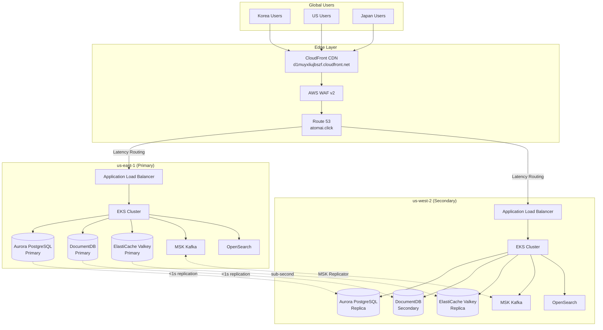
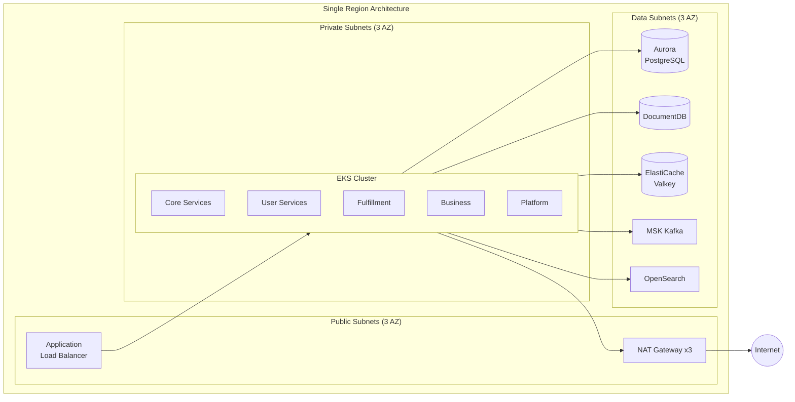
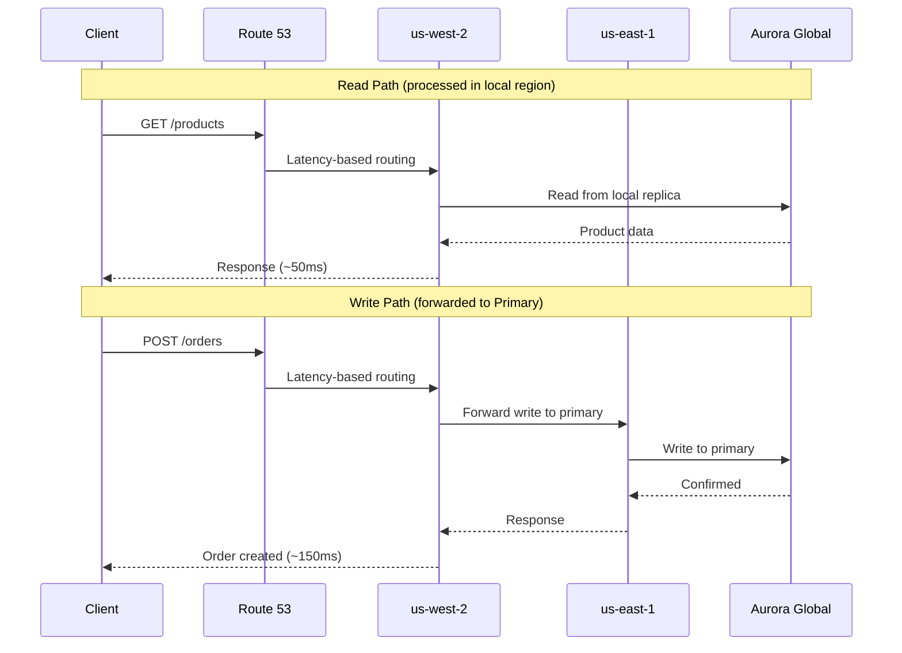
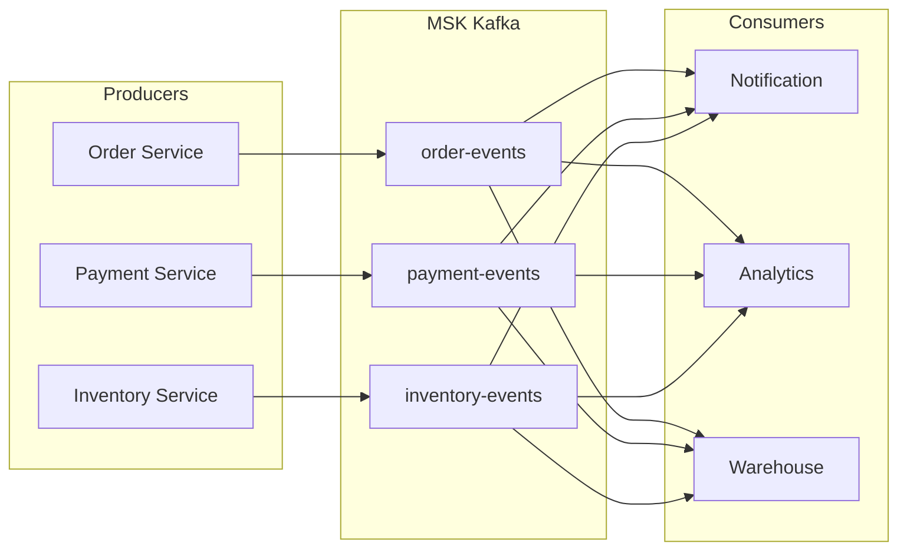
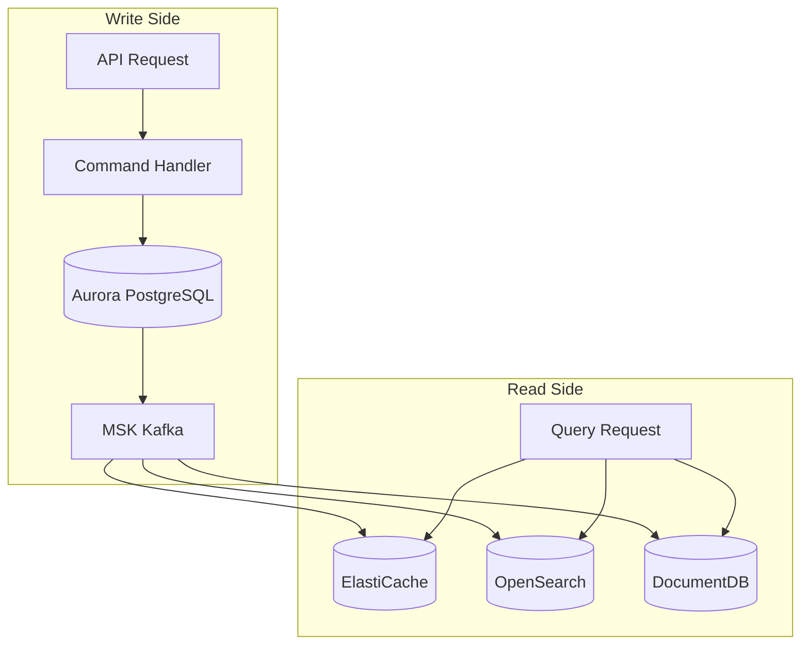

# Architecture Overview

Multi-Region Shopping Mall is a global-scale e-commerce platform built on AWS. It operates in an Active-Active configuration across two regions: **us-east-1** (Primary) and **us-west-2** (Secondary), achieving both strong consistency and low latency through the Write-Primary/Read-Local pattern.

## Design Goals

| Goal | Target | Achievement Method |
|------|--------|-------------------|
| **Availability** | 99.99% uptime | Multi-region Active-Active, automatic failover |
| **Read Latency** | sub-100ms | Read-Local pattern, ElastiCache, CloudFront CDN |
| **Write Consistency** | Strong consistency | Write-Primary pattern, Aurora Global DB |
| **Scalability** | 10x spike handling | EKS + Karpenter auto-scaling, MSK partitioning |
| **Recovery** | RPO <1s, RTO <10m | Global data replication, automated DR procedures |

## Global Traffic Flow

## Per-Region Deployment Architecture

## Service Domain Structure

20 microservices are categorized into 5 domains.

```mermaid
graph TB
    subgraph Core["Core Domain (6 Services)"]
        direction TB
        AG[API Gateway<br/>Go/Gin<br/>Routing, Auth]
        PC[Product Catalog<br/>Python/FastAPI<br/>Product Management]
        SR[Search<br/>Go/Gin<br/>Search Engine]
        CT[Cart<br/>Go/Gin<br/>Shopping Cart]
        OD[Order<br/>Java/Spring<br/>Order Processing]
        PM[Payment<br/>Java/Spring<br/>Payment Processing]
        IV[Inventory<br/>Go/Gin<br/>Inventory Management]
    end

    subgraph User["User Domain (4 Services)"]
        direction TB
        UA[User Account<br/>Java/Spring<br/>Account Management]
        UP[User Profile<br/>Python/FastAPI<br/>Profile Management]
        WL[Wishlist<br/>Python/FastAPI<br/>Wishlist]
        RV[Review<br/>Python/FastAPI<br/>Reviews/Ratings]
    end

    subgraph Fulfillment["Fulfillment Domain (3 Services)"]
        direction TB
        SH[Shipping<br/>Python/FastAPI<br/>Shipping Management]
        WH[Warehouse<br/>Java/Spring<br/>Warehouse Management]
        RT[Returns<br/>Java/Spring<br/>Returns Processing]
    end

    subgraph Business["Business Domain (4 Services)"]
        direction TB
        PR[Pricing<br/>Java/Spring<br/>Pricing Policy]
        RC[Recommendation<br/>Python/FastAPI<br/>Recommendation Engine]
        NF[Notification<br/>Python/FastAPI<br/>Notification Delivery]
        SL[Seller<br/>Java/Spring<br/>Seller Management]
    end

    subgraph Platform["Platform Domain (3 Services)"]
        direction TB
        EB[Event Bus<br/>Go/Gin<br/>Event Routing]
        AN[Analytics<br/>Python/FastAPI<br/>Analytics/Reporting]
    end
```

### Technology Stack by Service

| Domain | Service | Language/Framework | Primary Data Store |
|--------|---------|-------------------|-------------------|
| **Core** | API Gateway | Go/Gin | ElastiCache (sessions) |
| | Product Catalog | Python/FastAPI | DocumentDB, OpenSearch |
| | Search | Go/Gin | OpenSearch |
| | Cart | Go/Gin | ElastiCache |
| | Order | Java/Spring | Aurora PostgreSQL |
| | Payment | Java/Spring | Aurora PostgreSQL |
| | Inventory | Go/Gin | Aurora PostgreSQL, ElastiCache |
| **User** | User Account | Java/Spring | Aurora PostgreSQL |
| | User Profile | Python/FastAPI | DocumentDB |
| | Wishlist | Python/FastAPI | DocumentDB |
| | Review | Python/FastAPI | DocumentDB, OpenSearch |
| **Fulfillment** | Shipping | Python/FastAPI | Aurora PostgreSQL |
| | Warehouse | Java/Spring | Aurora PostgreSQL |
| | Returns | Java/Spring | Aurora PostgreSQL |
| **Business** | Pricing | Java/Spring | Aurora PostgreSQL, ElastiCache |
| | Recommendation | Python/FastAPI | DocumentDB, ElastiCache |
| | Notification | Python/FastAPI | DocumentDB, MSK |
| | Seller | Java/Spring | Aurora PostgreSQL, DocumentDB |
| **Platform** | Event Bus | Go/Gin | MSK Kafka |
| | Analytics | Python/FastAPI | OpenSearch, Aurora PostgreSQL |

## Core Architecture Patterns

### 1. Write-Primary / Read-Local

### 2. Event-Driven Architecture

### 3. CQRS (Command Query Responsibility Segregation)

## Infrastructure Resource Summary

| Resource | us-east-1 | us-west-2 | Role |
|----------|-----------|-----------|------|
| VPC | 10.0.0.0/16 | 10.1.0.0/16 | Network isolation |
| Subnets | 9 (3 tier x 3 AZ) | 9 (3 tier x 3 AZ) | Tier separation |
| EKS Nodes | Karpenter managed | Karpenter managed | Workload execution |
| Aurora | Primary Writer | Read Replica | Relational data |
| DocumentDB | Primary | Secondary | Document data |
| ElastiCache | Primary | Replica | Cache/Sessions |
| MSK | 3 brokers | 3 brokers | Event streaming |
| OpenSearch | 3 nodes | 3 nodes | Search/Logging |

## Next Steps

- [Multi-Region Design](./multi-region-design) - Write-Primary/Read-Local pattern details
- [Network Architecture](./network) - VPC design and security groups
- [Data Architecture](./data) - Data store schemas and patterns
- [Event-Driven Architecture](./event-driven) - MSK Kafka topics and SAGA pattern
