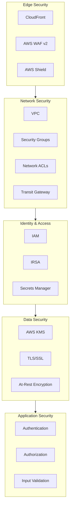
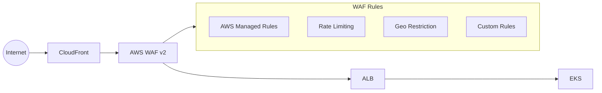
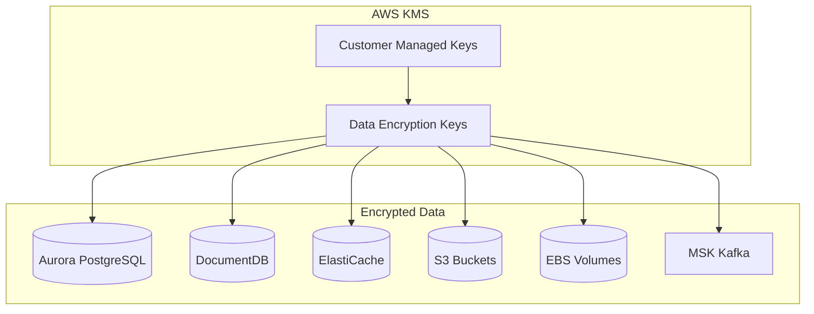
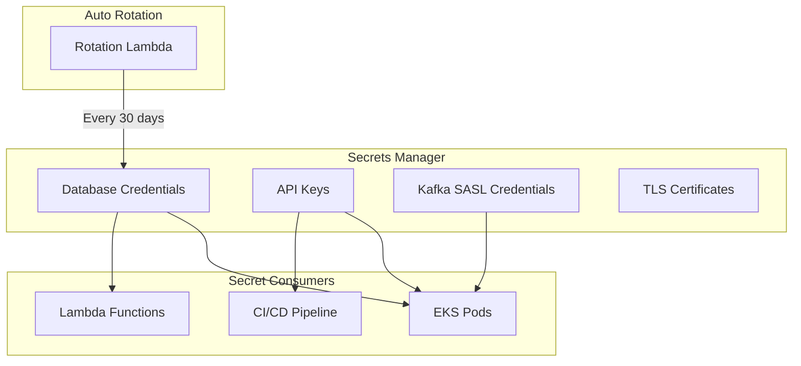
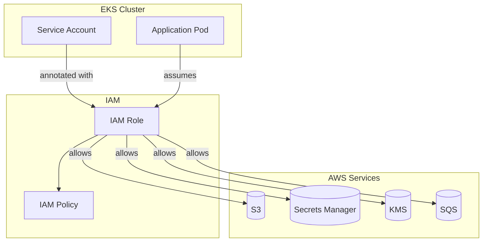
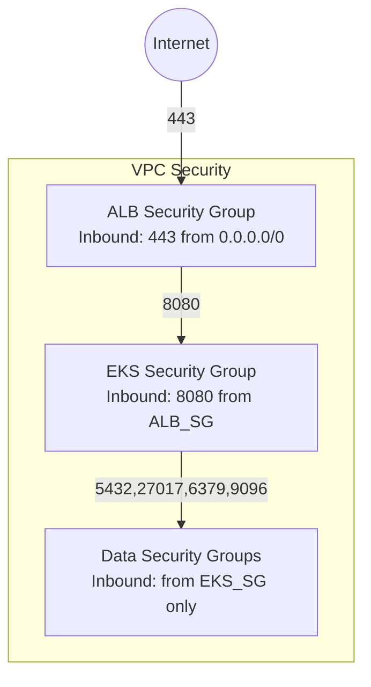

# Security

Multi-Region Shopping Mall implements a multi-layered security architecture providing comprehensive security at the infrastructure, data, and application levels. This document details WAF, encryption, IAM, and network security.

## Security Architecture Overview



## AWS WAF v2

### WAF Architecture



### WAF Rule Configuration

#### 1. AWS Managed Rules

| Rule Set | Priority | Action | Description |
|----------|----------|--------|-------------|
| **AWSManagedRulesCommonRuleSet** | 1 | Block | Block common web vulnerabilities |
| **AWSManagedRulesSQLiRuleSet** | 2 | Block | Block SQL Injection attacks |
| **AWSManagedRulesKnownBadInputsRuleSet** | 3 | Block | Block known malicious inputs |
| **AWSManagedRulesLinuxRuleSet** | 4 | Block | Block Linux-specific attacks |
| **AWSManagedRulesAmazonIpReputationList** | 5 | Block | Block malicious IPs |

#### 2. Rate Limiting

```hcl
resource "aws_wafv2_web_acl" "main" {
  name        = "production-waf"
  description = "Production WAF Web ACL"
  scope       = "CLOUDFRONT"

  default_action {
    allow {}
  }

  # Rate Limiting: 2000 requests per 5 minutes
  rule {
    name     = "RateLimitRule"
    priority = 10

    override_action {
      none {}
    }

    statement {
      rate_based_statement {
        limit              = 2000
        aggregate_key_type = "IP"
      }
    }

    action {
      block {}
    }

    visibility_config {
      cloudwatch_metrics_enabled = true
      metric_name                = "RateLimitRule"
      sampled_requests_enabled   = true
    }
  }

  # Granular Rate Limit per API endpoint
  rule {
    name     = "LoginRateLimit"
    priority = 11

    statement {
      rate_based_statement {
        limit              = 100  # 100 per 5 minutes
        aggregate_key_type = "IP"

        scope_down_statement {
          byte_match_statement {
            search_string         = "/api/auth/login"
            positional_constraint = "STARTS_WITH"
            field_to_match {
              uri_path {}
            }
            text_transformation {
              priority = 0
              type     = "LOWERCASE"
            }
          }
        }
      }
    }

    action {
      block {
        custom_response {
          response_code = 429
          custom_response_body_key = "TooManyRequests"
        }
      }
    }

    visibility_config {
      cloudwatch_metrics_enabled = true
      metric_name                = "LoginRateLimit"
      sampled_requests_enabled   = true
    }
  }
}
```

#### 3. Geo Restriction

```hcl
# Allowed countries: Korea (KR), United States (US), Japan (JP)
rule {
  name     = "GeoRestriction"
  priority = 20

  statement {
    not_statement {
      statement {
        geo_match_statement {
          country_codes = ["KR", "US", "JP"]
        }
      }
    }
  }

  action {
    block {
      custom_response {
        response_code = 403
        custom_response_body_key = "GeoBlocked"
      }
    }
  }

  visibility_config {
    cloudwatch_metrics_enabled = true
    metric_name                = "GeoRestriction"
    sampled_requests_enabled   = true
  }
}
```

### WAF Rules Summary Table

| Rule | Priority | Rate Limit | Action | Applied To |
|------|----------|------------|--------|------------|
| AWS Common Rules | 1 | - | Block | All requests |
| SQLi Rules | 2 | - | Block | All requests |
| Known Bad Inputs | 3 | - | Block | All requests |
| IP Reputation | 5 | - | Block | All requests |
| Global Rate Limit | 10 | 2000/5min | Block | All requests |
| Login Rate Limit | 11 | 100/5min | Block | /api/auth/login |
| Order Rate Limit | 12 | 50/5min | Block | /api/orders POST |
| Geo Restriction | 20 | - | Block | Non-allowed countries |

## KMS Encryption

### Encryption Architecture



### Encryption by Data Store

| Data Store | Encryption Type | KMS Key | Algorithm |
|------------|-----------------|---------|-----------|
| **Aurora PostgreSQL** | At-Rest | Customer Managed | AES-256 |
| **DocumentDB** | At-Rest | Customer Managed | AES-256 |
| **ElastiCache Valkey** | At-Rest + In-Transit | Customer Managed | AES-256, TLS 1.2 |
| **S3** | At-Rest | Customer Managed | AES-256 (SSE-KMS) |
| **EBS** | At-Rest | Customer Managed | AES-256 |
| **MSK Kafka** | At-Rest + In-Transit | Customer Managed | AES-256, TLS 1.2 |
| **OpenSearch** | At-Rest + In-Transit | Customer Managed | AES-256, TLS 1.2 |
| **Secrets Manager** | At-Rest | AWS Managed | AES-256 |

### KMS Key Policy

```json
{
  "Version": "2012-10-17",
  "Statement": [
    {
      "Sid": "Enable IAM User Permissions",
      "Effect": "Allow",
      "Principal": {
        "AWS": "arn:aws:iam::180294183052:root"
      },
      "Action": "kms:*",
      "Resource": "*"
    },
    {
      "Sid": "Allow RDS to use the key",
      "Effect": "Allow",
      "Principal": {
        "Service": "rds.amazonaws.com"
      },
      "Action": [
        "kms:Encrypt",
        "kms:Decrypt",
        "kms:ReEncrypt*",
        "kms:GenerateDataKey*",
        "kms:DescribeKey"
      ],
      "Resource": "*",
      "Condition": {
        "StringEquals": {
          "aws:SourceAccount": "180294183052"
        }
      }
    },
    {
      "Sid": "Allow EKS Pods via IRSA",
      "Effect": "Allow",
      "Principal": {
        "AWS": "arn:aws:iam::180294183052:role/eks-*-irsa"
      },
      "Action": [
        "kms:Decrypt",
        "kms:GenerateDataKey"
      ],
      "Resource": "*"
    }
  ]
}
```

### Terraform Configuration

```hcl
# KMS Key for Data Encryption
resource "aws_kms_key" "data_encryption" {
  description             = "KMS key for data encryption"
  deletion_window_in_days = 30
  enable_key_rotation     = true
  multi_region            = true

  policy = jsonencode({
    Version = "2012-10-17"
    Statement = [
      {
        Sid    = "Enable IAM User Permissions"
        Effect = "Allow"
        Principal = {
          AWS = "arn:aws:iam::${data.aws_caller_identity.current.account_id}:root"
        }
        Action   = "kms:*"
        Resource = "*"
      },
      {
        Sid    = "Allow services to use the key"
        Effect = "Allow"
        Principal = {
          Service = [
            "rds.amazonaws.com",
            "elasticache.amazonaws.com",
            "kafka.amazonaws.com",
            "es.amazonaws.com"
          ]
        }
        Action = [
          "kms:Encrypt",
          "kms:Decrypt",
          "kms:ReEncrypt*",
          "kms:GenerateDataKey*",
          "kms:DescribeKey",
          "kms:CreateGrant"
        ]
        Resource = "*"
      }
    ]
  })

  tags = {
    Name        = "production-data-encryption-key"
    Environment = "production"
  }
}

resource "aws_kms_alias" "data_encryption" {
  name          = "alias/production-data-encryption"
  target_key_id = aws_kms_key.data_encryption.key_id
}
```

## Secrets Manager

### Secret Management Structure



### Secret List

| Secret Name | Type | Rotation Period | Used By |
|-------------|------|-----------------|---------|
| `production/aurora/master` | DB Credentials | 30 days | Order, Payment, Inventory |
| `production/documentdb/master` | DB Credentials | 30 days | Product, Profile, Review |
| `production/msk/sasl` | SASL Credentials | 90 days | All Kafka consumers |
| `production/opensearch/master` | Service Credentials | 30 days | Search, Analytics |
| `production/api/jwt-secret` | API Secret | 90 days | API Gateway |

### Secret Access Example

```python
# Python - Using Secrets Manager
import boto3
import json
from botocore.exceptions import ClientError

def get_db_credentials(secret_name: str) -> dict:
    session = boto3.session.Session()
    client = session.client(
        service_name='secretsmanager',
        region_name='us-east-1'
    )

    try:
        response = client.get_secret_value(SecretId=secret_name)
        secret = json.loads(response['SecretString'])
        return {
            'host': secret['host'],
            'port': secret['port'],
            'username': secret['username'],
            'password': secret['password'],
            'database': secret['dbname']
        }
    except ClientError as e:
        raise e

# Usage example
creds = get_db_credentials('production/aurora/master')
connection_string = f"postgresql://{creds['username']}:{creds['password']}@{creds['host']}:{creds['port']}/{creds['database']}"
```

## IAM & IRSA

### IRSA (IAM Roles for Service Accounts)



### IAM Role by Service

| Service | IAM Role | Permissions |
|---------|----------|-------------|
| **Order Service** | `order-service-irsa` | SecretsManager:GetSecretValue, KMS:Decrypt, SQS:* |
| **Payment Service** | `payment-service-irsa` | SecretsManager:GetSecretValue, KMS:Decrypt |
| **Product Catalog** | `product-catalog-irsa` | SecretsManager:GetSecretValue, S3:GetObject |
| **Search Service** | `search-service-irsa` | SecretsManager:GetSecretValue, ES:* |
| **Notification** | `notification-irsa` | SecretsManager:GetSecretValue, SES:SendEmail, SNS:Publish |
| **Analytics** | `analytics-irsa` | SecretsManager:GetSecretValue, S3:*, Athena:* |

### IRSA Configuration

```hcl
# IRSA for Order Service
module "order_service_irsa" {
  source  = "terraform-aws-modules/iam/aws//modules/iam-role-for-service-accounts-eks"
  version = "~> 5.0"

  role_name = "order-service-irsa"

  oidc_providers = {
    main = {
      provider_arn               = module.eks.oidc_provider_arn
      namespace_service_accounts = ["production:order-service"]
    }
  }

  role_policy_arns = {
    policy = aws_iam_policy.order_service.arn
  }
}

resource "aws_iam_policy" "order_service" {
  name        = "order-service-policy"
  description = "Policy for Order Service"

  policy = jsonencode({
    Version = "2012-10-17"
    Statement = [
      {
        Sid    = "SecretsManagerAccess"
        Effect = "Allow"
        Action = [
          "secretsmanager:GetSecretValue",
          "secretsmanager:DescribeSecret"
        ]
        Resource = [
          "arn:aws:secretsmanager:*:${data.aws_caller_identity.current.account_id}:secret:production/aurora/*",
          "arn:aws:secretsmanager:*:${data.aws_caller_identity.current.account_id}:secret:production/msk/*"
        ]
      },
      {
        Sid    = "KMSDecrypt"
        Effect = "Allow"
        Action = [
          "kms:Decrypt",
          "kms:GenerateDataKey"
        ]
        Resource = aws_kms_key.data_encryption.arn
      }
    ]
  })
}
```

### Kubernetes Service Account

```yaml
# order-service ServiceAccount
apiVersion: v1
kind: ServiceAccount
metadata:
  name: order-service
  namespace: production
  annotations:
    eks.amazonaws.com/role-arn: arn:aws:iam::180294183052:role/order-service-irsa
---
apiVersion: apps/v1
kind: Deployment
metadata:
  name: order-service
  namespace: production
spec:
  template:
    spec:
      serviceAccountName: order-service
      containers:
      - name: order-service
        image: 180294183052.dkr.ecr.us-east-1.amazonaws.com/order-service:latest
        env:
        - name: AWS_REGION
          value: us-east-1
```

## Network Security

### Security Groups



### Network ACLs

| NACL | Inbound Rules | Outbound Rules | Applied Subnets |
|------|---------------|----------------|-----------------|
| **Public** | 443, 80 from 0.0.0.0/0 | All to 0.0.0.0/0 | Public Subnets |
| **Private** | All from VPC CIDR | All to 0.0.0.0/0 | Private Subnets |
| **Data** | All from Private CIDR | All to Private CIDR | Data Subnets |

### Data Subnet NACL

```hcl
resource "aws_network_acl" "data" {
  vpc_id     = aws_vpc.main.id
  subnet_ids = aws_subnet.data[*].id

  # Inbound: Allow only from Private subnets
  ingress {
    protocol   = "tcp"
    rule_no    = 100
    action     = "allow"
    cidr_block = "10.0.11.0/24"  # Private Subnet A
    from_port  = 0
    to_port    = 65535
  }

  ingress {
    protocol   = "tcp"
    rule_no    = 101
    action     = "allow"
    cidr_block = "10.0.12.0/24"  # Private Subnet B
    from_port  = 0
    to_port    = 65535
  }

  ingress {
    protocol   = "tcp"
    rule_no    = 102
    action     = "allow"
    cidr_block = "10.0.13.0/24"  # Private Subnet C
    from_port  = 0
    to_port    = 65535
  }

  # Cross-region replication
  ingress {
    protocol   = "tcp"
    rule_no    = 200
    action     = "allow"
    cidr_block = "10.1.0.0/16"  # us-west-2 VPC
    from_port  = 0
    to_port    = 65535
  }

  # Outbound: Respond only to Private subnets
  egress {
    protocol   = "tcp"
    rule_no    = 100
    action     = "allow"
    cidr_block = "10.0.0.0/16"
    from_port  = 0
    to_port    = 65535
  }

  tags = {
    Name = "data-subnet-nacl"
  }
}
```

## TLS/SSL

### TLS Configuration

| Segment | TLS Version | Certificate | Management |
|---------|-------------|-------------|------------|
| CloudFront ↔ Client | TLS 1.2+ | ACM (*.atomai.click) | AWS Managed |
| ALB ↔ CloudFront | TLS 1.2+ | ACM | AWS Managed |
| EKS ↔ ALB | TLS 1.2 | Self-signed | Kubernetes |
| Services ↔ Aurora | TLS 1.2 | RDS CA | AWS Managed |
| Services ↔ DocumentDB | TLS 1.2 | RDS CA | AWS Managed |
| Services ↔ ElastiCache | TLS 1.2 | ElastiCache CA | AWS Managed |
| Services ↔ MSK | TLS 1.2 | MSK CA | AWS Managed |

### Application TLS Settings

```go
// Go - TLS configuration example
package main

import (
    "crypto/tls"
    "crypto/x509"
    "database/sql"
    "io/ioutil"

    _ "github.com/lib/pq"
)

func connectToAurora() (*sql.DB, error) {
    // Load RDS CA certificate
    rootCert, err := ioutil.ReadFile("/etc/ssl/certs/rds-ca-2019-root.pem")
    if err != nil {
        return nil, err
    }

    rootCertPool := x509.NewCertPool()
    rootCertPool.AppendCertsFromPEM(rootCert)

    tlsConfig := &tls.Config{
        RootCAs:    rootCertPool,
        MinVersion: tls.VersionTLS12,
    }

    connStr := fmt.Sprintf(
        "host=%s port=5432 user=%s password=%s dbname=%s sslmode=verify-full sslrootcert=/etc/ssl/certs/rds-ca-2019-root.pem",
        host, user, password, dbname,
    )

    return sql.Open("postgres", connStr)
}
```

## Security Monitoring

### CloudTrail Logging

```hcl
resource "aws_cloudtrail" "main" {
  name                          = "production-trail"
  s3_bucket_name                = aws_s3_bucket.cloudtrail.id
  include_global_service_events = true
  is_multi_region_trail         = true
  enable_logging                = true

  event_selector {
    read_write_type           = "All"
    include_management_events = true

    data_resource {
      type   = "AWS::S3::Object"
      values = ["arn:aws:s3:::"]
    }
  }

  cloud_watch_logs_group_arn = "${aws_cloudwatch_log_group.cloudtrail.arn}:*"
  cloud_watch_logs_role_arn  = aws_iam_role.cloudtrail.arn

  kms_key_id = aws_kms_key.cloudtrail.arn

  tags = {
    Name = "production-cloudtrail"
  }
}
```

### GuardDuty Enablement

```hcl
resource "aws_guardduty_detector" "main" {
  enable = true

  datasources {
    s3_logs {
      enable = true
    }
    kubernetes {
      audit_logs {
        enable = true
      }
    }
    malware_protection {
      scan_ec2_instance_with_findings {
        ebs_volumes {
          enable = true
        }
      }
    }
  }

  finding_publishing_frequency = "FIFTEEN_MINUTES"

  tags = {
    Name = "production-guardduty"
  }
}
```

### Security Alerts

```hcl
# WAF block alert
resource "aws_cloudwatch_metric_alarm" "waf_blocked_requests" {
  alarm_name          = "waf-high-block-rate"
  comparison_operator = "GreaterThanThreshold"
  evaluation_periods  = 2
  metric_name         = "BlockedRequests"
  namespace           = "AWS/WAFV2"
  period              = 300
  statistic           = "Sum"
  threshold           = 1000

  dimensions = {
    WebACL = aws_wafv2_web_acl.main.name
    Region = "us-east-1"
    Rule   = "ALL"
  }

  alarm_actions = [aws_sns_topic.security_alerts.arn]

  alarm_description = "High number of WAF blocked requests"
}

# GuardDuty threat detection alert
resource "aws_cloudwatch_event_rule" "guardduty_findings" {
  name        = "guardduty-findings"
  description = "GuardDuty finding events"

  event_pattern = jsonencode({
    source      = ["aws.guardduty"]
    detail-type = ["GuardDuty Finding"]
    detail = {
      severity = [{ numeric = [">=", 7] }]
    }
  })
}

resource "aws_cloudwatch_event_target" "guardduty_sns" {
  rule      = aws_cloudwatch_event_rule.guardduty_findings.name
  target_id = "SendToSNS"
  arn       = aws_sns_topic.security_alerts.arn
}
```

## Security Checklist

### Infrastructure Security

- [x] VPC 3-tier architecture (Public/Private/Data)
- [x] Security Groups - Principle of least privilege
- [x] Network ACLs - Subnet-level filtering
- [x] VPC Flow Logs enabled
- [x] VPC Endpoints - Private connectivity

### Data Security

- [x] KMS Customer Managed Keys used
- [x] All data stores At-Rest encrypted
- [x] TLS 1.2+ In-Transit encryption
- [x] Secrets Manager auto-rotation

### Access Control

- [x] IAM IRSA - Pod-level permissions
- [x] Principle of least privilege applied
- [x] MFA enabled (console access)
- [x] CloudTrail audit logging

### Application Security

- [x] WAF v2 - OWASP Top 10 protection
- [x] Rate Limiting applied
- [x] Geo Restriction (KR/US/JP)
- [x] Input validation and sanitizing

### Monitoring

- [x] GuardDuty threat detection
- [x] CloudWatch alarms
- [x] Security Hub integration
- [x] Real-time alerting configured

## Next Steps

- [Network Architecture](./network) - Network security details
- [Disaster Recovery](./disaster-recovery) - DR security considerations
