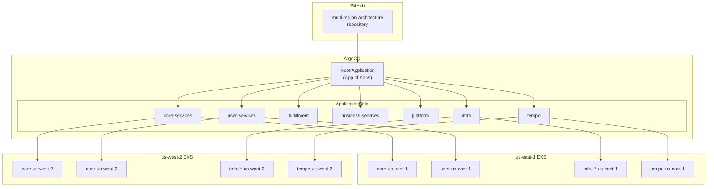
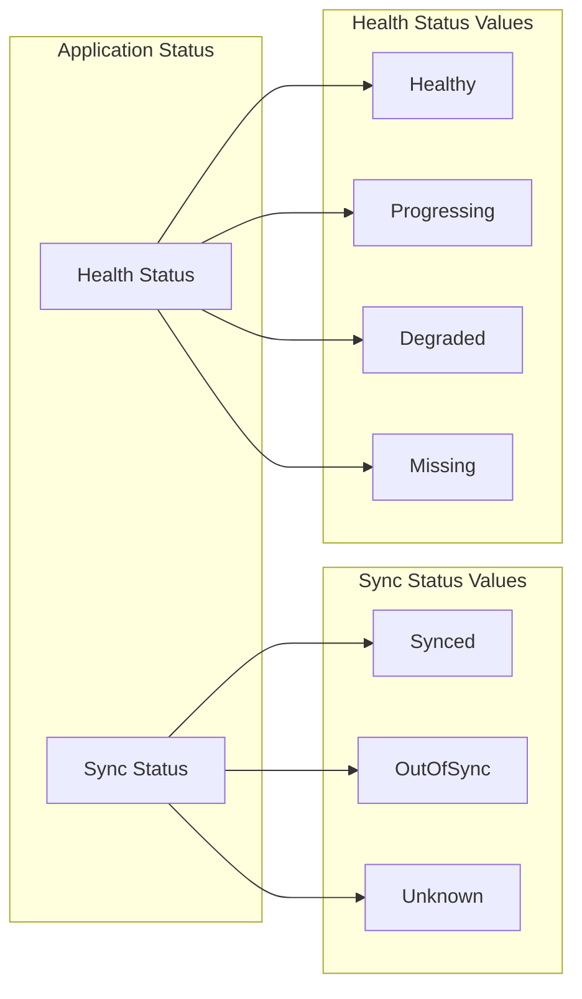

# GitOps - ArgoCD

The multi-region shopping mall platform uses **ArgoCD** to manage Kubernetes resources in a GitOps manner. The **App-of-ApplicationSets** pattern is used to efficiently manage multiple regions and services.

## Architecture



## ApplicationSet Configuration

### Directory Structure

```
k8s/infra/argocd/
├── kustomization.yaml
├── namespace.yaml
└── apps/
    ├── kustomization.yaml
    ├── root-app.yaml            # App of Apps
    ├── appset-core.yaml         # core-services
    ├── appset-user.yaml         # user-services
    ├── appset-fulfillment.yaml  # fulfillment
    ├── appset-business.yaml     # business-services
    ├── appset-platform.yaml     # platform
    ├── appset-infra.yaml        # Infrastructure components
    └── appset-tempo.yaml        # Tempo (for IRSA patches)
```

### Root Application (App of Apps)

```yaml
apiVersion: argoproj.io/v1alpha1
kind: Application
metadata:
  name: root
  namespace: argocd
spec:
  project: default
  source:
    repoURL: https://github.com/Atom-oh/multi-region-architecture.git
    targetRevision: main
    path: k8s/infra/argocd/apps
  destination:
    server: https://kubernetes.default.svc
    namespace: argocd
  syncPolicy:
    automated:
      prune: true
      selfHeal: true
```

### Service ApplicationSet

Each service domain has an ApplicationSet configured. The **Cluster Generator** is used to automatically create Applications for all registered clusters.

```yaml
# appset-core.yaml
apiVersion: argoproj.io/v1alpha1
kind: ApplicationSet
metadata:
  name: core-services
  namespace: argocd
spec:
  generators:
    - clusters:
        selector:
          matchExpressions:
            - key: region
              operator: Exists
  template:
    metadata:
      name: 'core-{{metadata.labels.region}}'
    spec:
      project: default
      source:
        repoURL: https://github.com/Atom-oh/multi-region-architecture.git
        targetRevision: main
        path: 'k8s/overlays/{{metadata.labels.region}}/core'
      destination:
        server: '{{server}}'
        namespace: core-services
      syncPolicy:
        automated:
          prune: true
          selfHeal: true
        syncOptions:
          - CreateNamespace=true
        retry:
          limit: 5
          backoff:
            duration: 5s
            factor: 2
            maxDuration: 3m
```

### Infrastructure ApplicationSet (Matrix Generator)

Infrastructure components use the **Matrix Generator** to create Applications for cluster x component combinations.

```yaml
# appset-infra.yaml
apiVersion: argoproj.io/v1alpha1
kind: ApplicationSet
metadata:
  name: infra
  namespace: argocd
spec:
  generators:
    - matrix:
        generators:
          - clusters:
              selector:
                matchExpressions:
                  - key: region
                    operator: Exists
          - list:
              elements:
                - component: karpenter
                  path: k8s/infra/karpenter
                  namespace: kube-system
                - component: fluent-bit
                  path: k8s/infra/fluent-bit
                  namespace: logging
                - component: external-secrets
                  path: k8s/infra/external-secrets
                  namespace: external-secrets
                - component: prometheus-stack
                  path: k8s/infra/prometheus-stack
                  namespace: monitoring
                - component: otel-collector
                  path: k8s/infra/otel-collector
                  namespace: platform
  template:
    metadata:
      name: 'infra-{{component}}-{{metadata.labels.region}}'
    spec:
      project: default
      source:
        repoURL: https://github.com/Atom-oh/multi-region-architecture.git
        targetRevision: main
        path: '{{path}}'
      destination:
        server: '{{server}}'
        namespace: '{{namespace}}'
      syncPolicy:
        automated:
          prune: true
          selfHeal: true
        syncOptions:
          - CreateNamespace=true
        retry:
          limit: 5
          backoff:
            duration: 5s
            factor: 2
            maxDuration: 3m
```

### Tempo ApplicationSet (IRSA Patch)

Tempo requires regional IRSA roles, so it is managed with a separate ApplicationSet. **Kustomize patches** are used to inject regional IAM role ARNs into the ServiceAccount.

```yaml
# appset-tempo.yaml
apiVersion: argoproj.io/v1alpha1
kind: ApplicationSet
metadata:
  name: tempo
  namespace: argocd
spec:
  generators:
    - clusters:
        selector:
          matchExpressions:
            - key: region
              operator: Exists
  template:
    metadata:
      name: 'infra-tempo-{{metadata.labels.region}}'
    spec:
      project: default
      source:
        repoURL: https://github.com/Atom-oh/multi-region-architecture.git
        targetRevision: main
        path: k8s/infra/tempo
        kustomize:
          patches:
            - target:
                kind: ServiceAccount
                name: tempo
              patch: |-
                - op: replace
                  path: /metadata/annotations/eks.amazonaws.com~1role-arn
                  value: "arn:aws:iam::180294183052:role/production-tempo-{{metadata.labels.region}}"
      destination:
        server: '{{server}}'
        namespace: observability
      syncPolicy:
        automated:
          prune: true
          selfHeal: true
        syncOptions:
          - CreateNamespace=true
        retry:
          limit: 5
          backoff:
            duration: 5s
            factor: 2
            maxDuration: 3m
```

## Cluster Registration

Register multi-region EKS clusters with ArgoCD.

```bash
# Register us-east-1 cluster
argocd cluster add arn:aws:eks:us-east-1:180294183052:cluster/multi-region-mall \
  --name multi-region-mall-us-east-1 \
  --label region=us-east-1

# Register us-west-2 cluster
argocd cluster add arn:aws:eks:us-west-2:180294183052:cluster/multi-region-mall \
  --name multi-region-mall-us-west-2 \
  --label region=us-west-2
```

### Cluster Labels

The ApplicationSet Cluster Generator uses the `region` label:

| Cluster | Label |
|---------|-------|
| multi-region-mall-us-east-1 | `region=us-east-1` |
| multi-region-mall-us-west-2 | `region=us-west-2` |

## Sync Policy

### Automated Sync

```yaml
syncPolicy:
  automated:
    prune: true      # Remove resources deleted from Git
    selfHeal: true   # Auto-recover on cluster changes
```

### Retry Policy

```yaml
syncPolicy:
  retry:
    limit: 5
    backoff:
      duration: 5s
      factor: 2
      maxDuration: 3m
```

### Sync Options

```yaml
syncPolicy:
  syncOptions:
    - CreateNamespace=true     # Auto-create namespace
    - PruneLast=true           # Perform deletions last
    - ApplyOutOfSyncOnly=true  # Apply only changed resources
```

## Checking Sync Status

### ArgoCD CLI

```bash
# Check all Application status
argocd app list

# Get detailed info for specific Application
argocd app get core-us-east-1

# Perform sync
argocd app sync core-us-east-1

# Check sync status
argocd app wait core-us-east-1
```

### ArgoCD UI



## Generated Applications List

Applications automatically generated by ApplicationSets:

| ApplicationSet | us-east-1 | us-west-2 |
|----------------|-----------|-----------|
| core-services | core-us-east-1 | core-us-west-2 |
| user-services | user-us-east-1 | user-us-west-2 |
| fulfillment | fulfillment-us-east-1 | fulfillment-us-west-2 |
| business-services | business-us-east-1 | business-us-west-2 |
| platform | platform-us-east-1 | platform-us-west-2 |
| infra (karpenter) | infra-karpenter-us-east-1 | infra-karpenter-us-west-2 |
| infra (fluent-bit) | infra-fluent-bit-us-east-1 | infra-fluent-bit-us-west-2 |
| infra (external-secrets) | infra-external-secrets-us-east-1 | infra-external-secrets-us-west-2 |
| infra (prometheus-stack) | infra-prometheus-stack-us-east-1 | infra-prometheus-stack-us-west-2 |
| infra (otel-collector) | infra-otel-collector-us-east-1 | infra-otel-collector-us-west-2 |
| tempo | infra-tempo-us-east-1 | infra-tempo-us-west-2 |

## Troubleshooting

### When Sync Fails

```bash
# Check sync errors
argocd app get <app-name> --show-operation

# Get resource details
argocd app resources <app-name>

# Force sync
argocd app sync <app-name> --force
```

### Common Issues

| Issue | Cause | Solution |
|-------|-------|----------|
| OutOfSync state persists | Resource change detected | `argocd app sync` |
| Degraded state | Pod startup failure | Check `kubectl describe pod` |
| Unknown state | Cluster connection issue | Verify cluster connection |
| Sync failed | Manifest error | Check Git repository |

## Next Steps

- [CI/CD Pipeline](/deployment/ci-cd-pipeline) - GitHub Actions workflow
- [Kustomize Overlays](/deployment/kustomize-overlays) - Regional configuration
