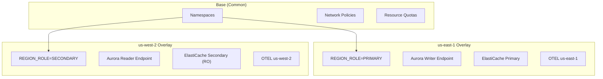

# Kustomize Overlays

The multi-region shopping mall platform uses **Kustomize** to manage Kubernetes manifests. Common settings are in `base`, and regional differences are managed in `overlays`.

## Directory Structure

```
k8s/
├── base/                           # Common settings
│   ├── kustomization.yaml
│   ├── namespaces.yaml
│   ├── network-policies/
│   │   ├── default-deny.yaml
│   │   ├── allow-dns.yaml
│   │   ├── allow-alb-ingress.yaml
│   │   └── allow-inter-namespace.yaml
│   └── resource-quotas/
│       ├── core-services.yaml
│       ├── user-services.yaml
│       ├── fulfillment.yaml
│       ├── business-services.yaml
│       └── platform.yaml
├── services/                       # Service deployments
│   ├── core/
│   ├── user/
│   ├── fulfillment/
│   ├── business/
│   └── platform/
├── overlays/                       # Regional overlays
│   ├── us-east-1/
│   │   └── kustomization.yaml
│   └── us-west-2/
│       └── kustomization.yaml
└── infra/                          # Infrastructure components
    ├── argocd/
    ├── karpenter/
    ├── otel-collector/
    └── tempo/
```

## Base Configuration

### kustomization.yaml

```yaml
apiVersion: kustomize.config.k8s.io/v1beta1
kind: Kustomization

resources:
  - namespaces.yaml
  - network-policies/default-deny.yaml
  - network-policies/allow-dns.yaml
  - network-policies/allow-alb-ingress.yaml
  - network-policies/allow-inter-namespace.yaml
  - resource-quotas/core-services.yaml
  - resource-quotas/user-services.yaml
  - resource-quotas/fulfillment.yaml
  - resource-quotas/business-services.yaml
  - resource-quotas/platform.yaml

commonLabels:
  app.kubernetes.io/managed-by: kustomize
```

### Namespace Definition

```yaml
# namespaces.yaml
apiVersion: v1
kind: Namespace
metadata:
  name: core-services
  labels:
    istio-injection: enabled
---
apiVersion: v1
kind: Namespace
metadata:
  name: user-services
  labels:
    istio-injection: enabled
---
apiVersion: v1
kind: Namespace
metadata:
  name: fulfillment
  labels:
    istio-injection: enabled
---
apiVersion: v1
kind: Namespace
metadata:
  name: business-services
  labels:
    istio-injection: enabled
---
apiVersion: v1
kind: Namespace
metadata:
  name: platform
  labels:
    istio-injection: enabled
```

### Network Policies

```yaml
# network-policies/default-deny.yaml
apiVersion: networking.k8s.io/v1
kind: NetworkPolicy
metadata:
  name: default-deny-all
spec:
  podSelector: {}
  policyTypes:
    - Ingress
    - Egress
---
# network-policies/allow-dns.yaml
apiVersion: networking.k8s.io/v1
kind: NetworkPolicy
metadata:
  name: allow-dns
spec:
  podSelector: {}
  policyTypes:
    - Egress
  egress:
    - to:
        - namespaceSelector:
            matchLabels:
              kubernetes.io/metadata.name: kube-system
      ports:
        - protocol: UDP
          port: 53
        - protocol: TCP
          port: 53
```

### Resource Quotas

```yaml
# resource-quotas/core-services.yaml
apiVersion: v1
kind: ResourceQuota
metadata:
  name: core-services-quota
  namespace: core-services
spec:
  hard:
    requests.cpu: "20"
    requests.memory: 40Gi
    limits.cpu: "40"
    limits.memory: 80Gi
    pods: "100"
```

## Regional Overlays

### us-east-1 (Primary)

```yaml
# overlays/us-east-1/kustomization.yaml
apiVersion: kustomize.config.k8s.io/v1beta1
kind: Kustomization

resources:
  - ../../base
  - ../../services/core
  - ../../services/user
  - ../../services/fulfillment
  - ../../services/business
  - ../../services/platform
  - ../../infra/karpenter
  - ../../infra/otel-collector

namespace: ""

patches:
  - target:
      kind: Deployment
    patch: |-
      - op: add
        path: /spec/template/spec/containers/0/env/-
        value:
          name: REGION_ROLE
          value: "PRIMARY"
      - op: add
        path: /spec/template/spec/containers/0/env/-
        value:
          name: AWS_REGION
          value: "us-east-1"
      - op: add
        path: /spec/template/spec/containers/0/env/-
        value:
          name: OTEL_EXPORTER_OTLP_ENDPOINT
          value: "http://otel-collector.platform.svc.cluster.local:4317"
      - op: add
        path: /spec/template/spec/containers/0/env/-
        value:
          name: OTEL_RESOURCE_ATTRIBUTES
          value: "deployment.environment=production,aws.region=us-east-1"

configMapGenerator:
  - name: region-config
    namespace: platform
    literals:
      - REGION=us-east-1
      - REGION_ROLE=PRIMARY
      - AURORA_ENDPOINT=production-aurora-global-us-east-1.cluster-xxxxxxxxxxxx.us-east-1.rds.amazonaws.com
      - AURORA_READER_ENDPOINT=production-aurora-global-us-east-1.cluster-ro-xxxxxxxxxxxx.us-east-1.rds.amazonaws.com
      - DOCUMENTDB_ENDPOINT=production-docdb-global-us-east-1.cluster-xxxxxxxxxxxx.us-east-1.docdb.amazonaws.com
      - VALKEY_ENDPOINT=clustercfg.production-elasticache-us-east-1.xxxxxx.use1.cache.amazonaws.com
      - MSK_BROKERS=b-1.productionmskuseast1.xxxxxx.xxx.kafka.us-east-1.amazonaws.com:9096,b-2.productionmskuseast1.xxxxxx.xxx.kafka.us-east-1.amazonaws.com:9096,b-3.productionmskuseast1.xxxxxx.xxx.kafka.us-east-1.amazonaws.com:9096
      - OPENSEARCH_ENDPOINT=https://vpc-production-os-use1-xxxxxxxxxxxxxxxxxxxxxxxxxxxx.us-east-1.es.amazonaws.com
  - name: tempo-region-config
    namespace: observability
    literals:
      - TEMPO_S3_BUCKET=production-mall-tempo-traces-us-east-1
      - TEMPO_ROLE_ARN=arn:aws:iam::123456789012:role/production-tempo-us-east-1

commonLabels:
  region: us-east-1
  region-role: primary

commonAnnotations:
  region.kubernetes.io/name: us-east-1
  region.kubernetes.io/role: primary
```

### us-west-2 (Secondary)

```yaml
# overlays/us-west-2/kustomization.yaml
apiVersion: kustomize.config.k8s.io/v1beta1
kind: Kustomization

resources:
  - ../../base
  - ../../services/core
  - ../../services/user
  - ../../services/fulfillment
  - ../../services/business
  - ../../services/platform
  - ../../infra/karpenter
  - ../../infra/otel-collector

namespace: ""

patches:
  - target:
      kind: Deployment
    patch: |-
      - op: add
        path: /spec/template/spec/containers/0/env/-
        value:
          name: REGION_ROLE
          value: "SECONDARY"
      - op: add
        path: /spec/template/spec/containers/0/env/-
        value:
          name: AWS_REGION
          value: "us-west-2"
      - op: add
        path: /spec/template/spec/containers/0/env/-
        value:
          name: OTEL_EXPORTER_OTLP_ENDPOINT
          value: "http://otel-collector.platform.svc.cluster.local:4317"
      - op: add
        path: /spec/template/spec/containers/0/env/-
        value:
          name: OTEL_RESOURCE_ATTRIBUTES
          value: "deployment.environment=production,aws.region=us-west-2"

configMapGenerator:
  - name: region-config
    namespace: platform
    literals:
      - REGION=us-west-2
      - REGION_ROLE=SECONDARY
      - AURORA_ENDPOINT=production-aurora-global-us-west-2.cluster-yyyyyyyyyyyy.us-west-2.rds.amazonaws.com
      - AURORA_READER_ENDPOINT=production-aurora-global-us-west-2.cluster-ro-yyyyyyyyyyyy.us-west-2.rds.amazonaws.com
      - DOCUMENTDB_ENDPOINT=production-docdb-global-us-west-2.cluster-yyyyyyyyyyyy.us-west-2.docdb.amazonaws.com
      - VALKEY_ENDPOINT=clustercfg.production-elasticache-us-west-2.yyyyyy.usw2.cache.amazonaws.com
      - MSK_BROKERS=b-1.productionmskuswest2.yyyyyy.yyy.kafka.us-west-2.amazonaws.com:9096
      - OPENSEARCH_ENDPOINT=https://vpc-production-os-usw2-yyyyyyyyyyyyyyyyyyyyyyyyyyyy.us-west-2.es.amazonaws.com
  - name: tempo-region-config
    namespace: observability
    literals:
      - TEMPO_S3_BUCKET=production-mall-tempo-traces-us-west-2
      - TEMPO_ROLE_ARN=arn:aws:iam::123456789012:role/production-tempo-us-west-2

commonLabels:
  region: us-west-2
  region-role: secondary

commonAnnotations:
  region.kubernetes.io/name: us-west-2
  region.kubernetes.io/role: secondary
```

## Regional Differences



### Environment Variable Comparison

| Environment Variable | us-east-1 | us-west-2 |
|---------------------|-----------|-----------|
| `REGION_ROLE` | PRIMARY | SECONDARY |
| `AWS_REGION` | us-east-1 | us-west-2 |
| `AURORA_ENDPOINT` | Writer endpoint | Reader endpoint |
| `VALKEY_ENDPOINT` | Primary (R/W) | Secondary (RO) |
| `MSK_BROKERS` | 3 brokers | 1 broker |
| `OPENSEARCH_ENDPOINT` | use1 domain | usw2 domain |

## ConfigMap Usage

Services reference ConfigMaps to use regional settings:

```yaml
apiVersion: apps/v1
kind: Deployment
metadata:
  name: order-service
spec:
  template:
    spec:
      containers:
        - name: order-service
          envFrom:
            - configMapRef:
                name: region-config
          env:
            - name: DB_HOST
              valueFrom:
                configMapKeyRef:
                  name: region-config
                  key: AURORA_ENDPOINT
```

## Kustomize Build Verification

You can verify the final manifests locally:

```bash
# Build us-east-1 overlay
kustomize build k8s/overlays/us-east-1/

# Build us-west-2 overlay
kustomize build k8s/overlays/us-west-2/

# Compare differences
diff <(kustomize build k8s/overlays/us-east-1/) \
     <(kustomize build k8s/overlays/us-west-2/)
```

## Patch Strategies

### Strategic Merge Patch

Use when modifying existing fields:

```yaml
patches:
  - patch: |-
      apiVersion: apps/v1
      kind: Deployment
      metadata:
        name: order-service
      spec:
        replicas: 5  # Adjust replicas per region
    target:
      kind: Deployment
      name: order-service
```

### JSON 6902 Patch

Use when adding new fields or requiring precise control:

```yaml
patches:
  - target:
      kind: Deployment
    patch: |-
      - op: add
        path: /spec/template/spec/containers/0/env/-
        value:
          name: NEW_ENV_VAR
          value: "new-value"
```

## Labels and Annotations

### commonLabels

Labels applied to all resources:

```yaml
commonLabels:
  region: us-east-1
  region-role: primary
  app.kubernetes.io/part-of: shopping-mall
```

### commonAnnotations

Annotations applied to all resources:

```yaml
commonAnnotations:
  region.kubernetes.io/name: us-east-1
  region.kubernetes.io/role: primary
```

## Next Steps

- [Rollout Strategy](/deployment/rollout-strategy) - Deployment and rollback strategy
- [GitOps - ArgoCD](/deployment/gitops-argocd) - ArgoCD configuration
