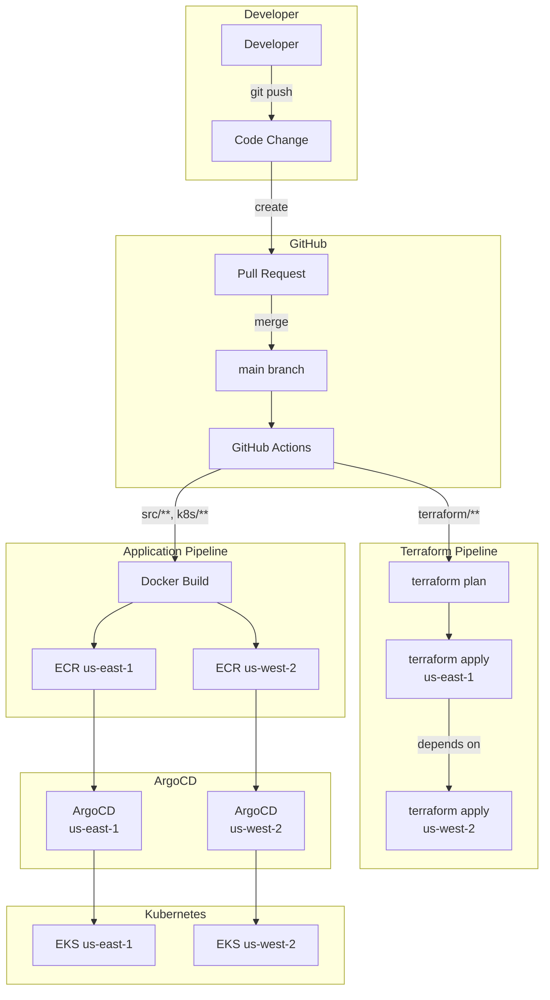
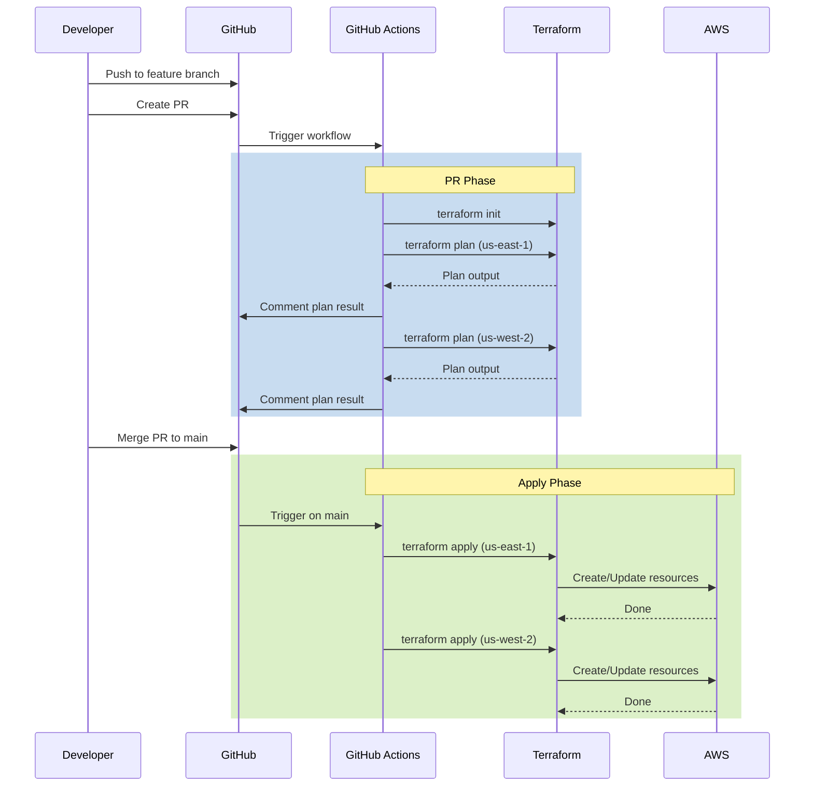
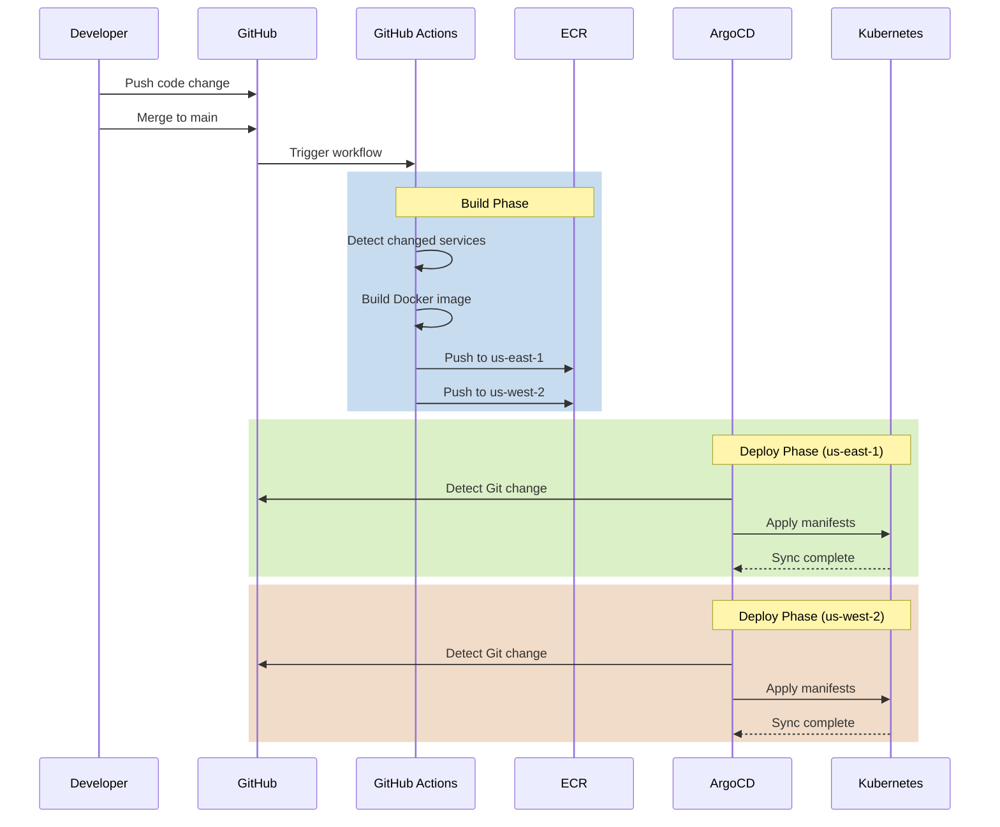
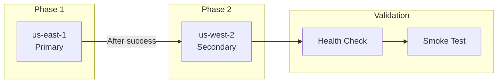
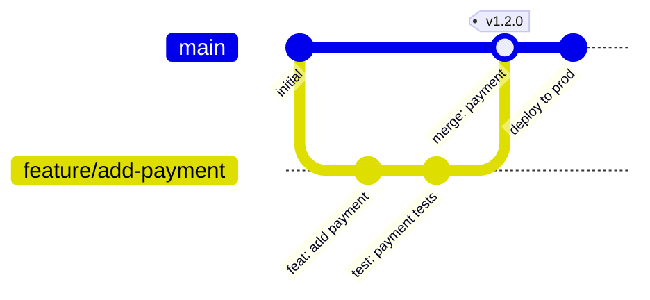

# Deployment Overview

The multi-region shopping mall platform adopts the **GitOps** paradigm, using the Git repository as the Single Source of Truth. Infrastructure changes are managed with **Terraform**, and application deployments are managed with **ArgoCD** and **Kustomize**.

## Deployment Pipeline Overview



## GitOps Principles

### 1. Declarative Configuration

All infrastructure and application states are declared as code:

```
multi-region-architecture/
├── terraform/                    # Infrastructure code
│   ├── environments/
│   │   └── production/
│   │       ├── us-east-1/       # Primary region
│   │       └── us-west-2/       # Secondary region
│   └── modules/                  # Reusable modules
├── k8s/                          # Kubernetes manifests
│   ├── base/                     # Common settings
│   ├── services/                 # Service deployments
│   ├── overlays/                 # Regional overlays
│   │   ├── us-east-1/
│   │   └── us-west-2/
│   └── infra/                    # Infrastructure components
└── .github/workflows/            # CI/CD pipelines
```

### 2. Version Controlled

- All changes are tracked via Git commits
- Changes reviewed through Pull Requests
- Rollbacks performed via Git revert

### 3. Automated

- Automatic Plan/Preview on PR creation
- Automatic deployment on merge to main branch
- ArgoCD continuously synchronizes Git state with cluster state

### 4. Auditable

- Track change history via Git history
- Review deployment records via GitHub Actions logs
- ArgoCD synchronization history

## Deployment Flow

### Infrastructure Changes (Terraform)



### Application Changes



## Environment Configuration

### Regional Roles

| Region | Role | Deployment Order | Database Mode |
|--------|------|------------------|---------------|
| **us-east-1** | Primary | 1st | Writer |
| **us-west-2** | Secondary | 2nd (after us-east-1 completes) | Reader / Failover |

### Deployment Order



:::caution Deployment Order Important
When making infrastructure changes, you must deploy to us-east-1 (Primary) first. For global databases, the Primary region creates the global cluster, then the Secondary joins.
:::

## Tool Stack

| Tool | Purpose | Version |
|------|---------|---------|
| **Terraform** | Infrastructure provisioning | 1.7.0 |
| **ArgoCD** | Kubernetes GitOps | 2.10.x |
| **Kustomize** | Kubernetes manifest management | 5.x |
| **GitHub Actions** | CI/CD pipeline | - |
| **Docker** | Container image builds | - |
| **ECR** | Container registry | - |

## Branch Strategy



### Branch Rules

| Branch | Purpose | Protection Rules |
|--------|---------|------------------|
| `main` | Production deployment | PR required, 1+ reviewers, CI must pass |
| `feature/*` | Feature development | - |
| `fix/*` | Bug fixes | - |
| `hotfix/*` | Emergency fixes | Branch from main, can merge directly |

## Rollback Strategy

### Infrastructure Rollback

```bash
# Revert to previous state in Git
git revert <commit-hash>
git push origin main

# Or rollback to a specific version directly
cd terraform/environments/production/us-east-1
terraform plan -target=module.eks
terraform apply -target=module.eks
```

### Application Rollback

```bash
# Using ArgoCD CLI
argocd app rollback <app-name> <revision>

# Or Git revert
git revert <commit-hash>
git push origin main
# ArgoCD automatically syncs to previous state
```

## Next Steps

- [GitOps - ArgoCD](/deployment/gitops-argocd) - ArgoCD ApplicationSet details
- [CI/CD Pipeline](/deployment/ci-cd-pipeline) - GitHub Actions workflow
- [Kustomize Overlays](/deployment/kustomize-overlays) - Regional configuration
- [Rollout Strategy](/deployment/rollout-strategy) - Deployment and rollback strategy
