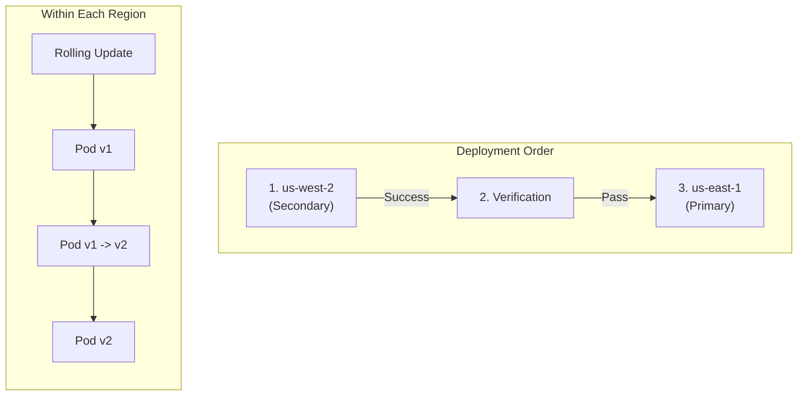
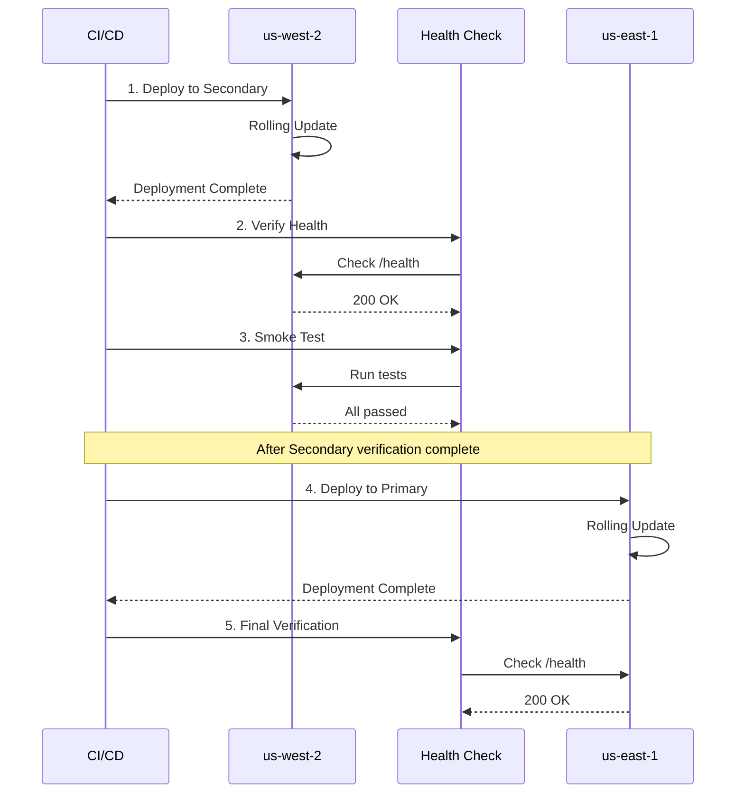
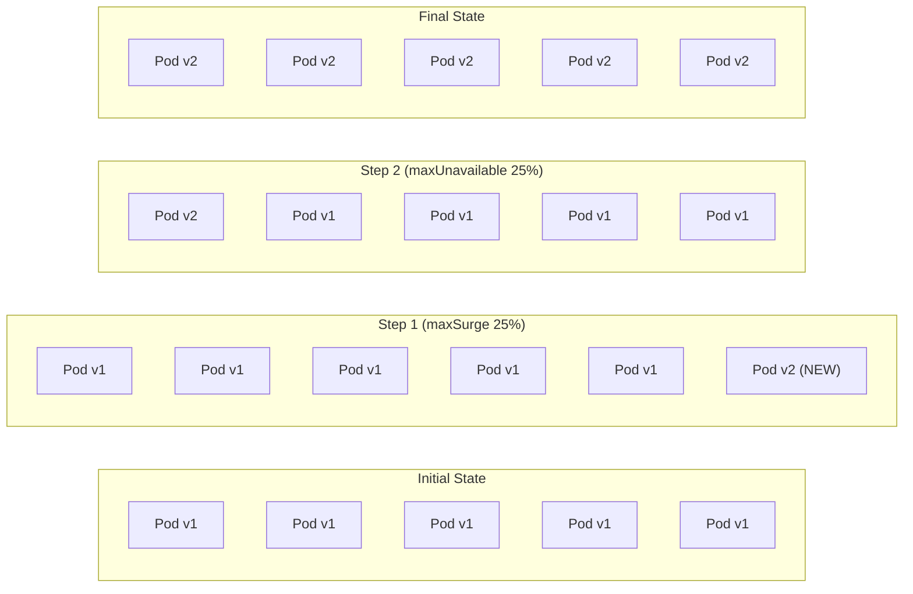
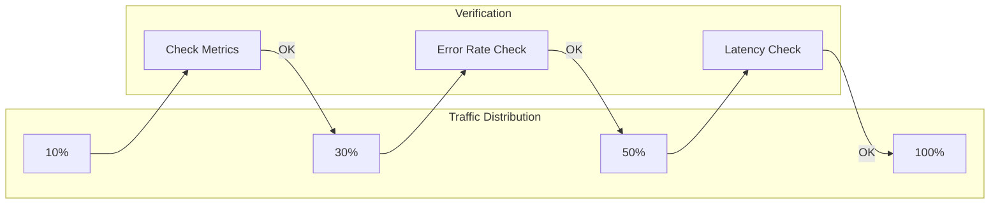
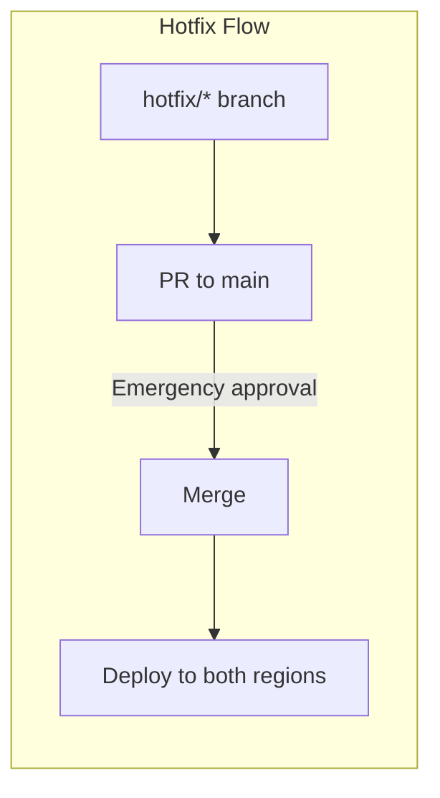

# Rollout Strategy

The multi-region shopping mall platform uses **Rolling Update** strategy as the default for safe deployments, and minimizes failure impact through **sequential deployment** between regions.

## Deployment Strategy Overview



## Regional Deployment Order

### Secondary First Strategy

Deploy to the secondary region (us-west-2) first to detect issues early:



### Rationale for Deployment Order

| Order | Region | Reason |
|-------|--------|--------|
| 1 | us-west-2 (Secondary) | Lower traffic, minimizes impact if issues occur |
| 2 | Verification | Health checks and smoke tests |
| 3 | us-east-1 (Primary) | Deploy to main traffic region after verification |

## Rolling Update Strategy

### Deployment Configuration

```yaml
apiVersion: apps/v1
kind: Deployment
metadata:
  name: order-service
spec:
  replicas: 5
  strategy:
    type: RollingUpdate
    rollingUpdate:
      maxSurge: 25%        # Maximum additional Pods
      maxUnavailable: 25%  # Maximum unavailable Pods
  template:
    spec:
      containers:
        - name: order-service
          readinessProbe:
            httpGet:
              path: /health/ready
              port: 8080
            initialDelaySeconds: 10
            periodSeconds: 5
            failureThreshold: 3
          livenessProbe:
            httpGet:
              path: /health/live
              port: 8080
            initialDelaySeconds: 30
            periodSeconds: 10
            failureThreshold: 3
```

### Rolling Update Process



## Canary Deployment (Consideration)

Currently using Rolling Update, but **Argo Rollouts** canary deployment can be considered for the future:

### Argo Rollouts Example

```yaml
apiVersion: argoproj.io/v1alpha1
kind: Rollout
metadata:
  name: order-service
spec:
  replicas: 5
  strategy:
    canary:
      steps:
        - setWeight: 10
        - pause: { duration: 5m }
        - setWeight: 30
        - pause: { duration: 5m }
        - setWeight: 50
        - pause: { duration: 5m }
        - setWeight: 100
      trafficRouting:
        alb:
          ingress: order-service-ingress
          servicePort: 80
  selector:
    matchLabels:
      app: order-service
```

### Canary Deployment Flow



## Rollback Procedures

### Automatic Rollback (ArgoCD)

ArgoCD automatically rolls back to the previous state on deployment failure:

```yaml
syncPolicy:
  automated:
    prune: true
    selfHeal: true
  retry:
    limit: 5
    backoff:
      duration: 5s
      factor: 2
      maxDuration: 3m
```

### Manual Rollback

#### Method 1: ArgoCD CLI

```bash
# Rollback to previous version
argocd app rollback order-service <revision>

# Sync to specific commit
argocd app sync order-service --revision <commit-hash>
```

#### Method 2: Git Revert

```bash
# Revert the problematic commit
git revert <commit-hash>
git push origin main

# ArgoCD automatically detects and syncs the change
```

#### Method 3: kubectl Direct Rollback

```bash
# Deployment rollback
kubectl rollout undo deployment/order-service -n core-services

# Rollback to specific revision
kubectl rollout undo deployment/order-service -n core-services --to-revision=2

# Check rollback status
kubectl rollout status deployment/order-service -n core-services
```

### Rollback Decision Criteria

| Metric | Threshold | Action |
|--------|-----------|--------|
| Error Rate | > 5% | Immediate rollback |
| P99 Latency | > 2 seconds | Review and rollback |
| Pod Restarts | > 3 times/5min | Immediate rollback |
| Health Check Failures | 3 consecutive | Automatic rollback |

## Deployment Verification

### Health Checks

```bash
# Check all Pod status
kubectl get pods -n core-services -l app=order-service

# Check Pod readiness
kubectl wait --for=condition=ready pod \
  -l app=order-service \
  -n core-services \
  --timeout=300s
```

### Smoke Tests

```bash
# API endpoint test
curl -f https://api.atomai.click/health

# Key functionality test
curl -X POST https://api.atomai.click/api/v1/orders/validate \
  -H "Content-Type: application/json" \
  -d '{"test": true}'
```

### Metrics Verification

```promql
# Check error rate
sum(rate(http_requests_total{status=~"5.."}[5m])) /
sum(rate(http_requests_total[5m])) * 100

# P99 latency
histogram_quantile(0.99, sum(rate(http_request_duration_seconds_bucket[5m])) by (le))
```

## Emergency Deployment Procedures

### Hotfix Deployment



### Emergency Deployment Checklist

1. [ ] Identify issue and create hotfix branch
2. [ ] Apply fix and test
3. [ ] Create PR and emergency review
4. [ ] Merge to main branch
5. [ ] Monitor deployment
6. [ ] Prepare rollback (if needed)

## Deployment Monitoring

### Real-time Monitoring

```bash
# Real-time deployment status
kubectl rollout status deployment/order-service -n core-services -w

# Check Pod events
kubectl get events -n core-services --sort-by='.lastTimestamp' | tail -20

# Check logs
kubectl logs -f deployment/order-service -n core-services
```

### Grafana Dashboards

- **Deployment Status**: Deployment progress
- **Error Rate**: Error rate trends
- **Latency**: Response time trends
- **Pod Status**: Pod status changes

## Next Steps

- [GitOps - ArgoCD](/deployment/gitops-argocd) - ArgoCD configuration
- [CI/CD Pipeline](/deployment/ci-cd-pipeline) - GitHub Actions
- [Observability](/observability/distributed-tracing) - Distributed tracing
