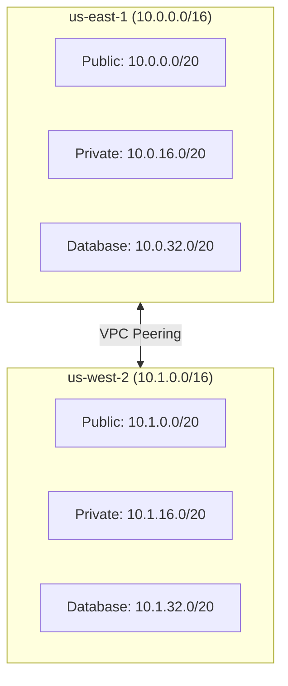

# Prerequisites

Prerequisites for deploying the Multi-Region Shopping Mall platform.

## AWS Account Requirements

### Region Access Permissions

Full access permissions are required for two AWS regions:

| Region | Role | Description |
|--------|------|-------------|
| **us-east-1** | Primary | Main region, handles write operations |
| **us-west-2** | Secondary | Secondary region, read operations and disaster recovery |

### IAM Permissions

Minimum IAM permissions required for deployment:

```json
{
  "Version": "2012-10-17",
  "Statement": [
    {
      "Effect": "Allow",
      "Action": [
        "eks:*",
        "ec2:*",
        "elasticache:*",
        "rds:*",
        "docdb:*",
        "es:*",
        "kafka:*",
        "s3:*",
        "cloudfront:*",
        "route53:*",
        "wafv2:*",
        "kms:*",
        "secretsmanager:*",
        "iam:*",
        "logs:*",
        "xray:*",
        "ecr:*"
      ],
      "Resource": "*"
    }
  ]
}
```

:::warning Production Environment
In actual production environments, use granular IAM policies per resource following the principle of least privilege.
:::

## Required Tools

The following tools must be installed in your local development environment:

### Infrastructure Tools

| Tool | Minimum Version | Description | Verification |
|------|-----------------|-------------|--------------|
| **Terraform** | >= 1.7.0 | Infrastructure provisioning | `terraform version` |
| **kubectl** | >= 1.29 | Kubernetes cluster management | `kubectl version --client` |
| **Helm** | >= 3.14 | Kubernetes package management | `helm version` |
| **AWS CLI** | v2 | AWS resource management | `aws --version` |
| **Docker** | >= 24.0 | Container builds | `docker --version` |

### Development Language Runtimes

| Language | Version | Services Used | Verification |
|----------|---------|---------------|--------------|
| **Go** | 1.21+ | api-gateway, event-bus, cart, search, inventory | `go version` |
| **Java** | 17 (LTS) | order, payment, user-account, warehouse, returns, pricing, seller | `java -version` |
| **Python** | 3.11+ | product-catalog, shipping, user-profile, recommendation, wishlist, analytics, notification, review | `python3 --version` |
| **Node.js** | 20 (LTS) | Build tools, documentation site | `node --version` |

### Installation Scripts

```bash
# macOS (Homebrew)
brew install terraform kubectl helm awscli docker
brew install go openjdk@17 python@3.11 node@20

# Ubuntu/Debian
# Terraform
wget -O- https://apt.releases.hashicorp.com/gpg | sudo gpg --dearmor -o /usr/share/keyrings/hashicorp-archive-keyring.gpg
echo "deb [signed-by=/usr/share/keyrings/hashicorp-archive-keyring.gpg] https://apt.releases.hashicorp.com $(lsb_release -cs) main" | sudo tee /etc/apt/sources.list.d/hashicorp.list
sudo apt update && sudo apt install terraform

# kubectl
curl -LO "https://dl.k8s.io/release/$(curl -L -s https://dl.k8s.io/release/stable.txt)/bin/linux/amd64/kubectl"
sudo install -o root -g root -m 0755 kubectl /usr/local/bin/kubectl

# Helm
curl https://raw.githubusercontent.com/helm/helm/main/scripts/get-helm-3 | bash

# AWS CLI v2
curl "https://awscli.amazonaws.com/awscli-exe-linux-x86_64.zip" -o "awscliv2.zip"
unzip awscliv2.zip && sudo ./aws/install
```

## AWS Service Quotas

Verify that the following service quotas are sufficient for multi-region deployment:

### Compute and Networking

| Service | Quota Item | Minimum Required (per region) |
|---------|------------|-------------------------------|
| **EKS** | Clusters per region | 2 |
| **VPC** | VPCs per region | 2 |
| **VPC** | NAT Gateways per AZ | 3 |
| **VPC** | Elastic IPs | 6 |
| **EC2** | Running On-Demand instances | 50 vCPU |
| **ALB** | Application Load Balancers | 2 |

### Databases

| Service | Quota Item | Minimum Required (per region) |
|---------|------------|-------------------------------|
| **Aurora** | DB clusters | 1 |
| **Aurora** | DB instances per cluster | 2 |
| **DocumentDB** | Clusters | 1 |
| **DocumentDB** | Instances per cluster | 2 |
| **ElastiCache** | Nodes | 4 |
| **ElastiCache** | Parameter groups | 2 |

### Search and Messaging

| Service | Quota Item | Minimum Required (per region) |
|---------|------------|-------------------------------|
| **OpenSearch** | Domains | 1 |
| **OpenSearch** | Instances per domain | 3 |
| **MSK** | Clusters | 1 |
| **MSK** | Brokers per cluster | 3 |

### Edge and Security

| Service | Quota Item | Minimum Required |
|---------|------------|------------------|
| **CloudFront** | Distributions | 1 |
| **WAF** | Web ACLs per region | 1 |
| **Route 53** | Hosted zones | 1 |
| **KMS** | Keys per region | 5 |
| **Secrets Manager** | Secrets per region | 20 |

### Checking and Requesting Quota Increases

```bash
# Check current quotas
aws service-quotas list-service-quotas \
  --service-code eks \
  --region us-east-1

# Request quota increase
aws service-quotas request-service-quota-increase \
  --service-code eks \
  --quota-code L-1194D53C \
  --desired-value 5 \
  --region us-east-1
```

## Domain and Certificates

### Route 53 Domain

- Domain: `atomai.click` (or your own domain)
- Route 53 Hosted Zone must be created
- NS records must be configured at the domain registrar

### SSL/TLS Certificates

A wildcard certificate is required:

```
*.atomai.click
```

Issue certificates in ACM:
- **us-east-1**: For CloudFront (required - CloudFront only uses us-east-1 certificates)
- **us-west-2**: For ALB

## Network Requirements

### CIDR Block Planning



### Required Ports

| Port | Protocol | Purpose |
|------|----------|---------|
| 443 | HTTPS | API Gateway, web traffic |
| 5432 | TCP | Aurora PostgreSQL |
| 27017 | TCP | DocumentDB |
| 6379 | TCP | ElastiCache Valkey |
| 9096 | TCP | MSK Kafka (SASL/SCRAM) |
| 443 | HTTPS | OpenSearch |

## Pre-Deployment Checklist

Verify the following items before deployment:

- [ ] Confirm us-east-1, us-west-2 access permissions on AWS account
- [ ] Grant required permissions to IAM user/role
- [ ] Install all required tools and verify versions
- [ ] Check AWS service quotas (request increases if needed)
- [ ] Route 53 Hosted Zone creation complete
- [ ] ACM certificate issuance complete (us-east-1, us-west-2)
- [ ] Confirm no VPC CIDR block conflicts

## Next Steps

Once all prerequisites are met, proceed to the [Quick Start Guide](./quick-start).
