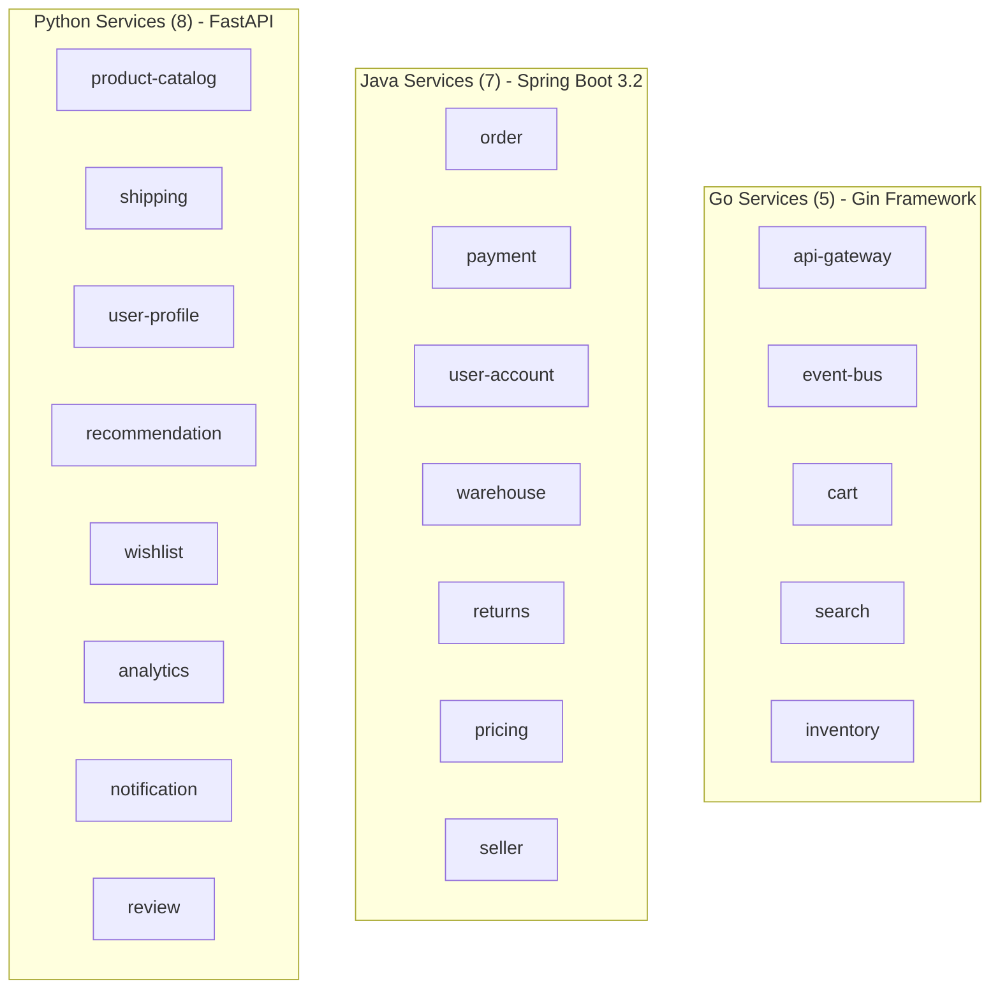
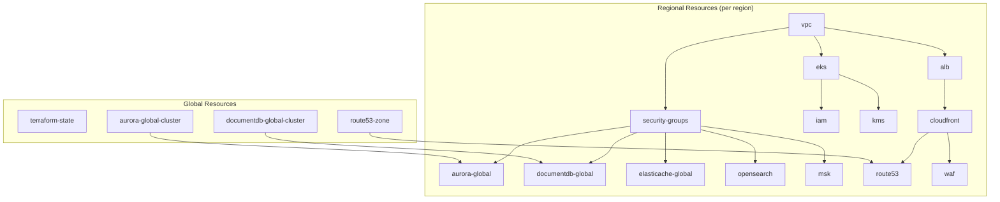
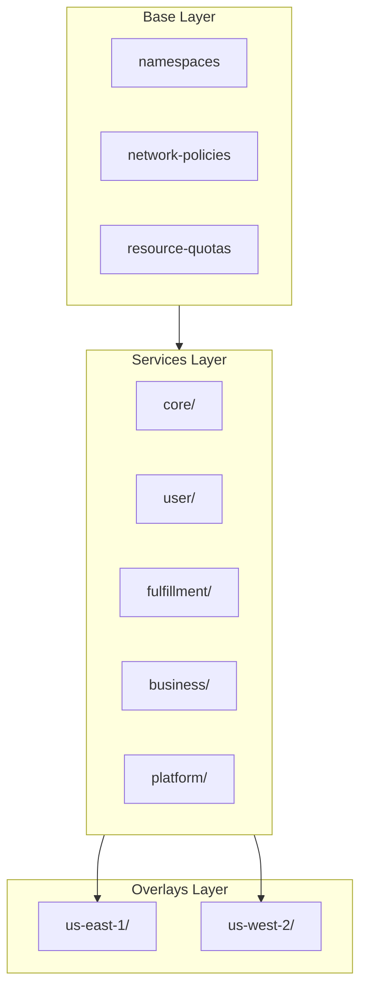
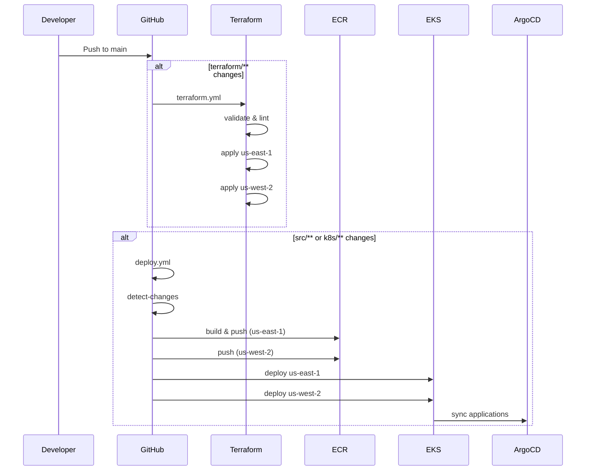

# Project Structure

An overview of the entire directory structure and description of each component in the Multi-Region Shopping Mall project.

## Overall Structure Overview

```
multi-region-architecture/
├── src/                    # Microservices source code
├── terraform/              # Infrastructure code (IaC)
├── k8s/                    # Kubernetes manifests
├── scripts/                # Utility scripts
├── docs/                   # Architecture documentation
├── webpage/                # Docusaurus documentation site
└── .github/workflows/      # CI/CD pipelines
```

## src/ - Microservices

20 microservices organized by domain.

```
src/
├── shared/                 # Shared libraries
│   ├── go/                 # Go common packages
│   │   └── pkg/
│   │       ├── kafka/      # Kafka producer/consumer
│   │       ├── region/     # Region-aware middleware
│   │       ├── tracing/    # OpenTelemetry setup
│   │       └── health/     # Health check utilities
│   ├── java/               # Java common libraries
│   │   └── mall-common/
│   │       └── src/main/java/com/mall/common/
│   │           ├── kafka/
│   │           ├── region/
│   │           └── tracing/
│   └── python/             # Python common packages
│       └── mall_common/
│           ├── kafka.py
│           ├── region.py
│           └── tracing.py
│
├── api-gateway/            # [Go] API routing, authentication, rate limiting
├── event-bus/              # [Go] Kafka event routing
├── cart/                   # [Go] Shopping cart (Valkey cache)
├── search/                 # [Go] Product search (OpenSearch)
├── inventory/              # [Go] Inventory management (Aurora)
│
├── order/                  # [Java] Order processing (Saga pattern)
├── payment/                # [Java] Payment processing
├── user-account/           # [Java] Authentication, session management
├── warehouse/              # [Java] Warehouse allocation
├── returns/                # [Java] Returns processing
├── pricing/                # [Java] Dynamic pricing, promotions
├── seller/                 # [Java] Seller portal
│
├── product-catalog/        # [Python] Product CRUD (DocumentDB)
├── shipping/               # [Python] Shipping tracking
├── user-profile/           # [Python] User profiles
├── recommendation/         # [Python] ML recommendations
├── wishlist/               # [Python] Wishlist (Valkey)
├── analytics/              # [Python] Event analytics
├── notification/           # [Python] Notifications (email, SMS, push)
└── review/                 # [Python] Product reviews
```

### Languages and Frameworks by Service



### Service Structure Patterns

#### Go Service Structure
```
src/cart/
├── cmd/
│   └── main.go                 # Entry point
├── internal/
│   ├── handler/                # HTTP handlers
│   │   └── cart_handler.go
│   ├── service/                # Business logic
│   │   └── cart_service.go
│   ├── repository/             # Data access
│   │   └── cart_repository.go
│   └── middleware/             # Middleware
│       └── auth.go
├── go.mod
├── go.sum
├── Dockerfile
└── AGENTS.md
```

#### Java Service Structure
```
src/order/
├── src/main/java/com/mall/order/
│   ├── OrderApplication.java   # Spring Boot main
│   ├── controller/
│   │   └── OrderController.java
│   ├── service/
│   │   ├── OrderService.java
│   │   └── impl/
│   │       └── OrderServiceImpl.java
│   ├── repository/
│   │   └── OrderRepository.java
│   ├── entity/
│   │   └── Order.java
│   ├── dto/
│   │   ├── OrderRequest.java
│   │   └── OrderResponse.java
│   └── config/
│       └── KafkaConfig.java
├── src/main/resources/
│   └── application.yml
├── build.gradle
├── Dockerfile
└── AGENTS.md
```

#### Python Service Structure
```
src/product-catalog/
├── app/
│   ├── __init__.py
│   ├── main.py                 # FastAPI app
│   ├── api/
│   │   └── routes/
│   │       └── products.py
│   ├── core/
│   │   └── config.py
│   ├── models/
│   │   └── product.py
│   ├── services/
│   │   └── product_service.py
│   └── repositories/
│       └── product_repository.py
├── tests/
│   └── test_products.py
├── requirements.txt
├── Dockerfile
└── AGENTS.md
```

## terraform/ - Infrastructure Code

Module-based multi-region infrastructure code using Terraform.

```
terraform/
├── global/                     # Global resources (region-independent)
│   ├── terraform-state/        # S3 + DynamoDB (state management)
│   │   ├── main.tf
│   │   ├── variables.tf
│   │   └── outputs.tf
│   ├── route53-zone/           # Route 53 Hosted Zone
│   ├── aurora-global-cluster/  # Aurora Global Database
│   └── documentdb-global-cluster/
│
├── modules/                    # Reusable modules
│   ├── networking/
│   │   ├── vpc/                # VPC, Subnets, NAT Gateway
│   │   ├── transit-gateway/    # Cross-region connectivity
│   │   └── security-groups/    # Security groups
│   │
│   ├── compute/
│   │   ├── eks/                # EKS cluster, node groups
│   │   └── alb/                # Application Load Balancer
│   │
│   ├── data/
│   │   ├── aurora-global/      # Aurora PostgreSQL (per region)
│   │   ├── documentdb-global/  # DocumentDB (per region)
│   │   ├── elasticache-global/ # ElastiCache Valkey
│   │   ├── opensearch/         # OpenSearch domain
│   │   ├── msk/                # MSK Kafka cluster
│   │   └── s3/                 # S3 buckets
│   │
│   ├── edge/
│   │   ├── cloudfront/         # CloudFront distribution
│   │   ├── route53/            # DNS records
│   │   └── waf/                # WAF rules
│   │
│   ├── security/
│   │   ├── kms/                # KMS keys
│   │   ├── secrets-manager/    # Secret management
│   │   └── iam/                # IAM roles, policies
│   │
│   └── observability/
│       ├── cloudwatch/         # Log groups, metrics
│       ├── xray/               # X-Ray configuration
│       └── tempo-storage/      # Tempo S3 backend
│
└── environments/               # Environment-specific configuration
    └── production/
        ├── us-east-1/          # Primary region
        │   ├── main.tf         # Module composition
        │   ├── variables.tf
        │   ├── outputs.tf
        │   └── backend.tf      # S3 backend configuration
        └── us-west-2/          # Secondary region
            ├── main.tf
            ├── variables.tf
            ├── outputs.tf
            └── backend.tf
```

### Terraform Module Dependencies



## k8s/ - Kubernetes Manifests

Kustomize-based Kubernetes manifests.

```
k8s/
├── base/                       # Base resources
│   ├── namespaces.yaml         # Namespace definitions
│   ├── network-policies/       # Network policies
│   │   ├── default-deny.yaml
│   │   ├── allow-dns.yaml
│   │   ├── allow-alb-ingress.yaml
│   │   └── allow-inter-namespace.yaml
│   ├── resource-quotas/        # Resource quotas
│   │   ├── core-services.yaml
│   │   ├── user-services.yaml
│   │   ├── fulfillment.yaml
│   │   ├── business-services.yaml
│   │   └── platform.yaml
│   └── kustomization.yaml
│
├── services/                   # Service manifests
│   ├── core/                   # Core domain
│   │   ├── product-catalog/
│   │   │   └── deployment.yaml
│   │   ├── search/
│   │   ├── cart/
│   │   ├── order/
│   │   ├── payment/
│   │   ├── inventory/
│   │   └── kustomization.yaml
│   ├── user/                   # User domain
│   │   ├── user-account/
│   │   ├── user-profile/
│   │   ├── wishlist/
│   │   ├── review/
│   │   └── kustomization.yaml
│   ├── fulfillment/            # Fulfillment domain
│   │   ├── shipping/
│   │   ├── warehouse/
│   │   ├── returns/
│   │   └── kustomization.yaml
│   ├── business/               # Business domain
│   │   ├── pricing/
│   │   ├── recommendation/
│   │   ├── notification/
│   │   ├── seller/
│   │   └── kustomization.yaml
│   ├── platform/               # Platform domain
│   │   ├── api-gateway/
│   │   ├── event-bus/
│   │   ├── analytics/
│   │   └── kustomization.yaml
│   └── kustomization.yaml
│
├── infra/                      # Infrastructure components
│   ├── argocd/                 # ArgoCD
│   │   ├── namespace.yaml
│   │   ├── kustomization.yaml
│   │   └── apps/
│   │       ├── root-app.yaml
│   │       ├── appset-core.yaml
│   │       ├── appset-user.yaml
│   │       ├── appset-fulfillment.yaml
│   │       ├── appset-business.yaml
│   │       ├── appset-platform.yaml
│   │       ├── appset-infra.yaml
│   │       ├── appset-tempo.yaml
│   │       └── kustomization.yaml
│   ├── karpenter/              # Karpenter (node provisioning)
│   │   ├── ec2nodeclass.yaml
│   │   ├── general-nodepool.yaml
│   │   ├── critical-nodepool.yaml
│   │   └── nodepools/
│   │       ├── api-nodepool.yaml
│   │       ├── worker-nodepool.yaml
│   │       ├── memory-nodepool.yaml
│   │       └── batch-nodepool.yaml
│   ├── keda/                   # KEDA (event-driven scaling)
│   │   ├── namespace.yaml
│   │   ├── keda-operator.yaml
│   │   └── scaledobjects/
│   ├── external-secrets/       # External Secrets Operator
│   │   ├── namespace.yaml
│   │   ├── cluster-secret-store.yaml
│   │   └── secrets/
│   ├── otel-collector/         # OpenTelemetry Collector
│   ├── tempo/                  # Grafana Tempo
│   ├── prometheus-stack/       # Prometheus + Grafana
│   ├── fluent-bit/             # Fluent Bit (logging)
│   └── kustomization.yaml
│
└── overlays/                   # Region-specific overlays
    ├── us-east-1/              # Primary region
    │   ├── core/
    │   │   └── kustomization.yaml
    │   ├── user/
    │   ├── fulfillment/
    │   ├── business/
    │   ├── platform/
    │   └── kustomization.yaml
    └── us-west-2/              # Secondary region
        ├── core/
        ├── user/
        ├── fulfillment/
        ├── business/
        ├── platform/
        └── kustomization.yaml
```

### Kustomize Structure



## scripts/ - Utility Scripts

```
scripts/
├── seed-data/                  # Seed data
│   ├── seed-aurora.sql         # PostgreSQL initial data
│   ├── seed-documentdb.js      # MongoDB initial data
│   ├── seed-opensearch.sh      # OpenSearch index/data
│   ├── seed-kafka-topics.sh    # Kafka topic creation
│   ├── seed-redis.sh           # Redis initial data
│   ├── run-seed.sh             # Run all seeds
│   └── k8s/jobs/
│       └── seed-data-job.yaml  # K8s Job manifest
├── build-and-push.sh           # Docker image build/push
└── AGENTS.md
```

## .github/workflows/ - CI/CD

```
.github/workflows/
├── terraform.yml               # Terraform CI/CD
│   # - PR: validate, lint, plan
│   # - main push: apply (primary -> secondary)
├── deploy.yml                  # Application deployment
│   # - Detect changed services
│   # - Docker build and ECR push
│   # - EKS deployment (primary -> secondary)
└── deploy-docs.yml             # Documentation site deployment
```

### CI/CD Pipeline Flow



## docs/ - Architecture Documentation

```
docs/
├── architecture/
│   └── diagrams/
│       ├── multi-region-architecture.drawio
│       ├── multi-region-architecture.svg
│       ├── replication-architecture.drawio
│       └── replication-architecture.svg
├── data-architecture.md
└── network-architecture.md
```

## Namespace Structure

Kubernetes namespaces are organized by domain:

| Namespace | Services | Description |
|-----------|----------|-------------|
| `core-services` | product-catalog, search, cart, order, payment, inventory | Core shopping functionality |
| `user-services` | user-account, user-profile, wishlist, review | User-related functionality |
| `fulfillment` | shipping, warehouse, returns | Order fulfillment |
| `business-services` | pricing, recommendation, notification, seller | Business logic |
| `platform` | api-gateway, event-bus, analytics | Platform common |
| `argocd` | ArgoCD | GitOps |
| `monitoring` | Prometheus, Grafana, Tempo | Monitoring |
| `logging` | Fluent Bit | Logging |
| `keda` | KEDA | Autoscaling |
| `external-secrets` | ESO | Secret management |
| `karpenter` | Karpenter | Node provisioning |

## Next Steps

- Understand system design in [Architecture Overview](/architecture/overview)
- Check detailed microservice documentation in [Services](/services/overview)
- Review AWS resource configuration in [Infrastructure](/infrastructure/overview)
