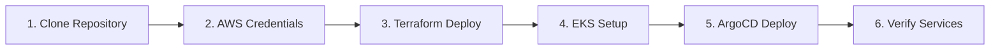

# Quick Start Guide

A step-by-step guide to deploying the Multi-Region Shopping Mall platform from scratch.

## Overview



## Step 1: Clone Repository

```bash
# Clone repository
git clone https://github.com/Atom-oh/multi-region-architecture.git
cd multi-region-architecture

# Verify directory structure
ls -la
# src/           - 20 microservices
# terraform/     - Infrastructure code
# k8s/           - Kubernetes manifests
# scripts/       - Utility scripts
```

## Step 2: Configure AWS Credentials

Configure AWS credentials for both regions.

### AWS CLI Profile Setup

```bash
# Set up default profile
aws configure
# AWS Access Key ID: [your-access-key]
# AWS Secret Access Key: [your-secret-key]
# Default region name: us-east-1
# Default output format: json

# Verify credentials
aws sts get-caller-identity
```

### Multi-Region Profiles (Optional)

```bash
# ~/.aws/config
[profile mall-east]
region = us-east-1
output = json

[profile mall-west]
region = us-west-2
output = json

# ~/.aws/credentials
[mall-east]
aws_access_key_id = YOUR_ACCESS_KEY
aws_secret_access_key = YOUR_SECRET_KEY

[mall-west]
aws_access_key_id = YOUR_ACCESS_KEY
aws_secret_access_key = YOUR_SECRET_KEY
```

### Set Environment Variables

```bash
# Required environment variables
export AWS_ACCOUNT_ID=$(aws sts get-caller-identity --query Account --output text)
export AWS_DEFAULT_REGION=us-east-1
export TF_VAR_aws_account_id=$AWS_ACCOUNT_ID

# Verify
echo "AWS Account: $AWS_ACCOUNT_ID"
```

## Step 3: Deploy Infrastructure with Terraform

### 3.1 Create Terraform State Bucket

```bash
cd terraform/global/terraform-state

# Initialize and apply
terraform init
terraform plan
terraform apply -auto-approve

# Verify outputs
# S3 bucket: multi-region-mall-terraform-state
# DynamoDB table: multi-region-mall-terraform-locks
```

### 3.2 Deploy Global Resources

```bash
# Route 53 Hosted Zone
cd ../route53-zone
terraform init
terraform apply -auto-approve

# Aurora Global Cluster
cd ../aurora-global-cluster
terraform init
terraform apply -auto-approve

# DocumentDB Global Cluster
cd ../documentdb-global-cluster
terraform init
terraform apply -auto-approve
```

### 3.3 Deploy Primary Region (us-east-1)

```bash
cd ../../environments/production/us-east-1

# Initialize backend
terraform init

# Review plan
terraform plan -out=tfplan

# Apply (takes approximately 30-45 minutes)
terraform apply tfplan
```

:::tip Deployment Time
Primary region deployment creates approximately 260 resources and takes 30-45 minutes.
EKS cluster, RDS, and OpenSearch creation take the most time.
:::

### 3.4 Deploy Secondary Region (us-west-2)

```bash
cd ../us-west-2

# Initialize backend
terraform init

# Review plan
terraform plan -out=tfplan

# Apply (takes approximately 25-35 minutes)
terraform apply tfplan
```

### 3.5 Verify Deployment

```bash
# Check us-east-1 outputs
cd ../us-east-1
terraform output

# Key outputs:
# eks_cluster_endpoint = "https://xxx.eks.us-east-1.amazonaws.com"
# aurora_cluster_endpoint = "production-aurora-global-us-east-1.cluster-xxx.us-east-1.rds.amazonaws.com"
# documentdb_endpoint = "production-docdb-global-us-east-1.cluster-xxx.us-east-1.docdb.amazonaws.com"
# elasticache_endpoint = "clustercfg.production-elasticache-us-east-1.xxx.use1.cache.amazonaws.com"
# opensearch_endpoint = "vpc-production-os-use1-xxx.us-east-1.es.amazonaws.com"
```

## Step 4: Configure kubectl

### 4.1 Connect to EKS Clusters

```bash
# us-east-1 cluster
aws eks update-kubeconfig \
  --name multi-region-mall \
  --region us-east-1 \
  --alias mall-east

# us-west-2 cluster
aws eks update-kubeconfig \
  --name multi-region-mall \
  --region us-west-2 \
  --alias mall-west

# Verify contexts
kubectl config get-contexts
```

### 4.2 Verify Cluster Status

```bash
# Check us-east-1 cluster
kubectl --context=mall-east get nodes
kubectl --context=mall-east get ns

# Check us-west-2 cluster
kubectl --context=mall-west get nodes
kubectl --context=mall-west get ns
```

### 4.3 Verify Karpenter Nodes

```bash
# Check NodePool status
kubectl --context=mall-east get nodepools
kubectl --context=mall-east get ec2nodeclasses

# Verify node provisioning
kubectl --context=mall-east get nodes -L karpenter.sh/nodepool
```

## Step 5: Deploy ArgoCD and Applications

### 5.1 Install ArgoCD

```bash
# Install ArgoCD on us-east-1
kubectl --context=mall-east apply -k k8s/infra/argocd/

# Wait for ArgoCD server
kubectl --context=mall-east wait --for=condition=available \
  deployment/argocd-server -n argocd --timeout=300s

# Get initial password
kubectl --context=mall-east -n argocd get secret argocd-initial-admin-secret \
  -o jsonpath="{.data.password}" | base64 -d
```

### 5.2 Access ArgoCD

```bash
# Port forwarding
kubectl --context=mall-east port-forward svc/argocd-server -n argocd 8080:443

# Access in browser: https://localhost:8080
# Username: admin
# Password: (password from above)
```

### 5.3 Deploy ApplicationSet

```bash
# Deploy Root Application (automatically deploys all services)
kubectl --context=mall-east apply -f k8s/infra/argocd/apps/root-app.yaml

# Check ApplicationSet status
kubectl --context=mall-east get applications -n argocd
```

### 5.4 Deploy Infrastructure Components

```bash
# External Secrets Operator
kubectl --context=mall-east apply -k k8s/infra/external-secrets/

# KEDA (Event-driven autoscaling)
kubectl --context=mall-east apply -k k8s/infra/keda/

# Fluent Bit (Logging)
kubectl --context=mall-east apply -k k8s/infra/fluent-bit/

# OTel Collector + Tempo (Distributed tracing)
kubectl --context=mall-east apply -k k8s/infra/otel-collector/
kubectl --context=mall-east apply -k k8s/infra/tempo/

# Prometheus Stack
kubectl --context=mall-east apply -k k8s/infra/prometheus-stack/
```

## Step 6: Deploy and Verify Services

### 6.1 Deploy Services with Kustomize

```bash
# Deploy all services to us-east-1
kubectl --context=mall-east apply -k k8s/overlays/us-east-1/

# Deploy all services to us-west-2
kubectl --context=mall-west apply -k k8s/overlays/us-west-2/
```

### 6.2 Check Deployment Status

```bash
# Check Pod status by namespace
for ns in core-services user-services fulfillment business-services platform; do
  echo "=== $ns ==="
  kubectl --context=mall-east get pods -n $ns
done
```

### 6.3 Verify Service Endpoints

```bash
# API Gateway endpoint
kubectl --context=mall-east get svc -n platform api-gateway

# Check ALB Ingress
kubectl --context=mall-east get ingress -A
```

### 6.4 Health Check

```bash
# API Gateway health check
curl -k https://api.atomai.click/health

# Individual service health check (using port forwarding)
kubectl --context=mall-east port-forward svc/product-catalog -n core-services 8000:8000
curl http://localhost:8000/health
```

## Step 7: Load Seed Data (Optional)

```bash
# Run seed data Job
kubectl --context=mall-east apply -f scripts/seed-data/k8s/jobs/seed-data-job.yaml

# Check Job status
kubectl --context=mall-east get jobs -n core-services

# Check logs
kubectl --context=mall-east logs job/seed-data -n core-services
```

## Deployment Verification Checklist

```bash
# Full system status check script
#!/bin/bash
echo "=== EKS Clusters ==="
aws eks describe-cluster --name multi-region-mall --region us-east-1 --query 'cluster.status'
aws eks describe-cluster --name multi-region-mall --region us-west-2 --query 'cluster.status'

echo "=== Aurora Global Cluster ==="
aws rds describe-global-clusters --query 'GlobalClusters[0].Status'

echo "=== DocumentDB Cluster ==="
aws docdb describe-db-clusters --region us-east-1 --query 'DBClusters[0].Status'

echo "=== ElastiCache ==="
aws elasticache describe-replication-groups --region us-east-1 --query 'ReplicationGroups[0].Status'

echo "=== OpenSearch ==="
aws opensearch describe-domain --domain-name production-os-use1 --region us-east-1 --query 'DomainStatus.Processing'

echo "=== Pods Status (us-east-1) ==="
kubectl --context=mall-east get pods -A | grep -v Running | grep -v Completed
```

## Troubleshooting

### Terraform State Lock Error

```bash
# Release DynamoDB lock
aws dynamodb delete-item \
  --table-name multi-region-mall-terraform-locks \
  --key '{"LockID": {"S": "multi-region-mall-terraform-state/production/us-east-1/terraform.tfstate"}}'
```

### EKS Connection Error

```bash
# Regenerate kubeconfig
aws eks update-kubeconfig --name multi-region-mall --region us-east-1 --alias mall-east

# Verify IAM authentication
aws eks get-token --cluster-name multi-region-mall --region us-east-1
```

### Pod CrashLoopBackOff

```bash
# Check logs
kubectl --context=mall-east logs <pod-name> -n <namespace> --previous

# Check events
kubectl --context=mall-east describe pod <pod-name> -n <namespace>
```

## Next Steps

- Set up [Local Development Environment](./local-development)
- Understand [Project Structure](./project-structure)
- Learn [Architecture Overview](/architecture/overview)
