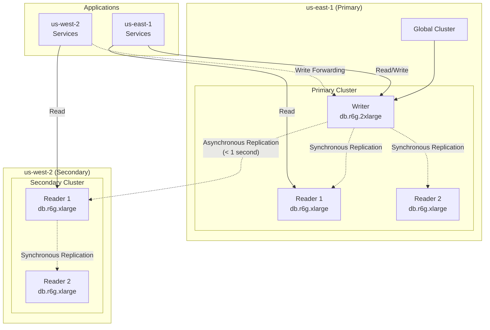

# Aurora Global Database

The multi-region shopping mall platform uses **Aurora PostgreSQL Global Database** to implement cross-region data replication. The Writer instance is in us-east-1, and us-west-2 operates as a Read Replica, forwarding write requests to the primary through **Write Forwarding**.

## Architecture



## Cluster Specifications

| Item | us-east-1 (Primary) | us-west-2 (Secondary) |
|------|---------------------|----------------------|
| Cluster ID | `production-aurora-global-us-east-1` | `production-aurora-global-us-west-2` |
| Engine | Aurora PostgreSQL 15.8 | Aurora PostgreSQL 15.8 |
| Writer Instance | db.r6g.2xlarge (1) | - |
| Reader Instances | db.r6g.xlarge (2) | db.r6g.xlarge (2) |
| Replication Lag | - | < 1 second |
| Write Forwarding | - | Enabled |
| Encryption | KMS (per-region key) | KMS (per-region key) |

## Connection Endpoints

### us-east-1

| Endpoint Type | Value |
|---------------|-------|
| **Writer** | `production-aurora-global-us-east-1.cluster-xxxxxxxxxxxx.us-east-1.rds.amazonaws.com` |
| **Reader** | `production-aurora-global-us-east-1.cluster-ro-xxxxxxxxxxxx.us-east-1.rds.amazonaws.com` |
| Port | 5432 |

### us-west-2

| Endpoint Type | Value |
|---------------|-------|
| **Reader** | `production-aurora-global-us-west-2.cluster-yyyyyyyyyyyy.us-west-2.rds.amazonaws.com` |
| **Reader (RO)** | `production-aurora-global-us-west-2.cluster-ro-yyyyyyyyyyyy.us-west-2.rds.amazonaws.com` |
| Port | 5432 |

## Terraform Configuration

```hcl
resource "aws_rds_cluster" "this" {
  cluster_identifier        = "${var.environment}-aurora-global-${var.region}"
  global_cluster_identifier = var.is_primary ? null : var.global_cluster_identifier

  engine         = "aurora-postgresql"
  engine_version = "15.8"

  # Primary cluster credentials
  master_username = var.is_primary ? "mall_admin" : null
  master_password = var.is_primary ? var.master_password : null

  # Secondary cluster - Write Forwarding
  source_region                  = var.is_primary ? null : var.source_region
  enable_global_write_forwarding = var.is_primary ? null : var.enable_write_forwarding

  db_subnet_group_name   = aws_db_subnet_group.this.name
  vpc_security_group_ids = [var.security_group_id]

  storage_encrypted = true
  kms_key_id        = var.kms_key_arn

  backup_retention_period      = var.is_primary ? var.backup_retention_period : 1
  preferred_backup_window      = "03:00-04:00"
  preferred_maintenance_window = "sun:04:00-sun:05:00"

  enabled_cloudwatch_logs_exports = ["postgresql"]
  deletion_protection             = true
}

# Writer Instance (Primary only)
resource "aws_rds_cluster_instance" "writer" {
  count = var.is_primary ? 1 : 0

  identifier         = "${var.environment}-aurora-global-${var.region}-writer"
  cluster_identifier = aws_rds_cluster.this.id
  instance_class     = var.writer_instance_class  # db.r6g.2xlarge

  monitoring_interval             = 60
  performance_insights_enabled    = true
  performance_insights_kms_key_id = var.kms_key_arn
}

# Reader Instances
resource "aws_rds_cluster_instance" "readers" {
  count = var.reader_count  # 2

  identifier         = "${var.environment}-aurora-global-${var.region}-reader-${count.index + 1}"
  cluster_identifier = aws_rds_cluster.this.id
  instance_class     = var.reader_instance_class  # db.r6g.xlarge

  monitoring_interval             = 60
  performance_insights_enabled    = true
  performance_insights_kms_key_id = var.kms_key_arn
}
```

## Database Schema

The following tables are stored in Aurora PostgreSQL:

### users table

```sql
CREATE TABLE users (
    id UUID PRIMARY KEY DEFAULT gen_random_uuid(),
    email VARCHAR(255) UNIQUE NOT NULL,
    password_hash VARCHAR(255) NOT NULL,
    name VARCHAR(100) NOT NULL,
    phone VARCHAR(20),
    created_at TIMESTAMP DEFAULT CURRENT_TIMESTAMP,
    updated_at TIMESTAMP DEFAULT CURRENT_TIMESTAMP,
    last_login_at TIMESTAMP,
    status VARCHAR(20) DEFAULT 'active'
);

CREATE INDEX idx_users_email ON users(email);
CREATE INDEX idx_users_status ON users(status);
```

### orders table

```sql
CREATE TABLE orders (
    id UUID PRIMARY KEY DEFAULT gen_random_uuid(),
    user_id UUID NOT NULL REFERENCES users(id),
    status VARCHAR(50) NOT NULL DEFAULT 'pending',
    total_amount DECIMAL(12, 2) NOT NULL,
    currency VARCHAR(3) DEFAULT 'KRW',
    shipping_address JSONB,
    created_at TIMESTAMP DEFAULT CURRENT_TIMESTAMP,
    updated_at TIMESTAMP DEFAULT CURRENT_TIMESTAMP,
    completed_at TIMESTAMP,
    region VARCHAR(20) NOT NULL
);

CREATE INDEX idx_orders_user_id ON orders(user_id);
CREATE INDEX idx_orders_status ON orders(status);
CREATE INDEX idx_orders_created_at ON orders(created_at);
CREATE INDEX idx_orders_region ON orders(region);
```

### payments table

```sql
CREATE TABLE payments (
    id UUID PRIMARY KEY DEFAULT gen_random_uuid(),
    order_id UUID NOT NULL REFERENCES orders(id),
    amount DECIMAL(12, 2) NOT NULL,
    currency VARCHAR(3) DEFAULT 'KRW',
    method VARCHAR(50) NOT NULL,
    status VARCHAR(50) NOT NULL DEFAULT 'pending',
    provider VARCHAR(50),
    transaction_id VARCHAR(255),
    created_at TIMESTAMP DEFAULT CURRENT_TIMESTAMP,
    completed_at TIMESTAMP
);

CREATE INDEX idx_payments_order_id ON payments(order_id);
CREATE INDEX idx_payments_status ON payments(status);
```

### inventory table

```sql
CREATE TABLE inventory (
    id UUID PRIMARY KEY DEFAULT gen_random_uuid(),
    product_id UUID NOT NULL,
    warehouse_id UUID NOT NULL,
    quantity INTEGER NOT NULL DEFAULT 0,
    reserved_quantity INTEGER NOT NULL DEFAULT 0,
    updated_at TIMESTAMP DEFAULT CURRENT_TIMESTAMP,
    UNIQUE(product_id, warehouse_id)
);

CREATE INDEX idx_inventory_product_id ON inventory(product_id);
CREATE INDEX idx_inventory_warehouse_id ON inventory(warehouse_id);
```

### shipments table

```sql
CREATE TABLE shipments (
    id UUID PRIMARY KEY DEFAULT gen_random_uuid(),
    order_id UUID NOT NULL REFERENCES orders(id),
    carrier VARCHAR(50) NOT NULL,
    tracking_number VARCHAR(100),
    status VARCHAR(50) NOT NULL DEFAULT 'preparing',
    shipped_at TIMESTAMP,
    delivered_at TIMESTAMP,
    created_at TIMESTAMP DEFAULT CURRENT_TIMESTAMP
);

CREATE INDEX idx_shipments_order_id ON shipments(order_id);
CREATE INDEX idx_shipments_tracking_number ON shipments(tracking_number);
```

## Write Forwarding

When applications in the secondary region perform write operations, Aurora automatically forwards requests to the primary Writer.

```mermaid
sequenceDiagram
    participant App as us-west-2 App
    participant Secondary as Secondary Reader
    participant Primary as Primary Writer

    App->>Secondary: INSERT INTO orders...
    Secondary->>Primary: Forward Write
    Primary->>Primary: Execute Write
    Primary-->>Secondary: Acknowledge
    Secondary-->>App: Success
    Primary-.>>Secondary: Async Replication
```

### Write Forwarding Considerations

| Item | Description |
|------|-------------|
| Latency | Additional latency due to extra network hop (~50-100ms) |
| Transactions | Supported (recommended within single region only) |
| Read Consistency | Choose from SESSION, EVENTUAL, GLOBAL |
| Failure Handling | Write fails if primary is down |

## Monitoring

### CloudWatch Metrics

```hcl
resource "aws_cloudwatch_metric_alarm" "aurora_cpu" {
  alarm_name          = "${var.environment}-aurora-cpu-high"
  comparison_operator = "GreaterThanThreshold"
  evaluation_periods  = 3
  metric_name         = "CPUUtilization"
  namespace           = "AWS/RDS"
  period              = 60
  statistic           = "Average"
  threshold           = 80
  alarm_description   = "Aurora CPU utilization is high"

  dimensions = {
    DBClusterIdentifier = aws_rds_cluster.this.cluster_identifier
  }
}

resource "aws_cloudwatch_metric_alarm" "aurora_replication_lag" {
  alarm_name          = "${var.environment}-aurora-replication-lag"
  comparison_operator = "GreaterThanThreshold"
  evaluation_periods  = 3
  metric_name         = "AuroraGlobalDBReplicationLag"
  namespace           = "AWS/RDS"
  period              = 60
  statistic           = "Average"
  threshold           = 1000  # 1 second
  alarm_description   = "Aurora global replication lag is high"

  dimensions = {
    DBClusterIdentifier = aws_rds_cluster.this.cluster_identifier
  }
}
```

### Performance Insights

Performance Insights is enabled on all instances for query performance analysis:

- **Top SQL**: Queries using the most resources
- **Wait Events**: Wait event analysis
- **DB Load**: Database load trends

## Disaster Recovery

### Automatic Failover

When the Writer fails within a region, a Reader is automatically promoted:

1. Writer instance failure detected (~30 seconds)
2. One of the Readers is promoted to Writer
3. Endpoint DNS update (~30 seconds)

### Regional Failover

In case of complete primary region failure:

```bash
# Promote secondary to primary
aws rds failover-global-cluster \
  --global-cluster-identifier production-aurora-global \
  --target-db-cluster-identifier production-aurora-global-us-west-2
```

:::warning Caution
Regional failover must be performed manually. Automatic global failover is not supported.
:::

## Next Steps

- [DocumentDB Global Cluster](/infrastructure/databases/documentdb-global) - MongoDB-compatible database
- [ElastiCache Global Datastore](/infrastructure/databases/elasticache-global) - Redis-compatible cache
