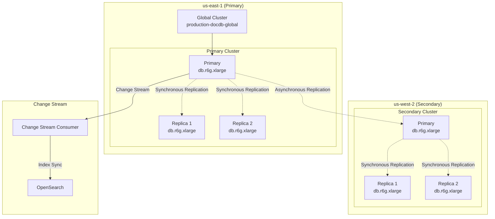
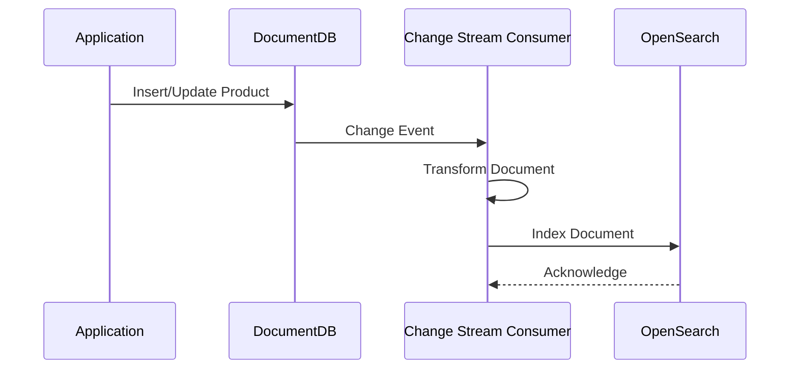

# DocumentDB Global Cluster

The multi-region shopping mall platform uses **Amazon DocumentDB Global Cluster** to operate a MongoDB-compatible document database. It stores unstructured data such as product catalogs, user profiles, wishlists, and reviews.

## Architecture



## Cluster Specifications

| Item | us-east-1 (Primary) | us-west-2 (Secondary) |
|------|---------------------|----------------------|
| Cluster ID | `production-docdb-global-primary` | `production-docdb-global-us-west-2` |
| Engine Version | DocumentDB 5.0 | DocumentDB 5.0 |
| Instance Class | db.r6g.xlarge | db.r6g.xlarge |
| Instance Count | 3 | 3 |
| Encryption | KMS (at-rest) + TLS (in-transit) | KMS + TLS |

:::info Note
The primary cluster in us-east-1 is the `production-docdb-global-primary` cluster restored from a snapshot. It was newly created because the original `production-docdb-global-us-east-1` cluster could not be converted to a global cluster.
:::

## Connection Endpoints

### us-east-1

| Endpoint Type | Value |
|---------------|-------|
| **Primary** | `production-docdb-global-us-east-1.cluster-xxxxxxxxxxxx.us-east-1.docdb.amazonaws.com` |
| **Reader** | `production-docdb-global-us-east-1.cluster-ro-xxxxxxxxxxxx.us-east-1.docdb.amazonaws.com` |
| Port | 27017 |

### us-west-2

| Endpoint Type | Value |
|---------------|-------|
| **Primary** | `production-docdb-global-us-west-2.cluster-yyyyyyyyyyyy.us-west-2.docdb.amazonaws.com` |
| **Reader** | `production-docdb-global-us-west-2.cluster-ro-yyyyyyyyyyyy.us-west-2.docdb.amazonaws.com` |
| Port | 27017 |

## Terraform Configuration

```hcl
resource "aws_docdb_cluster" "this" {
  cluster_identifier        = local.cluster_identifier
  global_cluster_identifier = var.is_primary ? null : var.global_cluster_identifier

  engine         = "docdb"
  engine_version = "5.0.0"

  # Primary cluster credentials
  master_username = var.is_primary ? "docdb_admin" : null
  master_password = var.is_primary ? var.master_password : null

  db_subnet_group_name            = aws_docdb_subnet_group.this.name
  db_cluster_parameter_group_name = var.is_primary ? aws_docdb_cluster_parameter_group.this.name : null
  vpc_security_group_ids          = [var.security_group_id]

  storage_encrypted = true
  kms_key_id        = var.kms_key_arn

  enabled_cloudwatch_logs_exports = var.is_primary ? ["audit", "profiler"] : []

  deletion_protection          = true
  backup_retention_period      = var.is_primary ? 35 : 1
  preferred_backup_window      = "03:00-04:00"
  preferred_maintenance_window = "sun:04:00-sun:05:00"
}

resource "aws_docdb_cluster_instance" "this" {
  count = var.instance_count  # 3

  identifier         = "${local.cluster_identifier}-${count.index + 1}"
  cluster_identifier = aws_docdb_cluster.this.id
  instance_class     = var.instance_class  # db.r6g.xlarge
}
```

### Parameter Group

```hcl
resource "aws_docdb_cluster_parameter_group" "this" {
  family      = "docdb5.0"
  name        = "${var.environment}-docdb-global-${var.region}"
  description = "DocumentDB cluster parameter group"

  parameter {
    name  = "tls"
    value = "enabled"
  }

  parameter {
    name  = "audit_logs"
    value = "enabled"
  }

  parameter {
    name  = "profiler"
    value = "enabled"
  }

  parameter {
    name  = "profiler_threshold_ms"
    value = "100"
  }
}
```

## Collection Design

### products collection

Stores product catalog data.

```javascript
// products collection
{
  _id: ObjectId("..."),
  productId: "PROD-001",
  name: "Samsung Galaxy S24 Ultra",
  nameKo: "삼성 갤럭시 S24 울트라",
  category: {
    main: "electronics",
    sub: "smartphones",
    path: ["electronics", "mobile", "smartphones"]
  },
  brand: "Samsung",
  price: {
    amount: 1650000,
    currency: "KRW",
    discountPercent: 10
  },
  inventory: {
    totalStock: 500,
    availableStock: 423
  },
  attributes: {
    color: ["Black", "White", "Purple"],
    storage: ["256GB", "512GB", "1TB"],
    display: "6.8-inch Dynamic AMOLED"
  },
  images: [
    { url: "https://...", type: "main" },
    { url: "https://...", type: "gallery" }
  ],
  rating: {
    average: 4.7,
    count: 2341
  },
  createdAt: ISODate("2024-01-15T00:00:00Z"),
  updatedAt: ISODate("2024-03-01T00:00:00Z"),
  status: "active"
}

// Indexes
db.products.createIndex({ productId: 1 }, { unique: true })
db.products.createIndex({ "category.path": 1 })
db.products.createIndex({ brand: 1 })
db.products.createIndex({ "price.amount": 1 })
db.products.createIndex({ status: 1, updatedAt: -1 })
db.products.createIndex({ name: "text", nameKo: "text" })
```

### user_profiles collection

Stores user profiles and settings.

```javascript
// user_profiles collection
{
  _id: ObjectId("..."),
  userId: "USER-001",
  preferences: {
    language: "ko",
    currency: "KRW",
    notifications: {
      email: true,
      push: true,
      sms: false
    }
  },
  addresses: [
    {
      id: "ADDR-001",
      type: "shipping",
      isDefault: true,
      name: "Hong Gildong",
      phone: "010-1234-5678",
      zipCode: "06234",
      address1: "123 Teheran-ro, Gangnam-gu, Seoul",
      address2: "Apt 101-1001"
    }
  ],
  paymentMethods: [
    {
      id: "PM-001",
      type: "card",
      isDefault: true,
      last4: "1234",
      brand: "visa"
    }
  ],
  recentlyViewed: [
    { productId: "PROD-001", viewedAt: ISODate("...") }
  ],
  createdAt: ISODate("..."),
  updatedAt: ISODate("...")
}

// Indexes
db.user_profiles.createIndex({ userId: 1 }, { unique: true })
db.user_profiles.createIndex({ "addresses.zipCode": 1 })
```

### wishlists collection

```javascript
// wishlists collection
{
  _id: ObjectId("..."),
  userId: "USER-001",
  items: [
    {
      productId: "PROD-001",
      addedAt: ISODate("..."),
      priceAtAdd: 1650000,
      notifyOnSale: true
    }
  ],
  createdAt: ISODate("..."),
  updatedAt: ISODate("...")
}

// Indexes
db.wishlists.createIndex({ userId: 1 }, { unique: true })
db.wishlists.createIndex({ "items.productId": 1 })
```

### reviews collection

```javascript
// reviews collection
{
  _id: ObjectId("..."),
  reviewId: "REV-001",
  productId: "PROD-001",
  userId: "USER-001",
  orderId: "ORD-001",
  rating: 5,
  title: "Best Smartphone",
  content: "The screen is really sharp and the camera performance is excellent...",
  images: ["https://..."],
  helpful: {
    count: 42,
    users: ["USER-002", "USER-003"]
  },
  verified: true,
  createdAt: ISODate("..."),
  updatedAt: ISODate("...")
}

// Indexes
db.reviews.createIndex({ productId: 1, createdAt: -1 })
db.reviews.createIndex({ userId: 1 })
db.reviews.createIndex({ rating: 1 })
```

### notifications collection

```javascript
// notifications collection
{
  _id: ObjectId("..."),
  userId: "USER-001",
  type: "order_shipped",
  title: "Your order has been shipped",
  body: "Order ORD-001 has been shipped...",
  data: {
    orderId: "ORD-001",
    trackingNumber: "1234567890"
  },
  read: false,
  createdAt: ISODate("..."),
  expiresAt: ISODate("...")  // TTL index
}

// Indexes
db.notifications.createIndex({ userId: 1, read: 1, createdAt: -1 })
db.notifications.createIndex({ expiresAt: 1 }, { expireAfterSeconds: 0 })
```

## Change Stream

DocumentDB Change Stream is used to synchronize data changes to OpenSearch.



### Change Stream Consumer Example (Go)

```go
// changestream_consumer.go
func watchProducts(ctx context.Context, collection *mongo.Collection) {
    pipeline := mongo.Pipeline{
        bson.D{{Key: "$match", Value: bson.D{
            {Key: "operationType", Value: bson.D{
                {Key: "$in", Value: []string{"insert", "update", "replace"}},
            }},
        }}},
    }

    opts := options.ChangeStream().
        SetFullDocument(options.UpdateLookup).
        SetStartAtOperationTime(&primitive.Timestamp{T: uint32(time.Now().Unix())})

    stream, err := collection.Watch(ctx, pipeline, opts)
    if err != nil {
        log.Fatal(err)
    }
    defer stream.Close(ctx)

    for stream.Next(ctx) {
        var event bson.M
        if err := stream.Decode(&event); err != nil {
            continue
        }

        // Index to OpenSearch
        indexToOpenSearch(event["fullDocument"])
    }
}
```

## Monitoring

### CloudWatch Metrics

| Metric | Description | Alarm Threshold |
|--------|-------------|-----------------|
| CPUUtilization | CPU utilization | > 80% |
| FreeableMemory | Available memory | < 1GB |
| DatabaseConnections | Active connections | > 500 |
| ReadLatency | Read latency | > 20ms |
| WriteLatency | Write latency | > 50ms |

### Profiler

Queries taking over 100ms are automatically logged:

```javascript
// Check slow queries
db.system.profile.find({
  millis: { $gt: 100 }
}).sort({ ts: -1 }).limit(10)
```

## Next Steps

- [ElastiCache Global Datastore](/infrastructure/databases/elasticache-global) - Valkey cache
- [OpenSearch](/infrastructure/databases/opensearch) - Search engine
