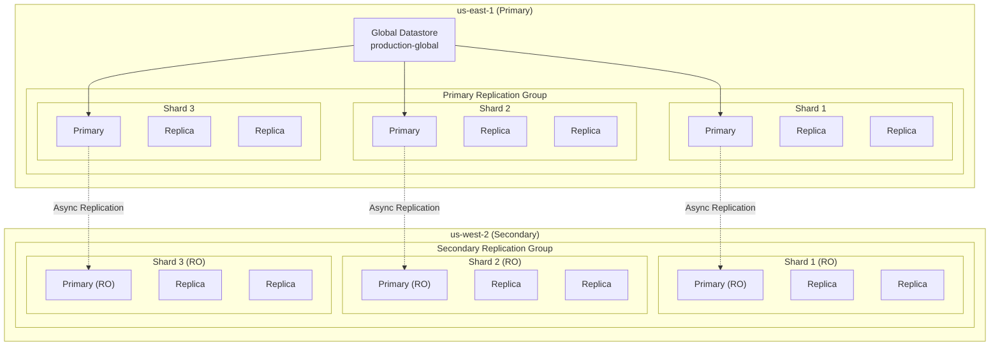
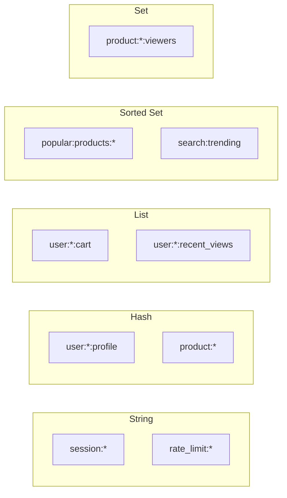

# ElastiCache Global Datastore

The multi-region shopping mall platform uses **ElastiCache for Valkey 7.2** to implement a high-performance caching layer. Data is automatically replicated between us-east-1 and us-west-2 through **Global Datastore**.

## Architecture



## Cluster Specifications

| Item | us-east-1 (Primary) | us-west-2 (Secondary) |
|------|---------------------|----------------------|
| Replication Group ID | `production-elasticache-us-east-1` | `production-elasticache-us-west-2` |
| Engine | Valkey 7.2 | Valkey 7.2 |
| Node Type | cache.r7g.xlarge | cache.r7g.xlarge |
| Shard Count | 3 | 3 |
| Replicas per Shard | 2 | 2 |
| Total Nodes | 9 (3 x 3) | 9 (3 x 3) |
| Read/Write | Read/Write | **Read Only** |
| Encryption | At-rest + In-transit | At-rest + In-transit |

## Connection Endpoints

### us-east-1

| Endpoint Type | Value |
|---------------|-------|
| **Configuration** | `clustercfg.production-elasticache-us-east-1.xxxxxx.use1.cache.amazonaws.com:6379` |

### us-west-2

| Endpoint Type | Value |
|---------------|-------|
| **Configuration** | `clustercfg.production-elasticache-us-west-2.yyyyyy.usw2.cache.amazonaws.com:6379` |

:::warning Important
us-west-2 is **read-only**. Write operations are only possible on the primary cluster in us-east-1.
:::

## Terraform Configuration

```hcl
resource "aws_elasticache_subnet_group" "this" {
  name        = "${var.environment}-elasticache-global-${var.region}"
  description = "Subnet group for ElastiCache Global cluster in ${var.region}"
  subnet_ids  = var.data_subnet_ids
}

resource "aws_elasticache_parameter_group" "this" {
  name   = "${var.environment}-elasticache-global-${var.region}"
  family = "valkey7"

  parameter {
    name  = "maxmemory-policy"
    value = "volatile-lru"
  }
}

# Primary region creates the global replication group
resource "aws_elasticache_global_replication_group" "this" {
  count = var.is_primary ? 1 : 0

  global_replication_group_id_suffix = "${var.environment}-global"
  primary_replication_group_id       = aws_elasticache_replication_group.this.id

  global_replication_group_description = "Global replication group for ${var.environment}"
}

resource "aws_elasticache_replication_group" "this" {
  replication_group_id = "${var.environment}-elasticache-${var.region}"
  description          = "ElastiCache Global replication group in ${var.region}"

  # For secondary regions, join the global replication group
  global_replication_group_id = var.is_primary ? null : var.global_replication_group_id

  # Primary-only settings
  engine         = var.is_primary ? "valkey" : null
  engine_version = var.is_primary ? "7.2" : null
  node_type      = var.is_primary ? var.node_type : null  # cache.r7g.xlarge

  num_node_groups         = var.is_primary ? var.num_node_groups : null  # 3
  replicas_per_node_group = var.is_primary ? var.replicas_per_node_group : null  # 2

  automatic_failover_enabled = var.is_primary ? true : null
  multi_az_enabled           = var.is_primary ? true : null

  subnet_group_name  = aws_elasticache_subnet_group.this.name
  security_group_ids = [var.security_group_id]

  parameter_group_name = var.is_primary ? aws_elasticache_parameter_group.this.name : null

  at_rest_encryption_enabled = var.is_primary ? true : null
  kms_key_id                 = var.kms_key_arn
  transit_encryption_enabled = var.is_primary ? true : null

  snapshot_retention_limit = var.is_primary ? 7 : null
  snapshot_window          = var.is_primary ? "03:00-04:00" : null
  maintenance_window       = var.is_primary ? "sun:04:00-sun:05:00" : null
}
```

## Cache Key Patterns

### Key Naming Convention

```
{service}:{entity}:{identifier}:{field?}
```

### Cache Key List

| Key Pattern | Description | TTL | Example |
|-------------|-------------|-----|---------|
| `session:{sessionId}` | User session | 24h | `session:abc123` |
| `user:{userId}:profile` | User profile cache | 1h | `user:USER-001:profile` |
| `user:{userId}:cart` | Shopping cart | 7d | `user:USER-001:cart` |
| `product:{productId}` | Product details | 30m | `product:PROD-001` |
| `product:{productId}:inventory` | Inventory info | 1m | `product:PROD-001:inventory` |
| `category:{categoryId}:products` | Products by category | 5m | `category:electronics:products` |
| `search:{queryHash}` | Search result cache | 10m | `search:a1b2c3d4` |
| `rate_limit:{ip}:{endpoint}` | Rate Limiting | 1m | `rate_limit:1.2.3.4:/api/orders` |
| `flash_sale:{saleId}:stock` | Flash sale stock | - | `flash_sale:SALE-001:stock` |
| `popular:products:{region}` | Popular products | 15m | `popular:products:us-east-1` |

### Data Type Usage



### Cache Pattern Examples

#### Session Management (String)

```go
// Save session
func SetSession(ctx context.Context, sessionID string, data []byte) error {
    return rdb.Set(ctx,
        fmt.Sprintf("session:%s", sessionID),
        data,
        24*time.Hour,
    ).Err()
}

// Get session
func GetSession(ctx context.Context, sessionID string) ([]byte, error) {
    return rdb.Get(ctx, fmt.Sprintf("session:%s", sessionID)).Bytes()
}
```

#### Product Cache (Hash)

```go
// Cache product info
func CacheProduct(ctx context.Context, product *Product) error {
    key := fmt.Sprintf("product:%s", product.ID)

    return rdb.HSet(ctx, key, map[string]interface{}{
        "name":     product.Name,
        "price":    product.Price,
        "stock":    product.Stock,
        "category": product.Category,
    }).Err()
}

// Set TTL
func SetProductTTL(ctx context.Context, productID string) error {
    return rdb.Expire(ctx,
        fmt.Sprintf("product:%s", productID),
        30*time.Minute,
    ).Err()
}
```

#### Shopping Cart (List)

```go
// Add to cart
func AddToCart(ctx context.Context, userID, productID string, quantity int) error {
    key := fmt.Sprintf("user:%s:cart", userID)
    item := fmt.Sprintf("%s:%d", productID, quantity)

    return rdb.RPush(ctx, key, item).Err()
}

// Get cart
func GetCart(ctx context.Context, userID string) ([]string, error) {
    return rdb.LRange(ctx,
        fmt.Sprintf("user:%s:cart", userID),
        0, -1,
    ).Result()
}
```

#### Popular Products (Sorted Set)

```go
// Update popular products
func IncrementProductView(ctx context.Context, region, productID string) error {
    key := fmt.Sprintf("popular:products:%s", region)

    return rdb.ZIncrBy(ctx, key, 1, productID).Err()
}

// Get top 10 popular products
func GetPopularProducts(ctx context.Context, region string) ([]string, error) {
    key := fmt.Sprintf("popular:products:%s", region)

    return rdb.ZRevRange(ctx, key, 0, 9).Result()
}
```

## Cluster Mode vs Non-Cluster Mode

| Item | Cluster Mode (Current) | Non-Cluster Mode |
|------|------------------------|------------------|
| Sharding | Automatic (hash slots) | Not available |
| Scalability | Horizontal scaling possible | Vertical scaling only |
| Key Distribution | Automatic | N/A |
| Multi-key Operations | Same slot only | Unlimited |
| Global Datastore | Supported | Supported |

:::tip Cluster Mode Notes
Multi-key operations (MGET, MSET, etc.) can only be used on keys in the same hash slot. Use hash tags `{tag}` to place related keys in the same slot:

```
user:{USER-001}:profile
user:{USER-001}:cart
user:{USER-001}:session
```
:::

## Disaster Recovery

### Node Failure

- Automatic failover within shard (~30 seconds)
- Multi-AZ deployment for availability zone failure handling

### Regional Failover

```bash
# Promote secondary to primary
aws elasticache failover-global-replication-group \
  --global-replication-group-id production-global \
  --primary-region us-west-2 \
  --primary-replication-group-id production-elasticache-us-west-2
```

## Monitoring

### Key Metrics

| Metric | Description | Alarm Threshold |
|--------|-------------|-----------------|
| CPUUtilization | CPU usage | > 75% |
| DatabaseMemoryUsagePercentage | Memory usage | > 80% |
| CacheHitRate | Cache hit rate | < 90% |
| ReplicationLag | Replication lag | > 1 second |
| CurrConnections | Current connections | > 5000 |
| Evictions | Cache evictions | > 100/min |

## Next Steps

- [OpenSearch](/infrastructure/databases/opensearch) - Search engine
- [MSK Kafka](/infrastructure/databases/msk) - Event streaming
