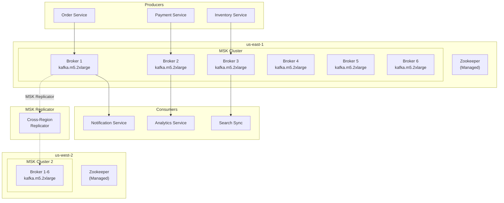
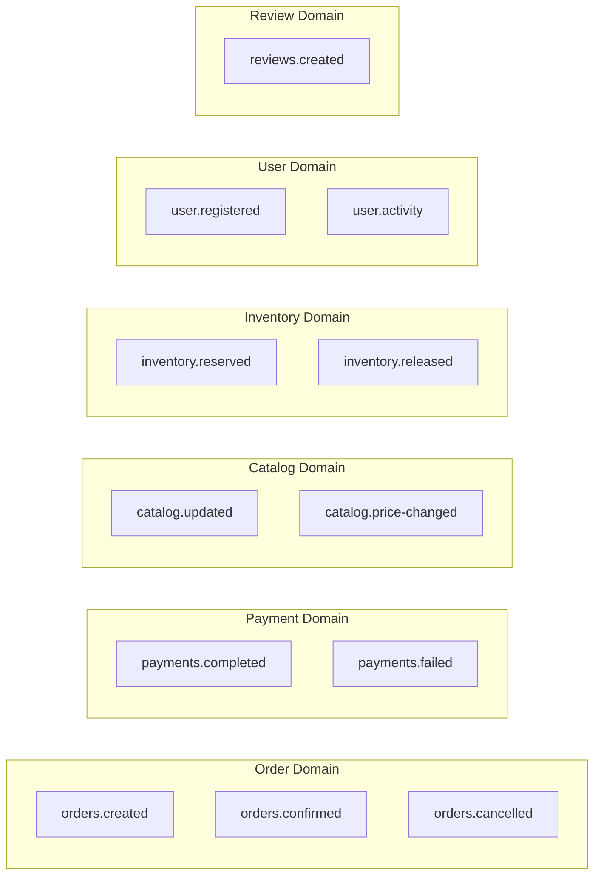

# MSK Kafka

The multi-region shopping mall platform uses **Amazon MSK (Managed Streaming for Apache Kafka)** to implement event-driven communication between microservices. Topics are replicated between the two regions through **MSK Replicator**.

## Architecture



## Cluster Specifications

| Item | us-east-1 | us-west-2 |
|------|-----------|-----------|
| Cluster Name | `production-msk-us-east-1` | `production-msk-us-west-2` |
| Kafka Version | 3.5.1 | 3.5.1 |
| Broker Type | kafka.m5.2xlarge | kafka.m5.2xlarge |
| Broker Count | 6 (2 per AZ) | 6 (2 per AZ) |
| Storage | 1TB EBS / broker | 1TB EBS / broker |
| Authentication | SASL/SCRAM | SASL/SCRAM |
| Encryption | TLS + At-rest | TLS + At-rest |

## Connection Information

### us-east-1

| Item | Value |
|------|-------|
| **Bootstrap Servers (SASL)** | `b-1.productionmskuseast1.xxxxxx.xxx.kafka.us-east-1.amazonaws.com:9096,b-2.productionmskuseast1.xxxxxx.xxx.kafka.us-east-1.amazonaws.com:9096,b-3.productionmskuseast1.xxxxxx.xxx.kafka.us-east-1.amazonaws.com:9096` |
| Port | 9096 (SASL/SCRAM) |

### us-west-2

| Item | Value |
|------|-------|
| **Bootstrap Servers (SASL)** | `b-1.productionmskuswest2.yyyyyy.yyy.kafka.us-west-2.amazonaws.com:9096` |
| Port | 9096 (SASL/SCRAM) |

## Terraform Configuration

```hcl
locals {
  topics = {
    "orders.created"        = { partitions = 12 }
    "orders.confirmed"      = { partitions = 12 }
    "orders.cancelled"      = { partitions = 6 }
    "payments.completed"    = { partitions = 12 }
    "payments.failed"       = { partitions = 6 }
    "catalog.updated"       = { partitions = 12 }
    "catalog.price-changed" = { partitions = 6 }
    "inventory.reserved"    = { partitions = 24 }
    "inventory.released"    = { partitions = 12 }
    "user.registered"       = { partitions = 6 }
    "user.activity"         = { partitions = 24 }
    "reviews.created"       = { partitions = 6 }
  }
}

resource "aws_msk_configuration" "this" {
  name           = "${var.environment}-msk-config-${var.region}"
  kafka_versions = [var.kafka_version]

  server_properties = <<PROPERTIES
auto.create.topics.enable=false
default.replication.factor=3
min.insync.replicas=2
num.partitions=6
log.retention.hours=168
PROPERTIES
}

resource "aws_msk_cluster" "this" {
  cluster_name           = "${var.environment}-msk-${var.region}"
  kafka_version          = var.kafka_version  # "3.5.1"
  number_of_broker_nodes = var.number_of_broker_nodes  # 6

  broker_node_group_info {
    instance_type   = var.broker_instance_type  # kafka.m5.2xlarge
    client_subnets  = var.data_subnet_ids
    security_groups = [var.security_group_id]

    storage_info {
      ebs_storage_info {
        volume_size = var.ebs_volume_size  # 1000
      }
    }
  }

  encryption_info {
    encryption_at_rest_kms_key_arn = var.kms_key_arn

    encryption_in_transit {
      client_broker = "TLS"
      in_cluster    = true
    }
  }

  client_authentication {
    sasl {
      scram = true
    }
  }

  open_monitoring {
    prometheus {
      jmx_exporter {
        enabled_in_broker = true
      }
      node_exporter {
        enabled_in_broker = true
      }
    }
  }

  logging_info {
    broker_logs {
      cloudwatch_logs {
        enabled   = true
        log_group = aws_cloudwatch_log_group.msk.name
      }
    }
  }

  configuration_info {
    arn      = aws_msk_configuration.this.arn
    revision = aws_msk_configuration.this.latest_revision
  }
}
```

## Topic Design

### Domain-specific Topics



### Topic Details

| Topic | Partitions | Replication Factor | Retention | Description |
|-------|------------|-------------------|-----------|-------------|
| `orders.created` | 12 | 3 | 7 days | Order creation events |
| `orders.confirmed` | 12 | 3 | 7 days | Order confirmation events |
| `orders.cancelled` | 6 | 3 | 7 days | Order cancellation events |
| `payments.completed` | 12 | 3 | 7 days | Payment completion events |
| `payments.failed` | 6 | 3 | 30 days (DLQ) | Payment failure events |
| `catalog.updated` | 12 | 3 | 7 days | Product information changes |
| `catalog.price-changed` | 6 | 3 | 7 days | Price change events |
| `inventory.reserved` | 24 | 3 | 7 days | Inventory reservation events |
| `inventory.released` | 12 | 3 | 7 days | Inventory release events |
| `user.registered` | 6 | 3 | 7 days | User registration events |
| `user.activity` | 24 | 3 | 7 days | User activity logs |
| `reviews.created` | 6 | 3 | 7 days | Review creation events |

### Dead Letter Queue (DLQ)

Failed messages are moved to DLQ topics:

| DLQ Topic | Retention | Purpose |
|-----------|-----------|---------|
| `dlq.orders` | 30 days | Order processing failures |
| `dlq.payments` | 30 days | Payment processing failures |
| `dlq.inventory` | 30 days | Inventory processing failures |

## MSK Replicator

Replicates topics between the two regions.

```hcl
resource "aws_msk_replicator" "this" {
  count = var.enable_replicator ? 1 : 0

  replicator_name = "${var.environment}-msk-replicator-${var.region}"

  kafka_cluster {
    amazon_msk_cluster {
      msk_cluster_arn = var.source_cluster_arn
    }

    vpc_config {
      subnet_ids          = var.data_subnet_ids
      security_groups_ids = [var.security_group_id]
    }
  }

  kafka_cluster {
    amazon_msk_cluster {
      msk_cluster_arn = var.target_cluster_arn
    }

    vpc_config {
      subnet_ids          = var.data_subnet_ids
      security_groups_ids = [var.security_group_id]
    }
  }

  replication_info_list {
    source_kafka_cluster_arn = var.source_cluster_arn
    target_kafka_cluster_arn = var.target_cluster_arn
    target_compression_type  = "GZIP"

    topic_replication {
      topics_to_replicate = var.replicator_topics

      copy_access_control_lists_for_topics = true
      copy_topic_configurations            = true
      detect_and_copy_new_topics           = true
    }

    consumer_group_replication {
      consumer_groups_to_replicate        = [".*"]
      synchronise_consumer_group_offsets  = true
      detect_and_copy_new_consumer_groups = true
    }
  }

  service_execution_role_arn = aws_iam_role.msk_replicator[0].arn
}
```

### Replicator Settings

| Item | Value |
|------|-------|
| Replication Direction | us-east-1 -> us-west-2 |
| Replicated Topics | All major topics |
| Consumer Group Sync | Enabled |
| Compression | GZIP |
| Latency | < 1 second (typical) |

## Event Schema

### OrderCreated Event

```json
{
  "eventId": "evt-12345",
  "eventType": "OrderCreated",
  "timestamp": "2024-03-15T10:30:00Z",
  "source": "order-service",
  "region": "us-east-1",
  "data": {
    "orderId": "ORD-001",
    "userId": "USER-001",
    "items": [
      {
        "productId": "PROD-001",
        "quantity": 2,
        "price": 1650000
      }
    ],
    "totalAmount": 3300000,
    "currency": "KRW",
    "shippingAddress": {
      "zipCode": "06234",
      "address": "123 Teheran-ro, Gangnam-gu, Seoul..."
    }
  },
  "metadata": {
    "correlationId": "corr-12345",
    "traceId": "trace-12345"
  }
}
```

### PaymentCompleted Event

```json
{
  "eventId": "evt-12346",
  "eventType": "PaymentCompleted",
  "timestamp": "2024-03-15T10:31:00Z",
  "source": "payment-service",
  "region": "us-east-1",
  "data": {
    "paymentId": "PAY-001",
    "orderId": "ORD-001",
    "amount": 3300000,
    "currency": "KRW",
    "method": "card",
    "provider": "toss",
    "transactionId": "txn-12345"
  },
  "metadata": {
    "correlationId": "corr-12345",
    "traceId": "trace-12345"
  }
}
```

## Producer/Consumer Configuration

### Producer Configuration (Go)

```go
config := sarama.NewConfig()
config.Producer.RequiredAcks = sarama.WaitForAll  // acks=all
config.Producer.Retry.Max = 5
config.Producer.Return.Successes = true
config.Net.SASL.Enable = true
config.Net.SASL.Mechanism = sarama.SASLTypeSCRAMSHA512
config.Net.SASL.User = username
config.Net.SASL.Password = password
config.Net.TLS.Enable = true
```

### Consumer Configuration (Go)

```go
config := sarama.NewConfig()
config.Consumer.Group.Rebalance.Strategy = sarama.BalanceStrategyRoundRobin
config.Consumer.Offsets.Initial = sarama.OffsetOldest
config.Consumer.Offsets.AutoCommit.Enable = true
config.Consumer.Offsets.AutoCommit.Interval = 1 * time.Second
config.Net.SASL.Enable = true
config.Net.SASL.Mechanism = sarama.SASLTypeSCRAMSHA512
config.Net.TLS.Enable = true
```

## Monitoring

### Key Metrics

| Metric | Description | Alarm Threshold |
|--------|-------------|-----------------|
| MessagesInPerSec | Messages received per second | Monitor |
| BytesInPerSec | Bytes received per second | > 100MB/s |
| UnderReplicatedPartitions | Under-replicated partitions | > 0 |
| OfflinePartitionsCount | Offline partitions | > 0 |
| ActiveControllerCount | Active controllers | != 1 |
| ConsumerLag | Consumer lag | > 10000 |
| KafkaDataLogsDiskUsed | Disk usage | > 80% |

### Prometheus Metrics (JMX Exporter)

```yaml
# prometheus-msk-config.yml
- job_name: 'msk'
  static_configs:
    - targets:
      - 'b-1.productionmskuseast1...:11001'
      - 'b-2.productionmskuseast1...:11001'
      - 'b-3.productionmskuseast1...:11001'
```

## Next Steps

- [CloudFront & Edge](/infrastructure/edge-cloudfront) - CDN configuration
- [WAF & Route53](/infrastructure/edge-waf) - Security and DNS
