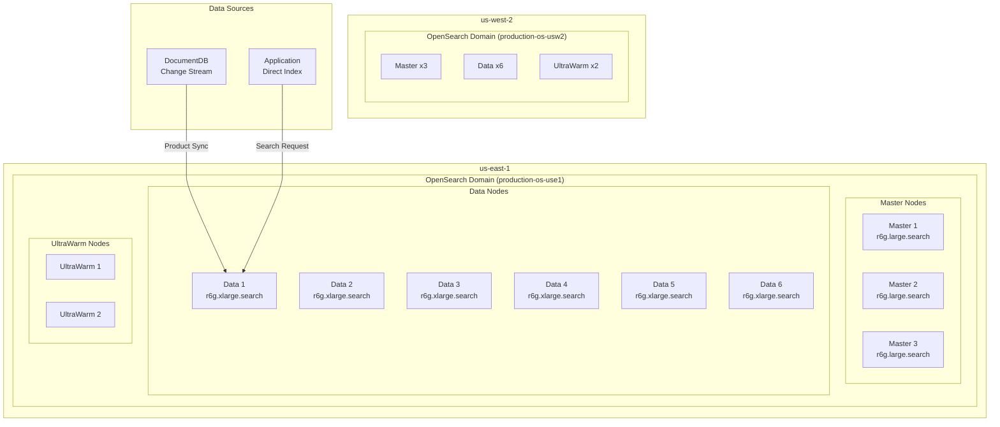
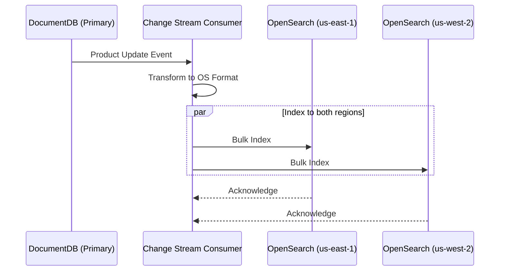

# OpenSearch

The multi-region shopping mall platform uses **Amazon OpenSearch Service 2.11** to provide product search, autocomplete, and log analysis features. It uses the **nori analyzer** for Korean language search and enables **UltraWarm** tier for cost optimization.

:::info Note
Unlike Aurora, DocumentDB, and ElastiCache, OpenSearch **does not support global clusters**. Independent domains are deployed in each region, and data synchronization is handled at the application level.
:::

## Architecture



## Domain Specifications

| Item | us-east-1 | us-west-2 |
|------|-----------|-----------|
| Domain Name | `production-os-use1` | `production-os-usw2` |
| Engine Version | OpenSearch 2.11 | OpenSearch 2.11 |
| Master Nodes | r6g.large.search x 3 | r6g.large.search x 3 |
| Data Nodes | r6g.xlarge.search x 6 | r6g.xlarge.search x 6 |
| Storage | 500GB gp3 / node | 500GB gp3 / node |
| UltraWarm | ultrawarm1.medium.search x 2 | ultrawarm1.medium.search x 2 |
| Availability Zones | 3 | 3 |

:::note Domain Name Limitation
OpenSearch domain names must be 28 characters or less. Therefore, region names are abbreviated:
- `us-east-1` -> `use1`
- `us-west-2` -> `usw2`
:::

## Connection Endpoints

| Region | Endpoint |
|--------|----------|
| **us-east-1** | `https://vpc-production-os-use1-kpvt3o2c36ru7kyikdx6qoluk4.us-east-1.es.amazonaws.com` |
| **us-west-2** | `https://vpc-production-os-usw2-pgtswpgymfnk6lsxmn7oxn3gzi.us-west-2.es.amazonaws.com` |

## Terraform Configuration

```hcl
locals {
  # OpenSearch domain name must be <= 28 chars
  short_region = replace(replace(var.region, "us-east-", "use"), "us-west-", "usw")
  domain_name  = "${var.environment}-os-${local.short_region}"
}

resource "aws_opensearch_domain" "this" {
  domain_name    = local.domain_name
  engine_version = "OpenSearch_2.11"

  cluster_config {
    dedicated_master_enabled = true
    dedicated_master_type    = var.master_instance_type   # r6g.large.search
    dedicated_master_count   = var.master_instance_count  # 3

    instance_type  = var.data_instance_type   # r6g.xlarge.search
    instance_count = var.data_instance_count  # 6

    zone_awareness_enabled = true

    zone_awareness_config {
      availability_zone_count = 3
    }

    warm_enabled = var.enable_ultrawarm  # true
    warm_type    = var.enable_ultrawarm ? var.warm_instance_type : null
    warm_count   = var.enable_ultrawarm ? var.warm_count : null
  }

  ebs_options {
    ebs_enabled = true
    volume_type = "gp3"
    volume_size = var.ebs_volume_size  # 500
    iops        = 3000
    throughput  = 250
  }

  vpc_options {
    subnet_ids         = var.data_subnet_ids
    security_group_ids = [var.security_group_id]
  }

  encrypt_at_rest {
    enabled = true
  }

  node_to_node_encryption {
    enabled = true
  }

  domain_endpoint_options {
    enforce_https       = true
    tls_security_policy = "Policy-Min-TLS-1-2-PFS-2023-10"
  }

  advanced_security_options {
    enabled                        = true
    internal_user_database_enabled = true

    master_user_options {
      master_user_name     = "admin"
      master_user_password = var.master_user_password
    }
  }

  log_publishing_options {
    cloudwatch_log_group_arn = aws_cloudwatch_log_group.index_slow_logs.arn
    log_type                 = "INDEX_SLOW_LOGS"
  }

  log_publishing_options {
    cloudwatch_log_group_arn = aws_cloudwatch_log_group.search_slow_logs.arn
    log_type                 = "SEARCH_SLOW_LOGS"
  }

  log_publishing_options {
    cloudwatch_log_group_arn = aws_cloudwatch_log_group.es_application_logs.arn
    log_type                 = "ES_APPLICATION_LOGS"
  }
}
```

## Korean Analyzer (Nori)

### Analyzer Settings

```json
{
  "settings": {
    "analysis": {
      "analyzer": {
        "korean_analyzer": {
          "type": "custom",
          "tokenizer": "nori_tokenizer",
          "filter": [
            "nori_readingform",
            "lowercase",
            "nori_part_of_speech"
          ]
        },
        "korean_search_analyzer": {
          "type": "custom",
          "tokenizer": "nori_tokenizer",
          "filter": [
            "nori_readingform",
            "lowercase",
            "nori_part_of_speech",
            "edge_ngram_filter"
          ]
        }
      },
      "tokenizer": {
        "nori_tokenizer": {
          "type": "nori_tokenizer",
          "decompound_mode": "mixed",
          "discard_punctuation": "true"
        }
      },
      "filter": {
        "nori_part_of_speech": {
          "type": "nori_part_of_speech",
          "stoptags": [
            "E", "IC", "J", "MAG", "MAJ",
            "MM", "SP", "SSC", "SSO", "SC",
            "SE", "XPN", "XSA", "XSN", "XSV",
            "UNA", "NA", "VSV"
          ]
        },
        "edge_ngram_filter": {
          "type": "edge_ngram",
          "min_gram": 1,
          "max_gram": 20
        }
      }
    }
  }
}
```

### Index Mapping (products)

```json
{
  "mappings": {
    "properties": {
      "productId": {
        "type": "keyword"
      },
      "name": {
        "type": "text",
        "analyzer": "korean_analyzer",
        "search_analyzer": "korean_search_analyzer",
        "fields": {
          "keyword": {
            "type": "keyword"
          },
          "suggest": {
            "type": "completion",
            "analyzer": "korean_analyzer"
          }
        }
      },
      "description": {
        "type": "text",
        "analyzer": "korean_analyzer"
      },
      "category": {
        "type": "keyword"
      },
      "categoryPath": {
        "type": "keyword"
      },
      "brand": {
        "type": "keyword"
      },
      "price": {
        "type": "scaled_float",
        "scaling_factor": 100
      },
      "discountPercent": {
        "type": "integer"
      },
      "rating": {
        "type": "float"
      },
      "reviewCount": {
        "type": "integer"
      },
      "attributes": {
        "type": "nested",
        "properties": {
          "name": { "type": "keyword" },
          "value": { "type": "keyword" }
        }
      },
      "tags": {
        "type": "keyword"
      },
      "createdAt": {
        "type": "date"
      },
      "updatedAt": {
        "type": "date"
      },
      "popularity": {
        "type": "rank_feature"
      }
    }
  }
}
```

## Search Query Examples

### Basic Product Search

```json
{
  "query": {
    "bool": {
      "must": [
        {
          "multi_match": {
            "query": "삼성 갤럭시",
            "fields": ["name^3", "description", "brand^2"],
            "type": "best_fields",
            "fuzziness": "AUTO"
          }
        }
      ],
      "filter": [
        { "term": { "category": "smartphones" } },
        { "range": { "price": { "gte": 500000, "lte": 2000000 } } }
      ]
    }
  },
  "sort": [
    { "_score": "desc" },
    { "popularity": "desc" }
  ],
  "highlight": {
    "fields": {
      "name": {},
      "description": {}
    }
  }
}
```

### Autocomplete (Suggest)

```json
{
  "suggest": {
    "product-suggest": {
      "prefix": "갤럭시",
      "completion": {
        "field": "name.suggest",
        "size": 10,
        "skip_duplicates": true,
        "fuzzy": {
          "fuzziness": 1
        }
      }
    }
  }
}
```

### Aggregations

```json
{
  "query": {
    "match": { "name": "스마트폰" }
  },
  "aggs": {
    "brands": {
      "terms": { "field": "brand", "size": 20 }
    },
    "price_ranges": {
      "range": {
        "field": "price",
        "ranges": [
          { "to": 500000, "key": "Under 500K KRW" },
          { "from": 500000, "to": 1000000, "key": "500K-1M KRW" },
          { "from": 1000000, "to": 1500000, "key": "1M-1.5M KRW" },
          { "from": 1500000, "key": "Over 1.5M KRW" }
        ]
      }
    },
    "avg_rating": {
      "avg": { "field": "rating" }
    }
  }
}
```

## UltraWarm Tier

### Index State Management (ISM) Policy

```json
{
  "policy": {
    "description": "Product index lifecycle policy",
    "default_state": "hot",
    "states": [
      {
        "name": "hot",
        "actions": [
          {
            "rollover": {
              "min_size": "50gb",
              "min_index_age": "7d"
            }
          }
        ],
        "transitions": [
          {
            "state_name": "warm",
            "conditions": {
              "min_index_age": "30d"
            }
          }
        ]
      },
      {
        "name": "warm",
        "actions": [
          {
            "warm_migration": {},
            "replica_count": {
              "number_of_replicas": 1
            }
          }
        ],
        "transitions": [
          {
            "state_name": "delete",
            "conditions": {
              "min_index_age": "365d"
            }
          }
        ]
      },
      {
        "name": "delete",
        "actions": [
          {
            "delete": {}
          }
        ]
      }
    ]
  }
}
```

## Cross-Region Data Synchronization

Since OpenSearch does not support global clusters, data is synchronized to both regions through DocumentDB Change Stream.



## Monitoring

### Key Metrics

| Metric | Description | Alarm Threshold |
|--------|-------------|-----------------|
| ClusterStatus.red | Cluster status | = 1 |
| FreeStorageSpace | Remaining storage | < 20GB |
| JVMMemoryPressure | JVM memory pressure | > 85% |
| CPUUtilization | CPU usage | > 80% |
| SearchLatency | Search latency | > 200ms |
| IndexingLatency | Indexing latency | > 100ms |

## Next Steps

- [MSK Kafka](/infrastructure/databases/msk) - Event streaming
- [CloudFront & Edge](/infrastructure/edge-cloudfront) - CDN configuration
