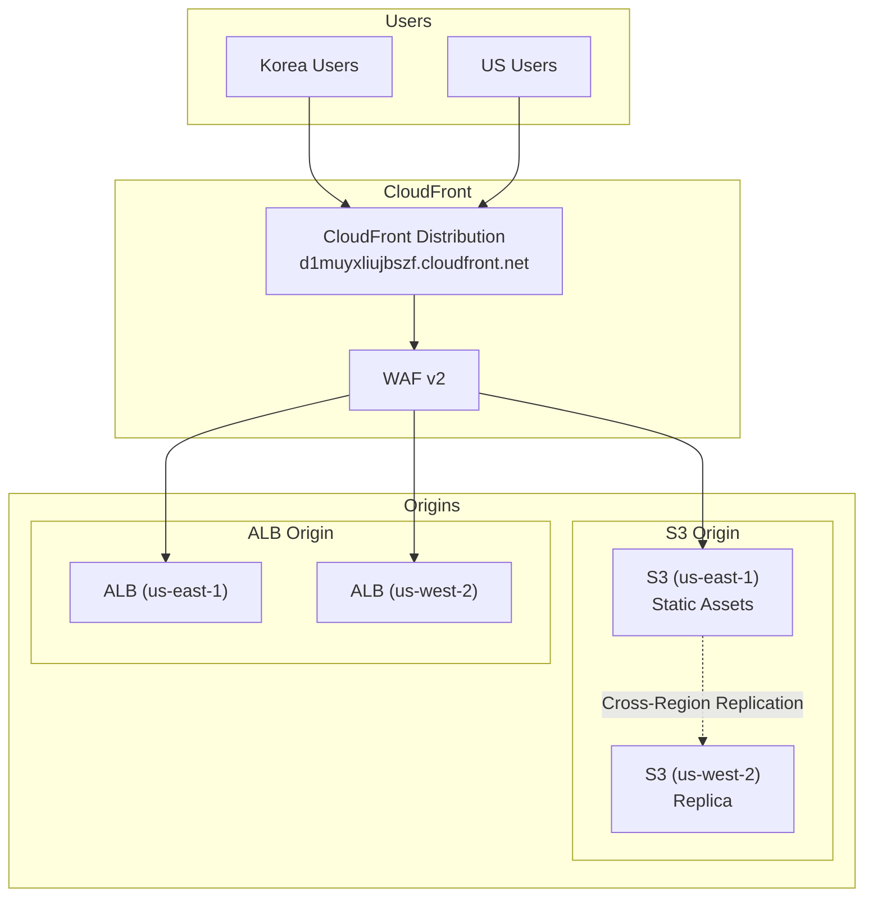
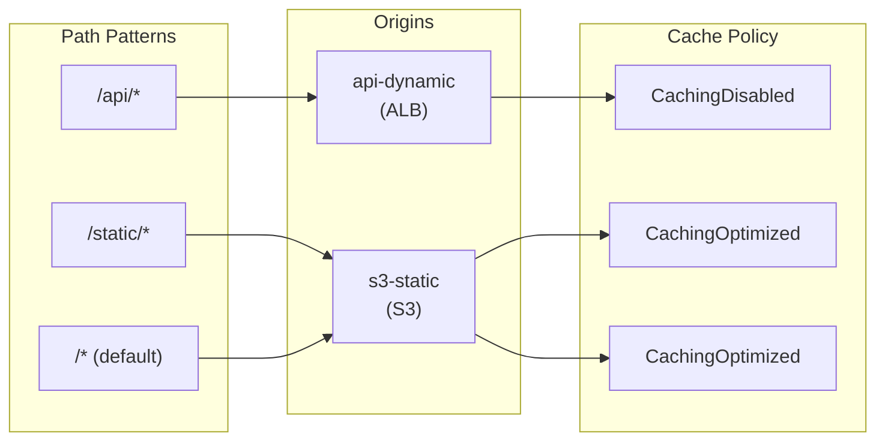
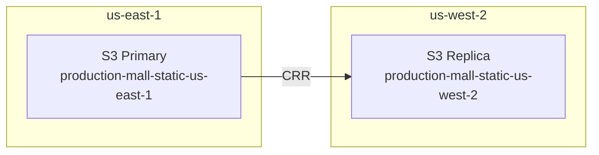

# CloudFront & CDN

The multi-region shopping mall platform uses **Amazon CloudFront** to provide fast response times to users worldwide. Static assets are served from S3, and dynamic API requests are routed to regional ALBs.

## Architecture



## CloudFront Distribution Configuration

| Item | Value |
|------|-------|
| Distribution ID | `d1muyxliujbszf.cloudfront.net` |
| Alternate Domain (CNAME) | `www.atomai.click`, `mall.atomai.click` |
| Price Class | PriceClass_100 (All Edge Locations) |
| HTTP Version | HTTP/2 + HTTP/3 |
| Certificate | ACM (`*.atomai.click`) |
| WAF | Attached |
| IPv6 | Enabled |

## Origin Configuration

### S3 Origin (Static Assets)

```hcl
origin {
  domain_name              = var.static_assets_bucket_domain_name
  origin_access_control_id = aws_cloudfront_origin_access_control.s3.id
  origin_id                = "s3-static"
}

resource "aws_cloudfront_origin_access_control" "s3" {
  name                              = "${var.environment}-s3-oac"
  description                       = "Origin Access Control for S3 static assets"
  origin_access_control_origin_type = "s3"
  signing_behavior                  = "always"
  signing_protocol                  = "sigv4"
}
```

### API Origin (Dynamic Content)

```hcl
origin {
  domain_name = var.api_domain_name
  origin_id   = "api-dynamic"

  custom_origin_config {
    http_port              = 80
    https_port             = 443
    origin_protocol_policy = "https-only"
    origin_ssl_protocols   = ["TLSv1.2"]
  }

  origin_shield {
    enabled              = true
    origin_shield_region = "us-east-1"
  }
}
```

## Cache Behaviors



### Behavior Details

| Path Pattern | Origin | Cache Policy | Allowed Methods | Compression |
|--------------|--------|--------------|-----------------|-------------|
| `/api/*` | api-dynamic | CachingDisabled | ALL | - |
| `/static/*` | s3-static | CachingOptimized | GET, HEAD, OPTIONS | Yes |
| `/*` (default) | s3-static | CachingOptimized | GET, HEAD, OPTIONS | Yes |

### Terraform Configuration

```hcl
resource "aws_cloudfront_distribution" "main" {
  enabled             = true
  is_ipv6_enabled     = true
  comment             = "${var.environment} CloudFront Distribution"
  default_root_object = "index.html"
  price_class         = "PriceClass_100"
  http_version        = "http2and3"
  web_acl_id          = var.waf_web_acl_id
  aliases             = ["www.${var.domain_name}", "mall.${var.domain_name}"]

  # Default cache behavior - S3 static content
  default_cache_behavior {
    target_origin_id       = "s3-static"
    viewer_protocol_policy = "redirect-to-https"
    compress               = true
    cache_policy_id        = data.aws_cloudfront_cache_policy.caching_optimized.id

    allowed_methods = ["GET", "HEAD", "OPTIONS"]
    cached_methods  = ["GET", "HEAD"]
  }

  # API paths - no caching
  ordered_cache_behavior {
    path_pattern             = "/api/*"
    target_origin_id         = "api-dynamic"
    viewer_protocol_policy   = "redirect-to-https"
    cache_policy_id          = data.aws_cloudfront_cache_policy.caching_disabled.id
    origin_request_policy_id = data.aws_cloudfront_origin_request_policy.all_viewer.id

    allowed_methods = ["DELETE", "GET", "HEAD", "OPTIONS", "PATCH", "POST", "PUT"]
    cached_methods  = ["GET", "HEAD"]
  }

  # Static assets - aggressive caching
  ordered_cache_behavior {
    path_pattern           = "/static/*"
    target_origin_id       = "s3-static"
    viewer_protocol_policy = "redirect-to-https"
    compress               = true
    cache_policy_id        = data.aws_cloudfront_cache_policy.caching_optimized.id

    allowed_methods = ["GET", "HEAD", "OPTIONS"]
    cached_methods  = ["GET", "HEAD"]
  }

  # TLS Certificate
  viewer_certificate {
    acm_certificate_arn      = var.acm_certificate_arn
    ssl_support_method       = "sni-only"
    minimum_protocol_version = "TLSv1.2_2021"
  }

  restrictions {
    geo_restriction {
      restriction_type = "none"
    }
  }
}
```

## S3 Cross-Region Replication (CRR)

Cross-region replication is configured between S3 buckets for high availability of static assets.



### CRR Configuration

```hcl
resource "aws_s3_bucket_replication_configuration" "static_assets" {
  bucket = aws_s3_bucket.static_assets.id
  role   = aws_iam_role.replication.arn

  rule {
    id     = "replicate-all"
    status = "Enabled"

    filter {
      prefix = ""
    }

    destination {
      bucket        = "arn:aws:s3:::production-mall-static-us-west-2"
      storage_class = "STANDARD"

      replication_time {
        status = "Enabled"
        time {
          minutes = 15
        }
      }

      metrics {
        status = "Enabled"
        event_threshold {
          minutes = 15
        }
      }
    }

    delete_marker_replication {
      status = "Enabled"
    }
  }
}
```

## Cache Invalidation

### CLI Invalidation

```bash
# Invalidate specific paths
aws cloudfront create-invalidation \
  --distribution-id E1234567890ABC \
  --paths "/static/css/*" "/static/js/*"

# Full invalidation
aws cloudfront create-invalidation \
  --distribution-id E1234567890ABC \
  --paths "/*"
```

### Automatic Invalidation on CI/CD Deployment

```yaml
# GitHub Actions
- name: Invalidate CloudFront
  run: |
    aws cloudfront create-invalidation \
      --distribution-id ${{ secrets.CLOUDFRONT_DISTRIBUTION_ID }} \
      --paths "/*"
```

## Performance Optimization

### Origin Shield

Enable Origin Shield to reduce requests to the origin:

```hcl
origin_shield {
  enabled              = true
  origin_shield_region = "us-east-1"
}
```

### HTTP/3 (QUIC)

Enable HTTP/3 to reduce connection setup time:

```hcl
http_version = "http2and3"
```

### Compression

Enable Brotli and Gzip compression:

```hcl
default_cache_behavior {
  compress = true
  # ...
}
```

## Monitoring

### CloudWatch Metrics

| Metric | Description |
|--------|-------------|
| Requests | Total request count |
| BytesDownloaded | Bytes downloaded |
| BytesUploaded | Bytes uploaded |
| TotalErrorRate | Total error rate |
| 4xxErrorRate | 4xx error rate |
| 5xxErrorRate | 5xx error rate |
| CacheHitRate | Cache hit rate |
| OriginLatency | Origin latency |

### Real-time Logs (Optional)

```hcl
resource "aws_cloudfront_realtime_log_config" "main" {
  name          = "${var.environment}-realtime-logs"
  sampling_rate = 5  # 5% sampling

  endpoint {
    stream_type = "Kinesis"

    kinesis_stream_config {
      role_arn   = aws_iam_role.cloudfront_realtime_logs.arn
      stream_arn = aws_kinesis_stream.cloudfront_logs.arn
    }
  }

  fields = [
    "timestamp",
    "c-ip",
    "sc-status",
    "cs-uri-stem",
    "time-taken",
    "x-edge-location"
  ]
}
```

## Next Steps

- [WAF & Route53](/infrastructure/edge-waf) - Security and DNS configuration
- [Deployment Overview](/deployment/overview) - GitOps deployment strategy
