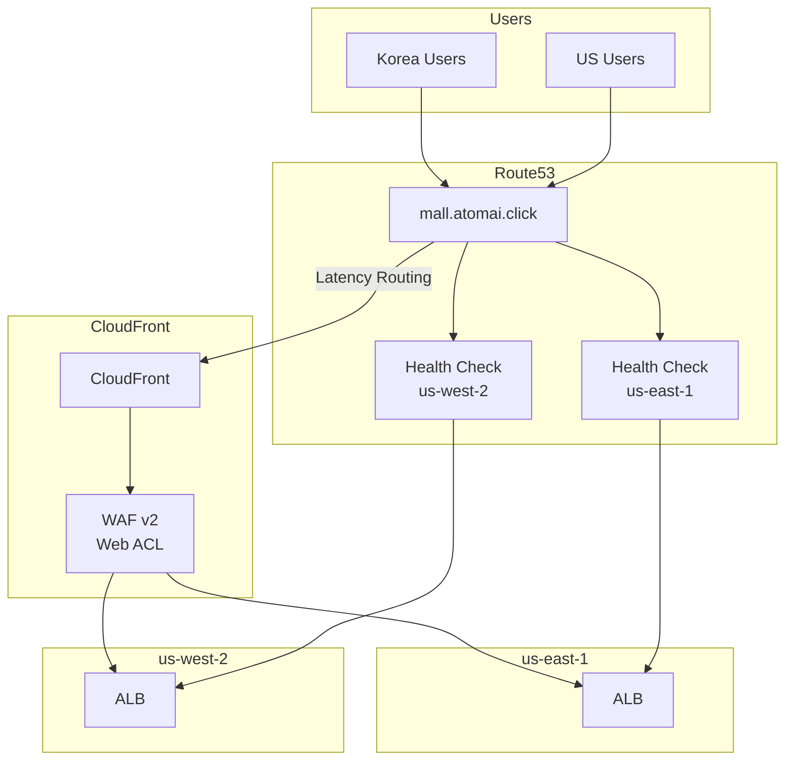
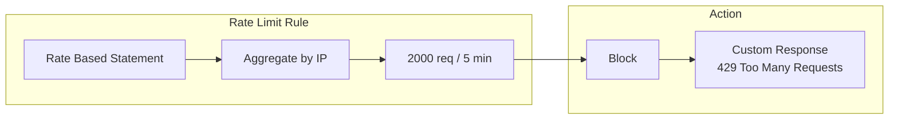
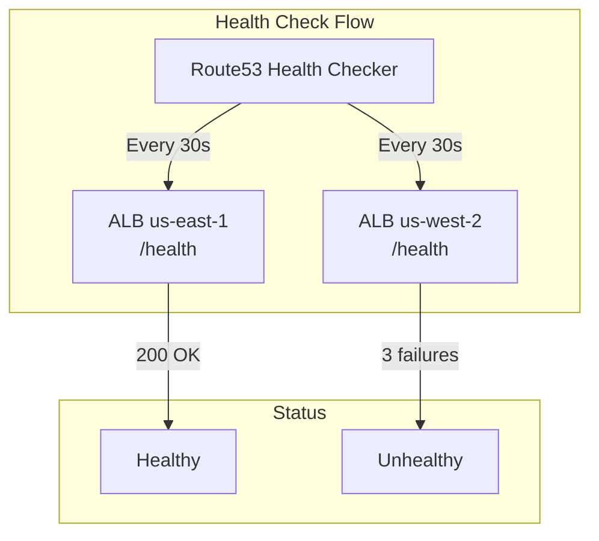
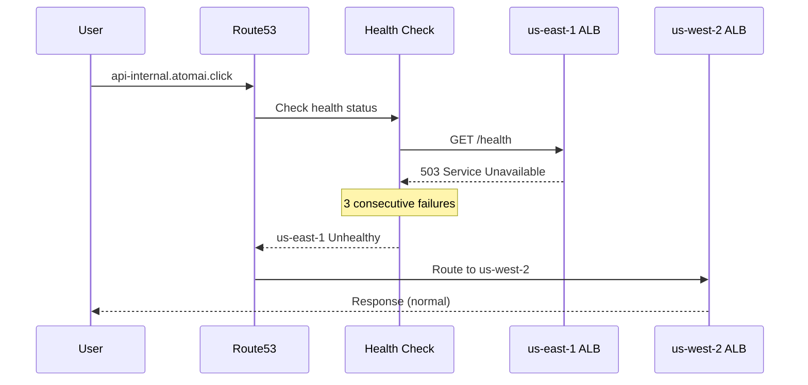

# WAF & Route53

The multi-region shopping mall platform protects web applications with **AWS WAF v2** and connects users to the nearest region using **Route53** latency-based routing.

## Architecture



## WAF v2 Web ACL

### Rule Configuration

| Priority | Rule Name | Type | Action | Description |
|----------|-----------|------|--------|-------------|
| 1 | AWSManagedRulesCommonRuleSet | Managed | Override | Common web vulnerability protection |
| 2 | AWSManagedRulesKnownBadInputsRuleSet | Managed | Override | Known malicious input patterns |
| 3 | AWSManagedRulesSQLiRuleSet | Managed | Override | SQL injection protection |
| 4 | AWSManagedRulesBotControlRuleSet | Managed | Override | Bot traffic control |
| 5 | RateLimit | Custom | Block | 2000 req/5min per IP |
| 6 | GeoBlock | Custom | Block | Sanctioned country blocking |

### Terraform Configuration

```hcl
resource "aws_wafv2_web_acl" "main" {
  name        = "${var.environment}-cloudfront-waf"
  description = "WAF Web ACL for CloudFront distribution"
  scope       = "CLOUDFRONT"  # CloudFront WAF must be created in us-east-1 only

  default_action {
    allow {}
  }

  # Rule 1: AWS Managed Common Rule Set
  rule {
    name     = "AWSManagedRulesCommonRuleSet"
    priority = 1

    override_action {
      none {}
    }

    statement {
      managed_rule_group_statement {
        name        = "AWSManagedRulesCommonRuleSet"
        vendor_name = "AWS"
      }
    }

    visibility_config {
      cloudwatch_metrics_enabled = true
      metric_name                = "${var.environment}-common-rules"
      sampled_requests_enabled   = true
    }
  }

  # Rule 2: Known Bad Inputs
  rule {
    name     = "AWSManagedRulesKnownBadInputsRuleSet"
    priority = 2

    override_action {
      none {}
    }

    statement {
      managed_rule_group_statement {
        name        = "AWSManagedRulesKnownBadInputsRuleSet"
        vendor_name = "AWS"
      }
    }

    visibility_config {
      cloudwatch_metrics_enabled = true
      metric_name                = "${var.environment}-bad-inputs"
      sampled_requests_enabled   = true
    }
  }

  # Rule 3: SQL Injection
  rule {
    name     = "AWSManagedRulesSQLiRuleSet"
    priority = 3

    override_action {
      none {}
    }

    statement {
      managed_rule_group_statement {
        name        = "AWSManagedRulesSQLiRuleSet"
        vendor_name = "AWS"
      }
    }

    visibility_config {
      cloudwatch_metrics_enabled = true
      metric_name                = "${var.environment}-sqli"
      sampled_requests_enabled   = true
    }
  }

  # Rule 4: Bot Control
  rule {
    name     = "AWSManagedRulesBotControlRuleSet"
    priority = 4

    override_action {
      none {}
    }

    statement {
      managed_rule_group_statement {
        name        = "AWSManagedRulesBotControlRuleSet"
        vendor_name = "AWS"
      }
    }

    visibility_config {
      cloudwatch_metrics_enabled = true
      metric_name                = "${var.environment}-bot-control"
      sampled_requests_enabled   = true
    }
  }

  # Rule 5: Rate Limiting
  rule {
    name     = "RateLimit"
    priority = 5

    action {
      block {}
    }

    statement {
      rate_based_statement {
        limit              = 2000  # 2000 requests per 5 minutes
        aggregate_key_type = "IP"
      }
    }

    visibility_config {
      cloudwatch_metrics_enabled = true
      metric_name                = "${var.environment}-rate-limit"
      sampled_requests_enabled   = true
    }
  }

  # Rule 6: Geo Block (Sanctioned Countries)
  rule {
    name     = "GeoBlock"
    priority = 6

    action {
      block {}
    }

    statement {
      geo_match_statement {
        country_codes = ["KP", "IR", "CU", "SY"]  # Sanctioned countries
      }
    }

    visibility_config {
      cloudwatch_metrics_enabled = true
      metric_name                = "${var.environment}-geo-block"
      sampled_requests_enabled   = true
    }
  }

  visibility_config {
    cloudwatch_metrics_enabled = true
    metric_name                = "${var.environment}-cloudfront-waf"
    sampled_requests_enabled   = true
  }
}
```

### Rate Limiting Details



| Parameter | Value | Description |
|-----------|-------|-------------|
| limit | 2000 | Maximum requests allowed per 5 minutes |
| aggregate_key_type | IP | Aggregate by IP address |
| evaluation_window | 300 seconds | Default 5-minute window |

## Route53 Configuration

### DNS Records

| Record | Type | Routing Policy | Value |
|--------|------|----------------|-------|
| `mall.atomai.click` | CNAME | Simple | `d1muyxliujbszf.cloudfront.net` |
| `api-internal.atomai.click` | A (Alias) | Latency | ALB (us-east-1) |
| `api-internal.atomai.click` | A (Alias) | Latency | ALB (us-west-2) |

### Latency-Based Routing

Latency-based routing connects users to the region with the lowest latency.

```hcl
resource "aws_route53_record" "api_latency" {
  for_each = { for k, v in var.alb_dns_names : k => v if v != "" }

  zone_id = var.zone_id
  name    = "api-internal.${data.aws_route53_zone.main.name}"
  type    = "A"

  alias {
    name                   = each.value
    zone_id                = var.alb_zone_ids[each.key]
    evaluate_target_health = true
  }

  set_identifier = each.key

  latency_routing_policy {
    region = each.key
  }

  health_check_id = aws_route53_health_check.regional[each.key].id
}
```

### Health Checks

Monitor the health status of ALBs in each region.

```hcl
resource "aws_route53_health_check" "regional" {
  for_each = var.alb_dns_names

  fqdn              = each.value
  port              = 443
  type              = "HTTPS"
  resource_path     = var.health_check_path  # /health
  request_interval  = var.health_check_interval  # 30 seconds
  failure_threshold = var.health_check_failure_threshold  # 3

  tags = {
    Name   = "${var.environment}-${each.key}-health-check"
    Region = each.key
  }
}
```



### Health Check Parameters

| Parameter | Value | Description |
|-----------|-------|-------------|
| type | HTTPS | HTTPS endpoint check |
| port | 443 | HTTPS port |
| resource_path | /health | Health check path |
| request_interval | 30 seconds | Check interval |
| failure_threshold | 3 | Failure threshold |

### CloudWatch Alarm Integration

```hcl
resource "aws_cloudwatch_metric_alarm" "health_check" {
  for_each = var.alb_dns_names

  alarm_name          = "${var.environment}-${each.key}-health-check-alarm"
  comparison_operator = "LessThanThreshold"
  evaluation_periods  = 2
  metric_name         = "HealthCheckStatus"
  namespace           = "AWS/Route53"
  period              = 60
  statistic           = "Minimum"
  threshold           = 1
  alarm_description   = "Health check alarm for ${each.key} region"
  treat_missing_data  = "breaching"

  dimensions = {
    HealthCheckId = aws_route53_health_check.regional[each.key].id
  }
}
```

## Failover Scenarios

### Single Region Failure



### Recovery Process

1. us-east-1 ALB returns to normal
2. Health Check succeeds (1 time)
3. Route53 adds us-east-1 back to the routing pool
4. Users are routed to the nearest region based on latency

## Monitoring

### WAF Metrics

| Metric | Description |
|--------|-------------|
| AllowedRequests | Number of allowed requests |
| BlockedRequests | Number of blocked requests |
| CountedRequests | Number of counted requests |
| PassedRequests | Number of passed requests |

### WAF Logging

```hcl
resource "aws_wafv2_web_acl_logging_configuration" "main" {
  log_destination_configs = [aws_cloudwatch_log_group.waf_logs.arn]
  resource_arn            = aws_wafv2_web_acl.main.arn

  logging_filter {
    default_behavior = "DROP"

    filter {
      behavior    = "KEEP"
      requirement = "MEETS_ANY"

      condition {
        action_condition {
          action = "BLOCK"
        }
      }

      condition {
        action_condition {
          action = "COUNT"
        }
      }
    }
  }
}
```

### Route53 Health Check Metrics

| Metric | Description |
|--------|-------------|
| HealthCheckStatus | 1 = Healthy, 0 = Unhealthy |
| HealthCheckPercentageHealthy | Healthy percentage (%) |
| ConnectionTime | Connection time |
| SSLHandshakeTime | SSL handshake time |

## Security Recommendations

### WAF Rule Tuning

1. **Log Analysis**: Monitor if legitimate requests are being blocked
2. **Count Mode**: Test new rules in Count mode first
3. **Exception Rules**: Whitelist specific IPs/paths as needed

### Rate Limiting Adjustment

```hcl
# Different rate limits per API endpoint
rule {
  name     = "APIRateLimit"
  priority = 7

  action {
    block {}
  }

  statement {
    rate_based_statement {
      limit              = 100  # Stricter for auth APIs
      aggregate_key_type = "IP"

      scope_down_statement {
        byte_match_statement {
          search_string         = "/api/auth/"
          field_to_match {
            uri_path {}
          }
          positional_constraint = "STARTS_WITH"
          text_transformation {
            priority = 0
            type     = "LOWERCASE"
          }
        }
      }
    }
  }

  visibility_config {
    cloudwatch_metrics_enabled = true
    metric_name                = "${var.environment}-api-rate-limit"
    sampled_requests_enabled   = true
  }
}
```

## Next Steps

- [Deployment Overview](/deployment/overview) - GitOps deployment strategy
- [CI/CD Pipeline](/deployment/ci-cd-pipeline) - GitHub Actions workflow
