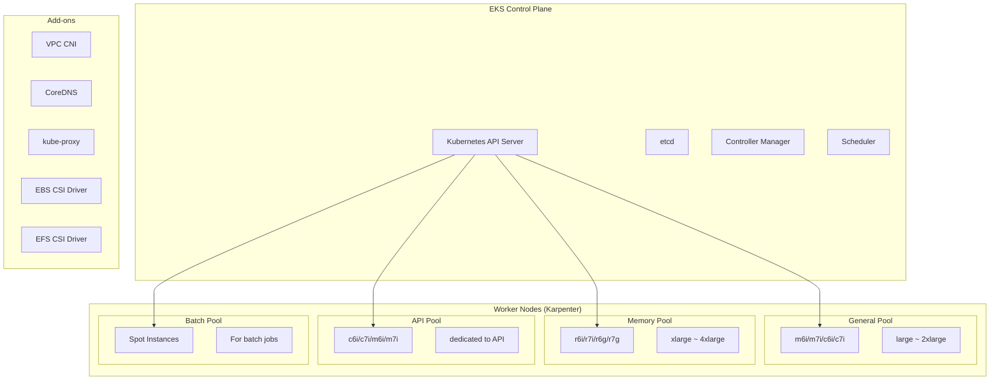
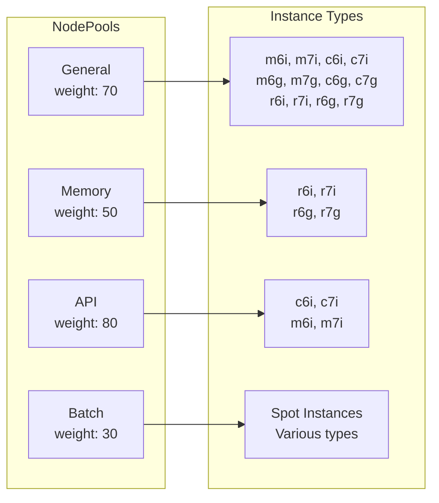
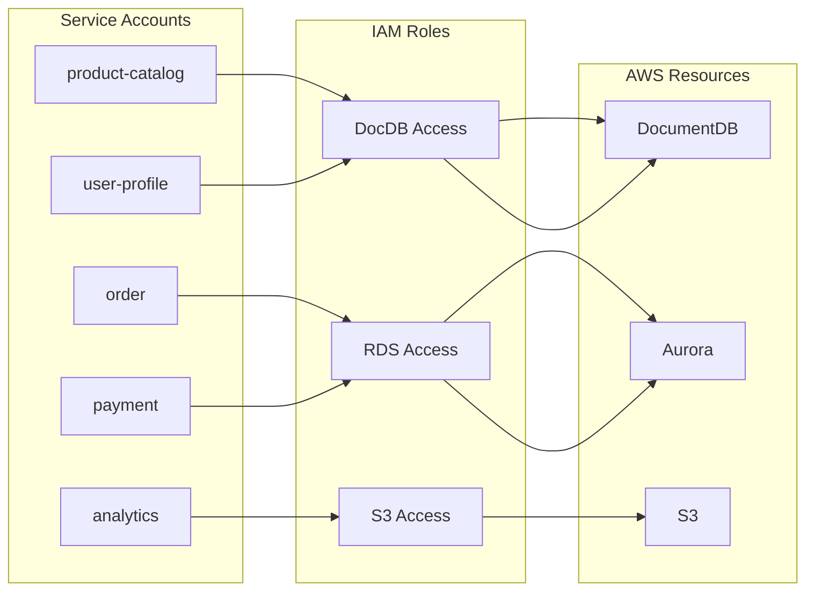

# EKS Cluster

The multi-region shopping mall platform deploys an **Amazon EKS** cluster in each region. It uses Kubernetes 1.29 and automatically provisions workload-optimized nodes through **Karpenter**.

## Cluster Configuration



## Cluster Specifications

| Item | us-east-1 | us-west-2 |
|------|-----------|-----------|
| Cluster Name | `multi-region-mall` | `multi-region-mall` |
| Kubernetes Version | 1.29 | 1.29 |
| API Endpoint | Private + Public | Private + Public |
| Service CIDR | 172.20.0.0/16 | 172.20.0.0/16 |
| Pod Networking | VPC CNI | VPC CNI |
| Log Types | api, audit, authenticator, controllerManager, scheduler |

## Terraform Configuration

```hcl
resource "aws_eks_cluster" "main" {
  name     = var.cluster_name
  version  = var.cluster_version  # "1.29"
  role_arn = aws_iam_role.eks_cluster.arn

  kubernetes_network_config {
    service_ipv4_cidr = "172.20.0.0/16"
  }

  vpc_config {
    subnet_ids              = var.private_subnet_ids
    endpoint_private_access = true
    endpoint_public_access  = true
  }

  enabled_cluster_log_types = [
    "api",
    "audit",
    "authenticator",
    "controllerManager",
    "scheduler"
  ]

  encryption_config {
    provider {
      key_arn = aws_kms_key.eks_secrets.arn
    }
    resources = ["secrets"]
  }
}
```

## Karpenter NodePools

Karpenter automatically provisions optimal EC2 instances based on workload requirements.

### NodePool Configuration



### General NodePool

The default NodePool for general-purpose workloads.

```yaml
apiVersion: karpenter.sh/v1
kind: NodePool
metadata:
  name: general
spec:
  template:
    metadata:
      labels:
        node-pool: general
    spec:
      nodeClassRef:
        group: karpenter.k8s.aws
        kind: EC2NodeClass
        name: default
      requirements:
        - key: karpenter.sh/capacity-type
          operator: In
          values:
            - spot
            - on-demand
        - key: kubernetes.io/arch
          operator: In
          values:
            - amd64
            - arm64
        - key: karpenter.k8s.aws/instance-family
          operator: In
          values:
            - m6i
            - m6g
            - m7i
            - m7g
            - c6i
            - c6g
            - c7i
            - c7g
            - r6i
            - r6g
            - r7i
            - r7g
        - key: karpenter.k8s.aws/instance-size
          operator: In
          values:
            - large
            - xlarge
            - 2xlarge
  weight: 70
  limits:
    cpu: "200"
    memory: 400Gi
  disruption:
    consolidationPolicy: WhenEmptyOrUnderutilized
    consolidateAfter: 30s
```

### NodePool Summary

| NodePool | Instance Family | Capacity Type | Limits | Purpose |
|----------|----------------|---------------|--------|---------|
| **general** | m6i, m7i, c6i, c7i, r6i, r7i (+ ARM) | Spot + On-Demand | 200 vCPU, 400Gi | General workloads |
| **memory** | r6i, r7i, r6g, r7g | On-Demand | 100 vCPU, 400Gi | Memory-intensive (Redis, Search) |
| **api** | c6i, c7i, m6i, m7i | On-Demand | 80 vCPU, 160Gi | API server workloads |
| **batch** | Various types | Spot Only | 50 vCPU, 100Gi | Batch jobs, Analytics |

### EC2NodeClass

EC2 settings shared by all NodePools.

```yaml
apiVersion: karpenter.k8s.aws/v1
kind: EC2NodeClass
metadata:
  name: default
spec:
  amiSelectorTerms:
    - alias: al2023@latest
  role: "multi-region-mall-node-group-${REGION}"
  subnetSelectorTerms:
    - tags:
        karpenter.sh/discovery: multi-region-mall
  securityGroupSelectorTerms:
    - tags:
        karpenter.sh/discovery: multi-region-mall
  blockDeviceMappings:
    - deviceName: /dev/xvda
      ebs:
        volumeSize: 100Gi
        volumeType: gp3
        iops: 3000
        throughput: 125
        encrypted: true
```

## Managed Add-ons

The following managed add-ons are installed on the EKS cluster:

| Add-on | Description | IRSA |
|--------|-------------|------|
| **vpc-cni** | AWS VPC CNI Plugin | Yes |
| **coredns** | Kubernetes DNS Service | No |
| **kube-proxy** | Network Proxy | No |
| **aws-ebs-csi-driver** | EBS Volume Provisioning | Yes |
| **aws-efs-csi-driver** | EFS Volume Mounting | Yes |

```hcl
resource "aws_eks_addon" "vpc_cni" {
  cluster_name             = aws_eks_cluster.main.name
  addon_name               = "vpc-cni"
  service_account_role_arn = aws_iam_role.vpc_cni.arn
}

resource "aws_eks_addon" "coredns" {
  cluster_name = aws_eks_cluster.main.name
  addon_name   = "coredns"
  depends_on   = [aws_eks_addon.vpc_cni]
}

resource "aws_eks_addon" "kube_proxy" {
  cluster_name = aws_eks_cluster.main.name
  addon_name   = "kube-proxy"
}

resource "aws_eks_addon" "aws_ebs_csi_driver" {
  cluster_name = aws_eks_cluster.main.name
  addon_name   = "aws-ebs-csi-driver"
}

resource "aws_eks_addon" "aws_efs_csi_driver" {
  cluster_name = aws_eks_cluster.main.name
  addon_name   = "aws-efs-csi-driver"
}
```

## IRSA (IAM Roles for Service Accounts)

Each microservice securely accesses AWS resources through IRSA.

### Service-to-IRSA Mapping



### IRSA Configuration Example

```hcl
locals {
  services = {
    "product-catalog" = { namespace = "core-services", policies = ["AmazonDocDBFullAccess"] }
    "order"           = { namespace = "core-services", policies = ["AmazonRDSDataFullAccess"] }
    "payment"         = { namespace = "core-services", policies = ["AmazonRDSDataFullAccess"] }
    "user-profile"    = { namespace = "user-services", policies = ["AmazonDocDBFullAccess"] }
    "analytics"       = { namespace = "platform", policies = ["AmazonS3FullAccess"] }
  }
}

resource "aws_iam_role" "service_irsa" {
  for_each = local.services

  name = "${var.cluster_name}-${each.key}-${var.region}"

  assume_role_policy = jsonencode({
    Version = "2012-10-17"
    Statement = [{
      Action = "sts:AssumeRoleWithWebIdentity"
      Effect = "Allow"
      Principal = {
        Federated = aws_iam_openid_connect_provider.eks.arn
      }
      Condition = {
        StringEquals = {
          "${local.oidc_provider_url}:aud" = "sts.amazonaws.com"
          "${local.oidc_provider_url}:sub" = "system:serviceaccount:${each.value.namespace}:${each.key}"
        }
      }
    }]
  })
}
```

## Cluster Security

### Encryption

- **Secrets Encryption**: Kubernetes Secrets encryption using KMS keys
- **etcd Encryption**: AWS managed encryption

```hcl
encryption_config {
  provider {
    key_arn = aws_kms_key.eks_secrets.arn
  }
  resources = ["secrets"]
}
```

### Network Security

- **Private Subnets**: Worker nodes are placed in private subnets
- **Security Groups**: Separate cluster and node security groups
- **API Endpoint**: Private + Public access (VPN/Bastion recommended)

## Connecting to the Cluster

```bash
# Update kubeconfig
aws eks update-kubeconfig \
  --name multi-region-mall \
  --region us-east-1

# Verify cluster
kubectl cluster-info
kubectl get nodes
```

## Next Steps

- [Aurora Global Database](/infrastructure/databases/aurora-global) - PostgreSQL Database
- [GitOps - ArgoCD](/deployment/gitops-argocd) - Kubernetes Deployment
- [Kustomize Overlays](/deployment/kustomize-overlays) - Region-specific Configuration
