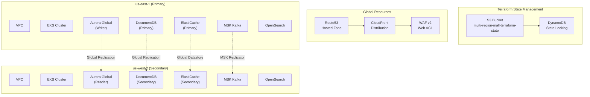
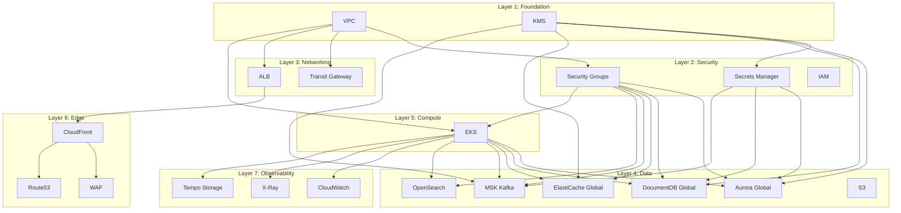

# Infrastructure Overview

The multi-region shopping mall platform uses **Terraform** to manage AWS infrastructure as code. It provisions **over 260 resources** across two regions: us-east-1 (primary) and us-west-2 (secondary).

## Architecture Diagram



## State Management

Terraform state is centrally managed using S3 backend with DynamoDB locking.

| Component | Value |
|-----------|-------|
| S3 Bucket | `multi-region-mall-terraform-state` |
| DynamoDB Table | `terraform-state-lock` |
| Region | `us-east-1` |
| Encryption | AES-256 Server-Side Encryption |

```hcl
terraform {
  backend "s3" {
    bucket         = "multi-region-mall-terraform-state"
    key            = "environments/production/us-east-1/terraform.tfstate"
    region         = "us-east-1"
    dynamodb_table = "terraform-state-lock"
    encrypt        = true
  }
}
```

## Module Dependency Diagram



## Resource Status by Region

### us-east-1 (Primary Region)

| Category | Resource Count | Key Components |
|----------|---------------|----------------|
| Networking | ~30 | VPC, Subnets, NAT GW, Transit Gateway |
| Compute | ~45 | EKS Cluster, Node Groups, ALB |
| Data | ~80 | Aurora, DocumentDB, ElastiCache, MSK, OpenSearch |
| Security | ~35 | KMS, Secrets Manager, IAM, Security Groups |
| Edge | ~20 | CloudFront, WAF, Route53 |
| Observability | ~50 | CloudWatch, X-Ray, Tempo Storage |
| **Total** | **~260** | |

### us-west-2 (Secondary Region)

| Category | Resource Count | Key Components |
|----------|---------------|----------------|
| Networking | ~30 | VPC, Subnets, NAT GW, Transit Gateway |
| Compute | ~45 | EKS Cluster, Node Groups, ALB |
| Data | ~75 | Aurora (Read), DocumentDB, ElastiCache, MSK, OpenSearch |
| Security | ~35 | KMS, Secrets Manager, IAM, Security Groups |
| Observability | ~50 | CloudWatch, X-Ray, Tempo Storage |
| **Total** | **~235** | |

## Environment Structure

```
terraform/
├── environments/
│   └── production/
│       ├── us-east-1/          # Primary Region
│       │   ├── main.tf
│       │   ├── variables.tf
│       │   ├── outputs.tf
│       │   └── terraform.tfvars
│       └── us-west-2/          # Secondary Region
│           ├── main.tf
│           ├── variables.tf
│           ├── outputs.tf
│           └── terraform.tfvars
├── global/                     # Global Resources
│   ├── route53/
│   └── iam/
└── modules/                    # Reusable Modules
    ├── compute/
    ├── data/
    ├── edge/
    ├── networking/
    ├── observability/
    └── security/
```

## Provisioning Order

When deploying to multiple regions, resources must be provisioned in the following order considering dependencies:

1. **Global Resources**: Route53 Hosted Zone, IAM Roles
2. **us-east-1 Primary**: Full infrastructure (including global database primary)
3. **us-west-2 Secondary**: Full infrastructure (joining global databases as secondary)

:::caution Important Notes
- Running `terraform apply` simultaneously in both regions may cause state conflicts
- Always deploy the primary region first, then the secondary region
- Global databases (Aurora, DocumentDB, ElastiCache) are created in the primary region first, then joined by the secondary
:::

## Tagging Strategy

All resources have the following tags applied:

```hcl
default_tags {
  tags = {
    Environment = "production"
    Region      = var.region
    ManagedBy   = "terraform"
    Project     = "multi-region-mall"
  }
}
```

## Next Steps

- [Terraform Modules](/infrastructure/terraform-modules) - Detailed description of 17 modules
- [EKS Cluster](/infrastructure/eks-cluster) - Kubernetes cluster configuration
- [Databases](/infrastructure/databases/aurora-global) - Global database configuration
