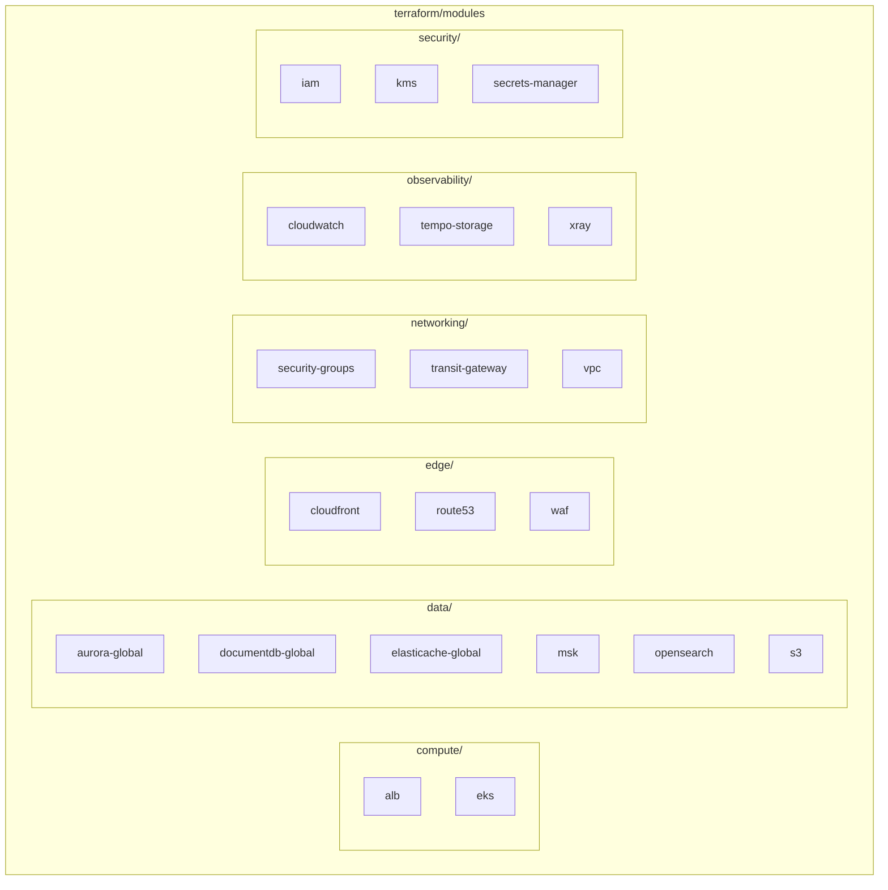
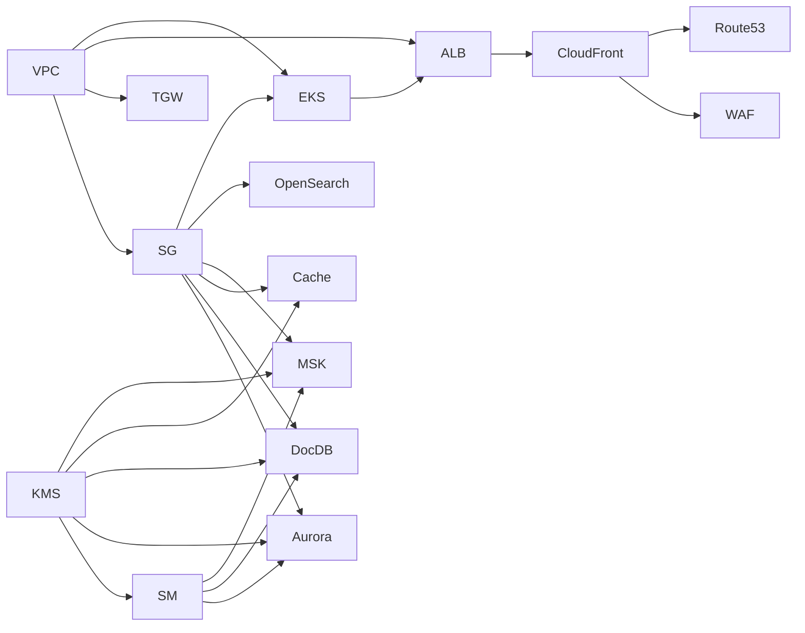

# Terraform Modules

The multi-region shopping mall platform consists of 17 reusable Terraform modules. Each module is responsible for a specific infrastructure domain and is used identically across both regions.

## Module Structure



## Complete Module List

| # | Module Name | Path | Resource Count | Description |
|---|-------------|------|----------------|-------------|
| 1 | **vpc** | `networking/vpc` | ~15 | VPC, Subnets, NAT Gateway, Internet Gateway |
| 2 | **transit-gateway** | `networking/transit-gateway` | ~5 | Transit Gateway, VPC Attachments |
| 3 | **security-groups** | `networking/security-groups` | ~12 | Service-specific Security Groups |
| 4 | **kms** | `security/kms` | ~8 | Service-specific KMS Keys (Aurora, DocDB, MSK, etc.) |
| 5 | **secrets-manager** | `security/secrets-manager` | ~10 | Database Credentials |
| 6 | **iam** | `security/iam` | ~20 | Service Roles and Policies |
| 7 | **eks** | `compute/eks` | ~35 | EKS Cluster, Add-ons, IRSA |
| 8 | **alb** | `compute/alb` | ~10 | Application Load Balancer |
| 9 | **aurora-global** | `data/aurora-global` | ~12 | Aurora PostgreSQL Global Database |
| 10 | **documentdb-global** | `data/documentdb-global` | ~10 | DocumentDB Global Cluster |
| 11 | **elasticache-global** | `data/elasticache-global` | ~8 | ElastiCache Valkey Global Datastore |
| 12 | **msk** | `data/msk` | ~15 | MSK Kafka Cluster, Replicator |
| 13 | **opensearch** | `data/opensearch` | ~12 | OpenSearch Domain |
| 14 | **s3** | `data/s3` | ~10 | S3 Buckets, Replication Rules |
| 15 | **cloudfront** | `edge/cloudfront` | ~5 | CloudFront Distribution |
| 16 | **waf** | `edge/waf` | ~8 | WAF v2 Web ACL |
| 17 | **route53** | `edge/route53` | ~10 | DNS Records, Health Checks |
| 18 | **cloudwatch** | `observability/cloudwatch` | ~25 | Dashboards, Alarms, Log Groups |
| 19 | **xray** | `observability/xray` | ~5 | X-Ray Groups, Sampling Rules |
| 20 | **tempo-storage** | `observability/tempo-storage` | ~8 | Tempo S3 Bucket, IAM Role |

## Module Details

### 1. VPC Module

Configures the network foundation infrastructure.

```hcl
module "vpc" {
  source = "../../../modules/networking/vpc"

  environment          = var.environment
  region               = var.region
  vpc_cidr             = "10.0.0.0/16"
  availability_zones   = ["us-east-1a", "us-east-1b", "us-east-1c"]
  public_subnet_cidrs  = ["10.0.1.0/24", "10.0.2.0/24", "10.0.3.0/24"]
  private_subnet_cidrs = ["10.0.11.0/24", "10.0.12.0/24", "10.0.13.0/24"]
  data_subnet_cidrs    = ["10.0.21.0/24", "10.0.22.0/24", "10.0.23.0/24"]
}
```

**Outputs:**
- `vpc_id` - VPC ID
- `public_subnet_ids` - List of public subnet IDs
- `private_subnet_ids` - List of private subnet IDs
- `data_subnet_ids` - List of data subnet IDs

### 2. EKS Module

Provisions the Kubernetes cluster and related resources.

```hcl
module "eks" {
  source = "../../../modules/compute/eks"

  cluster_name       = "multi-region-mall"
  cluster_version    = "1.29"
  region             = var.region
  vpc_id             = module.vpc.vpc_id
  private_subnet_ids = module.vpc.private_subnet_ids
}
```

**Key Features:**
- EKS Cluster (Kubernetes 1.29)
- OIDC Provider (for IRSA)
- Managed Add-ons: vpc-cni, coredns, kube-proxy, aws-ebs-csi-driver, aws-efs-csi-driver
- Service-specific IRSA Roles (20 microservices)

### 3. Aurora Global Module

Configures Aurora PostgreSQL-compatible Global Database.

```hcl
module "aurora" {
  source = "../../../modules/data/aurora-global"

  environment           = var.environment
  region                = var.region
  is_primary            = true  # false in us-west-2
  global_cluster_identifier = "production-aurora-global"

  writer_instance_class = "db.r6g.2xlarge"
  reader_instance_class = "db.r6g.xlarge"
  reader_count          = 2
}
```

### 4. DocumentDB Global Module

Configures MongoDB-compatible DocumentDB Global Cluster.

```hcl
module "documentdb" {
  source = "../../../modules/data/documentdb-global"

  environment              = var.environment
  region                   = var.region
  is_primary               = true
  global_cluster_identifier = "production-docdb-global"

  instance_class = "db.r6g.xlarge"
  instance_count = 3
}
```

### 5. ElastiCache Global Module

Configures Valkey 7.2-based Global Datastore.

```hcl
module "elasticache" {
  source = "../../../modules/data/elasticache-global"

  environment      = var.environment
  region           = var.region
  is_primary       = true

  node_type                = "cache.r7g.xlarge"
  num_node_groups          = 3
  replicas_per_node_group  = 2
}
```

### 6. MSK Module

Configures Apache Kafka cluster and MSK Replicator.

```hcl
module "msk" {
  source = "../../../modules/data/msk"

  environment           = var.environment
  region                = var.region
  kafka_version         = "3.5.1"
  broker_instance_type  = "kafka.m5.2xlarge"
  number_of_broker_nodes = 6
  ebs_volume_size       = 1000
}
```

### 7. OpenSearch Module

Configures OpenSearch domain for Korean language search.

```hcl
module "opensearch" {
  source = "../../../modules/data/opensearch"

  environment          = var.environment
  region               = var.region

  master_instance_type  = "r6g.large.search"
  master_instance_count = 3
  data_instance_type    = "r6g.xlarge.search"
  data_instance_count   = 6
  ebs_volume_size       = 500
  enable_ultrawarm      = true
}
```

## Module Dependencies



## Module Development Guidelines

### Standard File Structure

Each module follows this file structure:

```
modules/<category>/<module-name>/
├── main.tf          # Main resource definitions
├── variables.tf     # Input variables
├── outputs.tf       # Output values
└── versions.tf      # Provider version constraints (optional)
```

### Variable Naming Conventions

```hcl
# Environment variables (required)
variable "environment" {
  type        = string
  description = "Deployment environment (e.g., production, staging)"
}

variable "region" {
  type        = string
  description = "AWS region"
}

# Resource-specific variables
variable "instance_class" {
  type        = string
  description = "Instance class"
  default     = "db.r6g.large"
}
```

### Tag Standards

```hcl
tags = merge(var.tags, {
  Name        = "${var.environment}-<resource-name>"
  Environment = var.environment
  Module      = "<module-name>"
})
```

## Next Steps

- [EKS Cluster](/infrastructure/eks-cluster) - EKS detailed configuration
- [Aurora Global Database](/infrastructure/databases/aurora-global) - Aurora global database
- [Deployment Pipeline](/deployment/ci-cd-pipeline) - Terraform CI/CD
