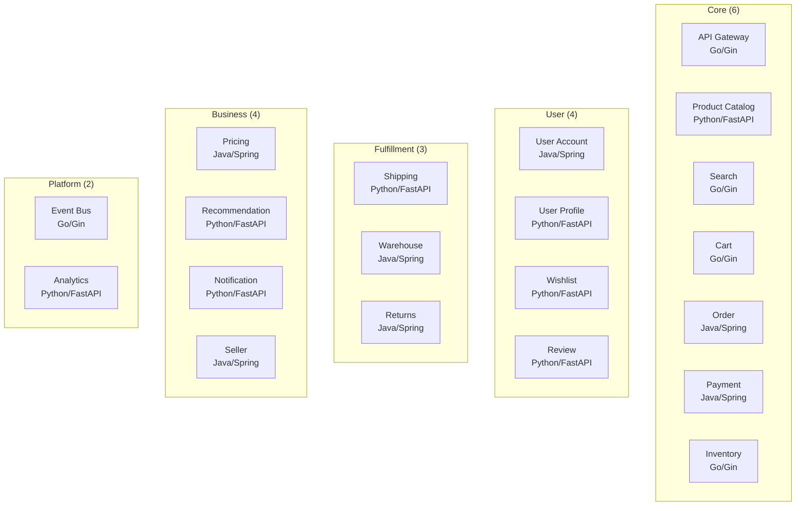
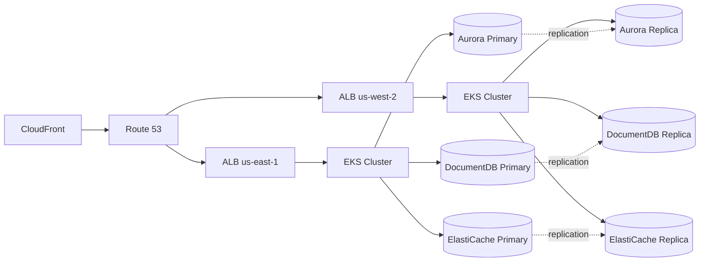

# Multi-Region Shopping Mall

Technical documentation for an AWS-based multi-region microservices shopping mall platform.

## Project Overview

This project is a global-scale shopping mall platform modeled after Amazon.com's infrastructure patterns. It operates in an Active-Active configuration across two regions: **us-east-1** (Primary) and **us-west-2** (Secondary).

### Key Features

| Item | Details |
|------|---------|
| **Architecture Pattern** | Write-Primary / Read-Local |
| **Microservices** | 20 (Go 5, Java 7, Python 8) |
| **Data Stores** | Aurora PostgreSQL, DocumentDB, ElastiCache Valkey, OpenSearch, MSK Kafka |
| **Infrastructure** | Terraform 260+ resources, EKS, VPC 3-tier |
| **Deployment** | GitOps (ArgoCD), GitHub Actions CI/CD |
| **Observability** | OpenTelemetry, Grafana Tempo, Prometheus, X-Ray |
| **Availability Target** | 99.99% SLA, RPO <1s, RTO <10m |

### Service Domains

### Infrastructure Stack

## Documentation Structure

- **[Getting Started](/getting-started/prerequisites)** - Prerequisites, Quick Start, Local Development Environment
- **[Architecture](/architecture/overview)** - System Design, Multi-Region, Network, Data
- **[Services](/services/overview)** - Detailed design documents for 20 microservices
- **[Infrastructure](/infrastructure/overview)** - Terraform, EKS, Databases, Edge
- **[Deployment](/deployment/overview)** - GitOps, CI/CD, Kustomize, Rollouts
- **[Observability](/observability/overview)** - Distributed Tracing, Metrics, Logging, Dashboards
- **[Operations](/operations/disaster-recovery)** - Disaster Recovery, Failover, Seed Data

## Technology Stack

| Category | Technology |
|----------|------------|
| **Languages** | Go 1.21, Java 17 (Spring Boot 3.2), Python 3.11 (FastAPI) |
| **Containers** | EKS (Kubernetes 1.29), Karpenter |
| **Databases** | Aurora PostgreSQL 15, DocumentDB 5.0, ElastiCache Valkey 7.2 |
| **Search** | OpenSearch 2.11 (nori Korean analyzer) |
| **Messaging** | MSK Kafka 3.5 (SASL/SCRAM) |
| **IaC** | Terraform 1.7+ |
| **GitOps** | ArgoCD, Kustomize |
| **Observability** | OpenTelemetry, Grafana Tempo, Prometheus, AWS X-Ray |
| **Edge** | CloudFront, WAF v2, Route 53 |
| **Security** | KMS, Secrets Manager, IAM (IRSA) |
