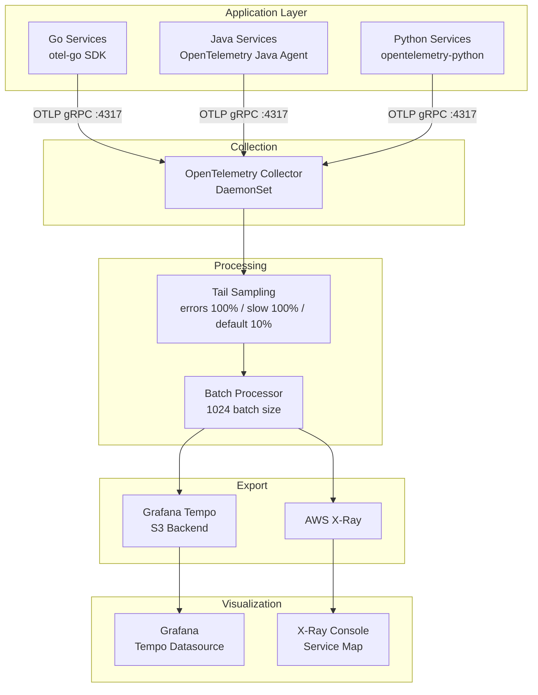
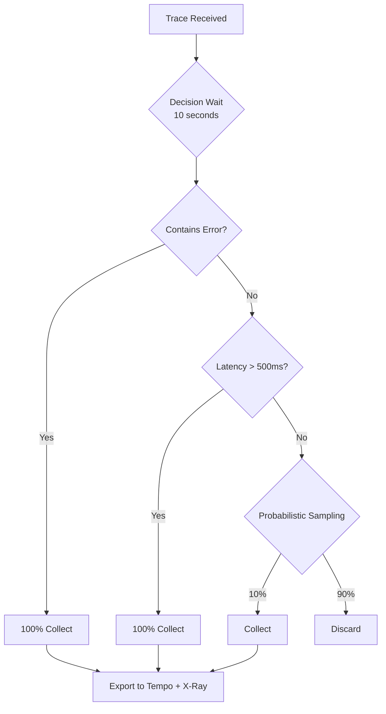

# Distributed Tracing

This section covers the distributed tracing system for tracking the complete flow of requests in a microservices environment. The OpenTelemetry Collector serves as the center, with dual export to Grafana Tempo and AWS X-Ray.

## Architecture Overview



## OpenTelemetry Collector Configuration

### DaemonSet Deployment

OTel Collector is deployed on all nodes to collect telemetry from Pods on each node.

```yaml
apiVersion: apps/v1
kind: DaemonSet
metadata:
  name: otel-collector
  namespace: platform
spec:
  template:
    spec:
      containers:
        - name: otel-collector
          image: public.ecr.aws/aws-observability/aws-otel-collector:v0.40.0
          ports:
            - name: otlp-grpc
              containerPort: 4317
              hostPort: 4317      # Exposed on node port
            - name: otlp-http
              containerPort: 4318
              hostPort: 4318
            - name: metrics
              containerPort: 8889  # For Prometheus scrape
          resources:
            requests:
              cpu: 100m
              memory: 512Mi
            limits:
              cpu: 500m
              memory: 1Gi
```

### Collector Configuration

```yaml
receivers:
  otlp:
    protocols:
      grpc:
        endpoint: 0.0.0.0:4317
      http:
        endpoint: 0.0.0.0:4318

processors:
  # Memory limiter
  memory_limiter:
    check_interval: 5s
    limit_mib: 512
    spike_limit_mib: 128

  # Tail-based Sampling
  tail_sampling:
    decision_wait: 10s
    num_traces: 100000
    expected_new_traces_per_sec: 1000
    policies:
      - name: errors-policy        # 100% collection for errors
        type: status_code
        status_code:
          status_codes: [ERROR]
      - name: slow-requests-policy # 100% for requests over 500ms
        type: latency
        latency:
          threshold_ms: 500
      - name: probabilistic-policy # 10% sampling for the rest
        type: probabilistic
        probabilistic:
          sampling_percentage: 10

  # Batch processing
  batch:
    timeout: 5s
    send_batch_size: 1024
    send_batch_max_size: 2048

  # Add resource attributes
  resource:
    attributes:
      - key: k8s.cluster.name
        value: mall-cluster
        action: upsert

exporters:
  # Export to Tempo
  otlp/tempo:
    endpoint: tempo.observability.svc.cluster.local:4317
    tls:
      insecure: true

  # Export to X-Ray
  awsxray:
    region: ${AWS_REGION}
    index_all_attributes: true

service:
  pipelines:
    traces:
      receivers: [otlp]
      processors: [memory_limiter, tail_sampling, batch, resource]
      exporters: [otlp/tempo, awsxray]
```

## Tail-based Sampling Strategy



| Policy | Condition | Sampling Rate | Purpose |
|--------|-----------|---------------|---------|
| **errors-policy** | status_code = ERROR | 100% | Preserve all error traces |
| **slow-requests-policy** | latency > 500ms | 100% | Performance issue analysis |
| **probabilistic-policy** | Other | 10% | Cost optimization |

## Grafana Tempo Setup

### Monolithic Mode Deployment

Runs all components (distributor, ingester, compactor, querier) in a single instance.

```yaml
apiVersion: apps/v1
kind: Deployment
metadata:
  name: tempo
  namespace: observability
spec:
  replicas: 1
  template:
    spec:
      serviceAccountName: tempo  # Uses IRSA
      containers:
        - name: tempo
          image: grafana/tempo:2.6.1
          args:
            - -config.file=/etc/tempo/tempo.yaml
            - -config.expand-env=true
          resources:
            requests:
              cpu: 500m
              memory: 1Gi
            limits:
              cpu: "1"
              memory: 2Gi
```

### Tempo Configuration (S3 Backend)

```yaml
server:
  http_listen_port: 3200
  grpc_listen_port: 9095

distributor:
  receivers:
    otlp:
      protocols:
        grpc:
          endpoint: 0.0.0.0:4317
        http:
          endpoint: 0.0.0.0:4318

ingester:
  max_block_duration: 5m

compactor:
  compaction:
    block_retention: 720h    # 30-day retention

# Metrics generator (service graph, span metrics)
metrics_generator:
  registry:
    external_labels:
      source: tempo
      cluster: mall-cluster
  storage:
    path: /var/tempo/generator/wal
    remote_write:
      - url: http://prometheus-kube-prometheus-prometheus.monitoring:9090/api/v1/write
        send_exemplars: true

# S3 Storage
storage:
  trace:
    backend: s3
    s3:
      bucket: ${TEMPO_S3_BUCKET}
      region: ${AWS_REGION}
    wal:
      path: /var/tempo/wal
    local:
      path: /var/tempo/blocks
```

### ArgoCD ApplicationSet (Regional IRSA)

Tempo is managed by a dedicated ApplicationSet that patches different IAM Roles per region.

```yaml
apiVersion: argoproj.io/v1alpha1
kind: ApplicationSet
metadata:
  name: tempo
  namespace: argocd
spec:
  generators:
    - clusters:
        selector:
          matchExpressions:
            - key: region
              operator: Exists
  template:
    metadata:
      name: 'infra-tempo-{{metadata.labels.region}}'
    spec:
      source:
        repoURL: https://github.com/Atom-oh/multi-region-architecture.git
        path: k8s/infra/tempo
        kustomize:
          patches:
            - target:
                kind: ServiceAccount
                name: tempo
              patch: |-
                - op: replace
                  path: /metadata/annotations/eks.amazonaws.com~1role-arn
                  value: "arn:aws:iam::123456789012:role/production-tempo-{{metadata.labels.region}}"
```

## SDK Instrumentation

### Go Services

```go
import (
    "go.opentelemetry.io/otel"
    "go.opentelemetry.io/otel/exporters/otlp/otlptrace/otlptracegrpc"
    "go.opentelemetry.io/otel/sdk/trace"
    "go.opentelemetry.io/contrib/instrumentation/github.com/gin-gonic/gin/otelgin"
)

func initTracer() (*trace.TracerProvider, error) {
    exporter, err := otlptracegrpc.New(ctx,
        otlptracegrpc.WithEndpoint("otel-collector.platform:4317"),
        otlptracegrpc.WithInsecure(),
    )
    if err != nil {
        return nil, err
    }

    tp := trace.NewTracerProvider(
        trace.WithBatcher(exporter),
        trace.WithResource(resource.NewWithAttributes(
            semconv.SchemaURL,
            semconv.ServiceName("order-service"),
            semconv.ServiceVersion("1.0.0"),
            attribute.String("region", os.Getenv("AWS_REGION")),
        )),
    )
    otel.SetTracerProvider(tp)
    return tp, nil
}

// Apply Gin middleware
router := gin.New()
router.Use(otelgin.Middleware("order-service"))
```

### Java Services (Spring Boot)

```yaml
# application.yaml
management:
  tracing:
    sampling:
      probability: 1.0
  otlp:
    tracing:
      endpoint: http://otel-collector.platform:4317

spring:
  application:
    name: payment-service
```

```xml
<!-- pom.xml -->
<dependency>
    <groupId>io.micrometer</groupId>
    <artifactId>micrometer-tracing-bridge-otel</artifactId>
</dependency>
<dependency>
    <groupId>io.opentelemetry</groupId>
    <artifactId>opentelemetry-exporter-otlp</artifactId>
</dependency>
```

### Python Services (FastAPI)

```python
from opentelemetry import trace
from opentelemetry.exporter.otlp.proto.grpc.trace_exporter import OTLPSpanExporter
from opentelemetry.sdk.trace import TracerProvider
from opentelemetry.sdk.trace.export import BatchSpanProcessor
from opentelemetry.instrumentation.fastapi import FastAPIInstrumentor

def init_tracer():
    provider = TracerProvider(
        resource=Resource.create({
            "service.name": "recommendation-service",
            "service.version": "1.0.0",
            "deployment.environment": os.getenv("ENV", "production"),
        })
    )

    exporter = OTLPSpanExporter(
        endpoint="otel-collector.platform:4317",
        insecure=True
    )
    provider.add_span_processor(BatchSpanProcessor(exporter))
    trace.set_tracer_provider(provider)

# FastAPI auto-instrumentation
app = FastAPI()
FastAPIInstrumentor.instrument_app(app)
```

## Kafka Message Trace Propagation

Trace context is propagated even in asynchronous messages through Kafka.

### Producer (Go)

```go
import (
    "go.opentelemetry.io/otel"
    "go.opentelemetry.io/otel/propagation"
)

func produceMessage(ctx context.Context, topic string, value []byte) error {
    // Inject trace context into headers
    headers := make([]kafka.Header, 0)
    carrier := propagation.MapCarrier{}
    otel.GetTextMapPropagator().Inject(ctx, carrier)

    for k, v := range carrier {
        headers = append(headers, kafka.Header{
            Key:   k,
            Value: []byte(v),
        })
    }

    return producer.Produce(&kafka.Message{
        TopicPartition: kafka.TopicPartition{Topic: &topic},
        Headers:        headers,  // Contains traceparent header
        Value:          value,
    }, nil)
}
```

### Consumer (Go)

```go
func consumeMessage(msg *kafka.Message) {
    // Extract trace context from headers
    carrier := propagation.MapCarrier{}
    for _, h := range msg.Headers {
        carrier[h.Key] = string(h.Value)
    }

    ctx := otel.GetTextMapPropagator().Extract(
        context.Background(),
        carrier,
    )

    // Start new span with extracted context
    tracer := otel.Tracer("kafka-consumer")
    ctx, span := tracer.Start(ctx, "process-message",
        trace.WithSpanKind(trace.SpanKindConsumer),
    )
    defer span.End()

    // Process message...
}
```

### Propagated Headers

```
traceparent: 00-0af7651916cd43dd8448eb211c80319c-b7ad6b7169203331-01
tracestate: (optional vendor-specific data)
```

## Querying Traces in Grafana

### Tempo Datasource Configuration

```yaml
# Grafana datasource
- name: Tempo
  type: tempo
  url: http://tempo.observability:3200
  jsonData:
    tracesToLogsV2:
      datasourceUid: cloudwatch
      filterByTraceID: true
      filterBySpanID: true
    tracesToMetrics:
      datasourceUid: prometheus
      spanStartTimeShift: '-1h'
      spanEndTimeShift: '1h'
    serviceMap:
      datasourceUid: prometheus
    nodeGraph:
      enabled: true
```

### TraceQL Query Examples

```
# Search traces by service
{ resource.service.name = "order-service" }

# Search error traces
{ status = error }

# Slow requests for specific HTTP path
{ span.http.route = "/api/v1/orders" && duration > 500ms }

# Traces for specific user
{ resource.user.id = "a0000001-0000-0000-0000-000000000001" }
```

## Troubleshooting

### When Traces Are Not Collected

```bash
# 1. Check OTel Collector status
kubectl get pods -n platform -l app=otel-collector

# 2. Check Collector logs
kubectl logs -n platform -l app=otel-collector --tail=100

# 3. Check Tempo status
kubectl get pods -n observability -l app=tempo

# 4. Verify Tempo ready
kubectl exec -n observability deploy/tempo -- wget -qO- http://localhost:3200/ready
```

### Adjusting Sampling Rate

Adjust sampling rate when traffic is high:

```yaml
tail_sampling:
  policies:
    - name: probabilistic-policy
      type: probabilistic
      probabilistic:
        sampling_percentage: 5  # Reduced from 10% to 5%
```

## Related Documentation

- [Observability Overview](/observability/overview)
- [Prometheus Metrics](/observability/metrics-prometheus)
- [Logging](/observability/logging)
