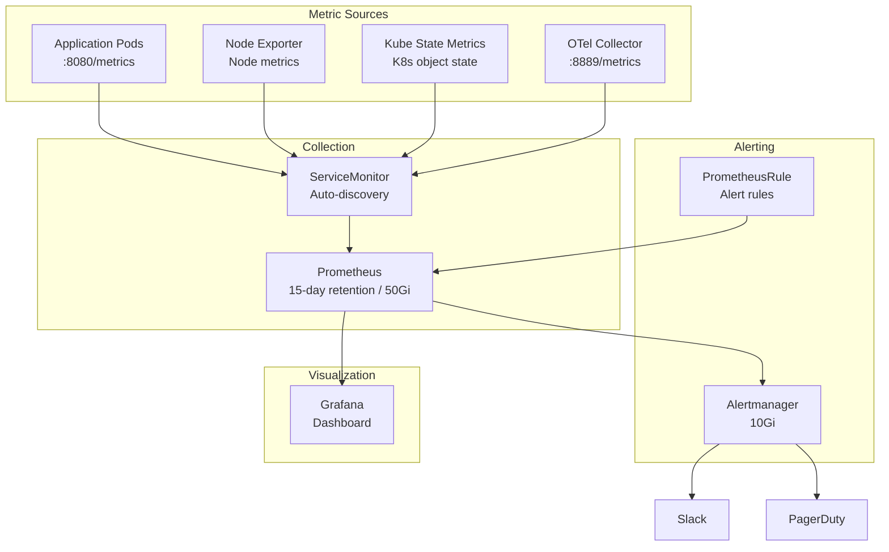

# Prometheus Metrics

Prometheus is used to collect metrics from EKS clusters and microservices, and Alertmanager is used to send alerts.

## Architecture



## Prometheus Stack Configuration

### Helm Values

```yaml
prometheus:
  prometheusSpec:
    retention: 15d                    # 15-day retention
    storageSpec:
      volumeClaimTemplate:
        spec:
          storageClassName: gp3
          resources:
            requests:
              storage: 50Gi
    serviceMonitorSelectorNilUsesHelmValues: false  # Discover all ServiceMonitors
    podMonitorSelectorNilUsesHelmValues: false
    ruleSelectorNilUsesHelmValues: false
    resources:
      requests:
        cpu: 500m
        memory: 2Gi
      limits:
        cpu: 2
        memory: 4Gi

alertmanager:
  alertmanagerSpec:
    storage:
      volumeClaimTemplate:
        spec:
          storageClassName: gp3
          resources:
            requests:
              storage: 10Gi

kubeStateMetrics:
  enabled: true

nodeExporter:
  enabled: true

prometheusOperator:
  resources:
    requests:
      cpu: 100m
      memory: 256Mi
    limits:
      cpu: 200m
      memory: 512Mi
```

## Service Discovery

### Pod Annotation-based Discovery

```yaml
apiVersion: v1
kind: Pod
metadata:
  annotations:
    prometheus.io/scrape: "true"
    prometheus.io/port: "8080"
    prometheus.io/path: "/metrics"
```

### ServiceMonitor Example

```yaml
apiVersion: monitoring.coreos.com/v1
kind: ServiceMonitor
metadata:
  name: order-service
  namespace: core-services
  labels:
    app: order-service
spec:
  selector:
    matchLabels:
      app: order-service
  endpoints:
    - port: http
      interval: 30s
      path: /metrics
  namespaceSelector:
    matchNames:
      - core-services
```

## Language-specific Metrics Setup

### Go (Gin + Prometheus)

```go
import (
    "github.com/gin-gonic/gin"
    "github.com/prometheus/client_golang/prometheus"
    "github.com/prometheus/client_golang/prometheus/promhttp"
)

var (
    httpRequestsTotal = prometheus.NewCounterVec(
        prometheus.CounterOpts{
            Name: "http_requests_total",
            Help: "Total number of HTTP requests",
        },
        []string{"method", "endpoint", "status"},
    )

    httpRequestDuration = prometheus.NewHistogramVec(
        prometheus.HistogramOpts{
            Name:    "http_request_duration_seconds",
            Help:    "HTTP request duration in seconds",
            Buckets: []float64{0.01, 0.05, 0.1, 0.25, 0.5, 1, 2.5, 5},
        },
        []string{"method", "endpoint"},
    )

    orderTotal = prometheus.NewCounterVec(
        prometheus.CounterOpts{
            Name: "orders_total",
            Help: "Total number of orders",
        },
        []string{"status", "region"},
    )
)

func init() {
    prometheus.MustRegister(httpRequestsTotal, httpRequestDuration, orderTotal)
}

func main() {
    r := gin.New()

    // Metrics middleware
    r.Use(func(c *gin.Context) {
        start := time.Now()
        c.Next()
        duration := time.Since(start).Seconds()

        httpRequestsTotal.WithLabelValues(
            c.Request.Method,
            c.FullPath(),
            strconv.Itoa(c.Writer.Status()),
        ).Inc()

        httpRequestDuration.WithLabelValues(
            c.Request.Method,
            c.FullPath(),
        ).Observe(duration)
    })

    // Metrics endpoint
    r.GET("/metrics", gin.WrapH(promhttp.Handler()))
}
```

### Java (Spring Boot + Micrometer)

```yaml
# application.yaml
management:
  endpoints:
    web:
      exposure:
        include: prometheus,health,info
  endpoint:
    prometheus:
      enabled: true
  metrics:
    tags:
      application: payment-service
      region: ${AWS_REGION:unknown}
    distribution:
      percentiles-histogram:
        http.server.requests: true
      slo:
        http.server.requests: 50ms,100ms,200ms,500ms,1s
```

```java
// Custom metrics
@Component
public class PaymentMetrics {
    private final Counter paymentSuccessCounter;
    private final Counter paymentFailureCounter;
    private final Timer paymentProcessingTime;

    public PaymentMetrics(MeterRegistry registry) {
        this.paymentSuccessCounter = Counter.builder("payments_total")
            .tag("status", "success")
            .description("Total successful payments")
            .register(registry);

        this.paymentFailureCounter = Counter.builder("payments_total")
            .tag("status", "failure")
            .description("Total failed payments")
            .register(registry);

        this.paymentProcessingTime = Timer.builder("payment_processing_seconds")
            .description("Payment processing time")
            .publishPercentiles(0.5, 0.9, 0.99)
            .register(registry);
    }

    public void recordSuccess() {
        paymentSuccessCounter.increment();
    }

    public void recordFailure() {
        paymentFailureCounter.increment();
    }

    public void recordProcessingTime(Duration duration) {
        paymentProcessingTime.record(duration);
    }
}
```

### Python (FastAPI + prometheus_fastapi_instrumentator)

```python
from fastapi import FastAPI
from prometheus_fastapi_instrumentator import Instrumentator
from prometheus_client import Counter, Histogram, Gauge

app = FastAPI()

# Auto-instrumentation
Instrumentator().instrument(app).expose(app)

# Custom metrics
recommendation_requests = Counter(
    "recommendation_requests_total",
    "Total recommendation requests",
    ["user_tier", "category"]
)

recommendation_latency = Histogram(
    "recommendation_latency_seconds",
    "Recommendation generation latency",
    buckets=[0.01, 0.05, 0.1, 0.25, 0.5, 1.0]
)

active_users = Gauge(
    "active_users",
    "Number of currently active users"
)

@app.get("/api/v1/recommendations/{user_id}")
async def get_recommendations(user_id: str):
    with recommendation_latency.time():
        recommendation_requests.labels(
            user_tier="gold",
            category="electronics"
        ).inc()
        # Recommendation logic...
        return {"recommendations": [...]}
```

## Core Metrics (RED Method)

Core metrics that each service should collect:

| Metric | Description | PromQL |
|--------|-------------|--------|
| **Rate** | Requests per second | `rate(http_requests_total[5m])` |
| **Errors** | Error rate | `rate(http_requests_total{status=~"5.."}[5m]) / rate(http_requests_total[5m])` |
| **Duration** | Response time | `histogram_quantile(0.99, rate(http_request_duration_seconds_bucket[5m]))` |

## Alert Rules (PrometheusRule)

### Service Alerts

```yaml
apiVersion: monitoring.coreos.com/v1
kind: PrometheusRule
metadata:
  name: service-alerts
  namespace: monitoring
spec:
  groups:
    - name: service.rules
      rules:
        # High error rate
        - alert: HighErrorRate
          expr: |
            (
              sum(rate(http_requests_total{status=~"5.."}[5m])) by (service)
              /
              sum(rate(http_requests_total[5m])) by (service)
            ) > 0.05
          for: 5m
          labels:
            severity: critical
          annotations:
            summary: "High error rate on {{ $labels.service }}"
            description: "{{ $labels.service }} 5XX error rate exceeds 5% (current: {{ $value | humanizePercentage }})"

        # Slow response
        - alert: HighLatency
          expr: |
            histogram_quantile(0.99,
              sum(rate(http_request_duration_seconds_bucket[5m])) by (le, service)
            ) > 2
          for: 5m
          labels:
            severity: warning
          annotations:
            summary: "{{ $labels.service }} response delay"
            description: "{{ $labels.service }} p99 response time exceeds 2 seconds"

        # Pod restarts
        - alert: PodRestartingTooOften
          expr: |
            increase(kube_pod_container_status_restarts_total[1h]) > 5
          for: 10m
          labels:
            severity: warning
          annotations:
            summary: "{{ $labels.pod }} Pod frequent restarts"
            description: "{{ $labels.namespace }}/{{ $labels.pod }} restarted more than 5 times in 1 hour"
```

### Infrastructure Alerts

```yaml
apiVersion: monitoring.coreos.com/v1
kind: PrometheusRule
metadata:
  name: infrastructure-alerts
  namespace: monitoring
spec:
  groups:
    - name: infrastructure.rules
      rules:
        # High node CPU
        - alert: NodeHighCPU
          expr: |
            (1 - avg(rate(node_cpu_seconds_total{mode="idle"}[5m])) by (instance)) > 0.85
          for: 10m
          labels:
            severity: warning
          annotations:
            summary: "High CPU on node {{ $labels.instance }}"
            description: "CPU usage exceeds 85% (current: {{ $value | humanizePercentage }})"

        # Node memory pressure
        - alert: NodeMemoryPressure
          expr: |
            (1 - node_memory_MemAvailable_bytes / node_memory_MemTotal_bytes) > 0.90
          for: 5m
          labels:
            severity: critical
          annotations:
            summary: "Memory shortage on node {{ $labels.instance }}"
            description: "Memory usage exceeds 90%"

        # Low disk space
        - alert: DiskSpaceLow
          expr: |
            (node_filesystem_avail_bytes{fstype!="tmpfs"} / node_filesystem_size_bytes) < 0.15
          for: 15m
          labels:
            severity: warning
          annotations:
            summary: "Low disk space on node {{ $labels.instance }}"
            description: "Free space on {{ $labels.mountpoint }} is below 15%"
```

### Business Alerts

```yaml
apiVersion: monitoring.coreos.com/v1
kind: PrometheusRule
metadata:
  name: business-alerts
  namespace: monitoring
spec:
  groups:
    - name: business.rules
      rules:
        # Order processing stopped
        - alert: NoOrdersProcessed
          expr: |
            sum(increase(orders_total[10m])) == 0
          for: 10m
          labels:
            severity: critical
          annotations:
            summary: "Order processing stopped"
            description: "No orders processed in the last 10 minutes"

        # High payment failure rate
        - alert: HighPaymentFailureRate
          expr: |
            (
              sum(rate(payments_total{status="failure"}[5m]))
              /
              sum(rate(payments_total[5m]))
            ) > 0.10
          for: 5m
          labels:
            severity: critical
          annotations:
            summary: "High payment failure rate"
            description: "Payment failure rate exceeds 10% (current: {{ $value | humanizePercentage }})"
```

## Grafana Data Source Configuration

```yaml
apiVersion: 1
datasources:
  - name: Prometheus
    type: prometheus
    access: proxy
    url: http://prometheus-kube-prometheus-prometheus.monitoring:9090
    isDefault: true
    jsonData:
      timeInterval: 15s
      httpMethod: POST

  - name: Alertmanager
    type: alertmanager
    access: proxy
    url: http://prometheus-kube-prometheus-alertmanager.monitoring:9093
    jsonData:
      implementation: prometheus
```

## Useful PromQL Queries

### Service Status

```promql
# Requests per second by service
sum(rate(http_requests_total[5m])) by (service)

# Error rate by service
sum(rate(http_requests_total{status=~"5.."}[5m])) by (service)
/ sum(rate(http_requests_total[5m])) by (service)

# P99 response time by service
histogram_quantile(0.99,
  sum(rate(http_request_duration_seconds_bucket[5m])) by (le, service)
)
```

### Resource Usage

```promql
# Pod CPU usage
sum(rate(container_cpu_usage_seconds_total{container!=""}[5m])) by (pod, namespace)

# Pod memory usage (MB)
sum(container_memory_working_set_bytes{container!=""}) by (pod, namespace) / 1024 / 1024

# Total CPU requests by namespace
sum(kube_pod_container_resource_requests{resource="cpu"}) by (namespace)
```

### Business Metrics

```promql
# Orders per minute
sum(rate(orders_total[1m])) * 60

# Payment success rate
sum(rate(payments_total{status="success"}[5m]))
/ sum(rate(payments_total[5m])) * 100

# Average order amount
sum(order_amount_sum) / sum(order_amount_count)
```

## Troubleshooting

### When Metrics Are Not Collected

```bash
# 1. Check ServiceMonitors
kubectl get servicemonitors -A

# 2. Check target status (Prometheus UI)
kubectl port-forward svc/prometheus-kube-prometheus-prometheus -n monitoring 9090:9090
# Access http://localhost:9090/targets

# 3. Verify Pod metrics endpoint
kubectl exec -it <pod-name> -- curl localhost:8080/metrics | head -50
```

### Testing Alertmanager Notifications

```bash
# Send test alert
curl -X POST http://localhost:9093/api/v2/alerts \
  -H "Content-Type: application/json" \
  -d '[{
    "labels": {
      "alertname": "TestAlert",
      "severity": "warning",
      "service": "test-service"
    },
    "annotations": {
      "summary": "This is a test alert",
      "description": "This is a test alert"
    }
  }]'
```

## Related Documentation

- [Observability Overview](/observability/overview)
- [Dashboards](/observability/dashboards)
- [Distributed Tracing](/observability/distributed-tracing)
