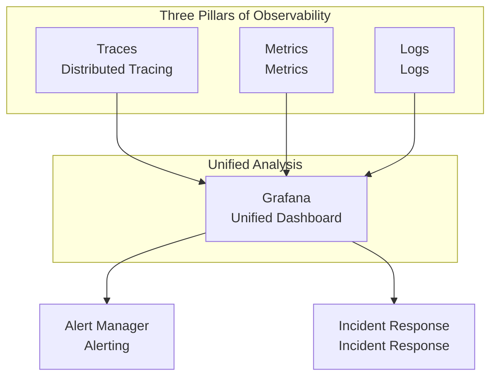
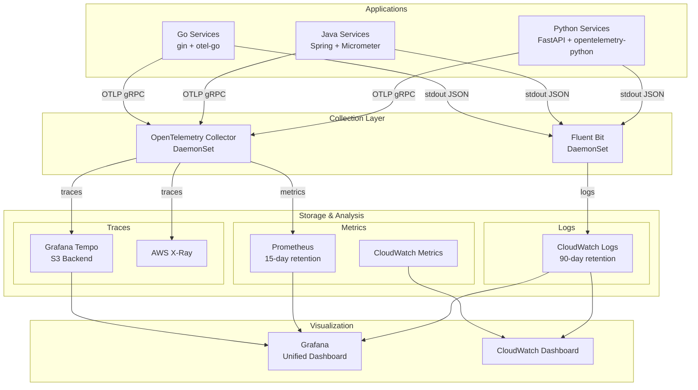
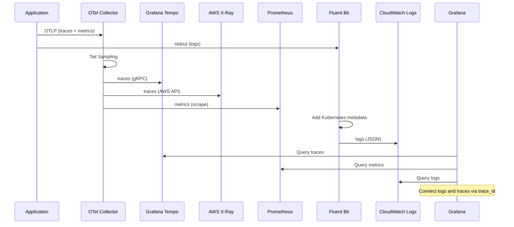
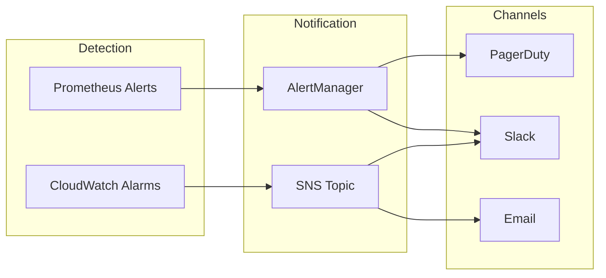

# Observability Overview

This section introduces the complete observability stack for the multi-region shopping mall platform. To quickly identify and resolve issues in distributed systems, we integrate three core elements: **Traces**, **Metrics**, and **Logs**.

## Three Pillars of Observability



| Pillar | Purpose | Tools |
|--------|---------|-------|
| **Traces** | Track entire request flow | OpenTelemetry, Tempo, X-Ray |
| **Metrics** | Quantify system state | Prometheus, CloudWatch |
| **Logs** | Detailed event records | Fluent Bit, CloudWatch Logs |

## Overall Architecture



## Core Components

### 1. OpenTelemetry Collector (DaemonSet)

Runs on all nodes and collects telemetry data from application Pods.

```yaml
# Receiver Ports
- OTLP gRPC: 4317
- OTLP HTTP: 4318
- Prometheus metrics: 8889

# Key Features
- Tail-based Sampling (errors 100%, slow requests 100%, default 10%)
- Batch processing (1024 batch size)
- Memory limit (512Mi)
```

**Dual Export:**
- **Grafana Tempo**: Long-term storage and detailed analysis
- **AWS X-Ray**: AWS service integration and service map

### 2. Prometheus + Grafana

```yaml
# Prometheus Settings
retention: 15d
storage: 50Gi (gp3)
serviceMonitor: Auto-discovery

# Grafana Settings
persistence: 10Gi
dataSource:
  - Prometheus (default)
  - Tempo (traces)
  - CloudWatch (AWS metrics)
```

### 3. Fluent Bit (DaemonSet)

Collects all container logs and sends them to CloudWatch Logs.

```yaml
# Log Group Structure
/eks/{cluster-name}/containers

# Log Stream
{node-name}-{container-name}

# Retention Period
90 days
```

### 4. CloudWatch Integration

CloudWatch resources managed by Terraform:

```hcl
# Log Groups by Namespace
- /eks/multi-region-mall/core-services
- /eks/multi-region-mall/user-services
- /eks/multi-region-mall/fulfillment
- /eks/multi-region-mall/business-services
- /eks/multi-region-mall/platform

# Key Alarms
- high-error-rate: 5XX error rate > 1%
- high-latency: Response time > 2 seconds
- aurora-replication-lag: Replication lag > 1000ms
- msk-under-replicated: Under-replicated partition detected
```

## Detailed Data Flow



## Regional Configuration

Each region (us-east-1, us-west-2) operates an independent observability stack:

| Component | us-east-1 | us-west-2 |
|-----------|-----------|-----------|
| OTel Collector | DaemonSet | DaemonSet |
| Tempo | S3 bucket (use1) | S3 bucket (usw2) |
| Prometheus | 50Gi PVC | 50Gi PVC |
| CloudWatch | /eks/multi-region-mall/* | /eks/multi-region-mall/* |

### Tempo IRSA Configuration

Regional IAM Roles are automatically patched through ArgoCD ApplicationSet:

```yaml
# appset-tempo.yaml
patches:
  - target:
      kind: ServiceAccount
      name: tempo
    patch: |-
      - op: replace
        path: /metadata/annotations/eks.amazonaws.com~1role-arn
        value: "arn:aws:iam::123456789012:role/production-tempo-{{metadata.labels.region}}"
```

## Alerting and Escalation



## Quick Start

### 1. Access Grafana

```bash
# Port forwarding
kubectl port-forward svc/prometheus-grafana -n monitoring 3000:80

# Access in browser
open http://localhost:3000
# Default account: admin / prom-operator
```

### 2. Search Traces

```bash
# Search traces via Tempo API
curl -G http://localhost:3200/api/search \
  --data-urlencode 'tags=service.name=order-service' \
  --data-urlencode 'minDuration=500ms'
```

### 3. Query Logs

```bash
# CloudWatch Logs Insights
aws logs start-query \
  --log-group-name "/eks/multi-region-mall/core-services" \
  --query-string 'fields @timestamp, @message | filter @message like /ERROR/ | limit 100'
```

## Related Documentation

- [Distributed Tracing](/observability/distributed-tracing) - OpenTelemetry detailed configuration
- [Prometheus Metrics](/observability/metrics-prometheus) - Metrics collection and alerting
- [Logging](/observability/logging) - Fluent Bit and log format
- [Dashboards](/observability/dashboards) - Grafana dashboard configuration
