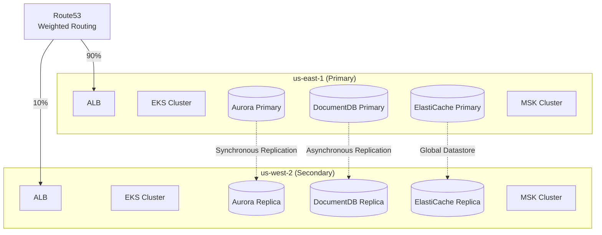
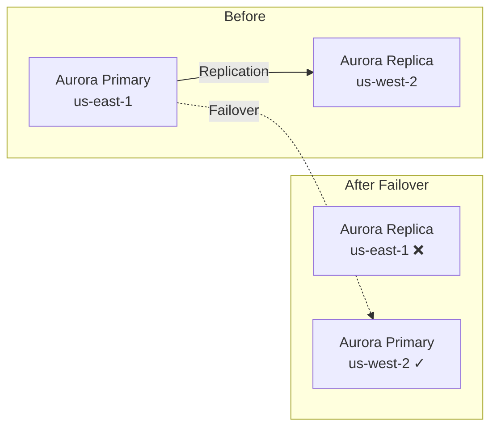
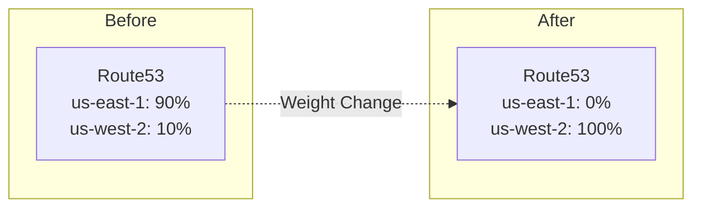
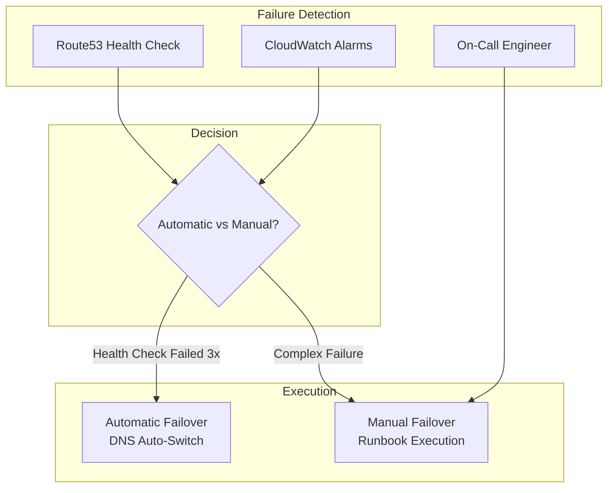

# Disaster Recovery

This document explains the disaster recovery (DR) strategy for the multi-region shopping mall platform. Our targets are **RPO < 1 second** and **RTO < 10 minutes**.

## DR Objectives

| Metric | Target | Description |
|--------|--------|-------------|
| **RPO** (Recovery Point Objective) | < 1 second | Maximum acceptable data loss time |
| **RTO** (Recovery Time Objective) | < 10 minutes | Maximum time to service recovery |
| **Availability** | 99.99% | Annual downtime < 53 minutes |

## Region Configuration



## Recovery Tiers

### Tier 1: Database Failover (RTO: 1-2 minutes)

Automatic/manual failover for single database failures.



**Target Services:**
- Aurora Global Database
- DocumentDB Global Cluster
- ElastiCache Global Datastore

### Tier 2: DNS Failover (RTO: 2-5 minutes)

Adjust Route53 weights for application layer failures.



### Tier 3: Full Region Failover (RTO: 5-10 minutes)

Complete transition to Secondary region when Primary region fails entirely.



## Data Store Recovery Status

| Data Store | Replication Method | RPO | Auto Failover | Notes |
|------------|-------------------|-----|---------------|-------|
| **Aurora Global** | Synchronous Replication | < 1 second | Supported | Global Database |
| **DocumentDB Global** | Asynchronous Replication | < 1 second | Manual | Global Cluster |
| **ElastiCache Global** | Asynchronous Replication | < 1 second | Supported | Global Datastore |
| **OpenSearch** | Independent Clusters | N/A | N/A | Separate per region |
| **MSK** | Independent Clusters | N/A | N/A | Separate per region |
| **S3** | Cross-Region Replication | < 15 minutes | N/A | Asynchronous |

## Runbook: Tier 1 - Aurora Failover

### Prerequisites
- Aurora Global Database configured
- Reader instance exists in Secondary region
- Replication lag < 100ms

### Procedure

```bash
# 1. Check current status
aws rds describe-global-clusters \
  --global-cluster-identifier production-aurora-global \
  --query 'GlobalClusters[0].GlobalClusterMembers'

# 2. Check replication lag
aws cloudwatch get-metric-statistics \
  --namespace AWS/RDS \
  --metric-name AuroraReplicaLag \
  --dimensions Name=DBClusterIdentifier,Value=production-aurora-global-us-west-2 \
  --start-time $(date -u -d '10 minutes ago' +%Y-%m-%dT%H:%M:%SZ) \
  --end-time $(date -u +%Y-%m-%dT%H:%M:%SZ) \
  --period 60 \
  --statistics Average

# 3. Promote Secondary to Primary (Planned)
aws rds failover-global-cluster \
  --global-cluster-identifier production-aurora-global \
  --target-db-cluster-identifier arn:aws:rds:us-west-2:123456789012:cluster:production-aurora-global-us-west-2

# 4. Verify promotion complete
aws rds describe-global-clusters \
  --global-cluster-identifier production-aurora-global \
  --query 'GlobalClusters[0].GlobalClusterMembers[?IsWriter==`true`].DBClusterArn'
```

### Expected Duration
- Planned failover: 1-2 minutes
- Unplanned failover: 2-5 minutes

## Runbook: Tier 2 - DNS Failover

### Procedure

```bash
# 1. Check current Route53 weights
aws route53 list-resource-record-sets \
  --hosted-zone-id Z1234567890ABC \
  --query "ResourceRecordSets[?Name=='api.atomai.click.']"

# 2. Change us-east-1 weight to 0
aws route53 change-resource-record-sets \
  --hosted-zone-id Z1234567890ABC \
  --change-batch '{
    "Changes": [{
      "Action": "UPSERT",
      "ResourceRecordSet": {
        "Name": "api.atomai.click",
        "Type": "A",
        "SetIdentifier": "us-east-1",
        "Weight": 0,
        "AliasTarget": {
          "HostedZoneId": "Z0EXAMPLE7654321",
          "DNSName": "alb-us-east-1.elb.amazonaws.com",
          "EvaluateTargetHealth": true
        }
      }
    }]
  }'

# 3. Change us-west-2 weight to 100
aws route53 change-resource-record-sets \
  --hosted-zone-id Z1234567890ABC \
  --change-batch '{
    "Changes": [{
      "Action": "UPSERT",
      "ResourceRecordSet": {
        "Name": "api.atomai.click",
        "Type": "A",
        "SetIdentifier": "us-west-2",
        "Weight": 100,
        "AliasTarget": {
          "HostedZoneId": "Z0EXAMPLEABCDEFG",
          "DNSName": "alb-us-west-2.elb.amazonaws.com",
          "EvaluateTargetHealth": true
        }
      }
    }]
  }'

# 4. Verify change propagation
aws route53 get-change --id <change-id>

# 5. Verify DNS
dig api.atomai.click +short
```

## Runbook: Tier 3 - Full Region Failover

### Checklist

```markdown
## Pre-Failover Verification
- [ ] Identify failure cause (temporary vs long-term)
- [ ] Verify Secondary region status is healthy
- [ ] Check data replication status (all DBs)
- [ ] Team notification and approval

## Failover Execution
- [ ] 1. Aurora Global failover
- [ ] 2. DocumentDB failover
- [ ] 3. ElastiCache failover
- [ ] 4. Route53 DNS weight change
- [ ] 5. Verify ArgoCD application sync

## Post-Failover Verification
- [ ] All services pass Health Check
- [ ] Verify key API responses
- [ ] Error rate within normal range
- [ ] Update status page
```

### Full Failover Script

```bash
#!/bin/bash
# full-region-failover.sh

set -e

SOURCE_REGION="us-east-1"
TARGET_REGION="us-west-2"

echo "=== Starting Full Region Failover ==="
echo "From: ${SOURCE_REGION} -> To: ${TARGET_REGION}"
echo ""

# 1. Aurora Failover
echo "[1/5] Aurora Global Database failover..."
aws rds failover-global-cluster \
  --global-cluster-identifier production-aurora-global \
  --target-db-cluster-identifier arn:aws:rds:${TARGET_REGION}:123456789012:cluster:production-aurora-global-${TARGET_REGION}
echo "Aurora failover initiated"

# 2. DocumentDB Failover (Manual)
echo "[2/5] DocumentDB failover..."
# For DocumentDB, detach Secondary from Global Cluster then promote
aws docdb modify-global-cluster \
  --global-cluster-identifier production-docdb-global \
  --deletion-protection false
aws docdb remove-from-global-cluster \
  --global-cluster-identifier production-docdb-global \
  --db-cluster-identifier production-docdb-global-${TARGET_REGION}
echo "DocumentDB failover complete"

# 3. ElastiCache Failover
echo "[3/5] ElastiCache Global Datastore failover..."
aws elasticache failover-global-replication-group \
  --global-replication-group-id production-elasticache-global \
  --primary-region ${TARGET_REGION} \
  --primary-replication-group-id production-elasticache-${TARGET_REGION}
echo "ElastiCache failover initiated"

# 4. Route53 Weight Change
echo "[4/5] Changing Route53 DNS weights..."
# (Execute DNS failover commands above)
echo "DNS weight change complete"

# 5. Status Verification
echo "[5/5] Verifying status..."
sleep 60

# Health Check
curl -s https://api.atomai.click/health | jq .
echo ""
echo "=== Failover Complete ==="
```

## Post-Recovery Procedures

### 1. When Original Region Recovers

```bash
# 1. Verify original region infrastructure status
aws ec2 describe-availability-zones --region us-east-1

# 2. Resynchronize databases
# Aurora: Reverse replication is automatically configured
# DocumentDB: Global Cluster reconfiguration required
# ElastiCache: Global Datastore auto-syncs

# 3. Gradual traffic restoration
# us-east-1: 10% -> 30% -> 50% -> 90%
```

### 2. Post-Mortem Analysis

```markdown
## Incident Report Template

### Overview
- Occurrence Time:
- Detection Time:
- Recovery Time:
- Impact Scope:

### Timeline
| Time | Event |
|------|-------|
| HH:MM | Failure occurred |
| HH:MM | Alert received |
| HH:MM | Failover decision |
| HH:MM | Failover complete |
| HH:MM | Service normalized |

### Root Cause

### Impact Assessment
- Affected users:
- Failed requests:
- Revenue impact:

### Improvement Actions
1.
2.
3.
```

## Regular DR Drills

### Quarterly Drill Schedule

| Drill | Frequency | Scope | Target RTO |
|-------|-----------|-------|------------|
| DB Failover | Monthly | Tier 1 | < 2 minutes |
| DNS Failover | Quarterly | Tier 2 | < 5 minutes |
| Full Region Failover | Semi-annually | Tier 3 | < 10 minutes |
| Chaos Engineering | Monthly | Random | Measure |

### Drill Checklist

```markdown
## DR Drill Preparation
- [ ] Announce drill schedule (at least 1 week ahead)
- [ ] Prepare rollback plan
- [ ] Prepare monitoring dashboards
- [ ] Verify communication channels

## Drill Execution
- [ ] Record baseline metrics
- [ ] Execute failover
- [ ] Measure RTO
- [ ] Verify data integrity

## Post-Drill
- [ ] Document results
- [ ] Identify improvements
- [ ] Confirm next drill schedule
```

## Related Documentation

- [Failover Procedures](/operations/failover-procedures)
- [Seed Data](/operations/seed-data)
- [Troubleshooting](/operations/troubleshooting)
