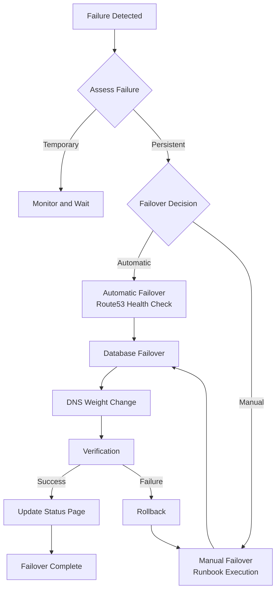
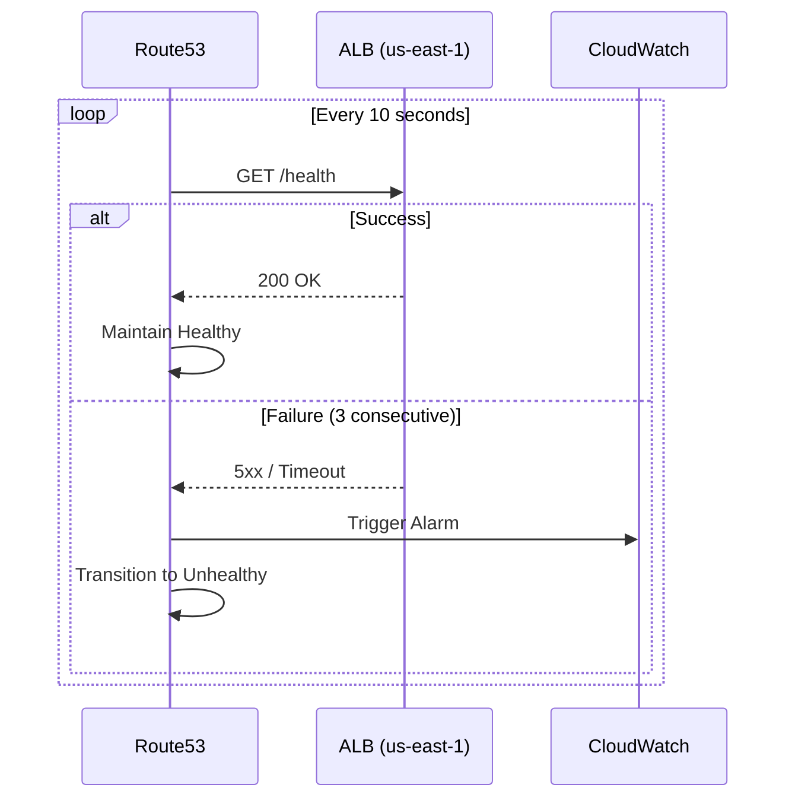

# Failover Procedures

This document provides detailed step-by-step failover procedures for regional failures.

## Failover Flow



## Step 1: Failure Detection (Detect)

### Route53 Health Check



### Check Health Check Status

```bash
# Query Route53 Health Check status
aws route53 get-health-check-status \
  --health-check-id <health-check-id>

# Example result
{
  "HealthCheckObservations": [
    {
      "Region": "us-east-1",
      "StatusReport": {
        "Status": "Failure",
        "CheckedTime": "2026-03-15T10:30:00Z"
      }
    }
  ]
}
```

### Check CloudWatch Alarms

```bash
# Check alarm status
aws cloudwatch describe-alarms \
  --alarm-names "production-high-error-rate" "production-high-latency" \
  --query 'MetricAlarms[*].[AlarmName,StateValue,StateReason]' \
  --output table
```

## Step 2: Failure Assessment (Assess)

### Checklist

```bash
#!/bin/bash
# assess-failure.sh

echo "=== Starting Failure Assessment ==="

# 1. EKS Cluster Status
echo "[1] EKS Cluster Status"
aws eks describe-cluster --name multi-region-mall --region us-east-1 \
  --query 'cluster.status'

# 2. Node Status
echo "[2] Node Status"
kubectl get nodes --context=us-east-1

# 3. Pod Status
echo "[3] Pod Status (core-services)"
kubectl get pods -n core-services --context=us-east-1 | grep -v Running

# 4. Aurora Status
echo "[4] Aurora Cluster Status"
aws rds describe-db-clusters \
  --db-cluster-identifier production-aurora-global-us-east-1 \
  --query 'DBClusters[0].Status'

# 5. DocumentDB Status
echo "[5] DocumentDB Cluster Status"
aws docdb describe-db-clusters \
  --db-cluster-identifier production-docdb-global-us-east-1 \
  --query 'DBClusters[0].Status'

# 6. ElastiCache Status
echo "[6] ElastiCache Status"
aws elasticache describe-replication-groups \
  --replication-group-id production-elasticache-us-east-1 \
  --query 'ReplicationGroups[0].Status'

# 7. MSK Status
echo "[7] MSK Cluster Status"
aws kafka describe-cluster \
  --cluster-arn arn:aws:kafka:us-east-1:123456789012:cluster/production-msk-us-east-1 \
  --query 'ClusterInfo.State'

echo "=== Assessment Complete ==="
```

### Failure Type Classification

| Type | Symptoms | Recommended Action |
|------|----------|-------------------|
| **Network Failure** | Intermittent timeouts, packet loss | Monitor, wait for auto-recovery |
| **Application Failure** | Specific service 5xx | Pod restart, scale out |
| **Database Failure** | DB connection failures | DB failover (Tier 1) |
| **Region Failure** | All services unavailable | Full failover (Tier 3) |

## Step 3: Failover Decision (Decide)

### Automatic Failover Conditions

- Route53 Health Check fails 3 consecutive times
- Or CloudWatch Alarm in ALARM state for 5+ minutes

### Manual Failover Conditions

- Complex failures (data consistency issues)
- Partial failures (only specific services affected)
- Automatic failover failed

### Decision Tree

```
Failure duration?
├── < 5 minutes: Monitor
├── 5-15 minutes: Consider DB failover
└── > 15 minutes: Execute full failover

Data consistency?
├── Normal: Proceed with automatic failover
└── Suspect: Manual failover + data verification
```

## Step 4: Failover Execution (Execute)

### 4.1 Aurora Global Database Failover

```bash
# 1. Check current Global Cluster status
aws rds describe-global-clusters \
  --global-cluster-identifier production-aurora-global \
  --query 'GlobalClusters[0].{
    GlobalClusterIdentifier: GlobalClusterIdentifier,
    Status: Status,
    Members: GlobalClusterMembers[*].{
      Cluster: DBClusterArn,
      IsWriter: IsWriter,
      Status: GlobalWriteForwardingStatus
    }
  }'

# 2. Check replication lag (< 100ms recommended)
aws cloudwatch get-metric-statistics \
  --namespace AWS/RDS \
  --metric-name AuroraReplicaLag \
  --dimensions Name=DBClusterIdentifier,Value=production-aurora-global-us-west-2 \
  --start-time $(date -u -d '5 minutes ago' +%Y-%m-%dT%H:%M:%SZ) \
  --end-time $(date -u +%Y-%m-%dT%H:%M:%SZ) \
  --period 60 \
  --statistics Average \
  --query 'Datapoints[*].Average'

# 3. Execute failover
aws rds failover-global-cluster \
  --global-cluster-identifier production-aurora-global \
  --target-db-cluster-identifier arn:aws:rds:us-west-2:123456789012:cluster:production-aurora-global-us-west-2

# 4. Monitor failover progress
watch -n 5 "aws rds describe-global-clusters \
  --global-cluster-identifier production-aurora-global \
  --query 'GlobalClusters[0].GlobalClusterMembers[*].[DBClusterArn,IsWriter]'"

# 5. Verify new Primary endpoint
aws rds describe-db-clusters \
  --db-cluster-identifier production-aurora-global-us-west-2 \
  --query 'DBClusters[0].Endpoint'
```

### 4.2 DocumentDB Global Cluster Failover

```bash
# 1. Check Global Cluster status
aws docdb describe-global-clusters \
  --global-cluster-identifier production-docdb-global

# 2. Detach Secondary cluster
aws docdb remove-from-global-cluster \
  --global-cluster-identifier production-docdb-global \
  --db-cluster-identifier production-docdb-global-us-west-2

# 3. Detached cluster becomes independent Primary
# Endpoint: production-docdb-global-us-west-2.cluster-xxx.us-west-2.docdb.amazonaws.com

# 4. Application connection string update required
# Update ConfigMap or Secret
kubectl set env deployment/product-catalog -n core-services \
  DOCUMENTDB_HOST=production-docdb-global-us-west-2.cluster-yyyyyyyyyyyy.us-west-2.docdb.amazonaws.com
```

### 4.3 ElastiCache Global Datastore Failover

```bash
# 1. Check Global Datastore status
aws elasticache describe-global-replication-groups \
  --global-replication-group-id production-elasticache-global \
  --query 'GlobalReplicationGroups[0].{
    Status: Status,
    PrimaryCluster: PrimaryReplicationGroupId,
    Members: Members[*].{
      ReplicationGroupId: ReplicationGroupId,
      Role: Role,
      Status: Status
    }
  }'

# 2. Execute failover
aws elasticache failover-global-replication-group \
  --global-replication-group-id production-elasticache-global \
  --primary-region us-west-2 \
  --primary-replication-group-id production-elasticache-us-west-2

# 3. Wait for failover completion
aws elasticache wait replication-group-available \
  --replication-group-id production-elasticache-us-west-2

# 4. Verify new endpoint
aws elasticache describe-replication-groups \
  --replication-group-id production-elasticache-us-west-2 \
  --query 'ReplicationGroups[0].ConfigurationEndpoint'
```

### 4.4 Route53 DNS Weight Change

```bash
# 1. Check current records
HOSTED_ZONE_ID="Z1234567890ABC"

aws route53 list-resource-record-sets \
  --hosted-zone-id ${HOSTED_ZONE_ID} \
  --query "ResourceRecordSets[?Name=='api.atomai.click.']"

# 2. Change us-east-1 to 0, us-west-2 to 100
cat << 'EOF' > /tmp/dns-failover.json
{
  "Changes": [
    {
      "Action": "UPSERT",
      "ResourceRecordSet": {
        "Name": "api.atomai.click",
        "Type": "A",
        "SetIdentifier": "primary-us-east-1",
        "Weight": 0,
        "AliasTarget": {
          "HostedZoneId": "Z0EXAMPLE7654321",
          "DNSName": "dualstack.prod-alb-us-east-1-123456.us-east-1.elb.amazonaws.com",
          "EvaluateTargetHealth": true
        }
      }
    },
    {
      "Action": "UPSERT",
      "ResourceRecordSet": {
        "Name": "api.atomai.click",
        "Type": "A",
        "SetIdentifier": "secondary-us-west-2",
        "Weight": 100,
        "AliasTarget": {
          "HostedZoneId": "Z0EXAMPLEABCDEFG",
          "DNSName": "dualstack.prod-alb-us-west-2-654321.us-west-2.elb.amazonaws.com",
          "EvaluateTargetHealth": true
        }
      }
    }
  ]
}
EOF

aws route53 change-resource-record-sets \
  --hosted-zone-id ${HOSTED_ZONE_ID} \
  --change-batch file:///tmp/dns-failover.json

# 3. Check change status
CHANGE_ID=$(aws route53 change-resource-record-sets ... --query 'ChangeInfo.Id' --output text)
aws route53 get-change --id ${CHANGE_ID}

# 4. Verify DNS propagation
dig api.atomai.click +short
nslookup api.atomai.click 8.8.8.8
```

## Step 5: Verification (Verify)

### 5.1 Health Check Verification

```bash
# API health check
curl -s https://api.atomai.click/health | jq .

# Expected response
{
  "status": "healthy",
  "region": "us-west-2",
  "timestamp": "2026-03-15T10:35:00Z",
  "services": {
    "database": "healthy",
    "cache": "healthy",
    "kafka": "healthy"
  }
}
```

### 5.2 Data Integrity Verification

```bash
# Aurora connection test
kubectl exec -it deploy/order-service -n core-services -- \
  psql -h $AURORA_HOST -U mall_admin -d mall -c "SELECT count(*) FROM orders;"

# DocumentDB connection test
kubectl exec -it deploy/product-catalog -n core-services -- \
  mongosh "$DOCUMENTDB_URI" --eval "db.products.countDocuments()"

# ElastiCache connection test
kubectl exec -it deploy/cart-service -n core-services -- \
  redis-cli -h $ELASTICACHE_HOST PING
```

### 5.3 Service Functional Tests

```bash
# Test key API endpoints
ENDPOINTS=(
  "/api/v1/products"
  "/api/v1/users/health"
  "/api/v1/orders/health"
  "/api/v1/cart/health"
)

for endpoint in "${ENDPOINTS[@]}"; do
  echo -n "Testing ${endpoint}: "
  STATUS=$(curl -s -o /dev/null -w "%{http_code}" "https://api.atomai.click${endpoint}")
  if [ "$STATUS" == "200" ]; then
    echo "OK"
  else
    echo "FAILED (${STATUS})"
  fi
done
```

### 5.4 Error Rate Check

```bash
# Prometheus query (last 5 minutes error rate)
curl -s "http://prometheus:9090/api/v1/query" \
  --data-urlencode 'query=sum(rate(http_requests_total{status=~"5.."}[5m])) / sum(rate(http_requests_total[5m])) * 100' \
  | jq '.data.result[0].value[1]'

# Acceptable threshold: < 1%
```

## Step 6: Communication (Communicate)

### Status Page Update

```markdown
## Service Status Update

**Time**: 2026-03-15 10:30 KST
**Status**: Recovered

### Timeline
- 10:15 - us-east-1 region failure detected
- 10:20 - Failover initiated
- 10:28 - Traffic transition to us-west-2 complete
- 10:30 - Service normalization confirmed

### Impact Scope
- Intermittent service delays for approximately 15 minutes
- No data loss

### Current Status
All services are operating normally in the us-west-2 region.
```

### Slack Notification

```bash
curl -X POST https://hooks.slack.com/services/xxx \
  -H 'Content-Type: application/json' \
  -d '{
    "channel": "#incidents",
    "username": "Failover Bot",
    "icon_emoji": ":rotating_light:",
    "attachments": [{
      "color": "good",
      "title": "Failover Complete",
      "text": "us-east-1 -> us-west-2 failover completed successfully.",
      "fields": [
        {"title": "RTO", "value": "8 minutes 32 seconds", "short": true},
        {"title": "Data Loss", "value": "None", "short": true}
      ],
      "ts": '"$(date +%s)"'
    }]
  }'
```

## Rollback Procedures

If issues occur after failover:

```bash
#!/bin/bash
# rollback-failover.sh

echo "=== Starting Failover Rollback ==="

# 1. Restore DNS to original
aws route53 change-resource-record-sets \
  --hosted-zone-id ${HOSTED_ZONE_ID} \
  --change-batch file:///tmp/dns-original.json

# 2. Do not rollback databases (risk of data loss)
# Instead, wait for original region recovery then resync

echo "DNS rollback complete. Database requires manual verification."
```

## Related Documentation

- [Disaster Recovery](/operations/disaster-recovery)
- [Troubleshooting](/operations/troubleshooting)
- [Observability Overview](/observability/overview)
