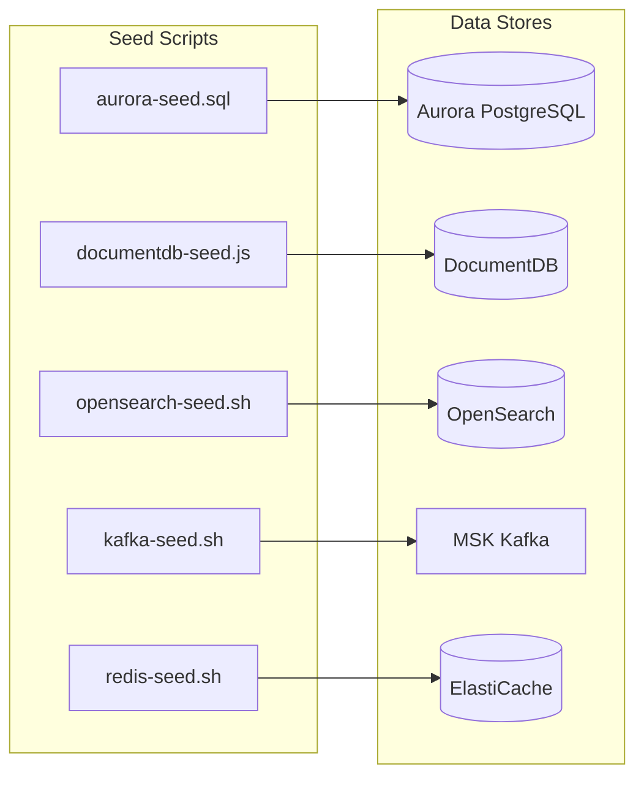
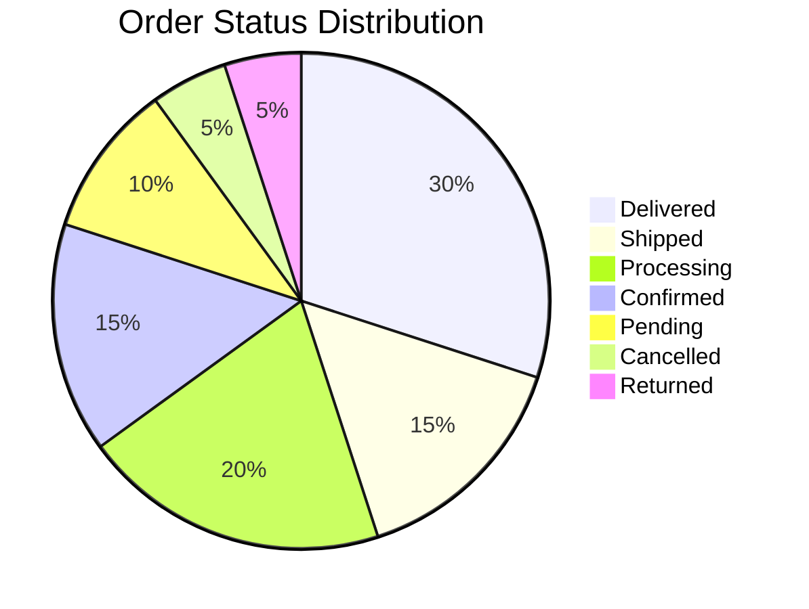

# Seed Data

This document explains the seed data configuration and execution methods for development, testing, and demo environments.

## Seed Data Overview



## Data Summary

| Data Store | Data Type | Count |
|------------|-----------|-------|
| **Aurora** | Users, Orders, Payments, Inventory, Shipments | 50 users, 200 orders, 150 inventory items |
| **DocumentDB** | Categories, Products, Profiles, Wishlists, Reviews, Notifications | 10 categories, 150 products, 300 reviews |
| **OpenSearch** | Product Search Index | 150 products |
| **MSK** | Kafka Topics | 40+ topics |
| **ElastiCache** | Cache, Sessions, Carts | Multiple keys |

## Categories (10)

| ID | Category Name | Slug |
|----|---------------|------|
| CAT-01 | Electronics | electronics |
| CAT-02 | Fashion | fashion |
| CAT-03 | Food | food |
| CAT-04 | Beauty | beauty |
| CAT-05 | Home Appliances | appliances |
| CAT-06 | Sports | sports |
| CAT-07 | Books | books |
| CAT-08 | Pets | pets |
| CAT-09 | Furniture | furniture |
| CAT-10 | Baby Products | baby |

## Products (150)

15 products per category, totaling 150 products tailored for the Korean market.

### Electronics (CAT-01)

| Product Name | Brand | Price |
|--------------|-------|-------|
| Samsung Galaxy S25 Ultra | Samsung Electronics | 1,799,000 KRW |
| iPhone 16 Pro Max | Apple | 1,990,000 KRW |
| LG Gram 17-inch Laptop | LG Electronics | 2,190,000 KRW |
| Samsung Galaxy Tab S10 | Samsung Electronics | 1,290,000 KRW |
| Sony WH-1000XM6 Headphones | Sony | 459,000 KRW |

### Fashion (CAT-02)

| Product Name | Brand | Price |
|--------------|-------|-------|
| Nike Air Max DN | Nike | 199,000 KRW |
| The North Face Nuptse Puffer | The North Face | 369,000 KRW |
| Levi's 501 Original Jeans | Levi's | 129,000 KRW |
| Musinsa Standard Sweatshirt | Musinsa Standard | 29,900 KRW |

### Food (CAT-03)

| Product Name | Brand | Price |
|--------------|-------|-------|
| Nongshim Shin Ramyun Multi-Pack | Nongshim | 4,980 KRW |
| Bibigo Wang Dumplings 1kg | CJ Bibigo | 12,900 KRW |
| Jongga Whole Kimchi 3kg | Jongga | 22,900 KRW |
| Chamisul Fresh 360ml x20 | HiteJinro | 28,900 KRW |

## Users (50)

Test users with Korean names.

```sql
-- Example users
('a0000001-0000-0000-0000-000000000001', 'kim.minjun@gmail.com', 'Minjun Kim', 'active'),
('a0000001-0000-0000-0000-000000000002', 'lee.soyeon@naver.com', 'Soyeon Lee', 'active'),
('a0000001-0000-0000-0000-000000000003', 'park.jihoon@kakao.com', 'Jihoon Park', 'active'),
...
```

### Membership Tiers

| Tier | User Count |
|------|------------|
| bronze | 10 |
| silver | 10 |
| gold | 15 |
| platinum | 10 |
| diamond | 4 |
| vip | 1 |

## Orders (200)

Order data with various statuses.

### Order Status Distribution



### Shipping Addresses

| City | District | Example Address |
|------|----------|-----------------|
| Seoul | Gangnam-gu | Teheran-ro 152 |
| Seoul | Mapo-gu | World Cup-buk-ro 396 |
| Busan | Haeundae-gu | Haeundae Beach-ro 264 |
| Incheon | Yeonsu-gu | Songdo Science-ro 32 |
| Daejeon | Yuseong-gu | University-ro 99 |
| Daegu | Suseong-gu | Dalgubeol-daero 2503 |
| Gwangju | Seo-gu | Sangmu-daero 1001 |
| Suwon | Yeongtong-gu | Samsung-ro 129 |
| Seongnam | Bundang-gu | Pangyo Station-ro 235 |
| Jeju | Jeju-si | Nohyeong-ro 75 |

## Kafka Topics

### Topics by Domain

```bash
# Order Domain
order.created           (12 partitions)
order.confirmed         (12 partitions)
order.cancelled         (6 partitions)
order.status-changed    (12 partitions)

# Payment Domain
payment.initiated       (12 partitions)
payment.completed       (12 partitions)
payment.failed          (6 partitions)
payment.refunded        (6 partitions)

# Inventory Domain
inventory.reserved      (12 partitions)
inventory.released      (6 partitions)
inventory.low-stock     (3 partitions)
inventory.restocked     (6 partitions)

# Shipping Domain
shipping.dispatched     (12 partitions)
shipping.in-transit     (12 partitions)
shipping.delivered      (12 partitions)
shipping.returned       (6 partitions)

# Notification Domain
notification.email      (6 partitions)
notification.push       (6 partitions)
notification.sms        (3 partitions)
notification.kakao      (6 partitions)

# User Domain
user.registered         (6 partitions)
user.profile-updated    (6 partitions)
user.login              (6 partitions)

# Product Domain
product.created         (6 partitions)
product.updated         (6 partitions)
product.price-changed   (6 partitions)
product.viewed          (12 partitions)

# Review Domain
review.submitted        (6 partitions)
review.approved         (6 partitions)

# Analytics Domain
search.query-logged     (12 partitions)
analytics.page-view     (12 partitions)
analytics.click         (12 partitions)

# Infrastructure
dlq.all                 (6 partitions, 30-day retention)
saga.orchestrator       (12 partitions)
```

## ElastiCache Data

### Cache Types

| Key Pattern | Purpose | TTL |
|-------------|---------|-----|
| `product:{id}` | Product detail cache | 1 hour |
| `cache:categories` | Category list | 24 hours |
| `cart:{userId}` | Shopping cart | 7 days |
| `session:{sessionId}` | User session | 2 hours |
| `ratelimit:api:{userId}` | API Rate Limit | 60 seconds |
| `leaderboard:popular` | Popular products (Sorted Set) | Permanent |
| `stock:{productId}` | Real-time inventory | Permanent |
| `search-history:{userId}` | Search history | 30 days |
| `promo:*` | Promotion cache | Various |

### Example Data

```json
// Cart (cart:a0000001-0000-0000-0000-000000000001)
{
  "userId": "a0000001-0000-0000-0000-000000000001",
  "items": [
    {"productId": "PROD-001", "quantity": 2, "price": 1799000},
    {"productId": "PROD-015", "quantity": 1, "price": 299000}
  ],
  "updatedAt": "2026-03-15T10:00:00Z"
}

// Promotion (promo:flash-sale)
{
  "id": "FLASH-001",
  "title": "Today Only! Up to 50% Off Electronics",
  "products": ["PROD-001", "PROD-005", "PROD-010", "PROD-015"],
  "discountRate": 50
}
```

## Running Seed Scripts

### Environment Variables

```bash
# Aurora
export AURORA_ENDPOINT="production-aurora-global-us-east-1.cluster-xxx.us-east-1.rds.amazonaws.com"
export AURORA_USER="mall_admin"
export AURORA_PASSWORD="<password>"
export AURORA_DB="mall"

# DocumentDB
export DOCUMENTDB_URI="mongodb://mall_admin:<password>@production-docdb-global-us-east-1.cluster-xxx.us-east-1.docdb.amazonaws.com:27017/?tls=true&replicaSet=rs0"
export TLS_CA_FILE="/tmp/global-bundle.pem"

# OpenSearch
export OPENSEARCH_ENDPOINT="https://vpc-production-os-use1-xxx.us-east-1.es.amazonaws.com"
export OPENSEARCH_USER="admin"
export OPENSEARCH_PASS="<password>"

# MSK
export MSK_BOOTSTRAP="b-1.productionmskuseast1.xxx.c3.kafka.us-east-1.amazonaws.com:9096"
export KAFKA_HOME="/opt/kafka"

# ElastiCache
export ELASTICACHE_ENDPOINT="clustercfg.production-elasticache-us-east-1.xxx.use1.cache.amazonaws.com"
export ELASTICACHE_PORT="6379"
```

### Running Individual Scripts

```bash
cd /home/ec2-user/multi-region-architecture/scripts/seed-data

# Aurora PostgreSQL
PGPASSWORD=$AURORA_PASSWORD psql \
  -h $AURORA_ENDPOINT \
  -U $AURORA_USER \
  -d $AURORA_DB \
  -f seed-aurora.sql

# DocumentDB
# First download TLS CA certificate
wget -O /tmp/global-bundle.pem https://truststore.pki.rds.amazonaws.com/global/global-bundle.pem
node seed-documentdb.js

# OpenSearch
bash seed-opensearch.sh

# Kafka Topics
bash seed-kafka-topics.sh

# ElastiCache
bash seed-redis.sh
```

### Running Master Script

```bash
# Run all seed data at once
cd /home/ec2-user/multi-region-architecture/scripts/seed-data
bash run-seed.sh

# Example output
============================================
 Shopping Mall - Data Seeding
 Region: us-east-1
 Time:   2026-03-15T10:00:00Z
============================================

──────────────────────────────────────────
▶ Aurora PostgreSQL
──────────────────────────────────────────
Seed complete: 50 users, 200 orders, 200 payments, 150 inventory items, 180 shipments
✓ Aurora PostgreSQL completed

──────────────────────────────────────────
▶ DocumentDB
──────────────────────────────────────────
Inserted 10 categories
Inserted 150 products
Inserted 50 user profiles
Inserted 30 wishlists
Inserted 300 reviews
Inserted 50 notifications
✓ DocumentDB completed

──────────────────────────────────────────
▶ OpenSearch
──────────────────────────────────────────
Bulk indexing complete: 150 products indexed successfully
✓ OpenSearch completed

──────────────────────────────────────────
▶ MSK Topics
──────────────────────────────────────────
MSK seed complete: 42 topics created
✓ MSK Topics completed

──────────────────────────────────────────
▶ ElastiCache
──────────────────────────────────────────
Total keys: 350
✓ ElastiCache completed

============================================
 Seed Summary
============================================
 Succeeded: 5
 Failed:    0
 Skipped:   0
============================================
```

## Data Verification

### Aurora Verification

```sql
-- Check count per table
SELECT 'users' as table_name, count(*) FROM users
UNION ALL
SELECT 'orders', count(*) FROM orders
UNION ALL
SELECT 'order_items', count(*) FROM order_items
UNION ALL
SELECT 'payments', count(*) FROM payments
UNION ALL
SELECT 'inventory', count(*) FROM inventory
UNION ALL
SELECT 'shipments', count(*) FROM shipments;

-- Order status distribution
SELECT status, count(*) FROM orders GROUP BY status ORDER BY count DESC;
```

### DocumentDB Verification

```javascript
// mongosh
use mall

// Count per collection
db.getCollectionNames().forEach(c => {
  print(`${c}: ${db[c].countDocuments()}`);
});

// Products count by category
db.products.aggregate([
  { $group: { _id: "$category.name", count: { $sum: 1 } } },
  { $sort: { count: -1 } }
]);
```

### OpenSearch Verification

```bash
# List indices
curl -s -u $OPENSEARCH_USER:$OPENSEARCH_PASS --insecure \
  "$OPENSEARCH_ENDPOINT/_cat/indices?v"

# Test product search
curl -s -u $OPENSEARCH_USER:$OPENSEARCH_PASS --insecure \
  -X POST "$OPENSEARCH_ENDPOINT/products/_search" \
  -H 'Content-Type: application/json' \
  -d '{"query": {"match": {"name": "Samsung"}}, "size": 5}' | jq '.hits.hits[]._source.name'
```

### ElastiCache Verification

```bash
redis-cli -h $ELASTICACHE_ENDPOINT -p $ELASTICACHE_PORT --tls

# Key count
DBSIZE

# Top 5 popular products
ZREVRANGE leaderboard:popular 0 4 WITHSCORES

# Check cart
GET cart:a0000001-0000-0000-0000-000000000001
```

## Data Reset

To reset data after testing:

```bash
# Aurora - Truncate tables
psql -h $AURORA_ENDPOINT -U $AURORA_USER -d $AURORA_DB << 'EOF'
TRUNCATE shipments, payments, order_items, orders, inventory, users CASCADE;
EOF

# DocumentDB - Drop collections
mongosh "$DOCUMENTDB_URI" --eval "
  ['categories','products','user_profiles','wishlists','reviews','notifications']
    .forEach(c => db[c].drop())
"

# OpenSearch - Delete index
curl -X DELETE "$OPENSEARCH_ENDPOINT/products" --insecure -u $OPENSEARCH_USER:$OPENSEARCH_PASS

# ElastiCache - Flush all keys
redis-cli -h $ELASTICACHE_ENDPOINT --tls FLUSHALL
```

## Related Documentation

- [Disaster Recovery](/operations/disaster-recovery)
- [Troubleshooting](/operations/troubleshooting)
- [Data Architecture](/architecture/data)
