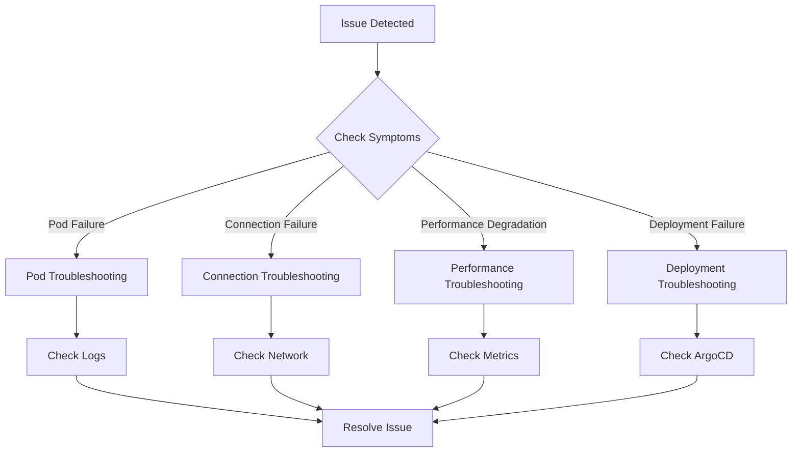

# Troubleshooting

This document explains common issues and solutions for operating the multi-region shopping mall platform.

## Problem Diagnosis Flow



## 1. Pod CrashLoopBackOff (DB Connection Failure)

### Symptoms
- Pod continuously restarts
- Status is `CrashLoopBackOff` or `Error`
- Database connection errors in logs

### Diagnosis

```bash
# 1. Check Pod status
kubectl get pods -n core-services -l app=order-service

# 2. Check Pod events
kubectl describe pod <pod-name> -n core-services

# 3. Check logs (including previous container)
kubectl logs <pod-name> -n core-services --previous

# 4. Example error messages
# "connection refused to production-aurora-global-us-east-1.cluster-xxx:5432"
# "dial tcp: lookup production-aurora... no such host"
```

### Causes and Solutions

#### Cause 1: Incorrect Database Endpoint

```bash
# Check Secret
kubectl get secret aurora-credentials -n core-services -o jsonpath='{.data.host}' | base64 -d

# Check actual Aurora endpoint
aws rds describe-db-clusters \
  --db-cluster-identifier production-aurora-global-us-east-1 \
  --query 'DBClusters[0].Endpoint'

# Update Secret
kubectl patch secret aurora-credentials -n core-services \
  -p '{"data":{"host":"'$(echo -n "correct-endpoint.rds.amazonaws.com" | base64)'"}}'

# Restart Pod
kubectl rollout restart deployment/order-service -n core-services
```

#### Cause 2: Missing Security Group Rules

```bash
# Get EKS Node Security Group ID
EKS_SG=$(aws eks describe-cluster --name multi-region-mall \
  --query 'cluster.resourcesVpcConfig.clusterSecurityGroupId' --output text)

# Add inbound rule to Aurora Security Group
aws ec2 authorize-security-group-ingress \
  --group-id <aurora-sg-id> \
  --protocol tcp \
  --port 5432 \
  --source-group $EKS_SG
```

#### Cause 3: IAM Authentication Issue (IRSA)

```bash
# Check ServiceAccount
kubectl get sa order-service -n core-services -o yaml

# Check IAM Role ARN
kubectl get sa order-service -n core-services \
  -o jsonpath='{.metadata.annotations.eks\.amazonaws\.com/role-arn}'

# Check IAM Role policy
aws iam get-role-policy \
  --role-name production-order-service-role \
  --policy-name rds-connect-policy
```

## 2. Kafka Consumer Lag

### Symptoms
- Event processing delays
- Consumer lag continuously increasing
- Message processing timeouts

### Diagnosis

```bash
# 1. Check Consumer Group lag (MSK)
aws kafka describe-cluster --cluster-arn <cluster-arn> \
  --query 'ClusterInfo.ZookeeperConnectString'

# Check lag with Kafka tools
kafka-consumer-groups.sh --bootstrap-server $MSK_BOOTSTRAP \
  --group order-processor \
  --describe

# 2. Check lag in CloudWatch
aws cloudwatch get-metric-statistics \
  --namespace AWS/Kafka \
  --metric-name SumOffsetLag \
  --dimensions Name=ConsumerGroup,Value=order-processor \
  --start-time $(date -u -d '1 hour ago' +%Y-%m-%dT%H:%M:%SZ) \
  --end-time $(date -u +%Y-%m-%dT%H:%M:%SZ) \
  --period 300 \
  --statistics Sum
```

### Causes and Solutions

#### Cause 1: Insufficient Consumer Processing Speed

```bash
# Check Consumer Pod count
kubectl get pods -n core-services -l app=order-processor

# Check HPA status
kubectl get hpa order-processor -n core-services

# Manual scale out
kubectl scale deployment/order-processor -n core-services --replicas=10

# Or check KEDA ScaledObject
kubectl get scaledobject order-processor -n core-services -o yaml
```

#### Cause 2: Retries Due to Processing Errors

```bash
# Check Consumer logs for errors
kubectl logs -l app=order-processor -n core-services --tail=100 | grep -i error

# Check DLQ (Dead Letter Queue)
kafka-console-consumer.sh --bootstrap-server $MSK_BOOTSTRAP \
  --topic dlq.all \
  --from-beginning \
  --max-messages 10
```

#### Cause 3: Kafka Broker Issues

```bash
# Check broker status
aws kafka describe-cluster \
  --cluster-arn <cluster-arn> \
  --query 'ClusterInfo.{State:State,NumberOfBrokerNodes:NumberOfBrokerNodes}'

# Check under-replicated partitions
kafka-topics.sh --bootstrap-server $MSK_BOOTSTRAP \
  --describe \
  --under-replicated-partitions
```

## 3. ElastiCache Connection Timeout (Secondary Region)

### Symptoms
- Cache connection failure only in us-west-2 region
- "Connection timed out" errors
- us-east-1 works normally

### Diagnosis

```bash
# 1. Check ElastiCache endpoint
aws elasticache describe-replication-groups \
  --replication-group-id production-elasticache-us-west-2 \
  --query 'ReplicationGroups[0].ConfigurationEndpoint'

# 2. Test connection from Pod
kubectl exec -it deploy/cart-service -n core-services -- \
  redis-cli -h $ELASTICACHE_HOST -p 6379 --tls PING

# 3. Test network connectivity
kubectl exec -it deploy/cart-service -n core-services -- \
  nc -zv $ELASTICACHE_HOST 6379
```

### Causes and Solutions

#### Cause 1: VPC Peering / Transit Gateway Routing

```bash
# Check route table
aws ec2 describe-route-tables \
  --filters "Name=vpc-id,Values=<eks-vpc-id>" \
  --query 'RouteTables[*].Routes[?DestinationCidrBlock==`10.1.0.0/16`]'

# Add route after checking ElastiCache subnet CIDR
aws ec2 create-route \
  --route-table-id <rtb-id> \
  --destination-cidr-block 10.1.0.0/16 \
  --transit-gateway-id <tgw-id>
```

#### Cause 2: Security Group

```bash
# Check ElastiCache Security Group inbound
aws ec2 describe-security-groups \
  --group-ids <elasticache-sg-id> \
  --query 'SecurityGroups[0].IpPermissions'

# Allow access from us-west-2 EKS CIDR
aws ec2 authorize-security-group-ingress \
  --group-id <elasticache-sg-id> \
  --protocol tcp \
  --port 6379 \
  --cidr 10.2.0.0/16  # us-west-2 EKS VPC CIDR
```

#### Cause 3: Global Datastore Replication Lag

```bash
# Check replication lag
aws elasticache describe-global-replication-groups \
  --global-replication-group-id production-elasticache-global \
  --query 'GlobalReplicationGroups[0].Members[*].{Region:ReplicationGroupId,Status:Status}'
```

## 4. OpenSearch Indexing Failure

### Symptoms
- Incomplete product search results
- Indexing API error responses
- Bulk indexing partial failures

### Diagnosis

```bash
# 1. Check cluster health
curl -s -u $OS_USER:$OS_PASS --insecure \
  "$OPENSEARCH_ENDPOINT/_cluster/health" | jq .

# 2. Check index status
curl -s -u $OS_USER:$OS_PASS --insecure \
  "$OPENSEARCH_ENDPOINT/_cat/indices?v"

# 3. Check shard allocation issues
curl -s -u $OS_USER:$OS_PASS --insecure \
  "$OPENSEARCH_ENDPOINT/_cat/shards?v&h=index,shard,prirep,state,unassigned.reason"
```

### Causes and Solutions

#### Cause 1: Insufficient Disk Space

```bash
# Check disk usage per node
curl -s -u $OS_USER:$OS_PASS --insecure \
  "$OPENSEARCH_ENDPOINT/_cat/allocation?v"

# Delete old indices
curl -X DELETE -u $OS_USER:$OS_PASS --insecure \
  "$OPENSEARCH_ENDPOINT/old-index-2025-*"

# Or apply index lifecycle policy
```

#### Cause 2: Mapping Conflict

```bash
# Check current mapping
curl -s -u $OS_USER:$OS_PASS --insecure \
  "$OPENSEARCH_ENDPOINT/products/_mapping" | jq .

# Recreate index (when mapping changes)
curl -X DELETE -u $OS_USER:$OS_PASS --insecure \
  "$OPENSEARCH_ENDPOINT/products"

# Create index with new mapping
bash /home/ec2-user/multi-region-architecture/scripts/seed-data/seed-opensearch.sh
```

#### Cause 3: Bulk Request Size Exceeded

```bash
# Check bulk request size limit
curl -s -u $OS_USER:$OS_PASS --insecure \
  "$OPENSEARCH_ENDPOINT/_cluster/settings?include_defaults=true" \
  | jq '.defaults.http.max_content_length'

# Split into smaller batches for indexing
```

## 5. Terraform State Lock Conflict

### Symptoms
- "Error acquiring the state lock" during `terraform apply`
- Another process holds the lock

### Diagnosis

```bash
# Example error message
# Error: Error acquiring the state lock
# Lock Info:
#   ID:        xxxxxxxx-xxxx-xxxx-xxxx-xxxxxxxxxxxx
#   Path:      multi-region-mall-terraform-state/production/us-east-1/terraform.tfstate
#   Operation: OperationTypeApply
#   Who:       user@hostname
#   Created:   2026-03-15 10:00:00 +0000 UTC
```

### Causes and Solutions

#### Cause 1: Previous Run Terminated Abnormally

```bash
# 1. Check if another terraform process is running
ps aux | grep terraform

# 2. Check lock in DynamoDB
aws dynamodb scan \
  --table-name multi-region-mall-terraform-locks \
  --filter-expression "LockID = :lockid" \
  --expression-attribute-values '{":lockid":{"S":"multi-region-mall-terraform-state/production/us-east-1/terraform.tfstate"}}'

# 3. Force unlock (caution: verify no other user is running)
terraform force-unlock <lock-id>

# Or delete directly from DynamoDB
aws dynamodb delete-item \
  --table-name multi-region-mall-terraform-locks \
  --key '{"LockID":{"S":"multi-region-mall-terraform-state/production/us-east-1/terraform.tfstate"}}'
```

#### Cause 2: Preventing Concurrent Execution

```bash
# Limit Terraform execution concurrency in CI/CD
# GitHub Actions example
concurrency:
  group: terraform-${{ github.ref }}
  cancel-in-progress: false
```

## 6. ArgoCD Sync Failure

### Symptoms
- Application status is `OutOfSync` or `Degraded`
- No changes even after clicking Sync button
- Health check failures

### Diagnosis

```bash
# 1. Check Application status
argocd app get infra-tempo-us-east-1

# 2. Check Sync status details
argocd app get infra-tempo-us-east-1 --show-params

# 3. Check resource status
kubectl get all -n observability -l app=tempo

# 4. Check ArgoCD server logs
kubectl logs -n argocd deploy/argocd-server --tail=100
```

### Causes and Solutions

#### Cause 1: Resource Definition Conflict

```bash
# Check if manually created resources exist
kubectl get configmap tempo-config -n observability -o yaml

# Add annotation for ArgoCD to manage
kubectl annotate configmap tempo-config -n observability \
  argocd.argoproj.io/sync-options="Prune=false"

# Or delete existing resource and recreate with ArgoCD
kubectl delete configmap tempo-config -n observability
argocd app sync infra-tempo-us-east-1
```

#### Cause 2: Kustomize Patch Error

```bash
# Test Kustomize build
cd k8s/infra/tempo
kustomize build .

# Fix after checking errors
# e.g., incorrect patch target
```

#### Cause 3: Missing IRSA Role

```bash
# Check ServiceAccount IAM Role
kubectl get sa tempo -n observability \
  -o jsonpath='{.metadata.annotations.eks\.amazonaws\.com/role-arn}'

# If role missing, create with Terraform
cd terraform/environments/production/us-east-1
terraform apply -target=module.tempo_irsa

# Resync ArgoCD
argocd app sync infra-tempo-us-east-1 --force
```

## Quick Diagnosis Script

```bash
#!/bin/bash
# quick-diagnosis.sh

echo "=== Quick System Diagnosis ==="
echo ""

echo "[1] Cluster Node Status"
kubectl get nodes
echo ""

echo "[2] Problem Pods"
kubectl get pods -A | grep -v Running | grep -v Completed
echo ""

echo "[3] Recent Events (Warning)"
kubectl get events -A --sort-by='.lastTimestamp' | grep Warning | tail -10
echo ""

echo "[4] Resource Usage"
kubectl top nodes
echo ""

echo "[5] PVC Status"
kubectl get pvc -A | grep -v Bound
echo ""

echo "[6] ArgoCD Application Status"
argocd app list --output wide | grep -v Healthy
echo ""

echo "[7] Recent Error Logs"
kubectl logs -l app=order-service -n core-services --tail=10 2>/dev/null | grep -i error
echo ""

echo "=== Diagnosis Complete ==="
```

## Related Documentation

- [Disaster Recovery](/operations/disaster-recovery)
- [Failover Procedures](/operations/failover-procedures)
- [Observability Overview](/observability/overview)
- [Distributed Tracing](/observability/distributed-tracing)
