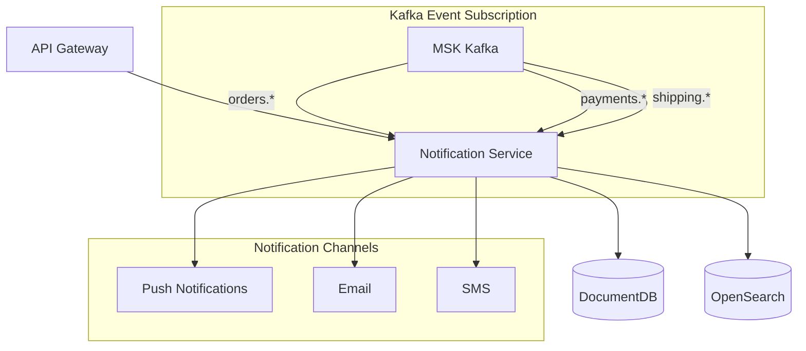
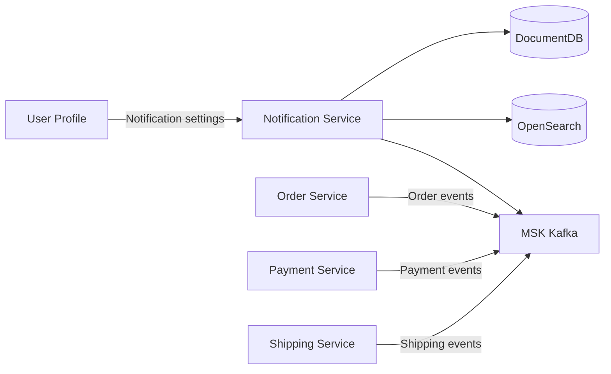

# Notification Service

## Overview

The Notification Service sends notifications to users through various channels (push, email, SMS). It subscribes to order/payment/shipping events to automatically generate notifications, and OpenSearch enables notification history search.

| Item | Value |
|------|-------|
| Language | Python 3.11 |
| Framework | FastAPI |
| Database | DocumentDB (MongoDB compatible) |
| Search | OpenSearch |
| Namespace | `mall-services` |
| Port | 8000 |
| Health Check | `GET /health` |

## Architecture



## API Endpoints

### Notification API

| Method | Path | Description |
|--------|------|-------------|
| `GET` | `/api/v1/notifications/{user_id}` | Get user notifications |
| `POST` | `/api/v1/notifications/send` | Send notification |

### Request/Response Examples

#### Get User Notifications

**Request:**
```http
GET /api/v1/notifications/user_001?limit=50
```

**Response:**
```json
{
  "notifications": [
    {
      "id": "notif_001",
      "user_id": "user_001",
      "channel": "PUSH",
      "subject": "Your order has been completed",
      "message": "Order ORD-2024-001 has been successfully completed. Preparing for shipment.",
      "status": "SENT",
      "created_at": "2024-01-15T10:00:00Z",
      "sent_at": "2024-01-15T10:00:05Z",
      "metadata": {
        "order_id": "ORD-2024-001",
        "event_type": "order.completed"
      }
    },
    {
      "id": "notif_002",
      "user_id": "user_001",
      "channel": "EMAIL",
      "subject": "Your shipment has started",
      "message": "Your order has been shipped via CJ Logistics. Tracking number: 1234567890123",
      "status": "SENT",
      "created_at": "2024-01-15T14:00:00Z",
      "sent_at": "2024-01-15T14:00:03Z",
      "metadata": {
        "order_id": "ORD-2024-001",
        "carrier": "CJ Logistics",
        "tracking_number": "1234567890123"
      }
    },
    {
      "id": "notif_003",
      "user_id": "user_001",
      "channel": "PUSH",
      "subject": "Your package has been delivered",
      "message": "Your order has been delivered. Please write a product review!",
      "status": "SENT",
      "created_at": "2024-01-16T14:00:00Z",
      "sent_at": "2024-01-16T14:00:02Z",
      "metadata": {
        "order_id": "ORD-2024-001",
        "event_type": "shipping.delivered"
      }
    }
  ],
  "total": 3
}
```

#### Send Notification

**Request:**
```http
POST /api/v1/notifications/send
Content-Type: application/json

{
  "user_id": "user_001",
  "channel": "PUSH",
  "subject": "Special Discount Event",
  "message": "Your wishlisted item is now 30% off! Check it out now.",
  "metadata": {
    "campaign_id": "PROMO-2024-001",
    "product_id": "prod_001"
  }
}
```

**Response:**
```json
{
  "id": "notif_004",
  "user_id": "user_001",
  "channel": "PUSH",
  "status": "SENT",
  "created_at": "2024-01-15T11:00:00Z"
}
```

## Data Models

### NotificationChannel (Enum)

```python
class NotificationChannel(str, Enum):
    EMAIL = "EMAIL"   # Email
    SMS = "SMS"       # Text message
    PUSH = "PUSH"     # Push notification
```

### NotificationStatus (Enum)

```python
class NotificationStatus(str, Enum):
    PENDING = "PENDING"   # Pending
    SENT = "SENT"         # Sent
    FAILED = "FAILED"     # Failed
```

### Notification

```python
class Notification(BaseModel):
    id: str
    user_id: str
    channel: NotificationChannel
    subject: str
    message: str
    status: NotificationStatus = NotificationStatus.PENDING
    created_at: datetime
    sent_at: Optional[datetime] = None
    metadata: Optional[dict] = None
```

### NotificationRequest

```python
class NotificationRequest(BaseModel):
    user_id: str
    channel: NotificationChannel
    subject: str
    message: str
    metadata: Optional[dict] = None
```

### NotificationResponse

```python
class NotificationResponse(BaseModel):
    id: str
    user_id: str
    channel: NotificationChannel
    status: NotificationStatus
    created_at: datetime
```

### NotificationListResponse

```python
class NotificationListResponse(BaseModel):
    notifications: list[Notification]
    total: int
```

## Events (Kafka)

### Subscribed Topics

| Topic | Event | Notification Content |
|-------|-------|---------------------|
| `orders.*` | Order events | Order received/confirmed/cancelled notifications |
| `payments.*` | Payment events | Payment completed/failed/refunded notifications |
| `shipping.*` | Shipping events | Shipment dispatched/arrived/delivered notifications |

### Consumer Configuration

```python
consumer_configs = [
    ("orders.*", "notification-orders-consumer", handle_order_event),
    ("payments.*", "notification-payments-consumer", handle_payment_event),
    ("shipping.*", "notification-shipping-consumer", handle_shipping_event),
]
```

### Notification Templates by Event

| Event | Subject | Message |
|-------|---------|---------|
| `order.created` | Your order has been received | Order {order_id} has been received. |
| `order.confirmed` | Your order has been confirmed | Order {order_id} has been confirmed and is being prepared for shipping. |
| `payment.completed` | Payment completed | Your payment of {amount} has been completed. |
| `payment.failed` | Payment failed | There was an issue processing your payment. Please try again. |
| `shipping.picked_up` | Your item has been shipped | Your item has been shipped via {carrier}. Tracking: {tracking} |
| `shipping.out_for_delivery` | Out for delivery | Your package is expected to arrive today. |
| `shipping.delivered` | Delivered | Your package has been delivered. Please write a review! |

## Environment Variables

| Variable | Description | Default |
|----------|-------------|---------|
| `SERVICE_NAME` | Service name | `notification` |
| `PORT` | Service port | `8080` |
| `AWS_REGION` | AWS region | `us-east-1` |
| `REGION_ROLE` | Region role (PRIMARY/SECONDARY) | `PRIMARY` |
| `DB_HOST` | DocumentDB host | `localhost` |
| `DB_PORT` | DocumentDB port | `27017` |
| `DB_USER` | Database user | `mall` |
| `DB_PASSWORD` | Database password | - |
| `DOCUMENTDB_HOST` | DocumentDB host | `localhost` |
| `DOCUMENTDB_PORT` | DocumentDB port | `27017` |
| `KAFKA_BROKERS` | Kafka broker address | `localhost:9092` |
| `OPENSEARCH_ENDPOINT` | OpenSearch endpoint | `http://localhost:9200` |
| `LOG_LEVEL` | Log level | `info` |

## Service Dependencies



### Services It Depends On
- **DocumentDB**: Notification data storage
- **OpenSearch**: Notification history search
- **MSK Kafka**: Event subscription
- **User Profile Service**: User notification preferences lookup

### Services That Depend On This
- **API Gateway**: Display user notification center

## Feature Details

### Channel Characteristics

| Channel | Use Case | Characteristics |
|---------|----------|-----------------|
| **PUSH** | Immediate alerts | App required, high real-time priority |
| **EMAIL** | Detailed information | Order confirmations, receipts with attachments |
| **SMS** | Important alerts | Delivery completion, verification codes |

### Notification Priority

1. **Urgent**: Payment failed, order cancelled - All channels simultaneously
2. **High**: Shipment started/delivered - PUSH + EMAIL
3. **Normal**: Order confirmed - PUSH or EMAIL
4. **Low**: Promotions - Based on user settings

### User Notification Settings Integration

Reference `preferences` field from User Profile service:
```json
{
  "notification_email": true,
  "notification_push": true,
  "notification_sms": false
}
```

### Retry Policy

- Maximum 3 retries on send failure
- Exponential backoff: 1 min -> 5 min -> 30 min
- Status changes to FAILED after 3 failures
