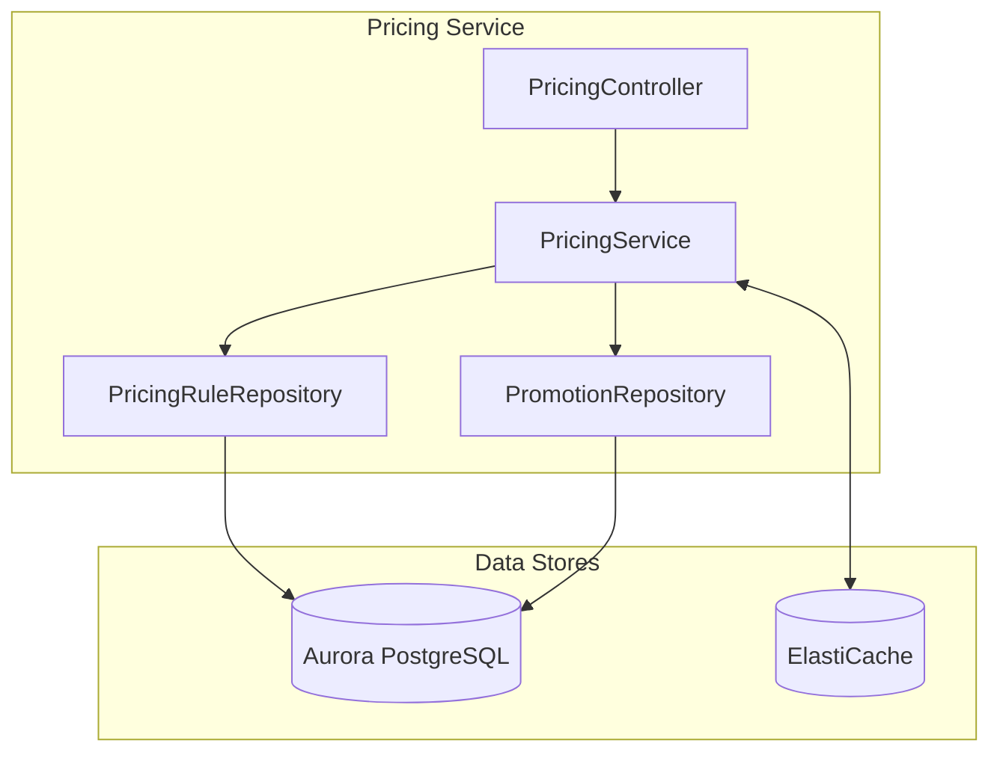
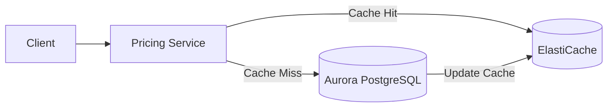
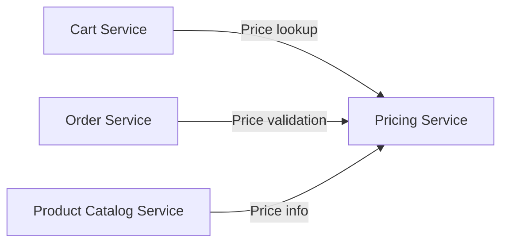
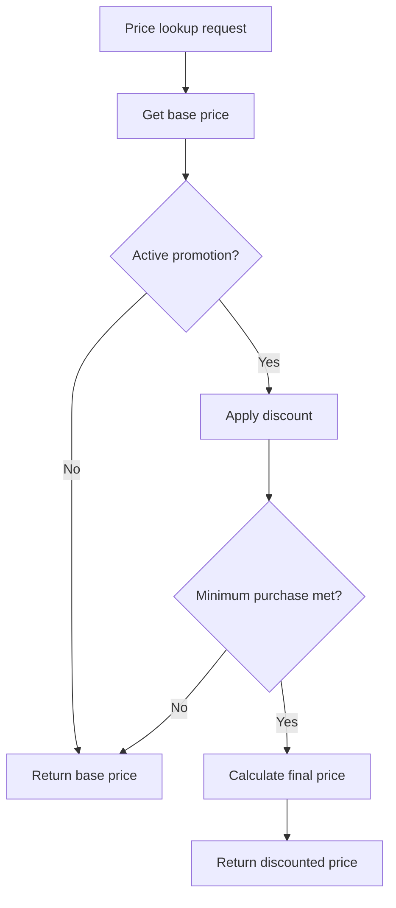

# Pricing Service

## Overview

The Pricing Service manages dynamic pricing, promotions, and flash sales. It uses ElastiCache to cache frequently queried price data for fast response times.

| Item | Details |
|------|---------|
| Language | Java 17 |
| Framework | Spring Boot 3.2 |
| Database | Aurora PostgreSQL (Global Database) |
| Cache | ElastiCache (Valkey/Redis) |
| Namespace | `mall-pricing` |
| Port | 8080 |
| Health Check | `/actuator/health` |

## Architecture



## API Endpoints

| Method | Path | Description |
|--------|------|-------------|
| `GET` | `/api/v1/pricing/{sku}` | Get price by SKU |
| `POST` | `/api/v1/pricing/calculate` | Calculate cart prices |
| `GET` | `/api/v1/promotions` | Get active promotions |
| `POST` | `/api/v1/promotions` | Create promotion |

### Get Price by SKU

**GET** `/api/v1/pricing/{sku}`

Response (200 OK):
```json
{
  "id": "550e8400-e29b-41d4-a716-446655440000",
  "sku": "SKU-ELECTRONICS-001",
  "basePrice": 299000.00,
  "finalPrice": 269100.00,
  "currency": "KRW",
  "discountApplied": 29900.00
}
```

### Calculate Cart Prices

**POST** `/api/v1/pricing/calculate`

Request:
```json
{
  "items": [
    {
      "sku": "SKU-ELECTRONICS-001",
      "quantity": 2
    },
    {
      "sku": "SKU-FASHION-001",
      "quantity": 1
    }
  ]
}
```

Response (200 OK):
```json
{
  "items": [
    {
      "id": "550e8400-e29b-41d4-a716-446655440000",
      "sku": "SKU-ELECTRONICS-001",
      "basePrice": 299000.00,
      "finalPrice": 269100.00,
      "currency": "KRW",
      "discountApplied": 29900.00
    },
    {
      "id": "550e8400-e29b-41d4-a716-446655440001",
      "sku": "SKU-FASHION-001",
      "basePrice": 89000.00,
      "finalPrice": 89000.00,
      "currency": "KRW",
      "discountApplied": 0.00
    }
  ],
  "subtotal": 687000.00,
  "totalDiscount": 59800.00,
  "total": 627200.00,
  "currency": "KRW"
}
```

### Get Active Promotions

**GET** `/api/v1/promotions`

Response (200 OK):
```json
[
  {
    "id": "660e8400-e29b-41d4-a716-446655440000",
    "name": "Lunar New Year Special Sale",
    "discountType": "PERCENTAGE",
    "discountValue": 10.00,
    "minPurchase": 50000.00,
    "startDate": "2024-02-01T00:00:00",
    "endDate": "2024-02-15T23:59:59",
    "active": true,
    "createdAt": "2024-01-15T10:00:00"
  },
  {
    "id": "660e8400-e29b-41d4-a716-446655440001",
    "name": "New Member Coupon",
    "discountType": "FIXED",
    "discountValue": 5000.00,
    "minPurchase": 30000.00,
    "startDate": "2024-01-01T00:00:00",
    "endDate": "2024-12-31T23:59:59",
    "active": true,
    "createdAt": "2024-01-01T00:00:00"
  }
]
```

### Create Promotion

**POST** `/api/v1/promotions`

Request:
```json
{
  "name": "Spring Special Sale",
  "discountType": "PERCENTAGE",
  "discountValue": 15.00,
  "minPurchase": 100000.00,
  "startDate": "2024-03-01T00:00:00",
  "endDate": "2024-03-31T23:59:59",
  "active": true
}
```

Response (201 Created):
```json
{
  "id": "660e8400-e29b-41d4-a716-446655440002",
  "name": "Spring Special Sale",
  "discountType": "PERCENTAGE",
  "discountValue": 15.00,
  "minPurchase": 100000.00,
  "startDate": "2024-03-01T00:00:00",
  "endDate": "2024-03-31T23:59:59",
  "active": true,
  "createdAt": "2024-02-15T10:00:00"
}
```

## Data Models

### PricingRule Entity

```java
@Entity
@Table(name = "pricing_rules")
public class PricingRule {
    @Id
    @GeneratedValue(strategy = GenerationType.UUID)
    private UUID id;

    @Column(unique = true, nullable = false)
    private String sku;

    @Column(name = "base_price", nullable = false, precision = 12, scale = 2)
    private BigDecimal basePrice;

    @Column(length = 3)
    private String currency = "KRW";

    private Boolean active = true;

    @Column(name = "created_at")
    private LocalDateTime createdAt;

    @Column(name = "updated_at")
    private LocalDateTime updatedAt;
}
```

### Promotion Entity

```java
@Entity
@Table(name = "promotions")
public class Promotion {
    public enum DiscountType {
        PERCENTAGE,  // Percentage discount
        FIXED        // Fixed amount discount
    }

    @Id
    @GeneratedValue(strategy = GenerationType.UUID)
    private UUID id;

    @Column(nullable = false)
    private String name;

    @Column(name = "discount_type", nullable = false)
    @Enumerated(EnumType.STRING)
    private DiscountType discountType;

    @Column(name = "discount_value", nullable = false, precision = 12, scale = 2)
    private BigDecimal discountValue;

    @Column(name = "min_purchase", precision = 12, scale = 2)
    private BigDecimal minPurchase = BigDecimal.ZERO;

    @Column(name = "start_date", nullable = false)
    private LocalDateTime startDate;

    @Column(name = "end_date", nullable = false)
    private LocalDateTime endDate;

    private Boolean active = true;

    @Column(name = "created_at")
    private LocalDateTime createdAt;

    // Check if currently active
    public boolean isCurrentlyActive() {
        LocalDateTime now = LocalDateTime.now();
        return active && now.isAfter(startDate) && now.isBefore(endDate);
    }
}
```

### Discount Types

| Type | Description | Example |
|------|-------------|---------|
| `PERCENTAGE` | Percentage discount | 10% off |
| `FIXED` | Fixed amount discount | 5,000 KRW off |

### Database Schema

```sql
CREATE TABLE pricing_rules (
    id UUID PRIMARY KEY DEFAULT gen_random_uuid(),
    sku VARCHAR(255) UNIQUE NOT NULL,
    base_price DECIMAL(12, 2) NOT NULL,
    currency VARCHAR(3) DEFAULT 'KRW',
    active BOOLEAN DEFAULT true,
    created_at TIMESTAMP DEFAULT CURRENT_TIMESTAMP,
    updated_at TIMESTAMP DEFAULT CURRENT_TIMESTAMP
);

CREATE TABLE promotions (
    id UUID PRIMARY KEY DEFAULT gen_random_uuid(),
    name VARCHAR(255) NOT NULL,
    discount_type VARCHAR(50) NOT NULL,
    discount_value DECIMAL(12, 2) NOT NULL,
    min_purchase DECIMAL(12, 2) DEFAULT 0,
    start_date TIMESTAMP NOT NULL,
    end_date TIMESTAMP NOT NULL,
    active BOOLEAN DEFAULT true,
    created_at TIMESTAMP DEFAULT CURRENT_TIMESTAMP
);

CREATE UNIQUE INDEX idx_pricing_rules_sku ON pricing_rules(sku);
CREATE INDEX idx_promotions_active ON promotions(active);
CREATE INDEX idx_promotions_dates ON promotions(start_date, end_date);
```

## Caching Strategy

### ElastiCache Usage



### Cache Key Patterns

| Key Pattern | Description | TTL |
|-------------|-------------|-----|
| `pricing:sku:{sku}` | Price info by SKU | 5 minutes |
| `promotions:active` | Active promotions list | 1 minute |
| `pricing:calculated:{hash}` | Cart calculation result | 30 seconds |

### Cache Invalidation

- Clear SKU cache when pricing rules change
- Clear promotion cache when promotions are created/modified
- Auto-refresh cache on promotion start/end

## Environment Variables

| Variable | Description | Default |
|----------|-------------|---------|
| `SPRING_DATASOURCE_URL` | Aurora PostgreSQL connection URL | - |
| `SPRING_DATASOURCE_USERNAME` | DB username | - |
| `SPRING_DATASOURCE_PASSWORD` | DB password | - |
| `SPRING_REDIS_HOST` | ElastiCache host | - |
| `SPRING_REDIS_PORT` | ElastiCache port | 6379 |
| `CACHE_TTL_SECONDS` | Default cache TTL | 300 |
| `SERVER_PORT` | Service port | 8080 |

## Service Dependencies



### Price Calculation Logic



### Error Handling

| HTTP Status Code | Error | Description |
|------------------|-------|-------------|
| 404 | PricingRuleNotFoundException | No price info for SKU |
| 400 | InvalidPromotionException | Invalid promotion configuration |
| 400 | PromotionExpiredException | Expired promotion |
