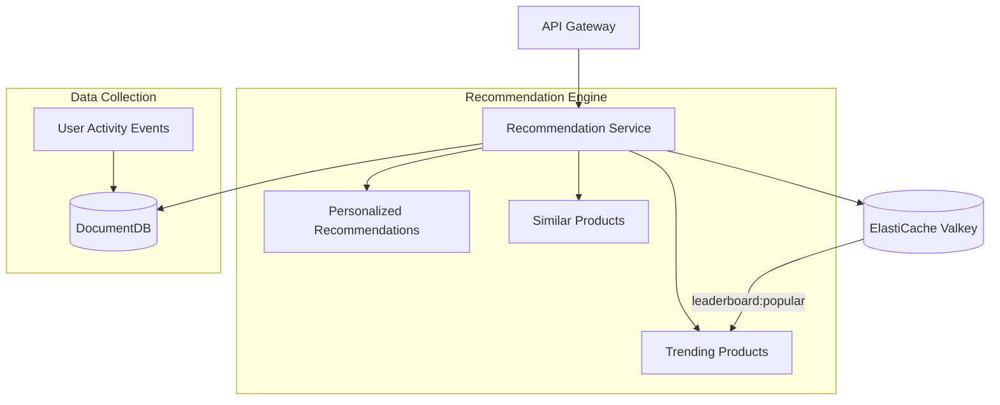
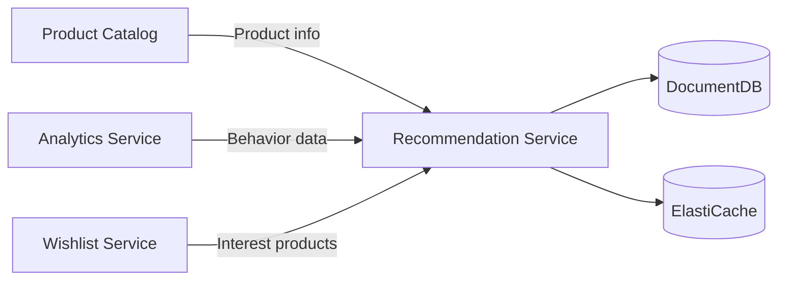

# Recommendation Service

## Overview

The Recommendation Service provides personalized product recommendations based on user behavior data. It stores user activities in DocumentDB and caches recommendation results via ElastiCache (Valkey) to ensure fast response times.

| Item | Value |
|------|-------|
| Language | Python 3.11 |
| Framework | FastAPI |
| Database | DocumentDB (MongoDB compatible) |
| Cache | ElastiCache (Valkey) |
| Namespace | `mall-services` |
| Port | 8000 |
| Health Check | `GET /health` |

## Architecture



## API Endpoints

### Recommendation API

| Method | Path | Description |
|--------|------|-------------|
| `GET` | `/api/v1/recommendations/{user_id}` | Personalized recommendations |
| `GET` | `/api/v1/recommendations/trending` | Trending products |
| `GET` | `/api/v1/recommendations/similar/{product_id}` | Similar product recommendations |

### Request/Response Examples

#### Personalized Recommendations

**Request:**
```http
GET /api/v1/recommendations/user_001?limit=10
```

**Response:**
```json
{
  "user_id": "user_001",
  "recommendations": [
    {
      "product_id": "prod_101",
      "score": 0.95,
      "reason": "Based on your browsing history",
      "category": "electronics"
    },
    {
      "product_id": "prod_205",
      "score": 0.87,
      "reason": "Based on your browsing history",
      "category": "fashion"
    },
    {
      "product_id": "prod_089",
      "score": 0.82,
      "reason": "Based on your browsing history",
      "category": "electronics"
    }
  ],
  "generated_at": "2024-01-15T10:00:00Z"
}
```

#### Trending Products

**Request:**
```http
GET /api/v1/recommendations/trending
```

**Response:**
```json
{
  "products": [
    {
      "product_id": "prod_001",
      "name": "Samsung Galaxy S24",
      "category": "electronics",
      "score": 0.98,
      "view_count": 15420,
      "purchase_count": 2341
    },
    {
      "product_id": "prod_042",
      "name": "Nike Air Max",
      "category": "fashion",
      "score": 0.94,
      "view_count": 12890,
      "purchase_count": 1876
    },
    {
      "product_id": "prod_078",
      "name": "Apple AirPods Pro",
      "category": "electronics",
      "score": 0.91,
      "view_count": 11200,
      "purchase_count": 1543
    }
  ],
  "generated_at": "2024-01-15T10:00:00Z"
}
```

#### Similar Product Recommendations

**Request:**
```http
GET /api/v1/recommendations/similar/prod_001?limit=10
```

**Response:**
```json
{
  "product_id": "prod_001",
  "similar": [
    {
      "product_id": "prod_002",
      "score": 0.89,
      "reason": "Users who viewed this also viewed",
      "category": "electronics"
    },
    {
      "product_id": "prod_015",
      "score": 0.76,
      "reason": "Users who viewed this also viewed",
      "category": "electronics"
    },
    {
      "product_id": "prod_023",
      "score": 0.71,
      "reason": "Users who viewed this also viewed",
      "category": "accessories"
    }
  ],
  "generated_at": "2024-01-15T10:00:00Z"
}
```

## Data Models

### Recommendation

```python
class Recommendation(BaseModel):
    product_id: str
    score: float = Field(ge=0.0, le=1.0)  # 0.0 ~ 1.0
    reason: str  # Recommendation reason
    category: Optional[str] = None
```

### UserActivity

```python
class UserActivity(BaseModel):
    user_id: str
    product_id: str
    action: str  # view, click, purchase, add_to_cart
    timestamp: datetime
    metadata: Optional[dict] = None
```

### TrendingProduct

```python
class TrendingProduct(BaseModel):
    product_id: str
    name: str
    category: str
    score: float
    view_count: int
    purchase_count: int
```

### RecommendationResponse

```python
class RecommendationResponse(BaseModel):
    user_id: str
    recommendations: list[Recommendation]
    generated_at: datetime
```

### TrendingResponse

```python
class TrendingResponse(BaseModel):
    products: list[TrendingProduct]
    generated_at: datetime
```

### SimilarProductsResponse

```python
class SimilarProductsResponse(BaseModel):
    product_id: str
    similar: list[Recommendation]
    generated_at: datetime
```

## Recommendation Algorithms

### Activity Weights

| Action | Weight | Description |
|--------|--------|-------------|
| `purchase` | 1.0 | Purchase completed |
| `add_to_cart` | 0.7 | Added to cart |
| `click` | 0.3 | Product clicked |
| `view` | 0.1 | Product viewed |

### Personalized Recommendation Logic

```python
def _generate_recommendations(activities: list[dict], limit: int) -> list[Recommendation]:
    product_scores: dict[str, float] = {}
    action_weights = {
        "purchase": 1.0,
        "add_to_cart": 0.7,
        "click": 0.3,
        "view": 0.1
    }

    for activity in activities:
        product_id = activity.get("product_id")
        action = activity.get("action", "view")
        weight = action_weights.get(action, 0.1)
        product_scores[product_id] = product_scores.get(product_id, 0) + weight

    sorted_products = sorted(product_scores.items(), key=lambda x: x[1], reverse=True)[:limit]

    return [
        Recommendation(
            product_id=pid,
            score=min(score / 10.0, 1.0),
            reason="Based on your browsing history"
        )
        for pid, score in sorted_products
    ]
```

## Caching Strategy

### ElastiCache (Valkey) Key Structure

| Key Pattern | Description | TTL |
|-------------|-------------|-----|
| `recommendations:{user_id}` | Personalized recommendation results | 1 hour |
| `recommendations:trending` | Trending products list | 1 hour |
| `recommendations:similar:{product_id}` | Similar products list | 1 hour |
| `leaderboard:popular` | Popular products sorted set | Real-time |

### Cache Logic

```python
CACHE_TTL_SECONDS = 3600  # 1 hour

async def get_personalized_recommendations(user_id: str, limit: int = 10):
    cache_key = f"recommendations:{user_id}"

    # Check cache
    cached = await valkey.get_json(cache_key)
    if cached:
        return RecommendationResponse(**cached)

    # Generate recommendations
    activities = await repo.get_user_activities(user_id)
    recommendations = _generate_recommendations(activities, limit)

    response = RecommendationResponse(
        user_id=user_id,
        recommendations=recommendations,
        generated_at=datetime.utcnow()
    )

    # Store in cache
    await valkey.set_json(cache_key, response.model_dump(mode="json"), CACHE_TTL_SECONDS)

    return response
```

## Environment Variables

| Variable | Description | Default |
|----------|-------------|---------|
| `SERVICE_NAME` | Service name | `recommendation` |
| `PORT` | Service port | `8080` |
| `AWS_REGION` | AWS region | `us-east-1` |
| `REGION_ROLE` | Region role (PRIMARY/SECONDARY) | `PRIMARY` |
| `DB_HOST` | DocumentDB host | `localhost` |
| `DB_PORT` | DocumentDB port | `27017` |
| `DB_NAME` | Database name | `recommendations` |
| `DB_USER` | Database user | `mall` |
| `DB_PASSWORD` | Database password | - |
| `DOCUMENTDB_HOST` | DocumentDB host | `localhost` |
| `DOCUMENTDB_PORT` | DocumentDB port | `27017` |
| `CACHE_HOST` | ElastiCache host | `localhost` |
| `CACHE_PORT` | ElastiCache port | `6379` |
| `KAFKA_BROKERS` | Kafka broker address | `localhost:9092` |
| `LOG_LEVEL` | Log level | `info` |

## Service Dependencies



### Services It Depends On
- **DocumentDB**: User activity data storage
- **ElastiCache (Valkey)**: Recommendation result caching, popular products leaderboard
- **Product Catalog**: Product metadata lookup

### Services That Depend On This
- **API Gateway**: Display recommendations on home/product pages
- **Search Service**: Apply personalization to search results

## Feature Details

### Trending Products Calculation
- Based on views/purchases in the last 24 hours
- Real-time ranking managed via ElastiCache Sorted Set
- Key: `leaderboard:popular`

### Similar Product Recommendations
- Based on "customers who viewed this also viewed"
- Collaborative filtering algorithm applied
- Prioritizes products in the same category

### Diversity Guarantee
- Prevents more than 3 consecutive products from the same category
- Excludes already purchased products
