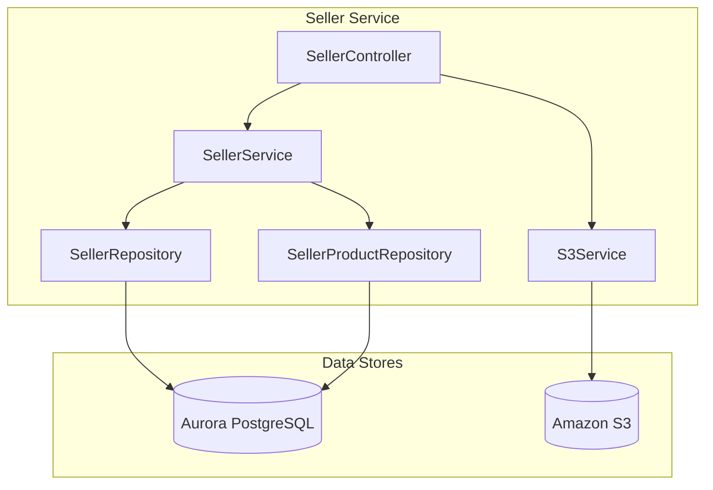
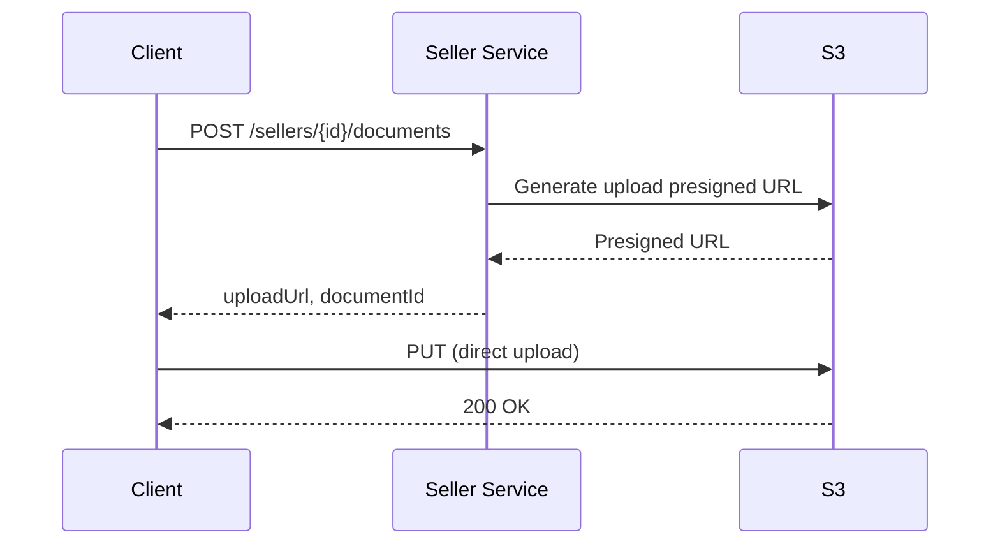
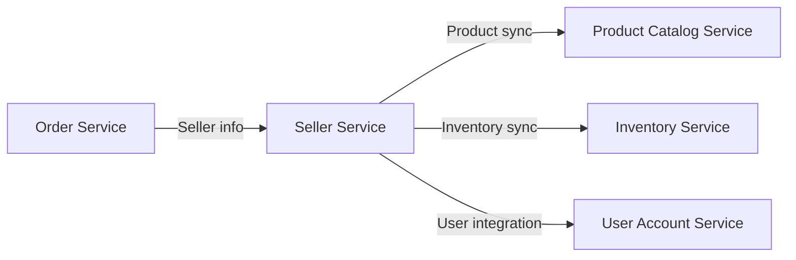
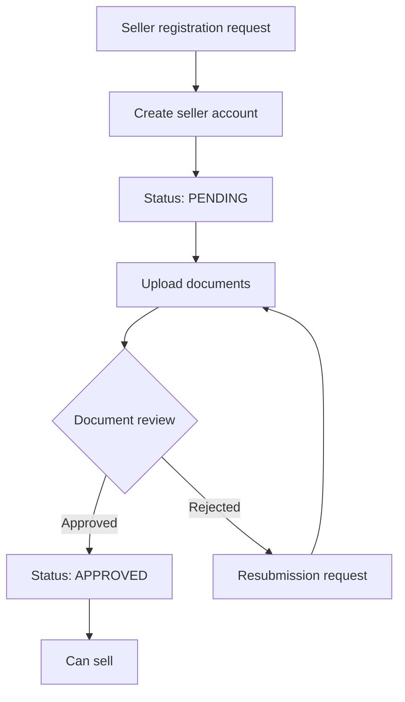
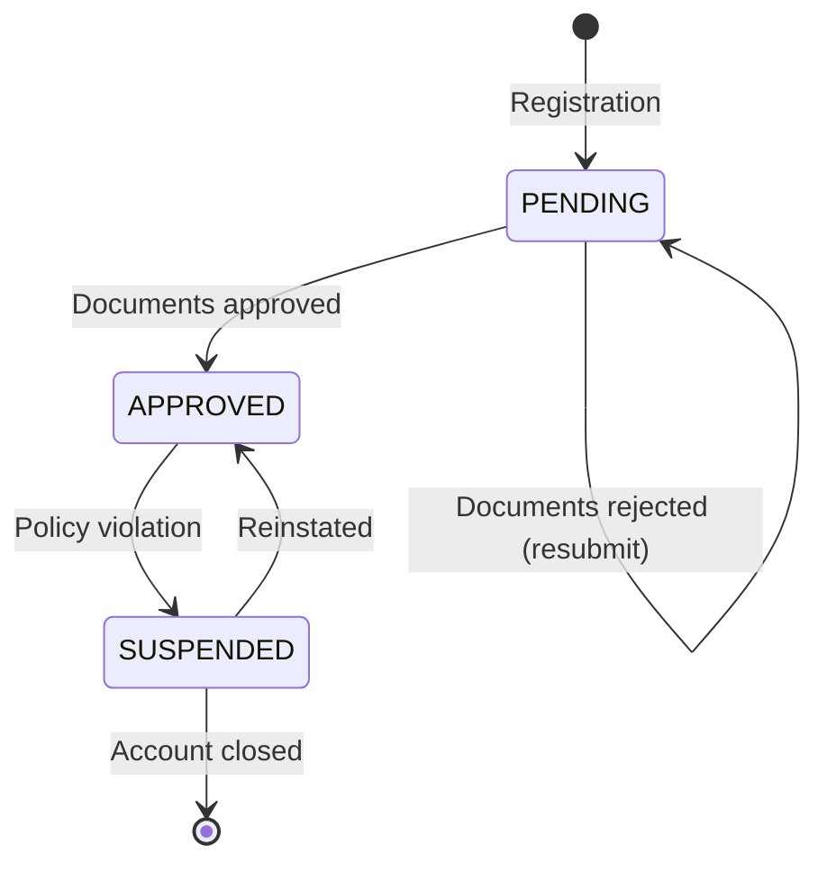

# Seller Service

## Overview

The Seller Service handles seller registration, store management, product registration, and business document verification. It provides document upload functionality using S3.

| Item | Details |
|------|---------|
| Language | Java 17 |
| Framework | Spring Boot 3.2 |
| Database | Aurora PostgreSQL (Global Database) |
| File Storage | Amazon S3 |
| Namespace | `mall-seller` |
| Port | 8080 |
| Health Check | `/actuator/health` |

## Architecture



## API Endpoints

| Method | Path | Description |
|--------|------|-------------|
| `POST` | `/api/v1/sellers/register` | Register seller |
| `GET` | `/api/v1/sellers/{id}` | Get seller |
| `GET` | `/api/v1/sellers` | Get seller list |
| `POST` | `/api/v1/sellers/{id}/products` | Register product |
| `GET` | `/api/v1/sellers/{id}/products` | Get seller's products |
| `POST` | `/api/v1/sellers/{id}/documents` | Generate document upload URL |

### Register Seller

**POST** `/api/v1/sellers/register`

Request:
```json
{
  "businessName": "Seoul Mart",
  "email": "seller@seoulmart.com",
  "phone": "02-1234-5678"
}
```

Response (201 Created):
```json
{
  "id": "550e8400-e29b-41d4-a716-446655440000",
  "businessName": "Seoul Mart",
  "email": "seller@seoulmart.com",
  "phone": "02-1234-5678",
  "status": "PENDING",
  "createdAt": "2024-01-15T10:00:00"
}
```

### Get Seller

**GET** `/api/v1/sellers/{id}`

Response (200 OK):
```json
{
  "id": "550e8400-e29b-41d4-a716-446655440000",
  "businessName": "Seoul Mart",
  "email": "seller@seoulmart.com",
  "phone": "02-1234-5678",
  "status": "APPROVED",
  "createdAt": "2024-01-15T10:00:00"
}
```

### Get Seller List

**GET** `/api/v1/sellers`

Response (200 OK):
```json
[
  {
    "id": "550e8400-e29b-41d4-a716-446655440000",
    "businessName": "Seoul Mart",
    "email": "seller@seoulmart.com",
    "phone": "02-1234-5678",
    "status": "APPROVED",
    "createdAt": "2024-01-15T10:00:00"
  },
  {
    "id": "550e8400-e29b-41d4-a716-446655440001",
    "businessName": "Busan Trading",
    "email": "seller@busanshop.com",
    "phone": "051-9876-5432",
    "status": "PENDING",
    "createdAt": "2024-01-16T14:00:00"
  }
]
```

### Register Product

**POST** `/api/v1/sellers/{id}/products`

Request:
```json
{
  "productId": "prod-001",
  "sku": "SKU-SEOUL-ELECTRONICS-001",
  "price": 299000.00,
  "stock": 100
}
```

Response (201 Created):
```json
{
  "id": "660e8400-e29b-41d4-a716-446655440000",
  "sellerId": "550e8400-e29b-41d4-a716-446655440000",
  "productId": "prod-001",
  "sku": "SKU-SEOUL-ELECTRONICS-001",
  "price": 299000.00,
  "stock": 100,
  "active": true,
  "createdAt": "2024-01-15T11:00:00"
}
```

### Get Seller's Products

**GET** `/api/v1/sellers/{id}/products`

Response (200 OK):
```json
[
  {
    "id": "660e8400-e29b-41d4-a716-446655440000",
    "sellerId": "550e8400-e29b-41d4-a716-446655440000",
    "productId": "prod-001",
    "sku": "SKU-SEOUL-ELECTRONICS-001",
    "price": 299000.00,
    "stock": 100,
    "active": true,
    "createdAt": "2024-01-15T11:00:00"
  },
  {
    "id": "660e8400-e29b-41d4-a716-446655440001",
    "sellerId": "550e8400-e29b-41d4-a716-446655440000",
    "productId": "prod-002",
    "sku": "SKU-SEOUL-FASHION-001",
    "price": 89000.00,
    "stock": 50,
    "active": true,
    "createdAt": "2024-01-15T11:30:00"
  }
]
```

### Generate Document Upload URL

**POST** `/api/v1/sellers/{id}/documents`

Request:
```json
{
  "fileName": "business_license.pdf",
  "contentType": "application/pdf",
  "documentType": "BUSINESS_LICENSE"
}
```

Supported document types:
- `BUSINESS_LICENSE` - Business registration certificate
- `BANK_ACCOUNT` - Bank account copy
- `ID_CARD` - Representative ID

Response (200 OK):
```json
{
  "documentId": "doc-550e8400-e29b-41d4-a716-446655440000",
  "uploadUrl": "https://s3.amazonaws.com/bucket/sellers/550e8400/documents/doc-550e8400?X-Amz-Algorithm=...",
  "key": "sellers/550e8400/documents/doc-550e8400/business_license.pdf",
  "expiresAt": "2024-01-15T11:15:00"
}
```

## Data Models

### Seller Entity

```java
@Entity
@Table(name = "sellers")
public class Seller {
    public enum Status {
        PENDING,    // Pending approval
        APPROVED,   // Approved
        SUSPENDED   // Suspended
    }

    @Id
    @GeneratedValue(strategy = GenerationType.UUID)
    private UUID id;

    @Column(name = "business_name", nullable = false)
    private String businessName;

    @Column(unique = true, nullable = false)
    private String email;

    @Column(length = 50)
    private String phone;

    @Enumerated(EnumType.STRING)
    @Column(length = 50)
    private Status status = Status.PENDING;

    @Column(name = "created_at")
    private LocalDateTime createdAt;

    @Column(name = "updated_at")
    private LocalDateTime updatedAt;
}
```

### SellerProduct Entity

```java
@Entity
@Table(name = "seller_products")
public class SellerProduct {
    @Id
    @GeneratedValue(strategy = GenerationType.UUID)
    private UUID id;

    @ManyToOne(fetch = FetchType.LAZY)
    @JoinColumn(name = "seller_id")
    private Seller seller;

    @Column(name = "product_id")
    private String productId;

    @Column(nullable = false)
    private String sku;

    @Column(nullable = false, precision = 12, scale = 2)
    private BigDecimal price;

    @Column(columnDefinition = "INTEGER DEFAULT 0")
    private Integer stock = 0;

    @Column(columnDefinition = "BOOLEAN DEFAULT true")
    private Boolean active = true;

    @Column(name = "created_at")
    private LocalDateTime createdAt;
}
```

### Seller Status

| Status | Description |
|--------|-------------|
| `PENDING` | Pending approval - Under document review |
| `APPROVED` | Approved - Can sell |
| `SUSPENDED` | Suspended - Sales temporarily halted |

### Database Schema

```sql
CREATE TABLE sellers (
    id UUID PRIMARY KEY DEFAULT gen_random_uuid(),
    business_name VARCHAR(255) NOT NULL,
    email VARCHAR(255) UNIQUE NOT NULL,
    phone VARCHAR(50),
    status VARCHAR(50) DEFAULT 'PENDING',
    created_at TIMESTAMP DEFAULT CURRENT_TIMESTAMP,
    updated_at TIMESTAMP DEFAULT CURRENT_TIMESTAMP
);

CREATE TABLE seller_products (
    id UUID PRIMARY KEY DEFAULT gen_random_uuid(),
    seller_id UUID REFERENCES sellers(id),
    product_id VARCHAR(255),
    sku VARCHAR(255) NOT NULL,
    price DECIMAL(12, 2) NOT NULL,
    stock INTEGER DEFAULT 0,
    active BOOLEAN DEFAULT true,
    created_at TIMESTAMP DEFAULT CURRENT_TIMESTAMP
);

CREATE UNIQUE INDEX idx_sellers_email ON sellers(email);
CREATE INDEX idx_sellers_status ON sellers(status);
CREATE INDEX idx_seller_products_seller_id ON seller_products(seller_id);
CREATE INDEX idx_seller_products_sku ON seller_products(sku);
```

## S3 Document Upload

### Presigned URL Flow



### S3 Bucket Structure

```
s3://mall-seller-documents/
├── sellers/
│   ├── {seller-id}/
│   │   ├── documents/
│   │   │   ├── {document-id}/
│   │   │   │   ├── business_license.pdf
│   │   │   │   ├── bank_account.pdf
│   │   │   │   └── id_card.jpg
```

## Environment Variables

| Variable | Description | Default |
|----------|-------------|---------|
| `SPRING_DATASOURCE_URL` | Aurora PostgreSQL connection URL | - |
| `SPRING_DATASOURCE_USERNAME` | DB username | - |
| `SPRING_DATASOURCE_PASSWORD` | DB password | - |
| `AWS_S3_BUCKET` | S3 bucket name | - |
| `AWS_S3_REGION` | S3 region | - |
| `AWS_ACCESS_KEY_ID` | AWS access key | - |
| `AWS_SECRET_ACCESS_KEY` | AWS secret key | - |
| `PRESIGNED_URL_EXPIRATION` | Presigned URL expiration (minutes) | 15 |
| `SERVER_PORT` | Service port | 8080 |

## Service Dependencies



### Seller Registration Process



### Seller Status Flow



### Error Handling

| HTTP Status Code | Error | Description |
|------------------|-------|-------------|
| 404 | SellerNotFoundException | Seller not found |
| 409 | DuplicateEmailException | Already registered email |
| 400 | InvalidDocumentException | Invalid document format |
| 403 | SellerNotApprovedException | Unapproved seller attempting to register products |
