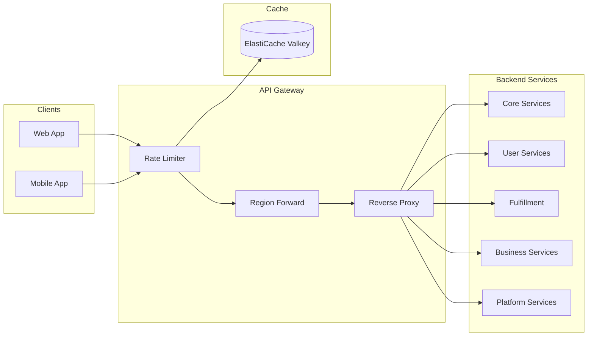
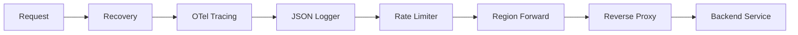

# API Gateway

## Overview

The API Gateway serves as the single entry point for all client requests, acting as a reverse proxy that routes requests to 19 backend microservices.

| Item | Details |
|------|---------|
| Language | Go 1.21+ |
| Framework | Gin |
| Database | ElastiCache (Valkey) - Rate Limiting |
| Namespace | core-services |
| Port | 8080 |
| Health Check | `/healthz`, `/readyz` |

## Architecture



## Key Features

### 1. Reverse Proxy
- Path prefix-based service routing
- Automatic service discovery (Kubernetes DNS)
- Upstream error handling

### 2. Rate Limiting
- Token Bucket algorithm implementation
- Limits based on API Key or Client IP
- Distributed counter via ElastiCache Valkey

### 3. Region Forwarding
- Detects write requests in Secondary region
- Automatic forwarding to Primary region
- `X-Forwarded-Region` header propagation

## API Endpoints

### Proxy Routing

| Method | Path | Description | Backend Service |
|--------|------|-------------|-----------------|
| ANY | `/api/v1/products/*` | Product Catalog | product-catalog.core-services |
| ANY | `/api/v1/search/*` | Search | search.core-services |
| ANY | `/api/v1/cart/*` | Cart | cart.core-services |
| ANY | `/api/v1/orders/*` | Orders | order.core-services |
| ANY | `/api/v1/payments/*` | Payments | payment.core-services |
| ANY | `/api/v1/inventory/*` | Inventory | inventory.core-services |
| ANY | `/api/v1/auth/*` | Authentication | user-account.user-services |
| ANY | `/api/v1/profiles/*` | Profiles | user-profile.user-services |
| ANY | `/api/v1/wishlists/*` | Wishlists | wishlist.user-services |
| ANY | `/api/v1/reviews/*` | Reviews | review.user-services |
| ANY | `/api/v1/shipments/*` | Shipping | shipping.fulfillment |
| ANY | `/api/v1/warehouses/*` | Warehouses | warehouse.fulfillment |
| ANY | `/api/v1/returns/*` | Returns | returns.fulfillment |
| ANY | `/api/v1/pricing/*` | Pricing | pricing.business-services |
| ANY | `/api/v1/recommendations/*` | Recommendations | recommendation.business-services |
| ANY | `/api/v1/notifications/*` | Notifications | notification.business-services |
| ANY | `/api/v1/sellers/*` | Sellers | seller.business-services |
| ANY | `/api/v1/events/*` | Event Bus | event-bus.platform |
| ANY | `/api/v1/analytics/*` | Analytics | analytics.platform |

### Rate Limit Response Headers

```http
X-RateLimit-Limit: 6000
X-RateLimit-Remaining: 5999
Retry-After: 60
```

### Rate Limit Exceeded Response

```json
{
  "error": "rate limit exceeded",
  "limit": 6000,
  "window": 60,
  "retryIn": 60
}
```

## Data Models

### Route Map

```go
// GetRouteMap returns the mapping of API path prefixes to backend services
func GetRouteMap() map[string]string {
    return map[string]string{
        // Core Services
        "/api/v1/products":  "product-catalog.core-services.svc.cluster.local:80",
        "/api/v1/search":    "search.core-services.svc.cluster.local:80",
        "/api/v1/cart":      "cart.core-services.svc.cluster.local:80",
        "/api/v1/orders":    "order.core-services.svc.cluster.local:80",
        "/api/v1/payments":  "payment.core-services.svc.cluster.local:80",
        "/api/v1/inventory": "inventory.core-services.svc.cluster.local:80",
        // ... additional services
    }
}
```

### Config

```go
type Config struct {
    ServiceName    string
    Port           string
    AWSRegion      string
    RegionRole     string // PRIMARY or SECONDARY
    PrimaryHost    string
    CacheHost      string
    CachePort      int
    RateLimitRPS   int    // Requests per second limit
    RateLimitBurst int    // Burst allowance
    RateLimitWindow int   // Window size (seconds)
}
```

## Events (Kafka)

The API Gateway does not directly publish or subscribe to Kafka events. All event processing is performed by backend services.

## Environment Variables

| Variable | Description | Default |
|----------|-------------|---------|
| `PORT` | Server port | `8080` |
| `AWS_REGION` | AWS region | `us-east-1` |
| `REGION_ROLE` | Region role (PRIMARY/SECONDARY) | `PRIMARY` |
| `PRIMARY_HOST` | Primary region host | - |
| `CACHE_HOST` | ElastiCache host | `localhost` |
| `CACHE_PORT` | ElastiCache port | `6379` |
| `RATE_LIMIT_RPS` | Requests per second limit | `100` |
| `RATE_LIMIT_BURST` | Burst allowance | `200` |
| `RATE_LIMIT_WINDOW` | Rate limit window (seconds) | `60` |
| `LOG_LEVEL` | Log level | `info` |

## Service Dependencies

### Services It Depends On
- **ElastiCache (Valkey)**: Rate limiting counter storage
- **All backend services**: Proxy targets

### Components That Depend On This Service
- **Web/Mobile clients**: All API requests
- **CloudFront**: CDN origin
- **ALB**: Load balancing

## Middleware Chain



1. **Recovery**: Panic recovery
2. **OTel Tracing**: Distributed tracing
3. **JSON Logger**: Structured logging
4. **Rate Limiter**: Request limiting (when Valkey is available)
5. **Region Forward**: Write request forwarding to Primary
6. **Reverse Proxy**: Backend service routing

## Error Responses

### 404 Not Found
```json
{
  "error": "no route found"
}
```

### 502 Bad Gateway
```json
{
  "error": "upstream unavailable"
}
```

### 429 Too Many Requests
```json
{
  "error": "rate limit exceeded",
  "limit": 6000,
  "window": 60,
  "retryIn": 60
}
```
