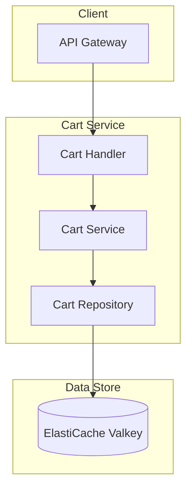
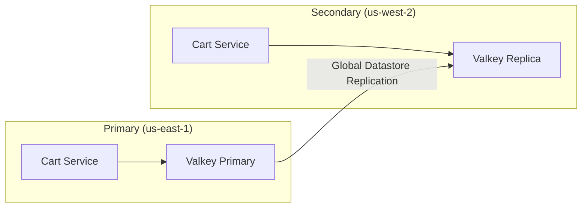

# Cart Service

## Overview

The Cart Service provides user shopping cart management functionality. It uses ElastiCache Valkey as the primary data store to ensure fast read/write performance, maintaining cart data for 7 days.

| Item | Details |
|------|---------|
| Language | Go 1.21+ |
| Framework | Gin |
| Database | ElastiCache (Valkey) |
| Namespace | core-services |
| Port | 8080 |
| Health Check | `/healthz`, `/readyz` |

## Architecture



## Key Features

### 1. Cart CRUD
- View cart
- Add items
- Update quantity
- Remove items
- Clear cart

### 2. Data Storage
- Efficient storage using Hash data structure
- 7-day TTL with automatic expiration
- Independent cart per user

### 3. Region Awareness
- Forwards write requests to Primary when in Secondary region

## API Endpoints

| Method | Path | Description |
|--------|------|-------------|
| GET | `/api/v1/cart/:user_id` | View cart |
| POST | `/api/v1/cart/:user_id/items` | Add item |
| PUT | `/api/v1/cart/:user_id/items/:item_id` | Update quantity |
| DELETE | `/api/v1/cart/:user_id/items/:item_id` | Remove item |
| DELETE | `/api/v1/cart/:user_id` | Clear cart |

### View Cart

#### Request

```bash
GET /api/v1/cart/user-123
```

#### Response

```json
{
  "user_id": "user-123",
  "items": [
    {
      "item_id": "550e8400-e29b-41d4-a716-446655440000",
      "product_id": "prod-001",
      "sku": "SGB-PRO-15",
      "name": "Samsung Galaxy Book Pro",
      "price": 1590000,
      "quantity": 1,
      "added_at": "2024-01-15T09:30:00Z"
    },
    {
      "item_id": "550e8400-e29b-41d4-a716-446655440001",
      "product_id": "prod-002",
      "sku": "APL-MBA-13",
      "name": "Apple MacBook Air M3",
      "price": 1890000,
      "quantity": 2,
      "added_at": "2024-01-15T10:15:00Z"
    }
  ],
  "total": 5370000,
  "item_count": 3,
  "updated_at": "2024-01-15T10:15:00Z"
}
```

### Add Item

#### Request

```bash
POST /api/v1/cart/user-123/items
Content-Type: application/json

{
  "product_id": "prod-001",
  "sku": "SGB-PRO-15",
  "name": "Samsung Galaxy Book Pro",
  "price": 1590000,
  "quantity": 1
}
```

#### Response

```json
{
  "item_id": "550e8400-e29b-41d4-a716-446655440000",
  "product_id": "prod-001",
  "sku": "SGB-PRO-15",
  "name": "Samsung Galaxy Book Pro",
  "price": 1590000,
  "quantity": 1,
  "added_at": "2024-01-15T09:30:00Z"
}
```

### Update Quantity

#### Request

```bash
PUT /api/v1/cart/user-123/items/550e8400-e29b-41d4-a716-446655440000
Content-Type: application/json

{
  "quantity": 3
}
```

#### Response

```json
{
  "item_id": "550e8400-e29b-41d4-a716-446655440000",
  "product_id": "prod-001",
  "sku": "SGB-PRO-15",
  "name": "Samsung Galaxy Book Pro",
  "price": 1590000,
  "quantity": 3,
  "added_at": "2024-01-15T09:30:00Z"
}
```

:::tip Setting Quantity to Zero
Setting the quantity to 0 removes the item from the cart. In this case, the response is `204 No Content`.
:::

### Remove Item

#### Request

```bash
DELETE /api/v1/cart/user-123/items/550e8400-e29b-41d4-a716-446655440000
```

#### Response

```
204 No Content
```

### Clear Cart

#### Request

```bash
DELETE /api/v1/cart/user-123
```

#### Response

```
204 No Content
```

## Data Models

### CartItem

```go
type CartItem struct {
    ItemID    string    `json:"item_id"`
    ProductID string    `json:"product_id"`
    SKU       string    `json:"sku"`
    Name      string    `json:"name"`
    Price     float64   `json:"price"`
    Quantity  int       `json:"quantity"`
    AddedAt   time.Time `json:"added_at"`
}
```

### Cart

```go
type Cart struct {
    UserID    string     `json:"user_id"`
    Items     []CartItem `json:"items"`
    Total     float64    `json:"total"`
    ItemCount int        `json:"item_count"`
    UpdatedAt time.Time  `json:"updated_at"`
}
```

### AddItemRequest

```go
type AddItemRequest struct {
    ProductID string  `json:"product_id" binding:"required"`
    SKU       string  `json:"sku" binding:"required"`
    Name      string  `json:"name" binding:"required"`
    Price     float64 `json:"price" binding:"required"`
    Quantity  int     `json:"quantity" binding:"required,min=1"`
}
```

### UpdateItemRequest

```go
type UpdateItemRequest struct {
    Quantity int `json:"quantity" binding:"required,min=0"`
}
```

## Valkey Data Structure

### Key Pattern

```
cart:{user_id}
```

Example: `cart:user-123`

### Storage Structure

Each item is stored as a field in a Hash data structure.

```
HSET cart:user-123
  "550e8400-..." '{"product_id":"prod-001","sku":"SGB-PRO-15",...}'
  "550e8400-..." '{"product_id":"prod-002","sku":"APL-MBA-13",...}'
```

### TTL

All carts are set with a **7-day (168 hours)** TTL. The TTL is renewed whenever an item is added or modified in the cart.

```go
const cartTTL = 7 * 24 * time.Hour // 7 days
```

## Events (Kafka)

The Cart Service does not currently publish or subscribe to Kafka events.

:::note Future Plans
The following events will be added when implementing the checkout process:
- `cart.updated` - Cart change event
- `cart.checkout-initiated` - Checkout initiation event
:::

## Environment Variables

| Variable | Description | Default |
|----------|-------------|---------|
| `PORT` | Server port | `8080` |
| `AWS_REGION` | AWS region | `us-east-1` |
| `REGION_ROLE` | Region role (PRIMARY/SECONDARY) | `PRIMARY` |
| `PRIMARY_HOST` | Primary region host | - |
| `CACHE_HOST` | ElastiCache host | `localhost` |
| `CACHE_PORT` | ElastiCache port | `6379` |
| `LOG_LEVEL` | Log level | `info` |

## Service Dependencies

### Services It Depends On

| Service | Purpose |
|---------|---------|
| ElastiCache (Valkey) | Cart data storage |

### Components That Depend On This Service

| Component | Purpose |
|-----------|---------|
| API Gateway | Cart API routing |
| Web/Mobile clients | Cart management |
| Order Service | Cart data lookup during checkout |

## Multi-Region Behavior

### ElastiCache Global Datastore

The Cart Service replicates data across regions through ElastiCache Global Datastore.



### Write Operations
- Primary region: Direct write to Valkey
- Secondary region: Request forwarding to Primary

### Read Operations
- All regions read from local Valkey Replica
- Minimized replication lag (typically less than 1 second)

## Error Responses

### 400 Bad Request

```json
{
  "error": "invalid request body"
}
```

### 404 Not Found

```json
{
  "error": "item not found"
}
```

### 500 Internal Server Error

```json
{
  "error": "failed to add item"
}
```
