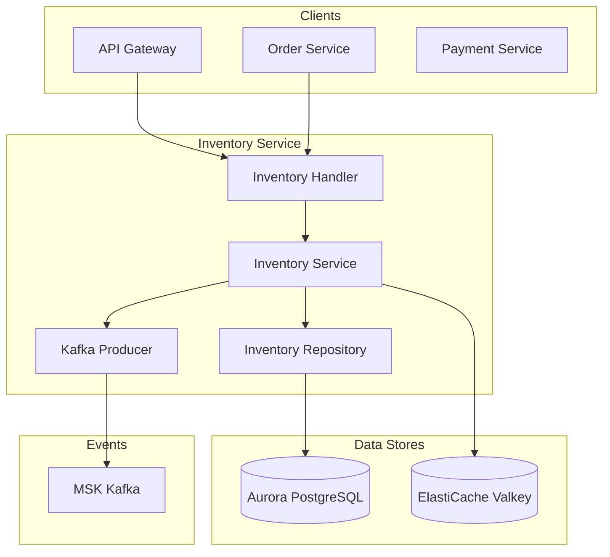
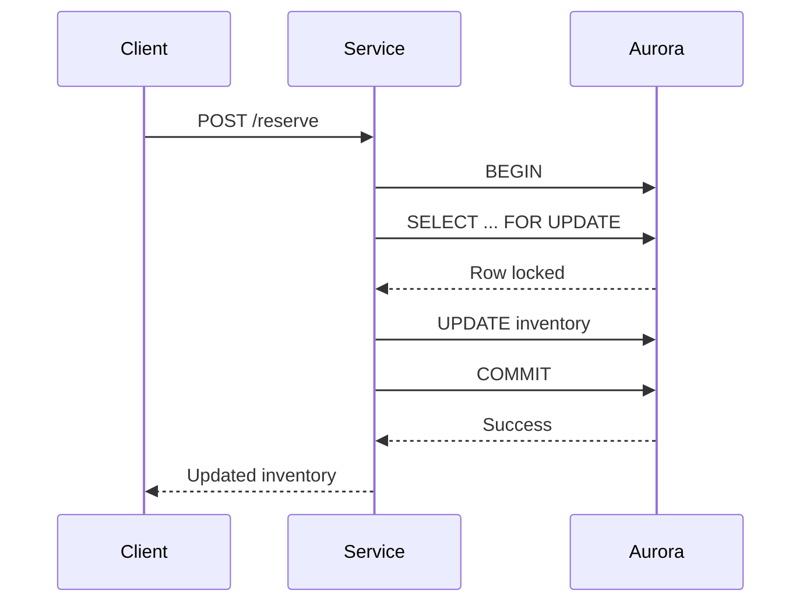
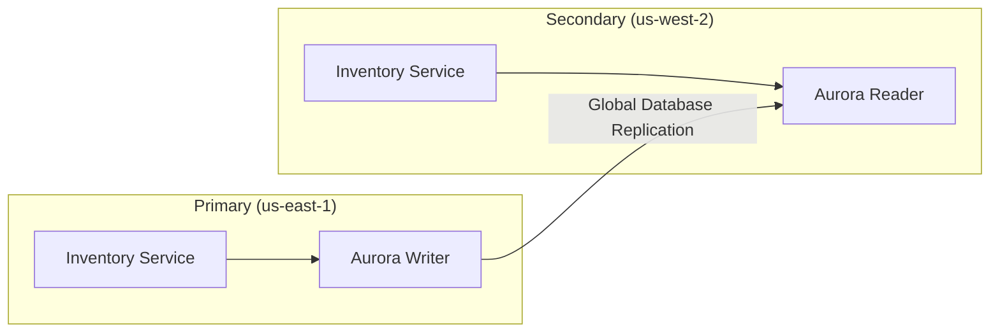

# Inventory Service

## Overview

The Inventory Service provides product inventory management functionality. It uses Aurora PostgreSQL to store inventory data and resolves concurrency issues through the Reserve/Release pattern. Kafka events are published when inventory changes to integrate with other services.

| Item | Details |
|------|---------|
| Language | Go 1.21+ |
| Framework | Gin |
| Database | Aurora PostgreSQL |
| Cache | ElastiCache (Valkey) |
| Namespace | core-services |
| Port | 8080 |
| Health Check | `/healthz`, `/readyz` |

## Architecture



## Key Features

### 1. Inventory Lookup
- SKU-based inventory lookup
- Provides available quantity, reserved quantity, and total quantity

### 2. Inventory Reservation (Reserve)
- Reserve inventory during order placement
- Transaction-based concurrency control
- Returns error when stock is insufficient

### 3. Inventory Release
- Release reservation on order cancellation
- Release within reserved quantity limits

### 4. Inventory Update
- Direct inventory modification for administrators
- Upsert support

## API Endpoints

| Method | Path | Description |
|--------|------|-------------|
| GET | `/api/v1/inventory/:sku` | Get inventory |
| POST | `/api/v1/inventory/:sku/reserve` | Reserve inventory |
| POST | `/api/v1/inventory/:sku/release` | Release reservation |
| PUT | `/api/v1/inventory/:sku` | Update inventory |

### Get Inventory

#### Request

```bash
GET /api/v1/inventory/SGB-PRO-15
```

#### Response

```json
{
  "sku": "SGB-PRO-15",
  "available": 45,
  "reserved": 5,
  "total": 50,
  "updated_at": "2024-01-15T10:30:00Z"
}
```

### Reserve Inventory

#### Request

```bash
POST /api/v1/inventory/SGB-PRO-15/reserve
Content-Type: application/json

{
  "quantity": 2
}
```

#### Response (Success)

```json
{
  "sku": "SGB-PRO-15",
  "available": 43,
  "reserved": 7,
  "total": 50,
  "updated_at": "2024-01-15T10:35:00Z"
}
```

#### Response (Insufficient Stock)

```json
{
  "error": "insufficient stock"
}
```
HTTP Status: 409 Conflict

### Release Reservation

#### Request

```bash
POST /api/v1/inventory/SGB-PRO-15/release
Content-Type: application/json

{
  "quantity": 1
}
```

#### Response

```json
{
  "sku": "SGB-PRO-15",
  "available": 44,
  "reserved": 6,
  "total": 50,
  "updated_at": "2024-01-15T10:40:00Z"
}
```

### Update Inventory

#### Request

```bash
PUT /api/v1/inventory/SGB-PRO-15
Content-Type: application/json

{
  "available": 100,
  "total": 100
}
```

#### Response

```json
{
  "sku": "SGB-PRO-15",
  "available": 100,
  "reserved": 0,
  "total": 100,
  "updated_at": "2024-01-15T11:00:00Z"
}
```

## Data Models

### Inventory

```go
type Inventory struct {
    SKU       string    `json:"sku"`
    Available int       `json:"available"`
    Reserved  int       `json:"reserved"`
    Total     int       `json:"total"`
    UpdatedAt time.Time `json:"updated_at"`
}
```

### ReserveRequest

```go
type ReserveRequest struct {
    Quantity int `json:"quantity" binding:"required,min=1"`
}
```

### ReleaseRequest

```go
type ReleaseRequest struct {
    Quantity int `json:"quantity" binding:"required,min=1"`
}
```

### UpdateStockRequest

```go
type UpdateStockRequest struct {
    Available int `json:"available" binding:"min=0"`
    Total     int `json:"total" binding:"min=0"`
}
```

## Database Schema

### inventory Table

```sql
CREATE TABLE inventory (
    sku VARCHAR(100) PRIMARY KEY,
    available INTEGER NOT NULL DEFAULT 0,
    reserved INTEGER NOT NULL DEFAULT 0,
    total INTEGER NOT NULL DEFAULT 0,
    updated_at TIMESTAMP WITH TIME ZONE DEFAULT NOW(),

    CONSTRAINT available_non_negative CHECK (available >= 0),
    CONSTRAINT reserved_non_negative CHECK (reserved >= 0),
    CONSTRAINT total_equals_sum CHECK (total = available + reserved)
);

CREATE INDEX idx_inventory_updated_at ON inventory(updated_at);
```

## Events (Kafka)

### Published Topics

| Topic | Description | Trigger |
|-------|-------------|---------|
| `inventory.reserved` | Inventory reservation event | On Reserve success |
| `inventory.released` | Reservation release event | On Release success |
| `inventory.updated` | Inventory update event | On UpdateStock success |

### Event Payloads

#### inventory.reserved

```json
{
  "event": "inventory.reserved",
  "sku": "SGB-PRO-15",
  "quantity": 2,
  "inventory": {
    "sku": "SGB-PRO-15",
    "available": 43,
    "reserved": 7,
    "total": 50,
    "updated_at": "2024-01-15T10:35:00Z"
  }
}
```

#### inventory.released

```json
{
  "event": "inventory.released",
  "sku": "SGB-PRO-15",
  "quantity": 1,
  "inventory": {
    "sku": "SGB-PRO-15",
    "available": 44,
    "reserved": 6,
    "total": 50,
    "updated_at": "2024-01-15T10:40:00Z"
  }
}
```

#### inventory.updated

```json
{
  "event": "inventory.updated",
  "sku": "SGB-PRO-15",
  "inventory": {
    "sku": "SGB-PRO-15",
    "available": 100,
    "reserved": 0,
    "total": 100,
    "updated_at": "2024-01-15T11:00:00Z"
  }
}
```

## Environment Variables

| Variable | Description | Default |
|----------|-------------|---------|
| `PORT` | Server port | `8080` |
| `AWS_REGION` | AWS region | `us-east-1` |
| `REGION_ROLE` | Region role (PRIMARY/SECONDARY) | `PRIMARY` |
| `PRIMARY_HOST` | Primary region host | - |
| `DB_HOST` | Aurora host | `localhost` |
| `DB_PORT` | Aurora port | `5432` |
| `DB_NAME` | Database name | `inventory` |
| `DB_USER` | Database user | `mall` |
| `DB_PASSWORD` | Database password | - |
| `CACHE_HOST` | ElastiCache host | `localhost` |
| `CACHE_PORT` | ElastiCache port | `6379` |
| `KAFKA_BROKERS` | Kafka broker address | `localhost:9092` |
| `LOG_LEVEL` | Log level | `info` |

## Service Dependencies

### Services It Depends On

| Service | Purpose |
|---------|---------|
| Aurora PostgreSQL | Inventory data storage |
| ElastiCache (Valkey) | Caching (optional) |
| MSK (Kafka) | Event publishing |

### Components That Depend On This Service

| Component | Purpose |
|-----------|---------|
| API Gateway | Inventory API routing |
| Order Service | Inventory reservation during orders |
| Payment Service | Inventory confirmation on payment completion |
| Warehouse Service | Inventory in/out management |

## Concurrency Control

Reserve and Release operations use `SELECT FOR UPDATE` to perform row-level locking.



### Insufficient Stock Handling

```go
if inv.Available < quantity {
    return nil, ErrInsufficientStock
}
```

Returns 409 Conflict response when stock is insufficient.

## Multi-Region Behavior

### Aurora Global Database

The Inventory Service replicates data across regions through Aurora Global Database.



### Write Operations
- Primary region: Direct write to Aurora Writer
- Secondary region: Request forwarding to Primary

### Read Operations
- All regions read from local Aurora Reader

## Error Responses

### 400 Bad Request

```json
{
  "error": "invalid request body"
}
```

### 404 Not Found

```json
{
  "error": "inventory not found"
}
```

### 409 Conflict

```json
{
  "error": "insufficient stock"
}
```

### 500 Internal Server Error

```json
{
  "error": "internal server error"
}
```
