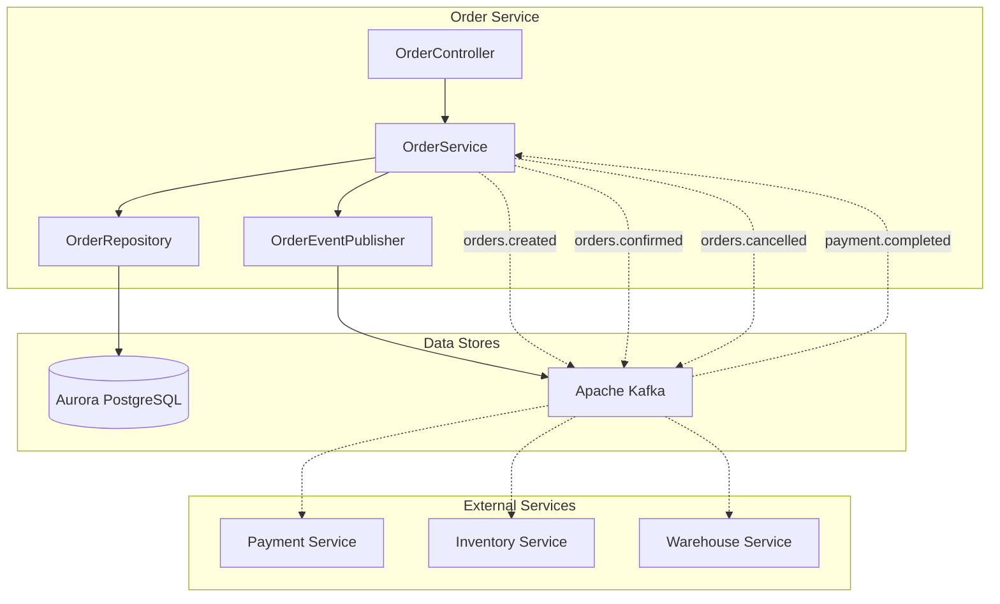
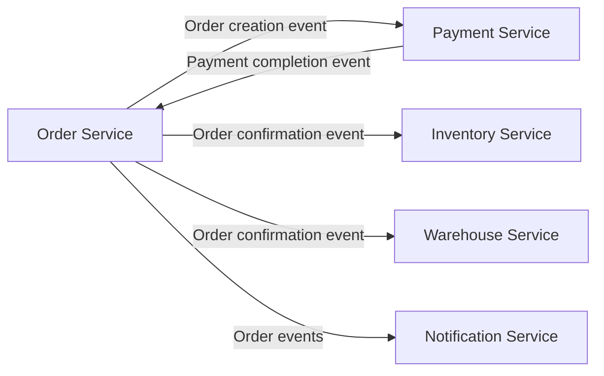

# Order Service

## Overview

The Order Service handles core order processing for the shopping mall and acts as a distributed transaction orchestrator using the SAGA pattern.

| Item | Details |
|------|---------|
| Language | Java 17 |
| Framework | Spring Boot 3.2 |
| Database | Aurora PostgreSQL (Global Database) |
| Namespace | `mall-order` |
| Port | 8080 |
| Health Check | `/actuator/health` |

## Architecture



## API Endpoints

| Method | Path | Description |
|--------|------|-------------|
| `POST` | `/api/v1/orders` | Create order |
| `GET` | `/api/v1/orders/{id}` | Get order |
| `GET` | `/api/v1/orders?userId={userId}` | Get orders by user |
| `PUT` | `/api/v1/orders/{id}/cancel` | Cancel order |

### Create Order

**POST** `/api/v1/orders`

Request:
```json
{
  "userId": "user-123",
  "items": [
    {
      "productId": "prod-001",
      "sku": "SKU-ELECTRONICS-001",
      "quantity": 2,
      "price": 299000.00
    },
    {
      "productId": "prod-002",
      "sku": "SKU-FASHION-001",
      "quantity": 1,
      "price": 89000.00
    }
  ]
}
```

Response (201 Created):
```json
{
  "id": "550e8400-e29b-41d4-a716-446655440000",
  "userId": "user-123",
  "status": "PENDING",
  "totalAmount": 687000.00,
  "items": [
    {
      "id": "item-uuid-1",
      "productId": "prod-001",
      "sku": "SKU-ELECTRONICS-001",
      "quantity": 2,
      "price": 299000.00
    },
    {
      "id": "item-uuid-2",
      "productId": "prod-002",
      "sku": "SKU-FASHION-001",
      "quantity": 1,
      "price": 89000.00
    }
  ],
  "createdAt": "2024-01-15T10:30:00",
  "updatedAt": "2024-01-15T10:30:00"
}
```

### Get Order

**GET** `/api/v1/orders/{id}`

Response (200 OK):
```json
{
  "id": "550e8400-e29b-41d4-a716-446655440000",
  "userId": "user-123",
  "status": "CONFIRMED",
  "totalAmount": 687000.00,
  "items": [...],
  "createdAt": "2024-01-15T10:30:00",
  "updatedAt": "2024-01-15T10:35:00"
}
```

### Cancel Order

**PUT** `/api/v1/orders/{id}/cancel`

Response (200 OK):
```json
{
  "id": "550e8400-e29b-41d4-a716-446655440000",
  "userId": "user-123",
  "status": "CANCELLED",
  "totalAmount": 687000.00,
  "items": [...],
  "createdAt": "2024-01-15T10:30:00",
  "updatedAt": "2024-01-15T11:00:00"
}
```

## Data Models

### Order Entity

```java
@Entity
@Table(name = "orders")
public class Order {
    @Id
    @GeneratedValue(strategy = GenerationType.UUID)
    private UUID id;

    @Column(name = "user_id", nullable = false)
    private String userId;

    @Enumerated(EnumType.STRING)
    @Column(nullable = false)
    private OrderStatus status = OrderStatus.PENDING;

    @Column(name = "total_amount", precision = 12, scale = 2)
    private BigDecimal totalAmount = BigDecimal.ZERO;

    @OneToMany(mappedBy = "order", cascade = CascadeType.ALL)
    private List<OrderItem> items = new ArrayList<>();

    @Column(name = "created_at")
    private LocalDateTime createdAt;

    @Column(name = "updated_at")
    private LocalDateTime updatedAt;
}
```

### OrderItem Entity

```java
@Entity
@Table(name = "order_items")
public class OrderItem {
    @Id
    @GeneratedValue(strategy = GenerationType.UUID)
    private UUID id;

    @ManyToOne(fetch = FetchType.LAZY)
    @JoinColumn(name = "order_id")
    private Order order;

    @Column(name = "product_id", nullable = false)
    private String productId;

    @Column(nullable = false)
    private String sku;

    @Column(nullable = false)
    private Integer quantity;

    @Column(precision = 12, scale = 2, nullable = false)
    private BigDecimal price;
}
```

### OrderStatus Enum

```java
public enum OrderStatus {
    PENDING,    // Pending
    CONFIRMED,  // Confirmed
    CANCELLED,  // Cancelled
    FAILED      // Failed
}
```

### Database Schema

```sql
CREATE TABLE orders (
    id UUID PRIMARY KEY DEFAULT gen_random_uuid(),
    user_id VARCHAR(255) NOT NULL,
    status VARCHAR(50) NOT NULL DEFAULT 'PENDING',
    total_amount DECIMAL(12, 2) DEFAULT 0,
    created_at TIMESTAMP DEFAULT CURRENT_TIMESTAMP,
    updated_at TIMESTAMP DEFAULT CURRENT_TIMESTAMP
);

CREATE TABLE order_items (
    id UUID PRIMARY KEY DEFAULT gen_random_uuid(),
    order_id UUID REFERENCES orders(id),
    product_id VARCHAR(255) NOT NULL,
    sku VARCHAR(255) NOT NULL,
    quantity INTEGER NOT NULL,
    price DECIMAL(12, 2) NOT NULL
);

CREATE INDEX idx_orders_user_id ON orders(user_id);
CREATE INDEX idx_orders_status ON orders(status);
CREATE INDEX idx_order_items_order_id ON order_items(order_id);
```

## Events (Kafka)

### Published Topics

| Topic Name | Event | Description |
|------------|-------|-------------|
| `orders.created` | order.created | Published when order is created |
| `orders.confirmed` | order.confirmed | Published when order is confirmed after payment |
| `orders.cancelled` | order.cancelled | Published when order is cancelled |

#### orders.created Payload

```json
{
  "event": "order.created",
  "order": {
    "id": "550e8400-e29b-41d4-a716-446655440000",
    "userId": "user-123",
    "status": "PENDING",
    "totalAmount": 687000.00,
    "items": [...],
    "createdAt": "2024-01-15T10:30:00",
    "updatedAt": "2024-01-15T10:30:00"
  }
}
```

#### orders.confirmed Payload

```json
{
  "event": "order.confirmed",
  "order": {
    "id": "550e8400-e29b-41d4-a716-446655440000",
    "userId": "user-123",
    "status": "CONFIRMED",
    "totalAmount": 687000.00,
    "items": [...],
    "createdAt": "2024-01-15T10:30:00",
    "updatedAt": "2024-01-15T10:35:00"
  }
}
```

### Subscribed Topics

| Topic Name | Description |
|------------|-------------|
| `payments.completed` | Receives payment completion events to confirm orders |

## Environment Variables

| Variable | Description | Default |
|----------|-------------|---------|
| `SPRING_DATASOURCE_URL` | Aurora PostgreSQL connection URL | - |
| `SPRING_DATASOURCE_USERNAME` | DB username | - |
| `SPRING_DATASOURCE_PASSWORD` | DB password | - |
| `SPRING_KAFKA_BOOTSTRAP_SERVERS` | Kafka broker address | - |
| `SERVER_PORT` | Service port | 8080 |

## Service Dependencies



### SAGA Pattern

The Order Service uses the SAGA orchestrator pattern for distributed transactions:

1. **Order Creation**: Create order with `PENDING` status
2. **Inventory Check**: Request inventory reservation from Inventory Service
3. **Payment Processing**: Request payment from Payment Service
4. **Order Confirmation**: Change to `CONFIRMED` status when all steps succeed
5. **Compensating Transaction**: Rollback previous steps on failure

### Error Handling

| HTTP Status Code | Error | Description |
|------------------|-------|-------------|
| 404 | OrderNotFoundException | Order not found |
| 400 | IllegalStateException | Invalid state transition (e.g., cancelling already cancelled order) |
| 500 | SagaException | SAGA transaction failure |
