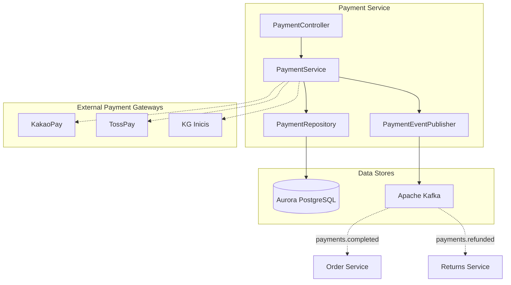
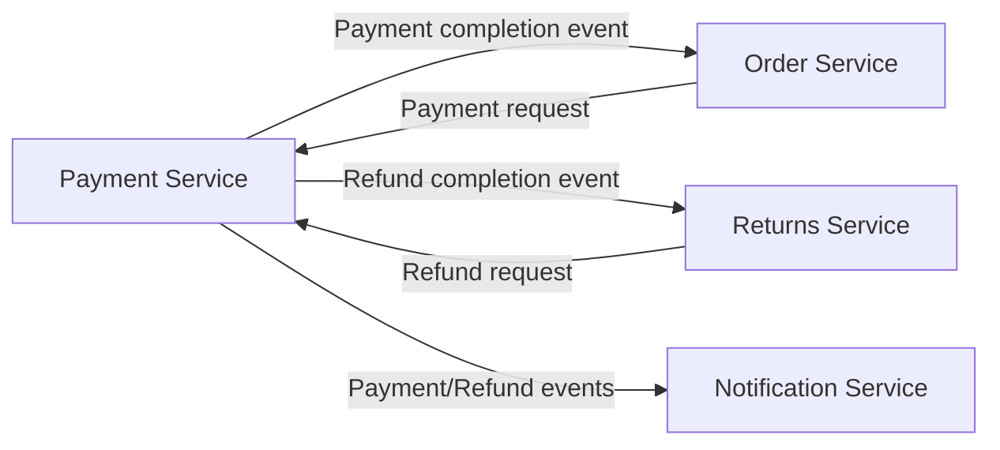
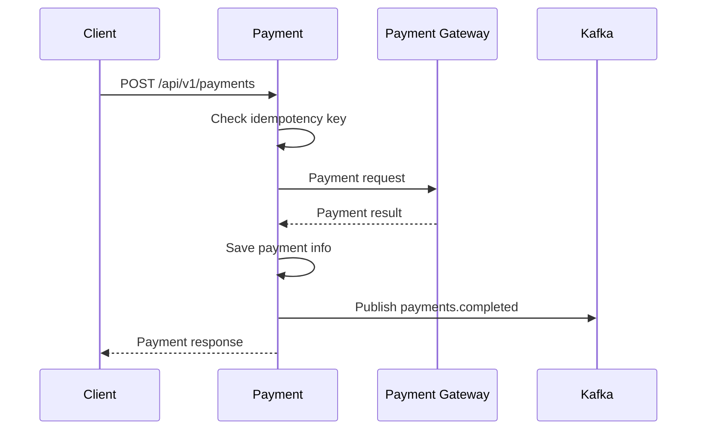

# Payment Service

## Overview

The Payment Service handles payment processing and refunds for orders, supporting major Korean payment methods (KakaoPay, TossPay, KG Inicis).

| Item | Details |
|------|---------|
| Language | Java 17 |
| Framework | Spring Boot 3.2 |
| Database | Aurora PostgreSQL (Global Database) |
| Namespace | `mall-payment` |
| Port | 8080 |
| Health Check | `/actuator/health` |

## Architecture



## API Endpoints

| Method | Path | Description |
|--------|------|-------------|
| `POST` | `/api/v1/payments` | Process payment |
| `GET` | `/api/v1/payments/{id}` | Get payment |
| `POST` | `/api/v1/payments/{id}/refund` | Process refund |

### Process Payment

**POST** `/api/v1/payments`

Request:
```json
{
  "orderId": "550e8400-e29b-41d4-a716-446655440000",
  "amount": 687000.00,
  "currency": "KRW",
  "paymentMethod": "KAKAO_PAY",
  "idempotencyKey": "order-550e8400-payment-001"
}
```

Supported payment methods:
- `KAKAO_PAY` - KakaoPay
- `TOSS_PAY` - TossPay
- `KG_INICIS` - KG Inicis
- `CREDIT_CARD` - Credit Card

Response (201 Created):
```json
{
  "id": "660e8400-e29b-41d4-a716-446655440001",
  "orderId": "550e8400-e29b-41d4-a716-446655440000",
  "amount": 687000.00,
  "currency": "KRW",
  "status": "COMPLETED",
  "paymentMethod": "KAKAO_PAY",
  "idempotencyKey": "order-550e8400-payment-001",
  "createdAt": "2024-01-15T10:32:00",
  "updatedAt": "2024-01-15T10:32:00"
}
```

### Get Payment

**GET** `/api/v1/payments/{id}`

Response (200 OK):
```json
{
  "id": "660e8400-e29b-41d4-a716-446655440001",
  "orderId": "550e8400-e29b-41d4-a716-446655440000",
  "amount": 687000.00,
  "currency": "KRW",
  "status": "COMPLETED",
  "paymentMethod": "KAKAO_PAY",
  "idempotencyKey": "order-550e8400-payment-001",
  "createdAt": "2024-01-15T10:32:00",
  "updatedAt": "2024-01-15T10:32:00"
}
```

### Process Refund

**POST** `/api/v1/payments/{id}/refund`

Response (200 OK):
```json
{
  "id": "660e8400-e29b-41d4-a716-446655440001",
  "orderId": "550e8400-e29b-41d4-a716-446655440000",
  "amount": 687000.00,
  "currency": "KRW",
  "status": "REFUNDED",
  "paymentMethod": "KAKAO_PAY",
  "idempotencyKey": "order-550e8400-payment-001",
  "createdAt": "2024-01-15T10:32:00",
  "updatedAt": "2024-01-15T12:00:00"
}
```

## Data Models

### Payment Entity

```java
@Entity
@Table(name = "payments")
public class Payment {
    @Id
    @GeneratedValue(strategy = GenerationType.UUID)
    private UUID id;

    @Column(name = "order_id", nullable = false)
    private UUID orderId;

    @Column(precision = 12, scale = 2, nullable = false)
    private BigDecimal amount;

    @Column(length = 3)
    private String currency = "USD";

    @Enumerated(EnumType.STRING)
    @Column(nullable = false)
    private PaymentStatus status = PaymentStatus.PENDING;

    @Column(name = "idempotency_key", unique = true)
    private String idempotencyKey;

    @Column(name = "payment_method")
    private String paymentMethod;

    @Column(name = "created_at")
    private LocalDateTime createdAt;

    @Column(name = "updated_at")
    private LocalDateTime updatedAt;
}
```

### PaymentStatus Enum

```java
public enum PaymentStatus {
    PENDING,    // Pending
    COMPLETED,  // Completed
    FAILED,     // Failed
    REFUNDED    // Refunded
}
```

### Database Schema

```sql
CREATE TABLE payments (
    id UUID PRIMARY KEY DEFAULT gen_random_uuid(),
    order_id UUID NOT NULL,
    amount DECIMAL(12, 2) NOT NULL,
    currency VARCHAR(3) DEFAULT 'KRW',
    status VARCHAR(50) NOT NULL DEFAULT 'PENDING',
    idempotency_key VARCHAR(255) UNIQUE,
    payment_method VARCHAR(50),
    created_at TIMESTAMP DEFAULT CURRENT_TIMESTAMP,
    updated_at TIMESTAMP DEFAULT CURRENT_TIMESTAMP
);

CREATE INDEX idx_payments_order_id ON payments(order_id);
CREATE INDEX idx_payments_status ON payments(status);
CREATE INDEX idx_payments_idempotency_key ON payments(idempotency_key);
```

## Events (Kafka)

### Published Topics

| Topic Name | Event | Description |
|------------|-------|-------------|
| `payments.completed` | payment.completed | Published on payment completion |
| `payments.failed` | payment.failed | Published on payment failure |
| `payments.refunded` | payment.refunded | Published on refund completion |

#### payments.completed Payload

```json
{
  "event": "payment.completed",
  "payment": {
    "id": "660e8400-e29b-41d4-a716-446655440001",
    "orderId": "550e8400-e29b-41d4-a716-446655440000",
    "amount": 687000.00,
    "currency": "KRW",
    "status": "COMPLETED",
    "paymentMethod": "KAKAO_PAY",
    "idempotencyKey": "order-550e8400-payment-001",
    "createdAt": "2024-01-15T10:32:00",
    "updatedAt": "2024-01-15T10:32:00"
  }
}
```

#### payments.refunded Payload

```json
{
  "event": "payment.refunded",
  "payment": {
    "id": "660e8400-e29b-41d4-a716-446655440001",
    "orderId": "550e8400-e29b-41d4-a716-446655440000",
    "amount": 687000.00,
    "currency": "KRW",
    "status": "REFUNDED",
    "paymentMethod": "KAKAO_PAY",
    "idempotencyKey": "order-550e8400-payment-001",
    "createdAt": "2024-01-15T10:32:00",
    "updatedAt": "2024-01-15T12:00:00"
  }
}
```

## Environment Variables

| Variable | Description | Default |
|----------|-------------|---------|
| `SPRING_DATASOURCE_URL` | Aurora PostgreSQL connection URL | - |
| `SPRING_DATASOURCE_USERNAME` | DB username | - |
| `SPRING_DATASOURCE_PASSWORD` | DB password | - |
| `SPRING_KAFKA_BOOTSTRAP_SERVERS` | Kafka broker address | - |
| `KAKAO_PAY_API_KEY` | KakaoPay API key | - |
| `TOSS_PAY_SECRET_KEY` | TossPay secret key | - |
| `KG_INICIS_MID` | KG Inicis merchant ID | - |
| `SERVER_PORT` | Service port | 8080 |

## Service Dependencies



### Idempotency

The Payment Service prevents duplicate payments through `idempotencyKey`:

1. Client generates a unique `idempotencyKey` for each request
2. Subsequent requests with the same key return the existing payment result
3. Prevents duplicate payments due to network errors

### Payment Flow



### Error Handling

| HTTP Status Code | Error | Description |
|------------------|-------|-------------|
| 404 | PaymentNotFoundException | Payment not found |
| 400 | IllegalStateException | Invalid state transition (e.g., refunding already refunded payment) |
| 409 | DuplicatePaymentException | Duplicate payment attempt (same idempotencyKey) |
