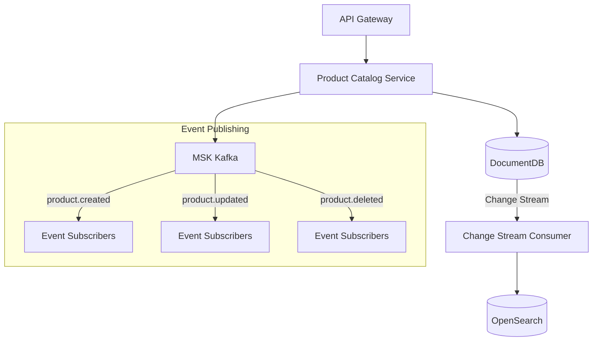
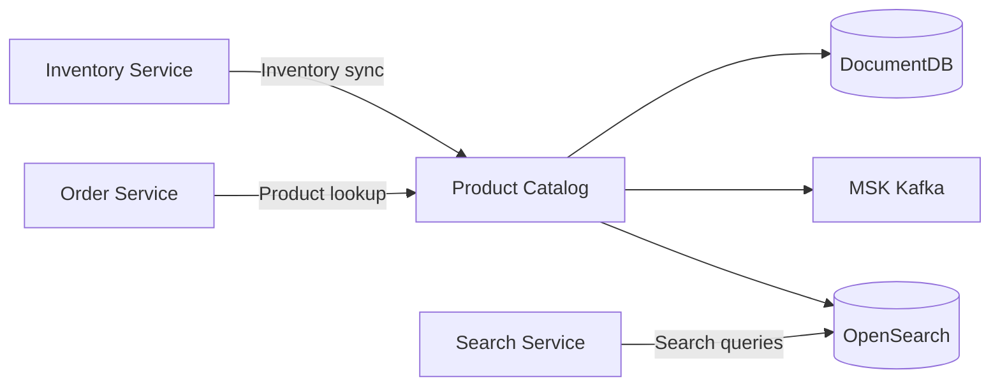

# Product Catalog Service

## Overview

The Product Catalog Service manages product and category information for the shopping mall. Product data stored in DocumentDB is synchronized to OpenSearch in real-time through Change Streams.

| Item | Value |
|------|-------|
| Language | Python 3.11 |
| Framework | FastAPI |
| Database | DocumentDB (MongoDB compatible) |
| Namespace | `mall-services` |
| Port | 8000 |
| Health Check | `GET /health` |

## Architecture



## API Endpoints

### Product API

| Method | Path | Description |
|--------|------|-------------|
| `GET` | `/api/v1/products` | Get product list |
| `GET` | `/api/v1/products/{product_id}` | Get product details |
| `POST` | `/api/v1/products` | Create product |
| `PUT` | `/api/v1/products/{product_id}` | Update product |
| `DELETE` | `/api/v1/products/{product_id}` | Delete product |
| `GET` | `/api/v1/categories` | Get category list |

### Request/Response Examples

#### Get Product List

**Request:**
```http
GET /api/v1/products?skip=0&limit=20&category=electronics
```

**Response:**
```json
{
  "products": [
    {
      "_id": "prod_001",
      "name": "Samsung Galaxy S24",
      "description": "Latest smartphone",
      "sku": "SGS24-256GB",
      "price": 1199000,
      "currency": "KRW",
      "category_id": "electronics",
      "images": ["https://cdn.example.com/products/s24.jpg"],
      "attributes": {
        "color": "Black",
        "storage": "256GB"
      },
      "inventory_count": 150,
      "is_active": true,
      "created_at": "2024-01-15T10:00:00Z",
      "updated_at": "2024-01-15T10:00:00Z"
    }
  ],
  "skip": 0,
  "limit": 20
}
```

#### Create Product

**Request:**
```http
POST /api/v1/products
Content-Type: application/json

{
  "name": "Nike Air Max",
  "description": "Comfortable running shoes",
  "sku": "NIKE-AM-42",
  "price": 189000,
  "currency": "KRW",
  "category_id": "fashion",
  "images": ["https://cdn.example.com/products/airmax.jpg"],
  "attributes": {
    "size": "270",
    "color": "White"
  },
  "inventory_count": 50,
  "is_active": true
}
```

**Response (201 Created):**
```json
{
  "_id": "prod_002",
  "name": "Nike Air Max",
  "description": "Comfortable running shoes",
  "sku": "NIKE-AM-42",
  "price": 189000,
  "currency": "KRW",
  "category_id": "fashion",
  "images": ["https://cdn.example.com/products/airmax.jpg"],
  "attributes": {
    "size": "270",
    "color": "White"
  },
  "inventory_count": 50,
  "is_active": true,
  "created_at": "2024-01-15T11:00:00Z",
  "updated_at": "2024-01-15T11:00:00Z"
}
```

## Data Models

### Product

```python
class Product(BaseModel):
    id: str = Field(alias="_id")
    name: str
    description: Optional[str] = None
    sku: str
    price: float
    currency: str = "USD"
    category_id: Optional[str] = None
    images: list[str] = []
    attributes: dict = {}
    inventory_count: int = 0
    is_active: bool = True
    created_at: datetime
    updated_at: datetime
```

### Category

```python
class Category(BaseModel):
    id: str = Field(alias="_id")
    name: str
    description: Optional[str] = None
    parent_id: Optional[str] = None
    created_at: datetime
```

### Categories (10 Korean Categories)

| ID | Name | Description |
|----|------|-------------|
| `electronics` | Electronics | Smartphones, laptops, tablets |
| `fashion` | Fashion | Clothing, shoes, accessories |
| `beauty` | Beauty | Cosmetics, skincare |
| `home` | Home/Living | Furniture, interior |
| `food` | Food | Fresh food, processed food |
| `sports` | Sports | Sports equipment, outdoor |
| `books` | Books | Books, e-books |
| `toys` | Toys | Toys, games |
| `baby` | Baby/Kids | Baby products, children's clothing |
| `pets` | Pets | Pet food, supplies |

## Events (Kafka)

### Published Topics

| Topic | Event | Description |
|-------|-------|-------------|
| `products.created` | Product Created | Published when a new product is registered |
| `products.updated` | Product Updated | Published when product information changes |
| `products.deleted` | Product Deleted | Published when a product is deleted |

### Event Payload Example

```json
{
  "event_type": "product.created",
  "product_id": "prod_001",
  "timestamp": "2024-01-15T10:00:00Z",
  "data": {
    "name": "Samsung Galaxy S24",
    "sku": "SGS24-256GB",
    "price": 1199000,
    "category_id": "electronics"
  }
}
```

## Environment Variables

| Variable | Description | Default |
|----------|-------------|---------|
| `SERVICE_NAME` | Service name | `product-catalog` |
| `PORT` | Service port | `8080` |
| `AWS_REGION` | AWS region | `us-east-1` |
| `REGION_ROLE` | Region role (PRIMARY/SECONDARY) | `PRIMARY` |
| `DB_HOST` | Database host | `localhost` |
| `DB_PORT` | Database port | `27017` |
| `DB_NAME` | Database name | `product_catalog` |
| `DB_USER` | Database user | `mall` |
| `DB_PASSWORD` | Database password | - |
| `DOCUMENTDB_HOST` | DocumentDB host | `localhost` |
| `DOCUMENTDB_PORT` | DocumentDB port | `27017` |
| `KAFKA_BROKERS` | Kafka broker address | `localhost:9092` |
| `OPENSEARCH_ENDPOINT` | OpenSearch endpoint | `http://localhost:9200` |
| `LOG_LEVEL` | Log level | `info` |

## Service Dependencies



### Services It Depends On
- **DocumentDB**: Product/category data storage
- **MSK Kafka**: Event publishing
- **OpenSearch**: Search index (synchronized via Change Stream)

### Services That Depend On This
- **Search Service**: Product search
- **Order Service**: Product information lookup during orders
- **Inventory Service**: Inventory quantity updates
- **Recommendation Service**: Recommended product lookup
