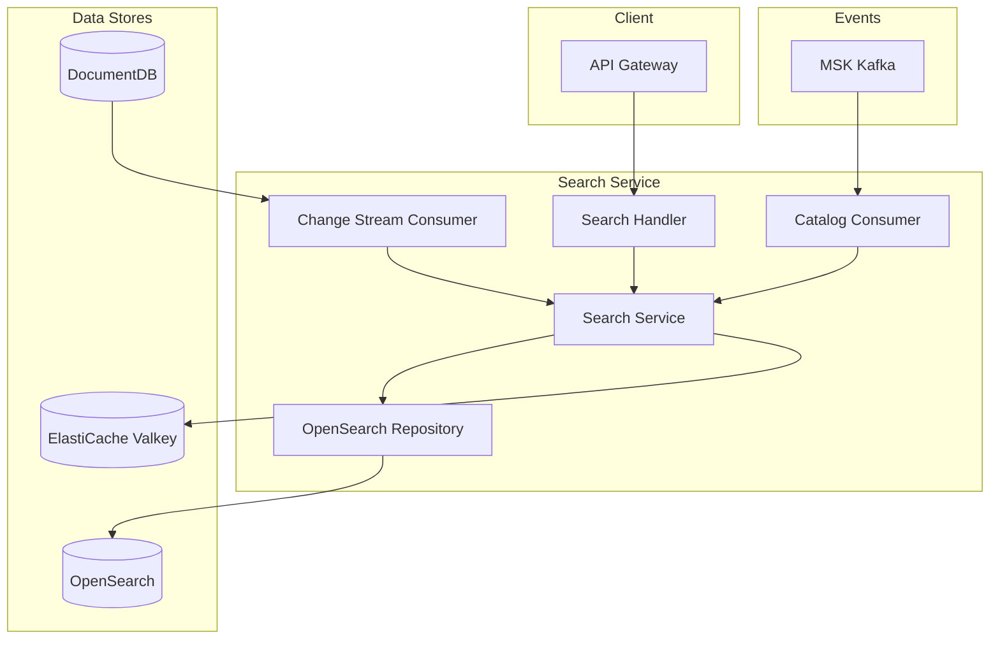
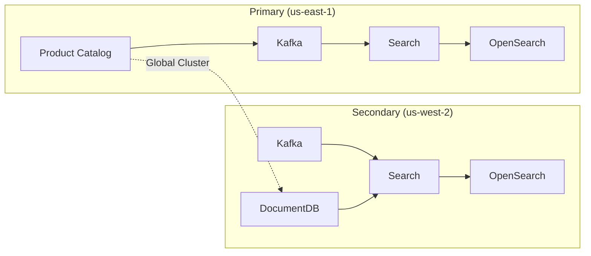

# Search Service

## Overview

The Search Service provides product search functionality using OpenSearch. It receives product change events from Product Catalog through Kafka to automatically synchronize the search index. In Secondary regions, data is synchronized through DocumentDB change streams.

| Item | Details |
|------|---------|
| Language | Go 1.21+ |
| Framework | Gin |
| Database | OpenSearch, DocumentDB (Change Stream) |
| Cache | ElastiCache (Valkey) |
| Namespace | core-services |
| Port | 8080 |
| Health Check | `/healthz`, `/readyz` |

## Architecture



## Key Features

### 1. Product Search
- Multi-field search (name, description, SKU)
- Category filtering
- Price range filtering
- Pagination

### 2. Search Result Caching
- Search result caching via Valkey (5-minute TTL)
- Duplicate query prevention based on cache keys

### 3. Real-time Index Synchronization
- Index updates via Kafka events
- Secondary region synchronization through DocumentDB Change Stream

## API Endpoints

### Product Search

| Method | Path | Description |
|--------|------|-------------|
| GET | `/api/v1/search` | Product search |

#### Request Parameters

| Parameter | Type | Required | Description | Default |
|-----------|------|----------|-------------|---------|
| `q` | string | N | Search keyword | - |
| `category` | string | N | Category ID | - |
| `min_price` | float | N | Minimum price | - |
| `max_price` | float | N | Maximum price | - |
| `page` | int | N | Page number | 1 |
| `size` | int | N | Page size (max 100) | 20 |

#### Request Example

```bash
GET /api/v1/search?q=laptop&category=electronics&min_price=500000&max_price=2000000&page=1&size=20
```

#### Response Example

```json
{
  "products": [
    {
      "id": "prod-001",
      "name": "Samsung Galaxy Book Pro",
      "description": "15.6-inch AMOLED display laptop",
      "sku": "SGB-PRO-15",
      "price": 1590000,
      "currency": "KRW",
      "category_id": "electronics",
      "images": [
        "https://cdn.example.com/products/sgb-pro-1.jpg"
      ],
      "attributes": {
        "brand": "Samsung",
        "display_size": "15.6",
        "memory": "16GB"
      },
      "is_active": true
    }
  ],
  "total": 42,
  "page": 1,
  "size": 20
}
```

## Data Models

### Product (Search Index)

```go
type Product struct {
    ID          string            `json:"id"`
    Name        string            `json:"name"`
    Description string            `json:"description"`
    SKU         string            `json:"sku"`
    Price       float64           `json:"price"`
    Currency    string            `json:"currency"`
    CategoryID  string            `json:"category_id"`
    Images      []string          `json:"images"`
    Attributes  map[string]string `json:"attributes"`
    IsActive    bool              `json:"is_active"`
}
```

### SearchParams

```go
type SearchParams struct {
    Query    string   // Search keyword
    Category string   // Category filter
    MinPrice *float64 // Minimum price
    MaxPrice *float64 // Maximum price
    Page     int      // Page number
    Size     int      // Page size
}
```

### SearchResult

```go
type SearchResult struct {
    Products []Product `json:"products"`
    Total    int64     `json:"total"`
    Page     int       `json:"page"`
    Size     int       `json:"size"`
}
```

### OpenSearch Index Mapping

```json
{
  "mappings": {
    "properties": {
      "id": {"type": "keyword"},
      "name": {"type": "text", "analyzer": "standard"},
      "description": {"type": "text", "analyzer": "standard"},
      "sku": {"type": "keyword"},
      "price": {"type": "float"},
      "currency": {"type": "keyword"},
      "category_id": {"type": "keyword"},
      "is_active": {"type": "boolean"}
    }
  }
}
```

## Events (Kafka)

### Subscribed Topics

| Topic | Description | Consumer Group |
|-------|-------------|----------------|
| `catalog.product.created` | Product creation event | search-indexer |
| `catalog.product.updated` | Product update event | search-indexer |
| `catalog.product.deleted` | Product deletion event | search-indexer |

### Event Payload Examples

#### product.created / product.updated

```json
{
  "event": "product.created",
  "product": {
    "id": "prod-001",
    "name": "Samsung Galaxy Book Pro",
    "description": "15.6-inch AMOLED display laptop",
    "sku": "SGB-PRO-15",
    "price": 1590000,
    "currency": "KRW",
    "category_id": "electronics",
    "images": ["https://cdn.example.com/products/sgb-pro-1.jpg"],
    "attributes": {"brand": "Samsung"},
    "is_active": true
  }
}
```

#### product.deleted

```json
{
  "event": "product.deleted",
  "product_id": "prod-001"
}
```

## Environment Variables

| Variable | Description | Default |
|----------|-------------|---------|
| `PORT` | Server port | `8080` |
| `AWS_REGION` | AWS region | `us-east-1` |
| `REGION_ROLE` | Region role (PRIMARY/SECONDARY) | `PRIMARY` |
| `OPENSEARCH_ENDPOINT` | OpenSearch endpoint | `http://localhost:9200` |
| `CACHE_HOST` | ElastiCache host | `localhost` |
| `CACHE_PORT` | ElastiCache port | `6379` |
| `KAFKA_BROKERS` | Kafka broker address | `localhost:9092` |
| `DOCUMENTDB_HOST` | DocumentDB host (Secondary) | `localhost` |
| `DOCUMENTDB_PORT` | DocumentDB port | `27017` |
| `LOG_LEVEL` | Log level | `info` |

## Service Dependencies

### Services It Depends On

| Service | Purpose |
|---------|---------|
| OpenSearch | Search index storage and queries |
| ElastiCache (Valkey) | Search result caching |
| MSK (Kafka) | Product change event reception |
| DocumentDB | Change Stream (Secondary region) |

### Components That Depend On This Service

| Component | Purpose |
|-----------|---------|
| API Gateway | Search API routing |
| Web/Mobile clients | Product search |

## Multi-Region Behavior

### Primary Region (us-east-1)
- Receives Product Catalog changes via Kafka events
- Updates OpenSearch index

### Secondary Region (us-west-2)
- Dual synchronization via Kafka events + DocumentDB Change Stream
- Detects replicated data from DocumentDB Global Cluster via Change Stream
- Updates local OpenSearch index



## Caching Strategy

Search results are cached in Valkey for 5 minutes.

### Cache Key Format

```
search:{query}:{category}:{page}:{size}[:min{price}][:max{price}]
```

Example:
```
search:laptop:electronics:1:20:min500000:max2000000
```
