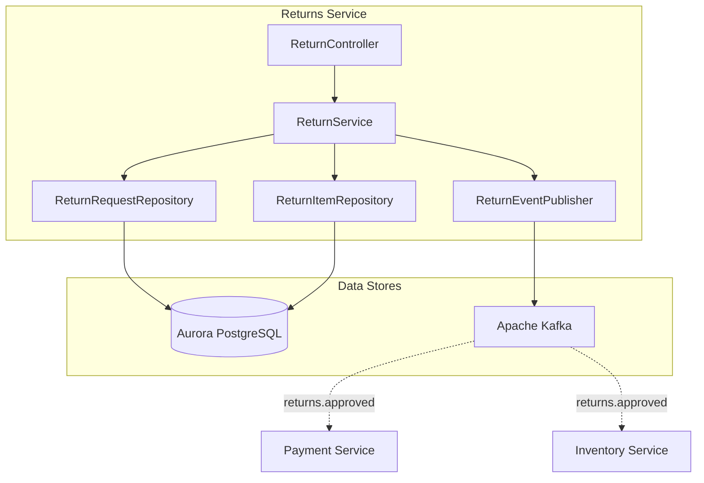
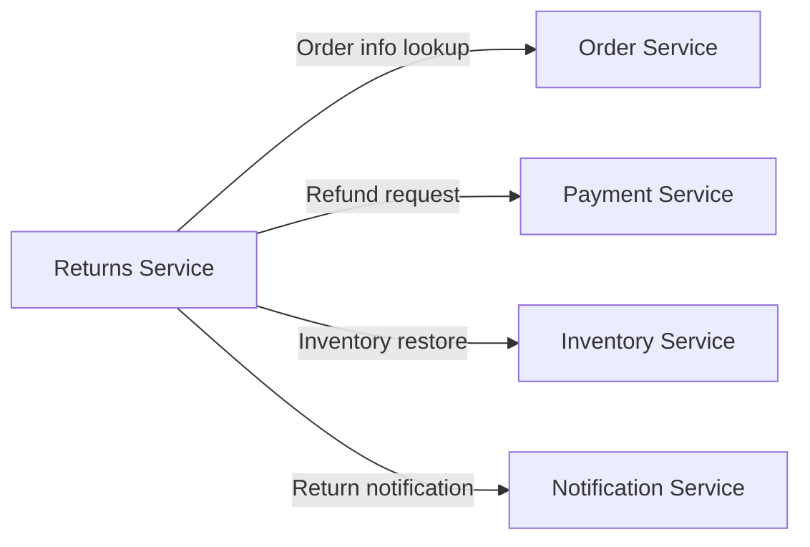
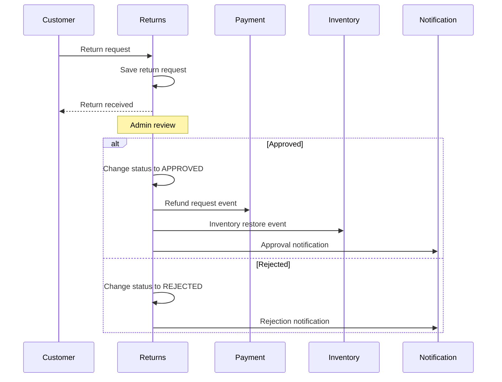
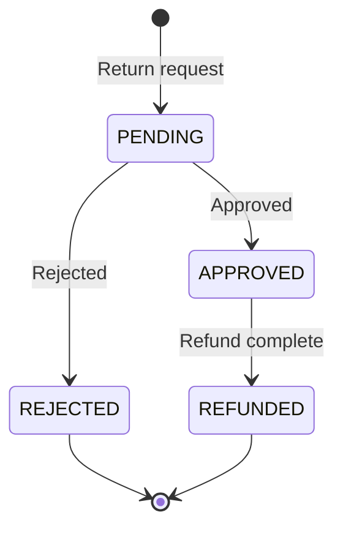

# Returns Service

## Overview

The Returns Service handles return request creation, approval, rejection processing, and refund coordination. Upon return approval, it integrates with the Payment Service to process refunds.

| Item | Details |
|------|---------|
| Language | Java 17 |
| Framework | Spring Boot 3.2 |
| Database | Aurora PostgreSQL (Global Database) |
| Namespace | `mall-returns` |
| Port | 8080 |
| Health Check | `/actuator/health` |

## Architecture



## API Endpoints

| Method | Path | Description |
|--------|------|-------------|
| `POST` | `/api/v1/returns` | Create return request |
| `GET` | `/api/v1/returns/{id}` | Get return request |
| `GET` | `/api/v1/returns?userId={userId}` | Get returns by user |
| `PUT` | `/api/v1/returns/{id}/approve` | Approve return |
| `PUT` | `/api/v1/returns/{id}/reject` | Reject return |

### Create Return Request

**POST** `/api/v1/returns`

Request:
```json
{
  "orderId": "550e8400-e29b-41d4-a716-446655440000",
  "userId": "user-123",
  "reason": "Product defect",
  "items": [
    {
      "productId": "prod-001",
      "sku": "SKU-ELECTRONICS-001",
      "quantity": 1,
      "reason": "Screen defect"
    }
  ]
}
```

Response (201 Created):
```json
{
  "id": "770e8400-e29b-41d4-a716-446655440000",
  "orderId": "550e8400-e29b-41d4-a716-446655440000",
  "userId": "user-123",
  "reason": "Product defect",
  "status": "PENDING",
  "items": [
    {
      "id": "880e8400-e29b-41d4-a716-446655440000",
      "productId": "prod-001",
      "sku": "SKU-ELECTRONICS-001",
      "quantity": 1,
      "reason": "Screen defect"
    }
  ],
  "createdAt": "2024-01-20T10:00:00",
  "updatedAt": "2024-01-20T10:00:00"
}
```

### Get Return Request

**GET** `/api/v1/returns/{id}`

Response (200 OK):
```json
{
  "id": "770e8400-e29b-41d4-a716-446655440000",
  "orderId": "550e8400-e29b-41d4-a716-446655440000",
  "userId": "user-123",
  "reason": "Product defect",
  "status": "PENDING",
  "items": [
    {
      "id": "880e8400-e29b-41d4-a716-446655440000",
      "productId": "prod-001",
      "sku": "SKU-ELECTRONICS-001",
      "quantity": 1,
      "reason": "Screen defect"
    }
  ],
  "createdAt": "2024-01-20T10:00:00",
  "updatedAt": "2024-01-20T10:00:00"
}
```

### Get Returns by User

**GET** `/api/v1/returns?userId=user-123`

Response (200 OK):
```json
[
  {
    "id": "770e8400-e29b-41d4-a716-446655440000",
    "orderId": "550e8400-e29b-41d4-a716-446655440000",
    "userId": "user-123",
    "reason": "Product defect",
    "status": "APPROVED",
    "items": [...],
    "createdAt": "2024-01-20T10:00:00",
    "updatedAt": "2024-01-21T14:00:00"
  }
]
```

### Approve Return

**PUT** `/api/v1/returns/{id}/approve`

Response (200 OK):
```json
{
  "id": "770e8400-e29b-41d4-a716-446655440000",
  "orderId": "550e8400-e29b-41d4-a716-446655440000",
  "userId": "user-123",
  "reason": "Product defect",
  "status": "APPROVED",
  "items": [...],
  "createdAt": "2024-01-20T10:00:00",
  "updatedAt": "2024-01-21T14:00:00"
}
```

### Reject Return

**PUT** `/api/v1/returns/{id}/reject`

Response (200 OK):
```json
{
  "id": "770e8400-e29b-41d4-a716-446655440000",
  "orderId": "550e8400-e29b-41d4-a716-446655440000",
  "userId": "user-123",
  "reason": "Product defect",
  "status": "REJECTED",
  "items": [...],
  "createdAt": "2024-01-20T10:00:00",
  "updatedAt": "2024-01-21T14:00:00"
}
```

## Data Models

### ReturnRequest Entity

```java
@Entity
@Table(name = "return_requests")
public class ReturnRequest {
    @Id
    @GeneratedValue(strategy = GenerationType.UUID)
    private UUID id;

    @Column(name = "order_id", nullable = false)
    private UUID orderId;

    @Column(name = "user_id", nullable = false)
    private String userId;

    @Column(columnDefinition = "TEXT")
    private String reason;

    @Enumerated(EnumType.STRING)
    @Column(length = 50)
    private ReturnStatus status = ReturnStatus.PENDING;

    @OneToMany(mappedBy = "returnRequest", cascade = CascadeType.ALL, orphanRemoval = true)
    private List<ReturnItem> items = new ArrayList<>();

    @Column(name = "created_at")
    private LocalDateTime createdAt;

    @Column(name = "updated_at")
    private LocalDateTime updatedAt;
}
```

### ReturnItem Entity

```java
@Entity
@Table(name = "return_items")
public class ReturnItem {
    @Id
    @GeneratedValue(strategy = GenerationType.UUID)
    private UUID id;

    @ManyToOne
    @JoinColumn(name = "return_id")
    private ReturnRequest returnRequest;

    @Column(name = "product_id", nullable = false)
    private String productId;

    @Column(nullable = false)
    private String sku;

    @Column(nullable = false)
    private Integer quantity;

    @Column(columnDefinition = "TEXT")
    private String reason;
}
```

### ReturnStatus Enum

```java
public enum ReturnStatus {
    PENDING,    // Pending
    APPROVED,   // Approved
    REJECTED,   // Rejected
    REFUNDED    // Refunded
}
```

### Database Schema

```sql
CREATE TABLE return_requests (
    id UUID PRIMARY KEY DEFAULT gen_random_uuid(),
    order_id UUID NOT NULL,
    user_id VARCHAR(255) NOT NULL,
    reason TEXT,
    status VARCHAR(50) DEFAULT 'PENDING',
    created_at TIMESTAMP DEFAULT CURRENT_TIMESTAMP,
    updated_at TIMESTAMP DEFAULT CURRENT_TIMESTAMP
);

CREATE TABLE return_items (
    id UUID PRIMARY KEY DEFAULT gen_random_uuid(),
    return_id UUID REFERENCES return_requests(id),
    product_id VARCHAR(255) NOT NULL,
    sku VARCHAR(255) NOT NULL,
    quantity INTEGER NOT NULL,
    reason TEXT
);

CREATE INDEX idx_return_requests_order_id ON return_requests(order_id);
CREATE INDEX idx_return_requests_user_id ON return_requests(user_id);
CREATE INDEX idx_return_requests_status ON return_requests(status);
CREATE INDEX idx_return_items_return_id ON return_items(return_id);
```

## Events (Kafka)

### Published Topics

| Topic Name | Event | Description |
|------------|-------|-------------|
| `returns.created` | return.created | Published when return request is created |
| `returns.approved` | return.approved | Published when return is approved |
| `returns.rejected` | return.rejected | Published when return is rejected |

#### returns.created Payload

```json
{
  "return_id": "770e8400-e29b-41d4-a716-446655440000",
  "order_id": "550e8400-e29b-41d4-a716-446655440000",
  "user_id": "user-123",
  "status": "PENDING",
  "reason": "Product defect",
  "item_count": 1
}
```

#### returns.approved Payload

```json
{
  "return_id": "770e8400-e29b-41d4-a716-446655440000",
  "order_id": "550e8400-e29b-41d4-a716-446655440000",
  "user_id": "user-123",
  "status": "APPROVED",
  "reason": "Product defect",
  "item_count": 1
}
```

#### returns.rejected Payload

```json
{
  "return_id": "770e8400-e29b-41d4-a716-446655440000",
  "order_id": "550e8400-e29b-41d4-a716-446655440000",
  "user_id": "user-123",
  "status": "REJECTED",
  "reason": "Product defect",
  "item_count": 1
}
```

## Environment Variables

| Variable | Description | Default |
|----------|-------------|---------|
| `SPRING_DATASOURCE_URL` | Aurora PostgreSQL connection URL | - |
| `SPRING_DATASOURCE_USERNAME` | DB username | - |
| `SPRING_DATASOURCE_PASSWORD` | DB password | - |
| `SPRING_KAFKA_BOOTSTRAP_SERVERS` | Kafka broker address | - |
| `SERVER_PORT` | Service port | 8080 |

## Service Dependencies



### Return Processing Flow



### Return Status Flow



### Error Handling

| HTTP Status Code | Error | Description |
|------------------|-------|-------------|
| 404 | ReturnNotFoundException | Return request not found |
| 400 | IllegalStateException | Invalid state transition (e.g., already processed return) |
| 400 | InvalidReturnRequestException | Invalid return request (return period exceeded, etc.) |
